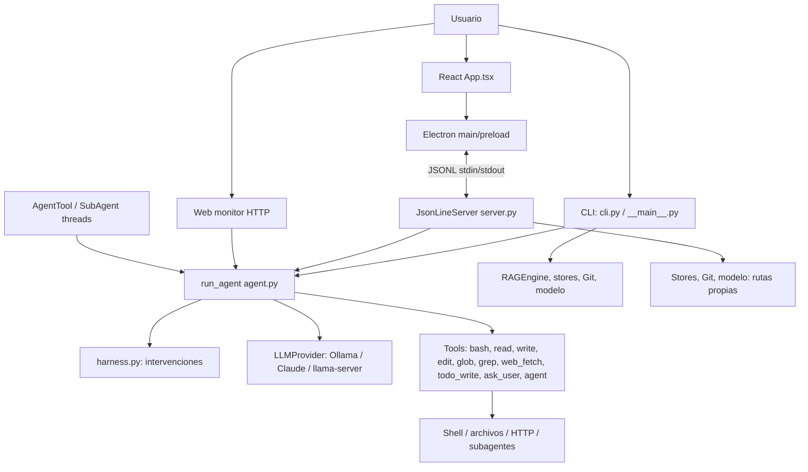
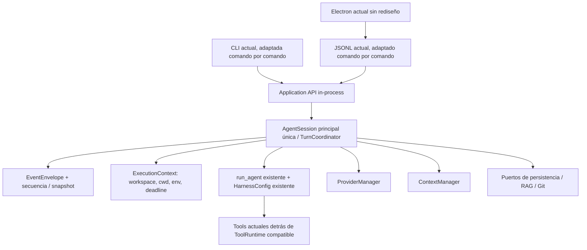
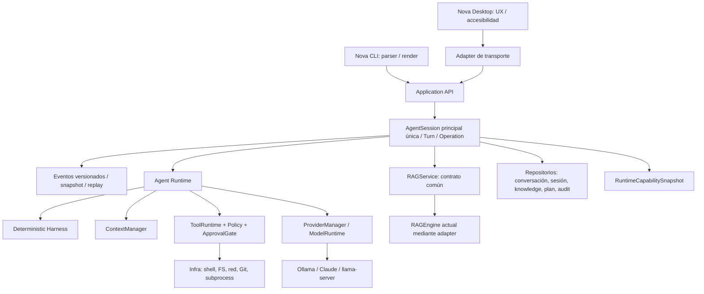

# Auditoría arquitectónica del núcleo de Local CLI para Nova

**Estado:** análisis de la copia actual; sin cambios en `local-cli-main`.

**Fecha de corte:** 28 de septiembre de 2026. **Objeto:** `C:\Users\joseh\Downloads\nova-local-cli\local-cli-main`, versión declarada `0.12.6` en `desktop/package.json`. El informe es una propuesta para aprobación, no una implementación. El archivo presente está en el directorio padre solicitado; no se ha editado el código fuente.

**Convenciones de evidencia:** `O` = comportamiento observado directamente en código; `I` = consecuencia inferida de ese código, pendiente de reproducir; `T` = test existente leído, no ejecutado en esta auditoría; `P` = diseño propuesto. Las referencias usan `local-cli-main/ruta:línea — símbolo`; la línea indica el inicio o el punto decisivo, no todo el bloque. No se ejecutó la suite, ni un E2E, ni se hizo una prueba real en Linux/macOS. Esta copia no contiene `.git` y en el entorno de auditoría `git` no está en `PATH`; por ello no hay `git status` verificable ni hash de commit que sirva como identidad del baseline. Conviene congelarlo después con un manifiesto de hashes antes de tocar el código.

## 1. Resumen ejecutivo y decisión

**Dictamen:** la refactorización es viable de forma incremental, manteniendo funcionales la CLI y el escritorio y conservando las diez tools públicas. El núcleo reutilizable ya existe: `run_agent` comparte un Agent Loop entre interfaces, `harness.py` reúne intervenciones deterministas, `LLMProvider` normaliza proveedores y la ejecución de shell está separada por plataforma. Lo que falta es una capa de aplicación **propietaria de la sesión y de las operaciones**. Hoy `cli.py`, `server.py` y `web_monitor.py` construyen contexto, seleccionan provider, disparan el loop, administran estado y traducen eventos por separado. `agent.py` todavía contiene presentación de consola y cálculo de contexto. Referencias: `local_cli/agent.py:1072 — run_agent`, `:1661 — _ConsoleEmitter`; `local_cli/cli.py:1400 — run_repl`, `:1601 — turno agent`; `local_cli/server.py:399 — _handle_chat`; `local_cli/web_monitor.py:219 — _run_agent`. **[O]**

La prioridad antes de una GUI nueva es cortar cuatro acoplamientos: (1) `cwd` global frente a hilos/subagentes; (2) aprobación y `ask_user` dependientes de stdin o de una respuesta sin identidad comprobada; (3) provider/modelo capturados por instancias de tools y rutas de interfaz; (4) eventos sin contrato, secuencia ni recuperación tras reconexión. El servidor también tiene un bloqueo del hilo lector por `join()` y el web monitor escucha en todas las interfaces sin autenticación visible. Referencias: `local_cli/sub_agent.py:233 — SubAgent.run`; `local_cli/server.py:293,310 — JsonLineServer.run`; `local_cli/tools/ask_user_tool.py:54 — AskUserTool.execute`; `local_cli/server.py:126,709,1361 — AgentTool/switch/spawn`; `local_cli/harness.py:51 — AgentEvent`; `local_cli/web_monitor.py:388,506 — _Handler.do_POST/run_web_monitor`. **[O]**

**Regla de producto:** Nova tendrá inicialmente **un chat visible y una AgentSession principal activa**. Los IDs de sesión, turno, generación, operación, tool call, aprobación y subagente sirven para correlación, lifecycle, concurrencia, cancelación, recuperación y observabilidad; **no** justifican un gestor de múltiples chats. La CLI seguirá siendo una interfaz soportada del mismo backend. Voz, memoria conversacional a largo plazo, adjuntos, MCP, buscador, navegador y multi-chat quedan fuera de esta refactorización. **[P]**

**Alcance RAG:** es **MUST BEFORE NEW GUI** extraer una frontera `RAGService` del Application Layer y ofrecer la capacidad actual a CLI y Desktop desde el mismo backend, con activación, consulta, progreso, errores, disponibilidad, presupuesto de retrieval y degradación no fatal. Perfeccionar el algoritmo o dividir internamente todo `RAGEngine` es **SHOULD BEFORE NEW GUI** y no bloquea la nueva GUI. **[P]**

### Arquitectura actual (código ejecutado)



El mismo `run_agent` se llama desde CLI, server, monitor y subagentes (`local_cli/agent.py:1072 — run_agent`; `local_cli/sub_agent.py:308 — _run_agent_loop`); el prompt base está centralizado (`local_cli/prompts.py:61 — build_system_prompt`) y la fábrica de tools también (`local_cli/tools/__init__.py:17 — create_tools`). Esa reutilización no equivale a un backend de aplicación único: el ciclo de sesión, opciones de inferencia, RAG, comandos y traducción de eventos siguen en los adaptadores. **[O]**

### Arquitectura intermedia recomendada



En esta etapa los formatos externos y `run_agent` se preservan; se introducen adaptadores y se migra una ruta a la vez. `bash` sigue siendo el nombre público de la tool. **[P]**

### Arquitectura objetivo de esta refactorización



Las flechas de dependencias van hacia contratos internos; Electron, JSONL, `input()` y SQLite son detalles de adaptación. El `RAGEngine` actual puede permanecer detrás de `RAGService` sin rediseño algorítmico. Un runtime de larga vida pertenece al proceso/backend y puede seguir activo con renderer oculto o reconstruido. Esto prepara una conversación de voz futura sin implementar STT/TTS ni multi-chat. **[P]**

## 2. Mapa de módulos, responsabilidades y acoplamientos

| Módulo actual | Responsabilidad real observada | Depende de / modifica / asume |
|---|---|---|
| `agent.py` | `run_agent`, streaming/retry, reparación de tools, invocación, caché, context compaction, guards; además emitter de consola y wrapper `agent_loop` | `harness`, `LLMProvider`, `Tool`, `ToolCache`; muta `messages`; ejecuta tools síncronas; asume callback síncrono y `should_stop` sondeado. `local_cli/agent.py:291,572,942,1072,1160,1661,1840`. **[O]** |
| `harness.py` | Eventos genéricos y reglas deterministas: text-call rescue, loop detection, read gate, verificación de write, recordatorio de todo, resumen | No hay importación local circular directa; `verify_file_write` lee FS, `TodoReminder` inspecciona tools. `local_cli/harness.py:51,80,379,477,773,942,1029,1108`. **[O]** |
| `prompts.py` | Prompt de sistema y skill injection | Lee `os.getcwd()` y descriptor de la tool `bash`; por tanto el prompt puede quedar desfasado respecto del contexto real de ejecución. `local_cli/prompts.py:22,61,77,78`. **[O/I]** |
| `cli.py`, `__main__.py` | REPL, slash commands, composición de tools/providers/RAG/stores, decisiones de turno e impresión | Su `_ReplContext` agrupa subsistemas; `run_repl` inyecta skills, RAG, plan y calcula `num_ctx` antes de `run_agent`. `local_cli/cli.py:89,196,1400,1603,1617,1649`; `local_cli/__main__.py:257,303,382`. **[O]** |
| `server.py` | Transporte JSONL, construcción completa de backend, conversación, modelos, aprobaciones, Git, knowledge, planes, actualización, subagentes | `JsonLineServer` concentra estado mutable y comandos; `_handle_chat` recompone el turno y traduce eventos. `local_cli/server.py:95,98,216,240,399,461,555,1344`. **[O]** |
| `web_monitor.py` | UI HTTP de desarrollo y otro compositor del mismo agent loop | Estado de sesión y queue en atributos de clase `_Handler`, HTTP expuesto en `0.0.0.0`. `local_cli/web_monitor.py:219,353,364,388,495,506`. **[O]** |
| `tools/`, `shell_tool.py`, `shell_executor.py`, `shell_policy.py`, `security.py` | Contrato `Tool` síncrono/string, fábrica por frontend, shell multiplataforma y reglas de allow/confirm/block | `ShellTool` toma `os.getcwd()` al ejecutar; el ejecutable de shell queda fijado por host. `local_cli/tools/base.py:12,58`; `tools/__init__.py:17`; `tools/shell_tool.py:21,59,79`; `shell_executor.py:72,96`; `shell_policy.py:85`; `security.py:56,106,159`. **[O]** |
| `providers/`, `orchestrator.py` | Adaptadores de Ollama, Claude y llama-server; `Orchestrator` cachea providers y ofrece routing/modelo | El contrato `LLMProvider` existe, pero las interfaces crean/cambian providers por rutas distintas. `local_cli/providers/base.py:41,60,110,145,175`; `providers/__init__.py:18`; `orchestrator.py:30,66,106,153,229,344`. **[O]** |
| `config.py`, `context_sizing.py`, `system_info.py` | Configuración estratificada, elección adaptativa 8/16/32K, detección parcial de hardware | Cache global de contexto por nombre de modelo; Windows no tiene ruta válida en `_system_ram_gb`; detector alterno usa `wmic`. `local_cli/config.py:200,220`; `context_sizing.py:36,39,65,95,103`; `system_info.py:13,74`. **[O]** |
| `rag.py` | Indexado, chunking, embeddings Ollama, SQLite, recuperación e inyección juntos | `RAGEngine` recibe `OllamaClient` concreto, usa DB relativa y se inicializa desde CLI. `local_cli/rag.py:100,206,220,233,249,387,450`; `__main__.py:382`. **[O]** |
| `sub_agent.py`, `tools/agent_tool.py` | Ejecución jerárquica concurrente, thread pool, opcional worktree Git, resultados | `SubAgent.run` hace `os.chdir()` global; `AgentTool` retiene provider/model/tools en constructor. `local_cli/sub_agent.py:141,154,193,233,529,548,571,616`; `tools/agent_tool.py:48,55,108,143`. **[O]** |
| `conversation_store.py`, `session.py`, `session_log.py` | Autosave del último chat por proyecto, snapshots manuales, flight recorder JSONL | Rutas basadas en cwd, persistencia y log vinculados a frontend; un ID de log no correlaciona todos los eventos. `local_cli/conversation_store.py:35,46,62,69`; `session.py:22,50,63`; `session_log.py:87,110,132,235`. **[O]** |
| `project_map.py`, `project_instructions.py`, `skills.py` | Contexto de proyecto y skills | Project map acepta cwd pero lo omite habitualmente; instrucciones suben hasta raíz Git; skills se descubren por loader y `prompts.py` las inyecta. `local_cli/project_map.py:40,54,78`; `project_instructions.py:44,77`; `skills.py:67,109,144`; `prompts.py:22`. **[O]** |
| `plan_manager.py`, `knowledge.py`, `git_ops.py`, `git_capability.py` | Archivos de plan/knowledge, checkpoints/rollback, capability Git | Operan fuera del runtime central. `GitOps` invoca `git` sin `cwd=` en `_run_git`; Git es opcional para el agent loop. `local_cli/plan_manager.py:105,124,213`; `knowledge.py:34,68,119`; `git_ops.py:39,71,88,119`; `git_capability.py:10,16`. **[O]** |
| `desktop/` | Electron main/preload/renderer; spawn backend Python, IPC, React state, filesystem explorer, updater | `main.ts` posee el proceso y buffering de mensajes; `App.tsx` interpreta JSONL y mantiene el transcript visible. `desktop/electron/main.ts:22,304,310,392`; `desktop/electron/preload.ts:17`; `desktop/src/App.tsx:19,128,149,178`. **[O]** |

**Ciclos:** el grafo de importaciones estáticas del paquete inspeccionado no mostró ciclos directos. Esto no prueba ausencia de ciclos operativos: las dependencias efectivas cruzan capas por callbacks, importaciones locales, variables de proceso y referencias a objetos de larga vida. `agent.py` tampoco es completamente puro: `_execute_tool` despacha efectos y puede escribir debug en stderr; `harness.verify_file_write` lee archivos. Referencias: `local_cli/agent.py:291,1072`; `local_cli/harness.py:942`. **[O]**

## 3. Problemas encontrados y severidad

Severidad propuesta: **P0** = exposición o corrupción de frontera que debe cerrarse antes de ampliar superficie; **P1** = rompe invariantes de sesión/operación; **P2** = deuda que degrada consistencia o escala. La severidad es valoración arquitectónica, no prueba de explotación.

| Nivel | Hallazgo y consecuencia | Evidencia / certeza |
|---|---|---|
| P0 | Web monitor sin autenticación visible y bind `0.0.0.0`; `POST` puede iniciar un turno del agente. No es apto para distribución Nova. | `local_cli/web_monitor.py:388 — _Handler.do_POST`, `:506 — run_web_monitor`. **[O]** |
| P0 | `os.chdir()` en subagente/worktree y `set_cwd` del servidor cambian el cwd **de todo el proceso**; otra tool/hilo puede ejecutar en un workspace distinto. | `local_cli/sub_agent.py:233 — SubAgent.run`, `local_cli/server.py:978 — _handle_set_cwd`, `local_cli/tools/shell_tool.py:79 — ShellTool.execute`. Posible carrera: **[I]**; mecanismo: **[O]**. |
| P1 | El hilo que lee JSONL hace `join()` para casi cualquier solicitud durante un chat. Un `status`/segundo `chat` antes de un `confirm_response` puede retener el lector mientras el chat espera la aprobación; `stop` que venga después no se procesa a tiempo. | `local_cli/server.py:293,308-311 — JsonLineServer.run`; `:236 — _gui_confirm`. **[O/I]** |
| P1 | `confirm_response` acepta `approved` sin validar `confirm_id`, turn, expiración u operación; respuesta vieja o equivocada podría resolver otra aprobación. | `local_cli/server.py:227-238 — _gui_confirm`, `:293-295 — run`; GUI sí envía `confirm_id` en `desktop/src/App.tsx:694-708`. **[O/I]** |
| P1 | `ask_user` usa `input()` incluso cuando la tool se registra para server/monitor; compite con stdin JSONL y no tiene canal GUI de respuesta. | `local_cli/tools/ask_user_tool.py:39,54 — execute`; `tools/__init__.py:59-69 — get_default_tools`. **[O]** |
| P1 | Provider/modelo de `AgentTool` se capturan al construirlo; switch posterior no lo actualiza. El `spawn_agent` explícito del servidor siempre crea Ollama aunque el principal esté en Claude. | `local_cli/server.py:126-130,656,709,1361-1373`; `tools/agent_tool.py:55-58,143-146`. **[O]** |
| P1 | `--server` recibe una `Config` con flags en `__main__`, pero llama `run_server()` sin ella; `JsonLineServer` crea otra `Config()`. El `ready.provider` puede anunciar lo configurado aunque el provider activo se inicia en Ollama. | `local_cli/__main__.py:84-100 — _dispatch_alternate_modes`; `local_cli/server.py:98-107,245-252 — __init__/run`. **[O]** |
| P1 | Contrato `Tool.execute -> str` no diferencia éxito, error, denegación o cancelación salvo texto; el loop debe inferir desde strings. La policy/approval queda incrustada en algunas tools. | `local_cli/tools/base.py:58 — Tool.execute`; `local_cli/tools/shell_tool.py:59-89 — execute`; `local_cli/harness.py:587 — _bash_exit_failed`. **[O]** |
| P2 | Detección Windows de RAM en `context_sizing` intenta `/proc/meminfo` y cae a 0 → límite 8K; `system_info` usa `wmic` como ruta distinta y no integra VRAM de Windows. | `local_cli/context_sizing.py:39-62,123 — _system_ram_gb/_ram_cap/resolve_num_ctx`; `system_info.py:61,74-85 — get_system_info`. **[O]** |
| P2 | `num_ctx` explícito retorna sin cotejar ventana nativa ni hardware. El presupuesto estima solo contenido/argumentos a cuatro caracteres por token; no suma schemas, output reserve, skills ni retrieval como rubros. | `local_cli/context_sizing.py:118-123 — resolve_num_ctx`; `local_cli/agent.py:572-595 — _estimate_tokens`; `prompts.py:22,61`. **[O]** |
| P2 | RAG sólo se arranca con `--rag` de CLI; server/desktop no exponen servicio equivalente. `RAGEngine` fusiona SQLite, Ollama, chunking e inyección. | `local_cli/__main__.py:382-412 — _init_rag`; `cli.py:1617-1626 — run_repl`; `rag.py:206-234 — RAGEngine`. **[O]** |
| P2 | `AgentTool` comparte objetos `sub_agent_tools` entre subagentes; `SubAgent` copia la lista, no las instancias. `TodoWriteTool` guarda `_todos` mutable por instancia. Riesgo de contaminación concurrente de tareas. | `local_cli/tools/agent_tool.py:58,143-147`; `local_cli/sub_agent.py:154`; `local_cli/tools/todo_tool.py:44-47,134`. **[O/I]** |
| P2 | `SubAgentRunner._completed` conserva resultados sin límite visible y `_ensure_executor` no está protegido por el lock de background. La cancelación con `Future.cancel()` sólo cancela tareas no iniciadas. | `local_cli/sub_agent.py:559-563,597,640-670,833-844 — SubAgentRunner`. **[O/I]** |
| P2 | Buffer Electron `pendingMessages` no tiene límite ni replay del backend; `App.tsx` guarda mensajes en estado React. Tras una reconstrucción de renderer pueden perderse eventos ya emitidos y no existe cursor para recuperarlos. | `desktop/electron/main.ts:25,324-328,392-406`; `desktop/src/App.tsx:19,128`; pérdida concreta pendiente de E2E **[I]**. |
| P2 | Rutas de FS y Git usan cwd implícito; `write` deja pasar rutas absolutas fuera del workspace salvo prefijos bloqueados; `edit` no comparte el validador de `write`. La frontera de futura sandboxización no está centralizada. | `local_cli/tools/write_tool.py:21,36-49 — _is_path_safe`; `edit_tool.py:172 — execute`; `git_ops.py:71-90 — _run_git`. **[O]** |

**No confundir:** `ShellPolicy` clasifica textos y exige/bloquea algunos casos, no crea un sandbox de SO. El shell puede invocar programas, modificar archivos y usar red dentro de los permisos del proceso. El ejecutable de shell lo escoge el host y Git Bash es opcional; `git` es otra capability. Referencias: `local_cli/shell_policy.py:85-109 — classify`; `tools/shell_tool.py:59-79 — execute`; `shell_executor.py:44-93 — detect_git_bash/detect_shell`; `git_capability.py:10-29 — detect_git_capability`. **[O]**

## 4. Estado mutable, side effects, divergencias y concurrencia

### Inventario de estado que hoy tiene dueño ambiguo

| Estado | Ubicación y mutación | Dueño recomendado |
|---|---|---|
| Directorio de trabajo del proceso | `os.chdir` en `local_cli/server.py:978 — _handle_set_cwd` y `sub_agent.py:233,252 — SubAgent.run`; `os.getcwd()` en `prompts.py:77`, `tools/shell_tool.py:79`, `project_map.py:80`. **[O]** | `ExecutionContext` inmutable por operación, con `workspace` y `cwd` explícitos; ninguna llamada a `os.chdir` durante turnos. **[P]** |
| Mensajes y working context | `JsonLineServer._messages` en `server.py:164,408,527,733`; `run_repl` y `run_agent` pasan/mutan una lista en `cli.py:1400,1603` y `agent.py:1076`. **[O]** | La única `AgentSession` principal activa tiene un escritor del transcript del chat visible; `ContextManager` materializa una vista para el modelo. **[P]** |
| Provider/modelo | `server.py:107,126,656,709` y `orchestrator.py:106,153,211`; subagentes guardan template/provider en `agent_tool.py:55`. **[O]** | `ProviderManager` por sesión y snapshot del modelo al comenzar cada generación/subagente. **[P]** |
| Aprobación pendiente | `server.py:113-116,227-238,293-295`: un `Event`, booleano y contador; no mapa por operación. **[O]** | `ApprovalGate` con `approvalId`, estado y scope ligados al `toolCallId`. **[P]** |
| Stop/cancel | `server.py:189,394-397`; `agent.py:1085,1137-1140` sondea flag; herramientas bloqueantes no reciben token. **[O]** | Árbol de `CancellationToken` y terminalización explícita de generaciones/procesos. **[P]** |
| Cache/contador/todos | `server.py:191-192`; `tool_cache.py:67 — ToolCache`; `tools/todo_tool.py:47,134`; `sub_agent.py:154`. **[O]** | Estado de sesión o de subagente, nunca instancia compartida sin contrato thread-safe. **[P]** |
| Context cache | `context_sizing.py:36,70-82 — _max_ctx_cache`, clave sólo por nombre; dos endpoints Ollama podrían anunciar el mismo nombre con ventanas distintas. **[O/I]** | Cache por `providerId + endpoint + modelId + revision`, con invalidación al cambiar modelo. **[P]** |
| Entorno/credenciales | `server.py:922-938 — _handle_set_api_key/_handle_claude_logout` muta `os.environ`; `security.py:159 — get_sanitized_env` filtra variables del shell. **[O]** | Secret store/ProviderConfig de proceso, y entorno de subprocess por operación con allowlist; jamás incluir secretos en eventos o logs. **[P]** |
| Monitor HTTP | `_Handler` guarda provider/tools/queue/mensajes en atributos de clase, `web_monitor.py:353-365,495-503`. **[O]** | Si sobrevive, un cliente de la Application API para desarrollo, sin estado agentic propio. **[P]** |
| Renderer Electron | `main.ts:22-28` guarda proceso/cola; `App.tsx:12-49,128` guarda IDs y transcript de UI. **[O]** | Backend es fuente de verdad para sesión/turnos; renderer sólo proyección y draft visual. **[P]** |
| Persistencia | `ConversationStore` último chat máx. 400 mensajes, `SessionManager` snapshots, `SessionLogger` auditoría: tres semánticas sin un boundary único. `conversation_store.py:32,62-69`; `session.py:63`; `session_log.py:144`. **[O]** | Repositorios separados, coordinados por Application Layer. **[P]** |

No se encontraron ciclos de imports estáticos en los módulos Python revisados; el acoplamiento fuerte es de **estado y control**, no de una dependencia circular simple. `run_agent` acepta objetos/callbacks y muta la lista recibida, lo que permite extraer fronteras sin reescribir todo `harness.py`, pero hay que sacar de allí la política de FS que lea en `verify_file_write` hacia un adaptador que preserve el resultado. `local_cli/agent.py:1072-1088`; `harness.py:942`. **[O/P]**

### Divergencias funcionales entre las superficies

| Capacidad | CLI actual | Server/Desktop actual | Consecuencia |
|---|---|---|---|
| Composición del turno | `cli.py:1603-1650`: skills, RAG, plan y `num_ctx` | `server.py:406-421`: skills y `num_ctx`, sin RAG; `web_monitor.py:253` pasa `config.num_ctx` | No existe una operación `StartTurn` única. **[O]** |
| Provider | `Orchestrator.switch_provider` en `cli.py:543-563`; inicio soporta llama-server en `__main__.py:110-117` | `server.py:709-736` limita switch a Ollama/Claude; arranca en Ollama (`:99-107`) | Modelo/provider y subagentes pueden divergir. **[O]** |
| RAG | `--rag` inicializa SQLite+embeddings `__main__.py:382-412` | No se inicializa ni inyecta en `_handle_chat` `server.py:399-550` | Desktop no consume el mismo servicio. **[O]** |
| Planes | CLI actualiza pasos, activa/abandona `cli.py:720-875` | Server gestiona sólo lista/creación/consulta `server.py:1208-1264` | Contrato de plan incompleto. **[O]** |
| Knowledge | CLI guarda/carga/lista `cli.py:1004-1140` | Server sólo subconjunto `server.py:1281-1320` | UI no expone mismas operaciones. **[O]** |
| Subagentes | CLI usa `AgentTool` con provider inicial; `orchestrator.py:344` gestiona rutas | Server `spawn_agent` directo fuerza Ollama `server.py:1361` y `AgentTool` conserva provider inicial `:126` | Cambio en runtime no se propaga con coherencia. **[O]** |
| Aprobación shell | CLI confirma por stdin `__main__.py:34-50` | Server emite `confirm_request` y espera `threading.Event` `server.py:216-238`; monitor deniega riesgos `tools/__init__.py:27-29` | Tres mecanismos alrededor de la misma tool. **[O]** |
| `ask_user` | `input()` puede operar en REPL | `input()` dentro del server lee el mismo stdin que transporta JSONL; no existe respuesta de UI normalizada | Contrato de user input ausente. `tools/ask_user_tool.py:54`. **[O]** |
| Persistencia/restore | CLI tiene `/save` manual y autosave; `cli.py:344,1487-1507` | Server autosave/resume/clear `server.py:543,1119,1144`; GUI reconstruye sólo user/assistant en `:1165` | Distintas visiones del mismo transcript. **[O]** |
| Modelo/updates | CLI incorpora model manager y Git updater `cli.py:435-629` | Server replica handlers `server.py:596-919`; Electron además implementa updater de app `desktop/electron/main.ts:620-775` | Es correcto separar actualizador del backend y distribución Electron, pero la gestión de modelos debe ser servicio común. **[O/P]** |

**Concurrencia concreta.** El pool de `SubAgentRunner` limita workers según `OLLAMA_NUM_PARALLEL` al construirse (`local_cli/sub_agent.py:548-552`); esa política se aplica aun si luego se selecciona otro provider. `_check_timeout` se llama al recibir eventos (`:308-327`), no interrumpe por sí sola una llamada de provider o tool bloqueada. `Future.cancel()` no detiene una tarea ya ejecutándose (`:571-615`). `ShellExecutor` sí termina el árbol de procesos **cuando vence su propio timeout** (`local_cli/shell_executor.py:105-144`), pero no recibe una señal de `CancelTurn`. El `stop` de server responde `stopped` al poner el flag (`server.py:394-397`) antes de que terminen necesariamente tools o subagentes. Estos hechos impiden equiparar “stop solicitado” con “turno cancelado”. **[O]**

Para evitar condiciones de carrera, la refactorización debe imponer un escritor de estado por `AgentSession`, operaciones de tool con `ExecutionContext` propio y un scheduler de concurrencia con cupos separados para LLM, tools y subagentes. El presupuesto de 8 GB VRAM favorece un default conservador de inferencias simultáneas; el número exacto debe surgir de capability/medición, no del hardware nominal. La creación del pool y los resultados retenidos necesitan lifecycle/TTL explícito (`sub_agent.py:559-563,833-844`). **[P]**

## 5. Límites de capa y estructura recomendada

No recomiendo empezar por trasladar archivos a `/core`, `/application`, etc. Primero hay que imponer **dirección de dependencias** en los módulos existentes y mantener imports compatibles. Luego se podrán mover paquetes con wrappers de importación temporal. **[P]**

| Capa | Responsabilidad y contratos | Fuera de su responsabilidad |
|---|---|---|
| `core/agent` + `core/harness` | Protocolo del Agent Loop, normalización de mensajes/tool calls, guards deterministas, requests de ejecución, decisiones de continuación | Renderer, stdin, HTTP, paths de persistencia, secretos, política de aprobación concreta |
| `core/context` | `ContextBudget`, selección validada de ventana, preparación de working context y compactación bajo presupuesto | Historial duradero y memoria personal |
| `core/events` | Tipos de evento, IDs, estados e invariantes | Escribir JSONL/IPC o manejar ventanas Electron |
| `core/tools` | `ToolDefinition`, `ToolInvocation`, `ToolResult`, `ToolRegistry`, protocolo de policy/approval | Ejecutables de shell, acceso directo al FS o callbacks de frontend |
| `core/providers` | `LLMProvider` y capacidades/model metadata normalizados | Credenciales globales, sockets de un proveedor específico |
| `application` | Dueño de la única AgentSession principal activa, turnos/operaciones, command handlers, aprobación, user input, provider switch, persistencia, `RAGService`/capabilities, scheduler | Parsear slash commands, renderizar terminal o React; gestionar varios chats activos |
| `infrastructure` | Ollama/Claude/llama-server, shell, FS, Git, SQLite, hardware probes, process control, repositorios | Reglas de UX y mutación de sesión |
| `interfaces` | CLI, server JSONL y monitor de desarrollo como traductores de comandos/eventos | Construir prompts, ejecutar tools, decidir `num_ctx` |
| `desktop` | Electron host/lifecycle/IPC; React rendering, interacción, accesibilidad y estado visual efímero | Fuente de verdad del transcript, provider, aprobación o reglas agentic |

Se conserva `run_agent` como motor inicial y `HarnessConfig` como comportamiento estable. El cambio decisivo es que el Application Layer construya y posea sus inputs; no hace falta reescribir sus guards antes de tener tests de caracterización. El wrapper `_ConsoleEmitter` puede quedar temporalmente como compatibilidad CLI. Referencias actuales: `local_cli/agent.py:1072,1661,1840`; `local_cli/harness.py:80`; `local_cli/tools/base.py:58`. **[P/O]**

## 6. Application API, identidad y modelo de sesión

**Application API propuesta [P].** API in-process primero, con adaptadores de transporte encima; los handlers devuelven un `CommandReceipt` con IDs y publican eventos. Los comandos deben ser asíncronos donde puedan esperar red, tool, aprobación, user input o subagente. `StartSession` inicia/restaura **la única sesión principal activa**, no crea una colección de conversaciones; no se proponen `ChatManager`, `ConversationManager`, `SessionCollection`, selector, tabs ni routing entre chats. Su forma conceptual:

```text
StartSession(workspace, config) -> sessionId, snapshot
StartTurn(sessionId, userInput, idempotencyKey) -> turnId, operationId
SubmitUserInput(sessionId, turnId, content) -> receipt
StopGeneration(sessionId, generationId) -> receipt
CancelTurn(sessionId, turnId) -> receipt
ChangeModel(sessionId, modelId, expectedRevision) -> receipt
ChangeProvider(sessionId, providerId, expectedRevision) -> receipt
ResolveApproval(sessionId, approvalId, decision, requestDigest) -> receipt
ResolveUserInput(sessionId, inputRequestId, response) -> receipt
ExecuteCommand(sessionId, commandName, args) -> operationId
StartSubAgent(sessionId, turnId, task, mode) -> agentId, operationId
CancelSubAgent(sessionId, agentId) -> receipt
GetSnapshot(sessionId) / SubscribeEvents(sessionId, afterSequence)
SetRAGEnabled(sessionId, enabled) / QueryRAG(sessionId, query) -> receipt, operationId?
GetRAGStatus(sessionId) -> availability, progress, lastError
```

`RequestApproval` y `AskUser` deben ser **solicitudes internas** iniciadas por ToolRuntime/Agent Runtime, no comandos arbitrarios que la UI dispare para autoautorizarse. `ExecuteCommand` se refiere a comandos de aplicación (models/status/plans/Git); la tool pública `bash` seguirá pasando por ToolRuntime/Policy. Se puede exponer una acción técnica de shell sólo si aplica exactamente la misma policy y approval. **[P]**

**Entidades e identidad [P].** `Chat visible` es la única proyección de conversación del producto; `AgentSession` es la identidad técnica y el dueño en backend del transcript, workspace, provider/model/config revision y operaciones de ese chat; `Turn` comienza con un input de usuario y termina exactamente una vez; `Generation` es **una petición** de inferencia al modelo dentro de un Turn, por lo que un turno con varias tool calls tiene varias generaciones; `Operation` es trabajo cancelable/auditable (tool, modelo, índice, Git, subagente); `ToolCall` es una operación originada por el modelo; `SubAgentSession` es una ejecución hija con contexto y cuota propia, ligada a `parentSessionId/turnId/agentId`, y **no** otro chat visible. Por tanto, `Chat visible ≠ AgentSession ≠ Turn ≠ Generation ≠ Operation ≠ SubAgentSession`: un chat contiene muchos turnos, generaciones, operaciones, tool calls, aprobaciones y subagentes sin convertirse en multi-chat. El objeto de dominio **no** debe ser la ventana ni una petición HTTP. Referencias que motivan esta distinción: `agent.py:1072-1088 — run_agent`; `server.py:325-333 — chat thread`; `sub_agent.py:529-640 — SubAgentRunner`. **[P/O]**

| ID | Creación / dueño | Propagación y cierre |
|---|---|---|
| `sessionId` | Application `StartSession`; identidad técnica de la única sesión principal activa, persistible para restore y correlación | En todo comando/evento/log; termina por cierre explícito o política de proceso; no implica catálogo ni routing de sesiones |
| `turnId` | Coordinador al aceptar input | En cada generación/tool/aprobación del turno; un solo estado terminal `completed/cancelled/failed` |
| `generationId` | ProviderManager por petición de inferencia, con `attempt` para retries | Deltas y fin de stream; `StopGeneration` actúa sólo sobre esa petición, no autoriza/deshace tools |
| `operationId` | Scheduler antes de trabajo largo | Tool, indexado, pull, Git o subagente; estado terminal y timestamps |
| `toolCallId` | ID del provider preservado o ID interno generado si falta | Relaciona `ToolRequested/Started/Completed/Failed` y respuesta al modelo; no se recicla |
| `approvalId` | ApprovalGate, unido a digest de tool+args+cwd+policy revision | Respuesta válida sólo para esa petición pendiente; expiración/cancelación deniega |
| `agentId` | Scheduler al crear subagente | Hijo, progreso, resultado y cancelación; siempre enlazado al padre |

Una mutación de `workspace`, provider o modelo se serializa con los turnos: esperar al fin seguro, cancelar explícitamente o generar una **nueva revisión de sesión**. No se cambia silenciosamente mientras un subagente trabaja. Cada comando admite `commandId/idempotencyKey`; `expectedRevision` evita que un renderer reiniciado sobreescriba estado reciente. Se rechaza un evento/respuesta si `sessionId`, `turnId`, `generationId`, `approvalId` o revisión no coincide con el objeto activo. Se registra causalidad con `causationId` y se ocultan secretos antes de emitir/loguear. **[P]**

## 7. Eventos, desconexión y cancelación

**Hecho actual:** `AgentEvent` sólo tiene `kind` y `data` (`local_cli/harness.py:51-68`); server los traduce a tipos JSONL en `_handle_chat` (`local_cli/server.py:461-510`) y Electron los empuja por IPC (`desktop/electron/main.ts:310-328`). Esto basta para streaming elemental, no para recuperación robusta. **[O]**

**Envelope interno propuesto [P]:** `schemaVersion`, `eventId`, `sequence` monotónica por sesión, `sessionId`, `turnId?`, `generationId?`, `operationId?`, `toolCallId?`, `approvalId?`, `agentId?`, `causationId?`, `timestamp`, `kind`, `payload` tipado, `visibility`, `stateRevision`. Contratos tipados cubren `SessionStarted`, `TurnStarted`, `AssistantDelta`, `ThinkingDelta`, `ToolRequested`, `ToolStarted`, `ToolCompleted`, `ToolFailed`, `ApprovalRequired`, `ApprovalResolved`, `UserInputRequired`, `UserInputResolved`, `AgentStarted`, `AgentProgress`, `AgentCompleted`, `AgentFailed`, `HarnessIntervention`, `TurnCompleted`, `TurnCancelled`, `TurnFailed`; además son útiles `GenerationStarted/Completed/Cancelled`, `OperationProgress`, `SessionSnapshot` y `EventGap`. Cada operación produce exactamente un terminal. Las intervenciones de `harness.py` se preservan como subtipos de `HarnessIntervention`, no se borran. **[P]**

**Bus [P]:** un escritor secuencial de la AgentSession principal activa asigna secuencia antes de publicar. Consumidores reciben una cola acotada; deltas de texto se agrupan cuando hay presión, pero eventos de estado/aprobación/tool nunca se descartan. El productor de tokens no debe quedar bloqueado indefinidamente por un renderer lento. Un snapshot consistente más un journal/cursor de eventos permite `Subscribe(afterSequence)`; si el cursor ya no está disponible, se envía `EventGap + snapshot`, no una reconstrucción inventada. El backend conserva su sesión al minimizar o reconstruir el renderer; la desconexión de una interfaz no cancela automáticamente un turno. Esto es recuperación de eventos de **un chat**, no infraestructura multi-chat. Al cerrar la aplicación, una política explícita decide terminar o preservar el proceso; hoy `window-all-closed` mata Python (`desktop/electron/main.ts:783-789`). No se necesita implementar daemon de voz ahora. **[P/O]**

**Errores y cancelación [P].** Separar `StopGeneration` (dejar de recibir inferencia), `CancelTurn` (propagar a tool/subagentes), `CancelSubAgent` y `CloseSession`. La cancelación pasa por `CancellationToken` jerárquico y deadline a providers y executors; las tools con efectos laterales deben reportar `completed`, `failed`, `cancelled` o `outcome_unknown` si se perdió el resultado tras un efecto. Nunca reintentar automáticamente una tool con efectos por error de stream; el retry de inferencia sólo antes de un efecto confirmado. Un shell recibe cancelación y termina grupo/árbol, con gracia breve y kill; `timeout` sigue siendo límite independiente. Una aprobación o pregunta pendientes se resuelven como denegadas/canceladas al terminar su turno. Esto corrige la discrepancia actual entre flag `stopped` y trabajo realmente concluido (`server.py:394-397`; `shell_executor.py:105-144`). **[P/O]**

## 8. ContextManager y RuntimeCapabilitySnapshot

### Diagnóstico del contexto actual

`resolve_num_ctx` usa el modelo Ollama (`show_model`), RAM y tiers 8K/16K/32K; `configured > 0` salta la validación; la ventana se calcula con el número aproximado de tokens **de los mensajes**. En Windows `_system_ram_gb` lee `/proc/meminfo`, falla y devuelve 0, por lo que la rama automática queda en 8K aunque el equipo tenga más RAM. El detector de recomendación `system_info.get_system_info` es distinto: en Windows usa `wmic`, en Linux puede encontrar nombre NVIDIA pero no conserva VRAM como campo, y en macOS asume memoria unificada por chip. Referencias: `local_cli/context_sizing.py:39-62,65-82,95-137 — _system_ram_gb/model_max_context/resolve_num_ctx`; `local_cli/system_info.py:13-25,29-85 — get_system_info`. **[O]**

El contexto de `agent.py` se compacta por más de 50 mensajes o umbral estimado (24K por defecto; al pasar `num_ctx` se usa 75 % de esa ventana), y puede truncar o resumir; el estimador suma `content` y argumentos de tool calls a cuatro caracteres/token, sin inventariar todos los rubros de un prompt. Las instrucciones de proyecto, mapa y skills se incorporan como mensajes de sistema (`local_cli/prompts.py:22,61`; `project_instructions.py:102`; `project_map.py:97`), que el algoritmo de truncación preserva (`agent.py:598-642`); un conjunto grande puede consumir presupuesto antes de la conversación reciente. Referencias: `local_cli/agent.py:69-84,572-595,645-710,999-1040,1168-1225 — compactación`. **[O]**

### Contrato propuesto

`RuntimeCapabilitySnapshot` es **dato confiable generado por adapters**, versionado y con procedencia/fecha: `os`, `arch`, RAM total/disponible, GPU(s), VRAM total/disponible si medible, provider/endpoint/health, modelo/revisión/quantization si se conoce, `modelContextWindow`, `toolSupport`, `thinkingSupport`, `embeddingSupport`, shell descriptor, Git capability y límites observados. Una propiedad puede ser `UNKNOWN`; no se convierte desconocido en “compatible”. Se renueva ante cambio de modelo/provider/hardware detectado y no se deja al LLM elegir ejecutables o inventar capacidades. **[P]**

El bug Windows se corrige conceptualmente con una fuente única de RAM del SO (por ejemplo `GlobalMemoryStatusEx` o API equivalente de Windows), Linux `/proc/meminfo`/API y macOS `sysctl`; probes de GPU opcionales y específicos, con timeout/errores aislados. `wmic` no debe ser el único soporte Windows. La VRAM no es igual a RAM de sistema en una GPU discreta, y “modelo 7B/8B/9B en 8 GB” depende de cuantización, KV cache, ventana, número de modelos cargados y paralelismo. El baseline de producto puede recomendar Ollama local 7B–9B cuantizado para 8 GB VRAM, pero debe ofrecer advertencia/selección conservadora cuando los datos sean insuficientes. Equipos mejores aumentan modelo, ventana, retrieval y concurrencia mediante la misma política. Referencias que motivan la separación: `system_info.py:61-85`, `context_sizing.py:39-62`, `sub_agent.py:548-552`. **[P/O]**

`ContextManager` debe recibir `ModelCapability` y `ContextSelection`, y producir un **presupuesto verificable**:

```text
selectedContextWindow = min(preset_usuario, modelContextWindow, limite_hardware_validado)
fixed = systemTokens + toolSchemaTokens + projectInstructionTokens + skillTokens
reserved = outputReserve + safetyMargin
available = selectedContextWindow - fixed - reserved
workingContextTokens + toolResultTokens + retrievalTokens <= available
```

Los presets de 4K/8K/16K/32K/... sólo aparecen si el modelo y hardware los pueden sostener según datos disponibles y prueba/telemetría; la selección explícita fuera del máximo se rechaza o solicita corrección, nunca se pasa intacta como hoy. Las quotas para retrieval y resultados de tools se asignan antes de incluirlos; se truncan/resumen por prioridad y procedencia. El `currentMessageTokens` tiene prioridad sobre material recuperado. Los contadores deben usar tokenizer del provider cuando exista y estimador conservador cuando no; registrar estimado frente a uso real para ajustar margen, sin prometer exactitud absoluta. Compactar el **working context** no debe destruir el historial persistido. En un diálogo de miles de turnos, sólo lo reciente más resúmenes cabrá en el modelo; esto no crea Long-Term Memory ni búsqueda semántica sobre chats. **[P]**

## 9. ProviderManager / ModelRuntime

El contrato `LLMProvider` actual ofrece `chat`, `chat_stream`, `list_models`, `get_model_info`, `format_tools` (`local_cli/providers/base.py:41,60,110,145,175`); existen Ollama (`ollama_provider.py:20`), Claude (`claude_provider.py:120`) y llama-server (`llama_server_provider.py:59`). Claude convierte mensajes/tool results mediante `message_converter.py:51,184,290`; Ollama delega en `OllamaClient` (`ollama_provider.py:36,103,151`) y llama-server usa API `/v1/chat/completions` (`llama_server_provider.py:228-248`). Esto es una base reutilizable para un manager, pero **no** incluye hoy un contrato único y verificado de capacidades/health/concurrencia. **[O]**

`ProviderManager` debe ser la única fuente por `AgentSession` para provider activo, endpoint, modelo, `ModelCapability`, opciones admitidas, embeddings, health y límites de concurrencia. La transición `ChangeProvider/ChangeModel` se valida en Application Layer y se serializa; se genera una `providerRevision`. Cada generación y subagente recibe un snapshot de esa revisión, no una instancia vieja capturada por `AgentTool`. La fábrica de subagentes debe usar el provider activo y conservar la posibilidad de provider distinto **sólo si una política explícita lo habilita**. Ollama no debe ser un supuesto oculto de contexto o RAG. `Orchestrator` puede donar código de creación/routing, pero no duplicar el estado del manager; sus métodos de routing no equivalen a enrutamiento automático demostrado en `run_agent`. Referencias: `local_cli/orchestrator.py:106,153,229,250,305,344`; `server.py:107,126,709,1361`; `agent_tool.py:55-58`. **[P/O]**

Los modelos locales sin native tool calling siguen necesitando el text-tool rescue existente (`harness.py:379 — extract_text_tool_calls`; `agent.py:1072-1115 — run_agent`); hay que preservar su contrato al introducir capacidades explícitas. `thinkingSupport` debe basarse en lo que el adapter puede comprobar, no únicamente en heurísticas de nombre. Claude puede anunciar `vision` en metadata (`claude_provider.py:556-572`), pero el chat actual carece de pipeline de adjuntos/imágenes: esa metadata no constituye soporte multimodal de Nova. **[O/P]**

## 10. ToolRuntime, ask_user, policy y seguridad

**Registro real:** `get_default_tools` crea nueve tools `bash`, `read`, `write`, `edit`, `glob`, `grep`, `web_fetch`, `todo_write`, `ask_user`; `agent` se añade condicionalmente. Los subagentes excluyen `ask_user` y `agent` para evitar stdin y recursión. `create_tools(frontend)` centraliza parcialmente los confirmations, pero aún conoce nombres de frontend. Referencias: `local_cli/tools/__init__.py:17-33,49-69,73-105 — create_tools/get_default_tools/get_sub_agent_tools`; `server.py:123-137 — AgentTool`; `__main__.py:354-378 — AgentTool`. **[O]**

**Contrato objetivo [P]:** `ToolDefinition` (nombre público inmutable, JSON Schema, descripción, clasificación de efectos), `ToolRegistry` (registro y scopes, sin hardcode en Agent Loop), `ToolInvocation` (IDs, args normalizados, `ExecutionContext`, deadline/cancel token), `ToolPolicy` (allow/deny/approval y motivo), `ToolApproval` (gate separado), `ToolExecutor` (ejecución aislable), `ToolResult` (estado tipado, stdout/stderr/exit code/artefactos/error, contenido para LLM). El `Agent Loop` solicita una invocación; ToolRuntime normaliza, verifica policy, obtiene aprobación, ejecuta y devuelve un resultado. El adaptador de compatibilidad serializa `ToolResult` como el string que el modelo espera hoy, mientras los clientes reciben eventos estructurados. Se preserva el identificador público `bash`, el schema actual y el conjunto de diez tools: renombrarlo ahora podría afectar prompt, reparación de llamadas y modelos locales (`prompts.py:78,181`; `harness.py:587`; `tools/bash_tool.py:6`). **[P/O]**

`ask_user` debe transformarse en una espera asíncrona **en Application Layer**: `UserInputRequired(inputRequestId, sessionId, turnId, question, deadline)`; CLI imprime y recoge respuesta, GUI presenta UI, un canal de voz futuro podrá responder sin alterar la tool. `ResolveUserInput` valida IDs y estado; al desconectarse el cliente queda pendiente o vence según política, sin consumir JSONL como texto de respuesta. No se puede seguir llamando `input()` desde el dominio (`tools/ask_user_tool.py:54`). **[P/O]**

**Shell actual:** `detect_shell` fija Windows `pwsh.exe`→`powershell.exe`, macOS `zsh`→`bash`→`sh`, Linux `bash`→`sh`; Git Bash sólo bajo preferencia explícita (`shell_executor.py:44-93`). `ShellTool` aplica `ShellPolicy`, confirmación y entorno saneado y ejecuta en `os.getcwd()` (`tools/shell_tool.py:59-79`). `PlatformShellExecutor` recoge stdout/stderr Unicode UTF-8, timeout y salida; en timeout mata grupo/árbol (`shell_executor.py:105-144`). PowerShell envía script UTF-16LE por `-EncodedCommand` (`:147-154`). La selección de shell/OS/version/capacidades se incorpora al prompt (`prompts.py:77-90`), pero debe provenir de `ExecutionContext/CapabilitySnapshot` de la sesión, no de un cwd mutable ni de args elegidos por el modelo. **[O/P]**

`ShellPolicy` tiene patrones para child shells, `Invoke-Expression` y otras construcciones PowerShell, y clasifica `ALLOW/CONFIRM/BLOCK`; `security.py` aporta patrones peligrosos/riesgosos y filtra un conjunto de variables. Son defensas sintácticas imperfectas frente a quoting, aliases, variables, pipes, redirects, procesos hijos, red, elevación y composición dinámica; no equivalen a límites del SO. En particular, conceder aprobación para un comando con efectos se mantiene como decisión humana por operación, y `--yes` conserva su semántica opt-in, sin ampliarla silenciosamente. Todos los adaptadores, incluidos subagentes y CLI, deben usar el mismo `PolicyEngine/ApprovalGate`; subagentes sin canal de aprobación deben denegar operaciones que la requieran. Referencias: `local_cli/shell_policy.py:21-31,85-109 — ShellPolicy.classify`; `security.py:56,106,131-159`; `tools/__init__.py:21-33,92-105`; `cli.py:1384-1390`. **[O/P]**

**FS y red:** las tools de archivos deben recibir `workspace/cwd` explícitos y un validador común para read/write/edit/glob/grep, definiendo qué rutas absolutas autorizadas se permiten; no asumir que un path relativo siempre permanece dentro de la raíz tras symlinks. `web_fetch` mantiene su función actual de recuperación HTTP; no se introduce web search ni browser automation. La policy futura debe cubrir URLs y red, además de subprocess y Git. `WriteTool._is_path_safe` sólo fuerza el límite del cwd a rutas relativas, y `EditTool` tiene otra ruta de escritura (`tools/write_tool.py:21-49`; `tools/edit_tool.py:172-266`). `PolicyEngine`, `ApprovalGate`, `Sandbox`, `CapabilitySnapshot` y `AuditLog` son fronteras distintas: **policy** decide, **approval** pide autorización, **validation** comprueba entradas, **sandbox** restringe mediante el SO, **audit** registra. Hoy no hay sandbox fuerte; diseñar cada executor con contexto/handle explícito hará posible insertarlo después. **[P/O]**

## 11. RAG, persistencia y servicios de aplicación

`RAGEngine` combina `index_directory`, chunking, SQLite y embedding por `OllamaClient`, `query` con similitud coseno e `augment_prompt` (`rag.py:100,181,206,220,249,387,450`). Omite archivos mayores de 256 KiB (`:21-22`), y su SQLite por defecto es una ruta relativa `rag_index.db` (`:229-234`). Esto ya funciona como RAG de proyectos, pero el arranque/inyección dependen de `--rag` en CLI (`__main__.py:382-412`; `cli.py:1617-1626`). **[O]**

**A. Frontera obligatoria [P, MUST BEFORE NEW GUI]:** `RAGService` en Application Layer envuelve inicialmente al `RAGEngine` existente. El backend, no `cli.py`, controla activación/desactivación, consulta/inyección, disponibilidad, progreso, errores y degradación no fatal. El progreso puede ser inicialmente grueso (`started/completed/failed`); granularidad por archivo no es condición de salida. CLI y Desktop consumen ese mismo contrato; `ContextManager` reserva el presupuesto de retrieval antes de incluir resultados. No se exige cambiar SQLite, embeddings, chunking, ranking ni índice para alcanzar esta frontera. El índice permanece separado del historial conversacional; no se indexan conversaciones ni se añade memoria a largo plazo.

**B. Perfeccionamiento interno [P, SHOULD BEFORE NEW GUI]:** dividir después `Indexer`, `Chunker`, `EmbeddingProvider`, `VectorStore` y `Retriever`/`ContextInjector`; evaluar estrategia vectorial, ranking, chunking, reindexación, rendimiento y almacenamiento alternativo sin cambiar la API consumida por CLI/Desktop. Nada de ese rediseño algorítmico bloquea la nueva GUI. Como `sqlite3.connect` se crea en `RAGEngine.__init__` (`rag.py:233`), **si** el adapter ejecuta indexado en otro hilo, debe crear/usar una conexión segura en ese worker o respetar un contrato equivalente; ello es seguridad de ejecución de la frontera, no rediseño RAG. **[P/O]**

**Persistencia observada:** `ConversationStore` guarda el último chat del proyecto en JSONL con cola máxima de 400 mensajes no-system (`conversation_store.py:28,32,46,62-90`); `SessionManager` soporta snapshots manuales con IDs (`session.py:50,63,121,158`); `SessionLogger` genera un ID propio y flight recorder por cwd (`session_log.py:87,110,132,144,235`). `KnowledgeStore` y `PlanManager` usan ficheros de proyecto (`knowledge.py:34,61,68`; `plan_manager.py:105,117,124`). Son persistencias distintas, no un sistema de memoria conversacional. **[O]**

Contratos propuestos [P]: `ConversationRepository` para el transcript canónico del **único chat activo**, `SessionSnapshotStore` para restore, `EventJournal/AuditLog` para trazas y replay, `KnowledgeRepository`, `PlanRepository`, `ConfigRepository`, `GitCheckpointService`. Son puertos de persistencia, **no** un `ConversationManager`, `ChatManager` ni un sistema de múltiples chats. Se mantienen formatos existentes mediante adapters/migradores versionados al principio. Application Layer decide cuándo guardar (aceptación de input, tool result terminal, fin/fallo de turno) y bajo qué clave `sessionId/workspace`; Agent Loop no abre JSONL ni SQLite. Restaurar un snapshot reemplaza o reanuda la sesión principal activa bajo validación de workspace/provider; no se cargan varias sesiones activas ni se añade selector. El historial persistido, el working context enviado al LLM y knowledge son objetos distintos. La rotación/retención del journal y la privacidad deben ser explícitas antes de sesiones muy largas.

**Git:** `GitCapability` ya distingue `UNAVAILABLE`, `AVAILABLE_NOT_REPOSITORY`, `AVAILABLE_REPOSITORY` (`git_capability.py:10-29`). Project map cae a recorrido de archivos (`project_map.py:40-80`); checkpoint/rollback/diff requieren Git/repo (`git_ops.py:39,119,131,266,397`), worktrees requieren Git (`sub_agent.py:360-412`), updater del backend depende de Git (`updater.py:17-27,65-95`). El Agent Loop, shell nativo y operaciones de archivo no dependen de Git Bash ni del ejecutable `git`. Un `GitService` debe recibir workspace explícito y devolver capability/errores tipados para CLI y Desktop; si Git no existe, sólo esas operaciones se deshabilitan o explican, sin impedir la sesión. **[O/P]**

## 12. Estrategia de interfaces

**CLI conservada [P].** `cli.py` debe reducirse gradualmente a parser de flags/slash commands, `ApplicationClient` y renderer textual del stream de eventos. Los handlers actuales de `/provider`, modelos, RAG, sesión, plan, knowledge, Git y subagentes se mueven a servicios de aplicación, conservando alias y mensajes compatibles durante la transición (`cli.py:196-706,720-1185,1400-1720`). En RAG sólo es obligatorio el consumo del `RAGService` común, no rehacer su índice. La lectura de terminal sólo pertenece al adapter CLI; el servicio `AskUser` no importa `input`. La CLI seguirá siendo prueba diagnóstica del backend sin Electron, y las mismas capacidades se exponen como comandos tipados al Desktop. **[P/O]**

**Server: opción D, adapter de nueva Application API [P].** `server.py` no debe seguir siendo dueño de la sesión; conviene dividir su actual `JsonLineServer` en `JsonLineTransport`, `CommandAdapter` y `EventSerializer` que llamen la API común. Conservar JSONL/los tipos existentes como capa de compatibilidad mientras se añade `schemaVersion`, IDs/cursor y handshake; JSONL no se declara contrato definitivo. Lectura y despacho nunca hacen `join()` de un turno: comandos se admiten/rechazan mediante state machine y receipt inmediato. La aprobación llega al `ApprovalGate` con ID validado. Esta frontera permite `Nova Electron ↔ adapter ↔ backend ↔ Agent Runtime` sin reutilizar la GUI actual. Referencias de necesidad: `server.py:95-107,240-392,399-550`. **[O/P]**

**Desktop actual [O/P].** Electron main inicia Python por `spawn(python, ['-m','local_cli','--server'])` y comunica JSONL (`desktop/electron/main.ts:292-351`); preload expone IPC (`desktop/electron/preload.ts:17-39`); `App.tsx` gestiona transcript/stream, confirmaciones, modelo y estado (`desktop/src/App.tsx:19-49,128-289,421-515,685-710`). Puede conservarse casi intacto durante la extracción del backend. En la GUI nueva, React sólo conserva draft de input, scroll y componentes visuales; la única sesión principal activa, modelo, operaciones y aprobaciones tienen dueño backend y se reconstruyen con snapshot+cursor. La GUI usa el `RAGService` común para activar/consultar y mostrar disponibilidad/progreso/error, sin esperar un RAG rediseñado. El file explorer hoy lee directamente desde Electron main mediante IPC (`desktop/electron/preload.ts:40-41`; `main.ts:413,433`); si sus resultados se incorporan a contexto/decisiones del agente, deben pasar por un servicio de FS común y su policy, aunque la selección visual de carpetas siga siendo UI. La gestión de secretos y empaquetado/updater de Electron pertenecen al host, con una interfaz segura hacia provider management. Minimizar una ventana no debe detener Python; el cierre completo sigue siendo política explícita del producto. **[O/P]**

**Web monitor [P].** No forma parte del producto Nova. Recomendación: **no empaquetarlo ni arrancarlo por defecto**. Si se conserva como dev tool, bind sólo a loopback, token por instancia + protección de origin/CSRF, límites de tamaño/ritmo y uso exclusivo de Application API; no debe construir tools/sesión propias. El estado actual de `web_monitor.py:353-365,388-449,465-506` justifica tratarlo como riesgo P0 antes de exponer una GUI nueva o distribuir el backend. La alternativa más pequeña es eliminar la ruta de arranque del producto y mantenerlo sólo en entorno controlado de desarrollo. **[O/P]**

**Puntos de extensión futuros [P].** Para voz persistente, la única `AgentSession` principal de proceso debe admitir entradas asíncronas y prioridad de interrupción/barge-in, evento de audio/texto por adapters futuros y actividad con renderer desconectado; no se define STT/TTS aún. Para adjuntos, introducir después un `AttachmentReference` con ciclo de vida/permissions y content pipeline, sin tratar una ruta cualquiera de FS como adjunto. Para memoria, crear después un repositorio/retrieval separado del RAG de proyectos y del transcript. Para web search/browser/MCP, añadir adapters/tools bajo el mismo ToolRuntime y policy; no anticipar protocolos ni permisos en esta etapa. Multi-chat también permanece fuera de alcance; ninguna frontera de esta auditoría requiere `ChatManager`, selector, tabs o routing entre conversaciones. Nada de ello es requisito para estabilizar el backend básico.

## 13. Riesgos de regresión y compatibilidad

1. **Comportamiento de agentes locales.** Cambiar formato de los tool results, prompt o nombre `bash` puede romper la reparación de llamadas textuales y modelos sin native tools. Caracterizar streaming, llamadas nativas/textuales, `LoopDetector`, read-before-edit, verificación write/edit, todo reminder, error-stop, finish guards y límite de pasos antes de introducir ToolRuntime. `local_cli/harness.py:379,477,773,942,1029`; `agent.py:389,461,1072-1115`. **[O/P]**
2. **Estados transitorios en la GUI.** El renderer distingue `stream`, `tool_call`, `tool_result`, `confirm_request`, `done`, `stopped`, `error`; el adapter nuevo debe conservar esos eventos legacy mientras se validan los nuevos. `local_cli/server.py:461-553`; `desktop/src/App.tsx:128-289`. **[O/P]**
3. **Concurrencia y worktrees.** Los tests actuales incluso esperan `os.chdir`/restauración (`tests/test_sub_agent.py:3779-3834`). Esos tests deberán reescribirse para afirmar cwd explícito y ausencia de cambio global; no deben bloquear el arreglo de la carrera. Los tests de concurrencia existentes prueban simultaneidad básica (`tests/test_sub_agent.py:1596,2279,3641`), no aislamiento completo ni cancelación de proceso. **[T/P]**
4. **Compatibilidad de providers.** Switching no debe invalidar formato de mensajes/tool IDs; Claude requiere conversión y llama-server acumula llamadas en streaming (`providers/message_converter.py:51,184`; `llama_server_provider.py:272-348`). Los modelos ya descargados y el endpoint Ollama deben seguir funcionando sin cloud frontier. **[O/P]**
5. **Persistencia.** JSONL viejo, `last-conversation.jsonl`, `/resume` y snapshots manuales necesitan lectura compatible. La nueva capa no debe confundir los 400 mensajes de autosave con el límite del contexto ni convertir los logs en memoria. `conversation_store.py:28,32,62-90`; `session.py:63,121`; `session_log.py:138,144`. **[O/P]**
6. **Aprobaciones.** La nueva API no puede introducir ejecuciones antes denegadas ni tratar un `stop` como aprobación. `auto_approve/--yes` sigue siendo opt-in y la aprobación expira/deniega por defecto. `tools/__init__.py:17-33`; `server.py:216-238`; `cli.py:1384-1390`. **[O/P]**
7. **Contexto/latencia local.** Pasar por defecto de 8K a 32K en un equipo de 8 GB puede degradar o impedir inferencia; el nuevo selector debe medir/validar capacidades y conservar el comportamiento razonable de arranque corto. `context_sizing.py:86-100,103-137`. **[O/P]**
8. **RAG asíncrono, sólo si se usa un worker.** Compartir con ese worker la conexión SQLite creada en otro hilo puede fallar; el adapter común debe crearla/emplearla de forma segura y probar cierre/cancelación. Esto no exige cambiar chunking, ranking ni almacenamiento. `rag.py:220-241`. **[O/P]**
9. **Git opcional.** La ausencia de `git` no puede bloquear shell, conversación, mapa fallback ni GUI; checkpoints/worktrees/updater han de mostrar capability precisa. `git_capability.py:10-29`; `project_map.py:40-80`; `updater.py:17-27`. **[O/P]**

## 14. Plan de pruebas y pruebas existentes

**Estado de esta auditoría:** se **leyeron** tests, no se ejecutaron. Los casos existentes en `tests/test_run_agent.py` cubren loop/error-stop/todo; `tests/test_context_sizing.py:28-142` prueba tiers con mocks; `tests/test_rag.py:55-694` prueba chunking/SQLite/query; `tests/test_server.py:76-169` prueba algunos turnos de `_handle_chat`; `tests/test_web_monitor.py:52-152` comprueba `_run_agent`; `tests/test_sub_agent.py:1596,2279,3641,3779` cubre concurrencia básica/worktree/cwd; `tests/test_shell_platform.py:26-196` usa mocks de `sys.platform` para selección y contiene integraciones condicionales del host. La existencia de estos archivos no demuestra que la suite pase hoy, ni que Windows/Linux/macOS se hayan ejecutado realmente. **[T]**

| Nivel | Tests que deben añadirse antes/durante la migración | Qué detectan |
|---|---|---|
| Unit | Presupuesto de contexto con system/schema/skills/retrieval/output; capabilities `UNKNOWN`; window 4K–32K; parser de eventos/IDs; estado terminal único; política de tool, path y aprobación | Errores de invariantes sin provider ni SO. **[P]** |
| Contract | Fixture determinista de `run_agent` y mensajes exactos para Ollama/Claude/llama-server; nombres/schemas de las diez tools; strings legacy de tool results; comandos y eventos JSONL anteriores+nuevos; snapshot/replay | Regresiones del harness y del protocolo. **[P]** |
| Integration | Provider falso con streaming/tool calls/errors; filesystem temporal; `RAGService` común con disponibilidad, consulta, progreso, error y desactivación no fatal; SQLite por worker **si** se usa indexado en worker; approval/user input con GUI/CLI simuladas; Git ausente/no-repo/repo; shell timeout/cancel | Acoplamientos entre servicios sin exigir rediseño RAG. **[P]** |
| E2E | CLI sin Electron y Desktop con backend real en proceso: turno multi-tool, provider/model switch, RAG activado/desactivado en el mismo backend, `ask_user`, aprobación, stop, clear/resume del **único chat**, renderer reload, desconexión/reconexión con cursor | Paridad de superficies y reconstrucción de una sesión, no multi-chat. **[P]** |
| Plataforma | Jobs reales Windows, Linux y macOS para shell nativo/fallback, quoting/Unicode/stdout/stderr/exit code, cwd, tiempo límite y árbol hijo; RAM Windows por API y detección GPU parcial; Git Bash opcional | Evita confundir un mock de `sys.platform` con portabilidad real. **[P]** |
| Concurrencia/fallos | Dos subagentes en distintos workspaces; cambio de cwd/model/provider con agente activo; aprobación vieja/duplicada/ID incorrecto; `status` mientras hay aprobación pendiente; cancelación durante stream, tool, shell hijo, RAG y subagente; crash/renderer desconectado | Carreras, eventos tardíos, side effects desconocidos y deadlocks. **[P]** |

La suite de caracterización debe capturar **before/after observable** de `run_agent` y del JSONL sin prometer igualdad de timestamps o IDs nuevos. Los tests de plataforma deben distinguir `mock`, `host real` y `servicio real`; Ollama real con modelo local 7B–9B se reserva para un smoke E2E opt-in en hardware objetivo, no para cada commit. Al menos un escenario real debe terminar una tarea con varias herramientas y sin proveedor cloud. **[P]**

## 15. Orden **exacto** recomendado de implementación (pendiente de aprobación)

Cada fase produce un sistema ejecutable y tiene una prueba de salida. Las primeras pruebas se escriben **antes** de alterar la pieza indicada. No se autoriza todavía ninguna de estas fases por la presente auditoría.

| Orden | Cambio delimitado | Tests previos obligatorios y gate de salida |
|---|---|---|
| **0. Congelar baseline** | Manifiesto de archivos/versiones y salida de suite; fixtures CLI/JSONL/agent/harness/tools/providers. Sin refactor. | Ejecutar suite completa en entorno conocido, documentar fallos preexistentes, transcript multi-tool, aprobación denegada/aceptada y no-Git. La copia actual no tiene commit hash. **MUST** |
| **1. Contener web monitor** | Sacarlo de distribución/arranque de producto; si se conserva para desarrollo, loopback y autenticarlo. Sin tocar Agent Loop. | Contract de bind y POST no autorizado; E2E de CLI/server sin monitor. P0 se cierra antes de ampliar acceso. **MUST** |
| **2. Contratos neutrales** | Tipos de IDs, `ExecutionContext`, `CapabilitySnapshot`, comandos/event envelope/resultado; wrappers legacy sin mover módulos. `run_agent` sigue igual. | Unit de serialización, unicidad, estado terminal, adapters legacy; JSONL existente permanece igual. **MUST** |
| **3. Eliminar cwd global de ejecución** | Inyectar workspace/cwd/env en shell, files, Git, prompts, mapa, instrucciones, RAG y subagentes; retirar `os.chdir` del server y workers. | Tests de la sesión principal y dos subagentes/operaciones concurrentes con distintos cwd y worktree, **sin crear otro chat principal**; symlinks/traversal; test que `os.getcwd()` del proceso no cambia. **MUST** |
| **4. Crear AgentSession y Application API mínima** | Un coordinador de **la única AgentSession principal activa**, dueño del transcript del chat visible y sus turnos; envolver `run_agent` existente. CLI/server pueden seguir rutas legacy mientras se compara. No añadir gestor, colección, selector o routing multi-chat. | Contract de `StartSession/StartTurn/GetSnapshot`, historial del chat único, terminal único, guardas de harness idénticas; rechazar inicio de otra sesión principal simultánea salvo reemplazo explícito. **MUST** |
| **5. Event Bus y bridge legacy** | Eventos tipados/correlacionados, secuencia, snapshot/cursor, cola acotada y traducción al JSONL actual. | Ordering, backpressure, delta batching sin perder terminales, replay/gap, cliente desconectado, restart de renderer simulado. **MUST** |
| **6. ToolRuntime compatible** | Registro/definición/invocación/resultado/policy; adapters para las diez tools; `bash` público intacto. Separar instancias de tools mutables por subagente. | Golden schemas/strings, cada tool y estado, protección shell igual o más estricta, idempotencia/cache, dos todos aislados. **MUST** |
| **7. ApprovalGate, ask_user y cancelación** | Approval/user input por IDs; CLI y server como resolutores; cancelar generación/turno/tool/subagente con deadlines y proceso hijo. | Respuesta tardía o ID erróneo se rechaza; CLI/GUI reciben pregunta; `status` no bloquea confirmación; stop no se confirma antes del terminal real; side effect desconocido no se reintenta. **MUST** |
| **8. ProviderManager** | Estado único por sesión y snapshots para subagentes; unificar switch/model info/health; conservar Ollama/Claude/llama-server. | Cambiar provider/modelo con subagente y turno en curso; tool IDs, streaming y text-tool fallback; Ollama local sin Claude. **MUST** |
| **9. CapabilitySnapshot y ContextManager** | Unificar probes RAM/GPU/modelo, reparar Windows, presupuestar contexto y presets compatibles. | Windows RAM real + mocks de fallo, modelo 4K/8K/32K, hard cap, reserva salida, RAG/skills grandes, compactación sin pérdida del transcript persistido. **MUST** |
| **10. Servicios de persistencia y frontera RAG** | Puertos para transcript del chat único/snapshot/log/knowledge/plan/config. `RAGService` de Application Layer envuelve el `RAGEngine` actual y ofrece a CLI/Desktop activación, consulta, progreso, errores y disponibilidad comunes; `ContextManager` reserva retrieval. Mantener formatos viejos. **No** dividir todavía Indexer/Chunker/VectorStore ni cambiar algoritmos para superar este gate. | Restaurar JSONL viejo, crash en guardado, no-Git; contratos y tests de RAG común en CLI/server para disponible/no disponible, consulta, progreso, error no fatal, desactivación y presupuesto; conexión SQLite segura **si** se ejecuta en worker. **MUST sólo la frontera y paridad**; rediseño interno **SHOULD**, no bloqueante. |
| **11. Migrar server a adapter** | `JsonLineServer` deja de poseer lógica agentic; traduce comandos/eventos de Application API. Mantener protocolo legacy y versionar extensiones. | Contract JSONL previo, aprobaciones y pregunta, operaciones simultáneas no bloqueantes, desconexión/replay, errores de transporte. **MUST** |
| **12. Migrar CLI a cliente API** | Reducir REPL a parser + client + renderer; todos los slash commands llaman servicios comunes. | Golden CLI, parity con server en modelo/Git/RAG/plan/knowledge/approvals; CLI sin GUI. **MUST** |
| **13. Adaptar Desktop sin rediseñarlo** | Usar snapshot/cursor y contratos del server; mover estado agentic fuera de `App.tsx`; consumir el `RAGService` común mostrando activación, disponibilidad, progreso y errores, sin esperar un RAG definitivo; mantener visual actual mientras se prepara Nova GUI de **un chat**. | E2E Electron: minimized, renderer reload, stop/approval, file explorer, provider switch, RAG disponible/no disponible y fallo no fatal, server crash/restart; sin perder el estado del chat único. **MUST** |
| **14. Retirar rutas duplicadas y cerrar gate** | Eliminar compositores viejos cuando todos los consumidores usen API; mantener sólo aliases de compatibilidad necesarios. No mover archivos por estética hasta pasar gates; no introducir arquitectura multi-chat. | Suite completa + matriz real de plataformas + smoke Ollama local; revisar import graph y que CLI/desktop no llamen `run_agent` ni `RAGEngine` directamente, sino Application API/`RAGService`. Verificar paridad RAG sin exigir nuevo índice, ranking o chunker. **MUST** |

La contención del monitor en el paso 1 no implica que Nova lo necesite. El corte de cwd precede a sesiones asíncronas porque éstas amplificarían la carrera. El ContextManager se introduce después de una fuente única de provider/modelo; puede adelantarse el probe Windows si el equipo necesita un arreglo puntual, con test que congele la política de 8K actual. **[P]**

## 16. Criterios objetivos de aceptación: «núcleo listo para la nueva GUI»

Todos los criterios siguientes deben comprobarse en CI/E2E, no sólo revisarse visualmente. **[P]**

1. `Desktop` y CLI llaman únicamente a Application API para cualquier estado/capacidad agentic; la CLI no invoca `run_agent`, `RAGEngine`, `GitOps` o `Orchestrator` directamente, y React no decide provider/approval/context. El backend ofrece todas las capacidades comunes mediante el mismo handler, para el **único chat visible**.
2. La AgentSession principal activa tiene `workspace/cwd/env` explícitos; ningún turno/subagente usa `os.chdir` ni depende del cwd global para tool, prompt, Git, RAG o persistencia. La sesión principal y un subagente en worktree pueden operar concurrentemente sin contaminación; ello no requiere dos chats ni dos sesiones principales activas.
3. Las diez tools públicas y schemas se mantienen; `bash` sigue visible al modelo; `ToolRuntime` único aplica la misma policy y approval a CLI, Desktop y subagentes. No se elevan permisos ni se eliminan confirmaciones. No se declara sandbox fuerte sin implementarlo.
4. `ask_user` funciona por `UserInputRequired/Resolved` en CLI y Desktop sin `input()` en dominio o server. Aprobar con ID equivocado, caducado o cancelado falla de forma segura.
5. Provider/modelo/capacidades son consistentes entre principal, tool `agent`, subagente explícito, contexto y UI. Se ejecuta un E2E con Ollama local; Claude y llama-server pasan contracts pertinentes.
6. Contexto usa `selectedContextWindow` validada y presupuesto que incluye system, schemas, instrucciones, skills, working context, tool results, retrieval y reservas. En Windows se detecta RAM mediante una API disponible o se reporta `UNKNOWN`, sin fingir 8 GB. No se destruye el transcript por compactación.
7. Todos los eventos de turno/operación tienen correlación y secuencia; hay snapshot + recuperación por cursor, y el renderer puede recargarse mientras un tool/subagente trabaja. Se definen backpressure y error/gap; no hay `join()` bloqueando el lector de comandos.
8. Cancelación distingue solicitada de terminal, alcanza provider/tool/subagentes y proceso hijo dentro de un límite medible; una operación con efecto desconocido nunca se reporta falsamente como completada ni se reintenta automáticamente.
9. Autosave/resume/snapshots JSONL previos conservan compatibilidad para el chat único; Git ausente/no-repo se comunica como capability, sin impedir chat, shell o mapa. `RAGService` pertenece al backend y ofrece desde CLI y Desktop la misma activación/desactivación, consulta/inyección, disponibilidad, progreso y errores; `ContextManager` reserva retrieval, y RAG ausente/fallido no impide la conversación. Este gate **no** exige dividir el motor ni mejorar índice, chunking, ranking o rendimiento.
10. Web monitor no se distribuye abierto en `0.0.0.0`; secretos no aparecen en eventos/logs; pruebas de path/approval cubren riesgos actuales. Windows, Linux y macOS tienen smoke de shell **ejecutado en cada SO**, además de mocks unitarios.
11. El producto presenta **un chat visible y una AgentSession principal activa**. `sessionId`, `turnId`, `generationId`, `operationId`, `toolCallId`, `approvalId` y `agentId` se verifican para lifecycle, correlación, cancelación, subagentes, aprobaciones, replay y observabilidad; no se añade `ChatManager`, `ConversationManager`, `SessionCollection`, selector, tabs ni routing entre conversaciones.

El umbral de “listo para GUI” **excluye deliberadamente** multi-chat, memoria a largo plazo, voz, adjuntos, MCP y browser automation. Exige una sesión única desacoplada del renderer y de stdin; la identidad técnica `sessionId` no anticipa un gestor de conversaciones. **[P]**

## 17. Clasificación final de recomendaciones

| Prioridad | Cambios |
|---|---|
| **MUST BEFORE NEW GUI** | Baseline/test de caracterización; cierre de exposición del web monitor; `ExecutionContext` sin cwd global; Application API con **una** AgentSession principal activa para el chat único; IDs técnicos/operaciones y eventos correlacionados; bus con snapshot/reconexión; ToolRuntime compatible y approvals sin regresión; `ask_user` fuera de stdin; cancelación definida; ProviderManager consistente; Windows RAM/context budget; servicios comunes para CLI/Server/Desktop y persistencia. En RAG, **sólo** desacoplarlo de CLI mediante `RAGService` del Application Layer: activación, consulta/inyección, progreso, error, disponibilidad y desactivación compartidas; reserva de retrieval en ContextManager y fallo no fatal. E2E local y CI Windows/Linux/macOS. |
| **SHOULD BEFORE NEW GUI** | Perfeccionamiento interno de RAG **no bloqueante**: división fina `Indexer/Chunker/EmbeddingProvider/VectorStore/Retriever`, estrategia vectorial, ranking, chunking, reindexación avanzada, rendimiento o almacenamiento alternativo. Repositorios versionados para knowledge/plan; clasificar efectos de tools más allá del mínimo; fortalecer validación de rutas y URL; telemetría de tokens/KV/VRAM y políticas de concurrencia medidas; bounds/TTL de resultados de subagentes; transporte alternativo a JSONL sólo si el contrato lo requiere; reubicación física de paquetes una vez estables los imports. |
| **CAN WAIT** | **Multi-chat queda fuera del alcance actual**: ningún `ChatManager`, `ConversationManager`, `SessionCollection`, varias sesiones principales activas, selector, tabs ni routing entre conversaciones. También Long-Term Conversational Memory, Personal Memory, MCP, calendario/correo/conectores, STT/TTS/voz bidireccional, adjuntos/PDF/visión, web search/browser automation y sandbox fuerte del SO. Los puertos generales para policy/sandbox, audio futuro y nuevas fuentes de contexto pueden preverse sin implementar esas capacidades. |

**Conclusión técnica:** el Agent Loop y el Deterministic Harness son aprovechables y no requieren una reescritura sustancial para alcanzar el objetivo. Sí precisan pequeñas adaptaciones de contratos/contexto y extracción gradual de efectos/presentación. La reorganización principal debe hacerse alrededor de una **Application API propietaria de la única sesión principal activa, ejecución, eventos, approvals y providers**, manteniendo la CLI como cliente de primera clase y JSONL como adapter transitorio. RAG sólo necesita una frontera común obligatoria; su perfeccionamiento interno puede continuar después de iniciar la nueva GUI. Los IDs técnicos no implican multi-chat. Esta conclusión deriva del punto de entrada compartido `local_cli/agent.py:1072 — run_agent`, de las reglas reunidas en `local_cli/harness.py:80-140 — HarnessConfig`, y de la composición actualmente repetida en `local_cli/cli.py:1601-1720`, `local_cli/server.py:399-550` y `local_cli/web_monitor.py:219-349`. **[O/P]**

