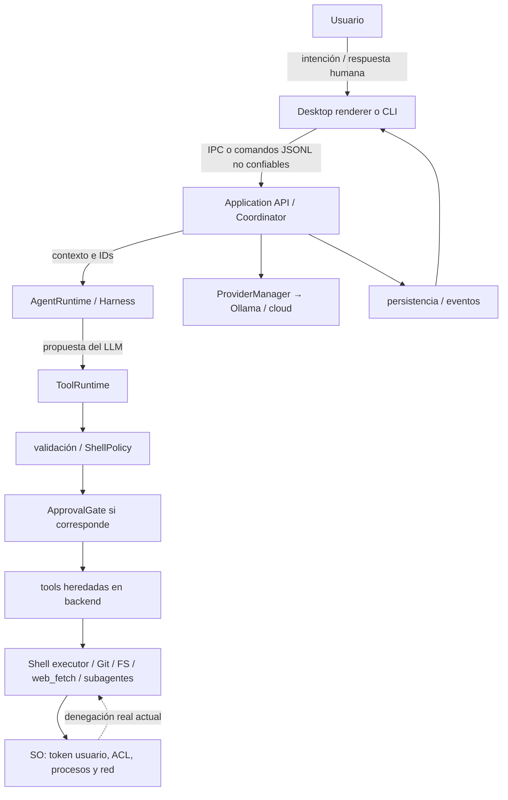
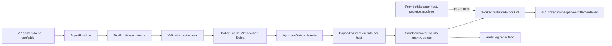

# Auditoría de seguridad de Nova V1

**Fecha:** 29 de septiembre de 2026. **Baseline:** `158b60effa484cd34a58b991f3ee4ca3f808d924`, versión Python `0.12.6`, Windows/Python 3.14.6. **Estado:** diagnóstico previo a ETAPA 2 — SECURITY; no especificación normativa ni implementación. **Repositorio:** raíz Git `local-cli-main`. La arquitectura normativa consultada es `../NOVA_CORE_ARQUITECTURA_V1.md`; la auditoría histórica, `../AUDITORIA_ARQUITECTONICA_NOVA_CORE.md`. Ambos documentos están en la carpeta padre, aunque este informe se entrega en la raíz Git. No existe `AGENTS.md` en el repositorio ni en sus directorios ascendentes inspeccionados; por ello no se atribuyen instrucciones locales a ese archivo.

## 1. Resumen ejecutivo

**[O]** Nova ya tiene `ExecutionContext` explícito, un `ToolRuntime` común para llamadas del modelo, clasificación de shell, aprobaciones correlacionadas, cancelación y eventos. **[T]** 656 tests relevantes pasaron, cinco se omitieron; las pruebas con fixtures confirmaron lectura/escritura por ruta absoluta fuera del workspace temporal, lectura del mismo archivo por `web_fetch(file://)` y herencia de `stdin` por PowerShell. La junction relativa hacia fuera fue rechazada. **[O]** Ninguna de esas protecciones crea una identidad de SO con menos privilegios: el backend y sus shells usan los permisos de la cuenta que lanzó Nova (`local_cli/application/tool_runtime.py:122-246 — ToolRuntime`; `local_cli/core/contracts.py:230-264 — ExecutionContext`; `local_cli/shell_executor.py:117-154 — PlatformShellExecutor.run`).

**[I]** Si el modelo se equivoca o sigue una inyección, puede solicitar a las herramientas accesos y efectos dentro de la autoridad de esa cuenta, incluso fuera del workspace. El hecho de que `bash` sea el identificador público no limita esa autoridad; en Windows invoca PowerShell y éste puede usar .NET, Python, Node, Git, sockets o nuevos procesos. **[P]** Para una garantía ante fallos del modelo/parser/policy se necesita un límite independiente en el host: grant acotado, broker que lo verifique y ejecutor de menor autoridad con restricciones del SO. No hay P0 demostrado bajo el modelo de amenaza definido aquí. Las exposiciones P1 están documentadas, sin corregirse.

**Diferencia central:** *protección lógica* = decidir si un texto o ruta parece aceptable; *autoridad efectiva* = todo lo permitido al proceso por token/ACL/red del host; *aislamiento fuerte* = denegación impuesta por el SO aunque falle la primera capa. El actual `ShellPolicy` es la primera, no la tercera (`local_cli/shell_policy.py:1-109 — ShellPolicy.classify`).

## 2. Alcance, reglas de evidencia y metodología

| Marca | Significado en este documento |
|---|---|
| **[O]** | Observación directa del código, configuración o test existente, sin afirmar ejecución en esta auditoría. |
| **[I]** | Consecuencia técnica razonable; no se demostró mediante prueba de explotación. |
| **[T]** | Prueba controlada, no destructiva, ejecutada en este equipo durante esta auditoría. |
| **[P]** | Recomendación o hipótesis de arquitectura SECURITY; no existe aún en producto. |
| **UNKNOWN / NO VERIFICADO** | No se alcanzó una demostración segura; requiere laboratorio, host o decisión posterior. |

Se leyó la arquitectura normativa y la auditoría anterior completas; prevalece la primera en decisiones Core V1 y el código ejecutado para conducta actual. Se inspeccionaron `core/`, `application/`, `tools/`, shell, providers, persistencia, RAG, Git, server/JSONL, CLI, Electron, subagentes y tests. Se ejecutó una selección amplia de regresión y pequeños ensayos con rutas, URLs, entorno y log **exclusivamente en directorios temporales autogenerados**. No se ejecutaron payloads destructivos, elevación, lecturas de secretos, pruebas en carpetas sensibles ni conexiones a servidores externos. La revisión de mecanismos de SO usa documentación primaria enlazada; conocer una API no prueba su viabilidad en Nova.

El reporte histórico `docs/nova_core_fase_14_resultados.md:96-117,158-173` documenta pruebas previas de Windows y declara pendiente la matriz real Linux/macOS y la emisión formal del gate `NOVA CORE V1 STABLE`. **[O]** El usuario adopta el estado actual como baseline congelado para esta auditoría; ello no convierte los ensayos históricos en pruebas nuevas ni certifica otras plataformas. El `AGENTS.md` solicitado estaba ausente, como se constató antes de auditar.

## 3. Estado del baseline auditado

| Aspecto | Estado observado | Límite de la observación |
|---|---|---|
| Sesión única, Application API y eventos | `AgentSessionCoordinator` crea la sesión, contexto, runtime, approvals y snapshot (`local_cli/application/session.py:342-429,845-859,1281-1382`). | No implica identidad de SO separada. |
| Tools | Nueve bases estáticas; `agent` se añade condicionalmente. `bash` sigue siendo nombre público (`local_cli/tools/__init__.py:13-116`; `local_cli/tools/agent_tool.py:70-110`). | Cada ejecutor heredado aún posee efectos propios. |
| Provider | Ollama principal; Claude y llama-server como adapters; estado/revisión en ProviderManager (`local_cli/application/providers.py:41-67,178-250`). | La red de provider es distinta conceptualmente de la red de tools, pero el proceso aún la comparte. |
| Shell | Windows pwsh/PowerShell, Linux bash/sh, macOS zsh/bash/sh; Git Bash opcional (`local_cli/shell_executor.py:56-110`). | Selección probada aquí sólo en Windows. |
| Git | Capacidad opcional y GitOps explícito (`local_cli/git_capability.py:10-48`; `local_cli/git_ops.py:59-114`). | Git/hooks no están aislados por SO. |
| Web monitor | Módulo y flags retirados del producto; los tests legacy sólo caracterizan la versión eliminada (`tests/test_web_monitor_containment.py:1-108`). | No atribuir el viejo bind `0.0.0.0` al baseline actual. |
| Sandbox de tools | No se crea worker restringido, AppContainer, token reducido, Job Object, namespace ni filtro de red en la ruta auditada (`local_cli/shell_executor.py:117-154`; `local_cli/application/tool_runtime.py:253-349`). | Un posible sandbox del *renderer* Electron no sería sandbox del backend ni de las tools. |

## 4. Threat model del asistente local

**Activos:** archivos personales y proyectos; estados/configuración Nova; tokens/API keys, llaves/agents SSH y Git; procesos de usuario; red local/internet; integridad del repo; disponibilidad de RAM/CPU/GPU/almacenamiento; decisiones humanas de aprobación; integridad del transcript/eventos.

**Adversarios dentro del alcance:** A) LLM benigno falible; B) comandos peligrosos por interpretación; C) prompt injection en archivos, repos, `web_fetch`, tool results, RAG y también instrucciones/skills de proyecto; D) argumentos inesperados; E) evasión de regex por quoting, pipes, redirects, child shells, `-EncodedCommand`, otros intérpretes, binarios y .NET; F) escape lógico de FS; G) symlinks/junctions/reparse; H) secretos heredados; I) hijos persistentes tras cancelación; J) subagente que pide más alcance; K) red no autorizada; L) confusión approval/permiso; M) renderer comprometido o defectuoso; N) respuesta tardía/replay; O) crash/reinicio con efecto incierto. El contenido recuperado y los resultados de tools son *datos no confiables* aunque aparezcan en un prompt. El system prompt lo explica, pero no impone autoridad (`local_cli/prompts.py:161-171`; `local_cli/project_instructions.py:100-116`; `local_cli/application/rag.py:37-44`).

**Fuera del modelo:** atacante que ya controla administrador/root, kernel o la cuenta completa del usuario; host físicamente comprometido; proveedor/endpoint legítimo ya malicioso por decisión expresa del usuario; malware previo con igual autoridad que Nova. Un renderer comprometido **sí** se considera, para estudiar cuánto confía el proceso principal en sus IPC. No se presupone que una inyección sea una instrucción legítima ni que aprobar una operación conceda permiso permanente.

**Objetivo SECURITY futuro [P]:** aun si fallan LLM, parser, tool o PolicyEngine, el ejecutor no debe poder exceder el máximo que el host concedió para esa operación. El host/broker y el SO conformarían la base confiable; si ellos mismos están comprometidos, esa garantía deja de aplicar.

## 5. Fronteras de confianza y dueño de autoridad

| Frontera y datos que la cruzan | Quién propone / decide / ejecuta | Límite efectivo hoy |
|---|---|---|
| Usuario → renderer/CLI → Application: texto, comandos, aprobación | Interfaz presenta; Application valida ciclo/identidad (`session.py:228-434,681-697`; `desktop/electron/main.ts:441-451`). | Misma cuenta local; JSONL por stdio no es autenticación si quien lo escribe ya controla ese canal. |
| Archivos/web/RAG/tool results → prompt → LLM | Fuente no confiable propone texto; Harness corrige formato y decide rutas deterministas (`prompts.py:161-171`; `rag.py:37-44`). | Instrucción al modelo, no denegación de SO. |
| LLM → ToolRuntime → tools | LLM propone nombre/args; ToolRuntime clasifica, pide aprobación si shell riesgoso, invoca (`tool_runtime.py:122-349`). | El ejecutor corre en backend, salvo shell en hijo con la misma cuenta. |
| Renderer → Electron main → backend | Main posee FS/credenciales y reenvía IPC (`desktop/electron/main.ts:314-325,441-525`; `preload.ts:19-70`). | Renderer aislado por configuración; sus puentes pueden solicitar autoridad del main. No hay comprobación visible de `event.sender` en los handlers citados. |
| Backend → provider/red, Git, disco/log | ProviderManager/servicios administrativos operan fuera de tool calls del modelo (`application/auxiliary.py:62-150`; `bootstrap_server.py:137-171`). | Autoridad de cuenta, filtros de protocolo o validaciones particulares; no worker limitado. |
| SO → proceso/hijo | Windows ACL/token o POSIX DAC y otros mecanismos ya configurados en el host. | **Única frontera de autoridad verificable hoy**, pero corresponde a la cuenta entera, no a cada grant Nova. |

**[O]** `Visibility.SENSITIVE` clasifica eventos, no encripta ni autentica consumidores (`local_cli/application/session.py:1140-1155,1334-1369`). **[I]** Un cliente IPC autorizado que vea snapshot/approval args puede ver contenido sensible. No se probó un atacante remoto sobre el renderer.

## 6. Modelo de autoridad efectiva actual

**[O]** `ExecutionContext` contiene workspace/cwd absolutos, ambiente inmutable a nivel Python, IDs, deadline y `RuntimeCapabilitySnapshot`; exige que *cwd* quede dentro de workspace y no publica el ambiente en `correlation_metadata` (`local_cli/core/contracts.py:223-266`). Su `capabilities` describe hardware/modelo/shell/Git; no es un grant OS ni un conjunto de permisos de archivo/red. `ToolRuntime.policy_for` sólo clasifica especialmente `ShellTool`; devuelve `ALLOW` para las demás tools registradas (`local_cli/application/tool_runtime.py:122-138`). En invocaciones ordinarias, ninguna tool cambia de usuario ni recibe descriptores de acceso limitados. El backend puede acceder a cualquier recurso que permita su cuenta; el shell recibe entorno parcialmente filtrado y puede abrir procesos/archivos/sockets con ese token (`local_cli/security.py:133-171`; `local_cli/shell_executor.py:117-154`).

**[T]** `ToolRuntime` completó `read`, `write` y `web_fetch(file://)` sobre un directorio temporal *hermano* del workspace; los tres emitieron un único `ToolCompleted`. `ShellTool` PowerShell permitió `Set-Content` sobre ese hermano sin aprobación. **[I]** Igual ruta contra archivos reales sujetos a permisos de la cuenta podría afectarlos; no se intentó sobre archivos del usuario. **[O]** Los servicios técnicos de Git, updater, modelo y RAG son otra superficie Application/CLI/server, no llamadas del LLM saltándose `ToolRuntime` por defecto (`local_cli/application/auxiliary.py:62-150`; `local_cli/application/session.py:1306-1332`). La separación futura de autoridad deberá cubrirlos también si ejecutan operaciones no confiables.

No se encontró una política de permisos `filesystem.read(root)`, `network.connect(host)` o token por operación. La única contención OS presente de base es el permiso de la cuenta/ACL ya existentes. En particular, **"path validada dentro del workspace" no significa "proceso imposibilitado de acceder fuera"**: el propio `cwd` está limitado pero rutas absolutas y el shell salen; cualquier otro intérprete con ese token también puede hacerlo.

## 7. Matriz de las diez tools públicas

Convenciones: **L** = validación/policy lógica; **H** = autoridad heredada de host; **A** = approval interactiva específica; **C** = cancelación. `effectState` se consigna como implementación actual, no como prueba de ausencia de efectos. Cada fila cubre ejecución principal; subagentes se detallan en §14. El ambiente no se entrega explícitamente a las tools Python de archivos/web, pero el proceso Python comparte `os.environ`; el shell recibe `ExecutionContext.environment`. Todas las rutas pasan por `ToolRuntime` para llamadas del modelo (`local_cli/application/tool_runtime.py:140-349`).

| Tool / ejecutor real | L, A y C | FS / proceso / red / ambiente / salida del workspace | `effectState`, auditabilidad y subagente |
|---|---|---|---|
| `bash` → `ShellTool`/executor nativo (`tools/shell_tool.py:25-174`) | L: ShellPolicy; A: `CONFIRM` salvo `--yes`/opt-in; `BLOCK` inapelable. C/deadline durante proceso (`tool_runtime.py:193-276`). | H: FS, subprocess y red completos de cuenta. `cwd` explícito no restringe destinos; env denylist, PATH incluido. Child interpreters/composición posibles. | Resultado stdout/stderr/exitCode, estado `UNKNOWN` tras ejecución; timeout/cancelación iniciados `outcome_unknown`; eventos ToolRequested/Started/terminal. Subagente lo tiene; riesgosos rechazados sin humano (`tools/__init__.py:80-115`). |
| `read` → `ReadTool` (`tools/read_tool.py:71-151`) | L: traversal relativo resuelto; A: no; C: sólo preflight, no durante lectura (`tool_runtime.py:257-333`). | H: lectura absoluta externa permitida; archivo de texto, UTF-8/latin1; symlink relativo estático hacia fuera rechazado, absoluto aceptado. Sin subprocess/red propia; comparte cuenta. | `effectState=NONE`; contenido entra al resultado/modelo/log/transcript. Subagente: sí. [T] absoluto externo permitido. |
| `write` → `WriteTool` (`tools/write_tool.py:21-51,113-149`) | L: traversal relativo y prefijos POSIX fijos; A: no; C: preflight. | H: crea padres y reemplaza archivo absoluto externo permitido en Windows; sin proceso/red propia. Symlink/junction y carrera dependen de resolución/operación; no handle-bound. | Resultado legacy inferido, `effectState=UNKNOWN` aun al éxito (`tool_runtime.py:321-337`); subagente: sí. [T] absoluto externo permitido. |
| `edit` → `EditTool` (`tools/edit_tool.py:216-266`) | L: traversal relativo y reemplazo de texto; no reutiliza prefijos bloqueados de write; A: no; C: preflight. | H: lee/escribe ruta absoluta externa si la cuenta permite; hace reemplazo atómico tras lectura. Sin subprocess/red propia. | Resultado legacy inferido y `UNKNOWN`; diff puede revelar texto; subagente: sí. |
| `glob` → `GlobTool` (`tools/glob_tool.py:79-124`) | L: traversal relativo y filtro de resultados relativos; A: no; C: preflight. | H: enumera ruta base absoluta externa; patrón puede ampliar coste/volumen. FS read/stat; sin subprocess/red intencional, UNC puede implicar red de FS. | Cacheable/read `NONE`; resultados incluyen rutas; subagente: sí. |
| `grep` → `GrepTool` (`tools/grep_tool.py:109-183`) | L: traversal relativo, 500 coincidencias; A: no; C: preflight. | H: `rglob` y lectura de archivos de base absoluta externa; lee contenido completo y regex sin timeout de regex. FS read; sin proceso/red intencional. | Cacheable/read `NONE`; resultados pueden contener secretos; subagente: sí. |
| `web_fetch` → `urllib.request.urlopen` (`tools/web_fetch_tool.py:67-138`) | L: URL no vacía, tipo de contenido **después** de abrir; A: no; C: preflight, timeout socket 30 s. | H: HTTP(S), redirects/proxy de urllib y handlers `file://`, `data:` [T]; puede leer archivos locales, alcanzar red interna si la cuenta/red permiten. No navegador. | Legacy clasifica `NONE` aunque un GET pueda tener efecto remoto; texto entra al modelo/log. Subagente: sí. |
| `todo_write` → `TodoWriteTool` (`tools/todo_tool.py:37-125`) | L: formato de lista; A: no; C: preflight. | Estado del plan de la instancia, no FS/proceso/red directo en ejecutor; comparte backend. | Legacy `UNKNOWN` por clasificación genérica de no cacheable; subagente: sí con instancia separada (`sub_agent.py:249-253`). |
| `ask_user` → `UserInputGate` (`application/tool_runtime.py:278-306`; `application/interactions.py:170+`) | L: pregunta no vacía; A: respuesta humana **no es approval de efecto**; C: gate con token/deadline. | No acceso directo FS/proceso/red; interface responde vía Application; el texto retornado es dato, no permiso. | `NONE`; no se ofrece a subagentes (`tools/__init__.py:80-115`). |
| `agent` → `AgentTool`/`SubAgentRunner` (`tools/agent_tool.py:117+`; `sub_agent.py:213-340`) | L: scope estático de tools hijas y límites de runner; A: no general para delegar; C: token hijo, timeout. | Puede iniciar ocho tools hijas con autoridad host; worktree es aislamiento de Git/concurrencia, no seguridad SO. Backend/provider ambiente filtrado parcial. | Resultado legacy `UNKNOWN`; agentId y eventos; tool `agent` no anidable por registry, pero shell hijo puede crear procesos. Disponible sólo si composición habilita runner (`bootstrap_server.py:66-82`). |

**Nota [O]:** `ToolDefinition.effect_class` (`read`, `potential_mutation`, etc.) y `scope` (`main`/`sub_agent`) son metadatos, no capabilities efectivas (`application/tool_runtime.py:54-68`). Los ejecutores `read/write/edit/glob/grep/web_fetch` no reciben token/deadline al entrar en sus métodos: sólo se revisan antes (`application/tool_runtime.py:253-333`). El éxito textual legado se traduce a `ToolStatus`, por lo que sus `effectState` no prueban una transacción completa ni rollback.

## 8. Shell, composición y procesos — auditoría profunda

### Selección, argumentos y cuota visible

**[O]** `detect_shell` resuelve ejecutable nativo del host y sólo acepta la preferencia de configuración; la llamada del modelo contiene `command` y `timeout`, no selector de ejecutable. Windows usa `pwsh.exe` o `powershell.exe`; `Git Bash` se detecta separadamente y no es requisito (`local_cli/shell_executor.py:36-110`; `local_cli/tools/shell_tool.py:42-73`). PowerShell se lanza con `-NoLogo -NoProfile -NonInteractive -EncodedCommand` y script UTF-16LE/UTF-8 para pipes; Bash con `--noprofile --norc -c`, Zsh `-f -c`, sh `-c` (`shell_executor.py:185-213`). Esto reduce perfiles/inyección de argumentos de lanzamiento, **no** limita el lenguaje que ejecuta la shell. El timeout de tool se normaliza a 1–600 s, default 120; el texto presentado se trunca a 100 KiB por stream **después** de que `communicate` haya capturado stdout/stderr enteros en memoria (`tools/shell_tool.py:21-22,107-173`; `shell_executor.py:117-154`). No confundir cap de prompt de ContextManager con cuota física de salida.

### Qué clasifica ShellPolicy

**[O]** Bloquea vacío/NUL, comandos destructivos visibles, child shells expresas (`cmd /c`, `powershell -Command/-EncodedCommand`, `pwsh`, `bash -c`, etc.), `Invoke-Expression`/`iex`, `Start-Process`, `Add-Type`, construcción de ScriptBlock, formatos/borrado de disco y patrones de borrado de raíz. Pide confirmación para `Remove-Item`, `taskkill`, cambios de ACL/registro/red, sudo y varios patrones POSIX. Conserva checks POSIX `rm -rf`, `dd`, `chmod`, `curl|sh` (`shell_policy.py:21-109`; `security.py:20-118`). Es regex y máscara de literales PowerShell, no AST ni seguimiento de datos/efectos. En el propio código se documenta que no es sandbox (`shell_policy.py:1-4`; `security.py:56-64`).

**[T]** En PowerShell real, `Set-Content -LiteralPath '<temporal fuera del workspace>'` se clasificó `ALLOW` y escribió el fixture sin pedir approval. **[I]** Un comando permitido puede llamar APIs .NET, Python/Node, Git, `curl`/`Invoke-WebRequest`, abrir sockets o subprocesses mediante formas que no coincidan con regex; bloquear `Start-Process` literal o `pwsh -Command` literal no garantiza prohibir todo `CreateProcess`. Redirecciones y pipelines pueden introducir escritura/ejecución indirecta; variables, quoting, escape con backtick, aliases y scripts cargados cambian el texto interpretado. No se ejecutaron payloads de evasión destructiva. `-EncodedCommand` del **lanzador Nova** es serialización legítima del texto ya clasificado; un `-EncodedCommand` generado dentro de ese texto sería child shell y puede ser detectado si coincide con el patrón, pero una ruta alternativa a API de procesos no queda contenida por ello.

### Autoridad Windows efectiva

**[O]** El shell hijo hereda cwd y el diccionario de ambiente pasado al `Popen`, así como el token de cuenta, permisos de archivos y conectividad ordinaria. `stdout` y `stderr` se capturan en pipes; **`stdin` no se configura y hereda el del backend**. Se usa `CREATE_NEW_PROCESS_GROUP` (Windows) o nueva sesión POSIX; no se crea Job Object ni token/AppContainer reducido (`shell_executor.py:117-132`). Otros handles heredables no se caracterizaron. `PATH`, `COMSPEC`, `USERPROFILE`, `TEMP/TMP`, variables SSH/Git/proxy y claves no incluidas en denylist pueden atravesar el ambiente (`security.py:133-171`). **[T]** Una variable dummy de nombre no listado fue visible desde PowerShell; `ANTHROPIC_API_KEY` dummy sí se filtró. En otra prueba, PowerShell ejecutado por `ShellTool` leyó una línea dummy del `stdin` pipe de su proceso padre pese a `-NonInteractive`. **[I]** En server mode, ese descriptor contiene JSONL del Desktop (`server.py:102-143`; `desktop/electron/main.ts:321-325`): shell y lector backend podrían competir por mensajes futuros, incluso frames sensibles; no se interceptó un frame real de producto. Los programas encontrados por PATH pueden heredar ambiente y `stdin`; secretos de Git credential helpers, perfiles y ficheros de la cuenta siguen accesibles por la autoridad del token, aunque una variable concreta se retire.

**[O]** En cancelación/timeout del shell, Windows llama `taskkill /PID ... /T /F` y luego mata la raíz si aún vive; POSIX usa `killpg(SIGKILL)` y fallback raíz (`shell_executor.py:157-181`). Se ignora fallo de `taskkill` y no existe contención de hijos por Job Object. Un hijo desacoplado, reparentado o que sobreviva a la salida normal del shell no está cubierto por una garantía de lifetime; el código **no** recoge todos los hijos al completar normalmente (`shell_executor.py:134-154`). **[T]** Los tests existentes ejecutados verificaron timeout/cancelación de un árbol benigno en esta máquina (`tests/test_nova_core_phase14_platform.py:84-137`); no se probó escape de descendientes detached ni fallo forzado de `taskkill`. `effectState=outcome_unknown` después de una ejecución interrumpida reconoce que cancelar no deshace efectos (`tools/shell_tool.py:138-173`). Las operaciones con efectos no deben reintentarse automáticamente cuando ese estado es incierto.

**[I]** `shutil.which`/pruebas de ejecutable y `git` por PATH confían en resolución del host y ambiente; PATH contaminado o binarios/config/hooks de un repo no confiable son superficie adicional (`shell_executor.py:36-110`; `git_ops.py:83-114`; `updater.py:30-40`). No se probó hijacking de PATH/hooks en el host real.

## 9. Filesystem: rutas, enlaces y carreras

**[O]** `resolve_tool_path` resuelve `..` y symlinks de forma léxica/canónica previa, pero `relative_path_escapes` sólo niega salida para rutas **relativas** (`tools/_paths.py:8-15`). `ExecutionContext` restringe cwd, no rutas de recurso (`core/contracts.py:245-264`). `write` bloquea prefijos POSIX concretos y `..` relativo; rutas absolutas fuera del workspace se aceptan si pasan el SO. `edit` no aplica esos prefijos; `read`, `glob`, `grep` aceptan base absoluta externa (`tools/write_tool.py:21-51`; `edit_tool.py:216-266`; `read_tool.py:87-103`; `glob_tool.py:79-110`; `grep_tool.py:109-136`). En Windows los prefijos POSIX no son una protección de `C:\Windows`, ni de perfiles, unidades adicionales o UNC.

**[T]** Con `workspace` y `outside` dentro de un temporal: `../outside` fue rechazado para lectura y escritura; ruta absoluta de `outside` sí permitió ambas. Una junction temporal `workspace/junction → outside` fue creada, la lectura **relativa** atravesándola fue rechazada y la junction eliminada. La creación de symlink ordinario requirió privilegio/soporte ausente (`OSError`): **UNKNOWN / NO VERIFICADO** para ese fixture, aunque la junction probó el caso relevante en Windows. **[I]** Un symlink o junction **absoluto** resuelto hacia fuera seguirá el tratamiento de ruta absoluta y podría pasar; no se ensayó destructivamente contra un destino sensible.

**[O]** `atomic_write_text` crea temporal en padre, escribe y hace `os.replace`, protegiendo frente a truncado por escritura interrumpida; separa `resolve`/validación, `mkdir`, `stat`, apertura y `replace`, sin vincular autorización a un handle/inode/identidad de objeto (`tools/_fileio.py:77-126`; `write_tool.py:113-149`). Además modifica `os.umask(0)` temporalmente antes de restaurarlo (`_fileio.py:109-116`): como umask es global de proceso POSIX, hay posible carrera entre threads **[I]**; no se ejercitó. Los symlinks/junctions/reparse pueden cambiar entre validación y uso: **TOCTOU plausible [I], no exploit demostrado [T]**. En un futuro broker se necesitan handles abiertos y comprobados o resolución resistente a reemplazo según plataforma; no basta con repetir `Path.resolve()`.

| Vector | Observación / incertidumbre |
|---|---|
| Cwd y `..` | Canonización previa y rechazo relativo [O,T]; no límite OS para shell/rutas absolutas. |
| Symlink/junction/reparse | Junction relativa externa rechazada [T]. Alias absoluto y cambio concurrente **NO VERIFICADO**; todos los tipos de reparse no cubiertos. |
| Windows drive/UNC/ADS | No hay allowlist explícita de unidad, share, UNC o Alternate Data Stream en los paths de tools [O]. Acceso concreto y semántica ADS **NO VERIFICADO**; puede depender de FS/ACL/red. |
| Case y alias | `Path.resolve` ayuda a normalizar; no se ve comparación por identidad de archivo/volumen ni handles [O]. Equivalencia exacta de alias Win32/8.3 y case según volumen **NO VERIFICADO**. |
| Temporal y worktree | `tempfile`/Git worktree se usan para atomicidad/aislamiento operativo (`tools/_fileio.py:100-123`; `sub_agent.py:434-487`), no restringen una tool a esa ruta. |
| Tamaño y binary | `read` sin límite total por defecto, `grep` lee cada texto entero, `glob` materializa matches; no cuota física general (`tools/read_tool.py:104-150`; `grep_tool.py:121-183`; `glob_tool.py:90-105`). |

La autoridad real sigue limitada por ACL/DAC del usuario, no por un grant de workspace Nova. Una ruta "validada" jamás equivale por sí sola a confinamiento del **proceso**.

## 10. Network authority

| Ruta | Destino/autoridad actual | Evidencia y clasificación |
|---|---|---|
| `web_fetch` | URL sin allowlist de esquema/host/IP/puerto; `urllib` usa handlers/proxy/redirects. `file://` y `data:` se aceptaron; HTTP(S) dispone de red de backend. | [O,T] `tools/web_fetch_tool.py:67-138`; fixture local sin tráfico externo. Posible SSRF hacia servicios locales/red privada [I], no atacado. |
| `bash` y binarios hijos | Sockets permitidos por SO/cuenta; `curl`, `Invoke-WebRequest`, Python/Node/Git/package managers pueden comunicarse. | [O,I] `shell_executor.py:117-154`; `shell_policy.py:21-109`; no prueba externa. |
| Providers | Ollama usa cliente HTTP validado como local, Claude API y llama-server tienen clientes propios; sus conexiones son necesidad del host, no permiso de tool. | [O] `ollama_client.py:121-168`; `providers/claude_provider.py:145-228`; `providers/llama_server_provider.py:70-110`. |
| RAG embeddings/model management | Cliente Ollama calcula embeddings y gestiona pulls/modelos; origen distinto de `web_fetch`. | [O] `rag.py:353-366,429-443`; `model_manager.py:180-233`; `ollama_client.py:548-552`. |
| Git y updater backend | `git fetch/pull` y posible `pip install -e .` bajo cuenta; Git puede usar remotos/credential helpers/hooks según configuración. | [O,I] `updater.py:17-145`; `git_ops.py:83-114`. |
| Electron | OAuth/Claude, GitHub releases, download de update; `openExternal` entrega URI al SO. | [O] `desktop/electron/main.ts:105-109,151-214,621-745,767-815`. |

`validate_ollama_host` comprueba sintaxis y host permitido; incluso incluye `0.0.0.0`, que es dirección de bind más que garantía de loopback destino, y no fija DNS/redirect/proxy ni restringe sockets de otras rutas (`local_cli/security.py:178-224`). **[I]** No debe usarse como firewall de tools. El `Content-Type` de `web_fetch` se comprueba después de abrir el recurso; el cuerpo se lee completo y se trunca sólo para presentación (`web_fetch_tool.py:84-135`). **[P]** Futura red de inferencia/actualización/embeddings debe permanecer en host autorizado; red del worker de tools debe concederse separadamente y verificarse por OS/broker, incluidos DNS, redirect, IP final y proxies. El alcance concreto de destinos es decisión pendiente.

## 11. Secretos y ambiente

**[O]** `get_sanitized_env()` copia `os.environ` y quita una denylist de 23 nombres, entre ellos `ANTHROPIC_API_KEY`, `OPENAI_API_KEY`, `AWS_SECRET_ACCESS_KEY`, `GITHUB_TOKEN`, `BASH_ENV`, `ENV` y `ZDOTDIR` (`local_cli/security.py:133-171`). Conservar `PATH`, `HOME`/`USERPROFILE`, `TEMP/TMP`, `COMSPEC`, `SSH_AUTH_SOCK`, `GIT_*`, proxies, `PYTHONPATH`, `NODE_OPTIONS` y claves con nombres nuevos es posible. **[T]** Un `NOVA_AUDIT_CUSTOM_SECRET` dummy llegó a PowerShell y un `ANTHROPIC_API_KEY` dummy no. No se inspeccionó ningún valor real. `ShellTool` aplica la denylist también a ambientes inyectados; el backend Python y Electron principal retienen su entorno, y Electron pasa `...process.env` al backend con la clave Claude si está almacenada (`tools/shell_tool.py:35-44`; `desktop/electron/main.ts:314-325`). El provider Claude toma `ANTHROPIC_API_KEY` de `os.environ` o argumento y la conserva en su instancia (`providers/claude_provider.py:145-185`). El flujo server `set_api_key` la coloca en `os.environ` del proceso (`server.py:461-478`).

**[O]** Electron guarda credencial Claude usando `safeStorage` si disponible y texto claro si no; usa `{ mode: 0o600 }`, sin que ello demuestre ACL restrictiva efectiva en Windows (`desktop/electron/main.ts:55-95`). `get-claude-auth` devuelve un fragmento de clave al renderer (`main.ts:510-515`). Las rutas de conversación/JSONL guardan transcript bruto sin cifrado ni redacción general (`application/persistence.py:36-51`; `infrastructure/persistence.py:40-66`), y eventos/snapshots pueden llevar texto/herramientas y approvals pendientes (`application/session.py:1140-1155,1334-1369`; `application/legacy_event_bridge.py:28-43`). `json_safe_copy` sólo preserva JSON seguro; no redacta (`core/contracts.py:36-49`).

**[T]** Con un valor dummy en argumentos de tool, `SessionLogger.emit` lo escribió en su JSONL; `LegacyAuditLog` ocultó el campo `api_key`, pero no el mismo valor en `customNote` porque no recibió lista de secretos. **[O]** El redactor usa nombres de clave/`Bearer` y sólo reemplaza valores concretos si se suministran; `create_persistence_service` lo instancia sin valores (`infrastructure/persistence.py:175-196`; `application/persistence.py:96-115`). `SessionLogger.emit` registra argumentos/resultados (limitados en caracteres) sin esa redacción y falla abierto si no puede escribir (`session_log.py:144-166,235-280`). La promesa de que *ningún* secreto salga en eventos/logs aún no está verificada. **[P]** Para SECURITY se deben separar ambientes del host/proveedor/worker, allowlist por operación, broker de secretos necesarios, redactar estructuras y texto antes de eventos/log/snapshot, conservar un AuditLog sin secretos y validar Windows ACL/almacenamiento. La elección exacta de allowlist y retención requiere decisión.

## 12. PolicyEngine actual: alcance real

**[O]** No hay un motor de permisos OS `PolicyEngine V2` implementado como tal. La frontera Application es `ToolRuntime.policy_for`: rechaza nombre desconocido, aplica `ShellPolicy` sólo a `ShellTool`, y devuelve `ALLOW` para `read/write/edit/glob/grep/web_fetch/todo_write/ask_user/agent` (`application/tool_runtime.py:122-138`). Las tools llevan checks propios de argumentos/rutas; URL no tiene policy de destinos. Git/updater son servicios administrativos externos a esa ruta, con checks propios; `agent` elige registry estático hijo, sin intersección formal de grants (`application/auxiliary.py:62-150`; `tools/__init__.py:80-115`; `sub_agent.py:245-283`). Policy distingue `ALLOW`, `REQUIRE_APPROVAL`, `DENY` y revisión `1`; no razona sobre descriptores/handles/efectos finales, sockets, binarios secundarios o autoridad heredada (`tool_runtime.py:29-45,122-138`).

**[O]** Reglas POSIX provienen de `security.py:20-118`; reglas Windows PowerShell de `shell_policy.py:28-60`. `ShellPolicy` revisa texto, no composición semántica. **[I]** Quoting, interpolación, pipes, redirects, scripts/imports, Python/Node/.NET y procesos pueden evadir el objetivo de una regex sin evadir necesariamente su texto literal; no debe afirmarse que se probó una explotación general. **[P]** Conservar clasificación actual como defensa adicional, warnings, bloqueo de patrones evidentes y experiencia de aprobación. Una `PolicyEngine V2` debería decidir sobre invocación estructurada, efectos/capabilities y argumentos canonizados; nunca debe presentarse como enforcement OS ni ser la única barrera. La comprobación de grant máxima debe sobrevivir a un fallo de esta policy.

## 13. ApprovalGate: exactitud y límites

**[O,T]** `ApprovalGate._digest` SHA-256 canoniza `sessionId`, `turnId`, `operationId`, `toolCallId`, nombre, argumentos JSON, cwd resuelto, `policyRevision` y deadline. `request` genera approvalId, observa cancelación/vencimiento, publica pending; `resolve` exige ID y coincidencia de sesión/toolCall/digest/cwd/revisión, rechaza respuesta obsoleta, de otro cwd o después de cancelación; los tests de gates ejecutados cubrieron esos caminos (`application/interactions.py:32-164`; `tests/test_nova_core_phase7_interactions.py:57-162`; `tests/test_security_gates.py:55-105`). La repetición idéntica de una respuesta ya resuelta devuelve el mismo booleano, pero la ejecución se deduplica por `operationId` y fingerprint en `ToolRuntime`; **no constituye un segundo grant ni segunda ejecución** (`interactions.py:149-164`; `tool_runtime.py:143-158`).

**[O]** La aprobación es *one-shot lógica para esa tool call*. `--yes`/`auto_approve` la omite por opción explícita, pero no elimina `BLOCK` (`tool_runtime.py:185-218`; `tools/__init__.py:13-38`). Un subagente no recibe un `ApprovalGate` interactivo en su runtime; su shell configurado rechaza comandos `CONFIRM` (`sub_agent.py:245-283`; `tools/__init__.py:94-115`). **[I]** El digest no autentica físicamente qué humano pulsó el botón: frontend/IPC en la misma cuenta podría enviar una resolución válida si conoce el request; tampoco vincula a contenido/objeto de FS que puede cambiar entre aprobación y uso. No es vulnerabilidad de replay demostrada ni justificación para debilitar el gate. **[P]** Mantener las comprobaciones actuales, añadir autenticidad del canal/issuer de approval y enlazar grant/sandbox al máximo autorizado. Nunca tratar una approval como desactivar sandbox. No se modificó el diseño de approvals en esta auditoría.

## 14. Subagentes y herencia de autoridad

**[O]** Un `SubAgent` recibe provider/model snapshot y un conjunto de ocho tools: `bash`, `read`, `write`, `edit`, `glob`, `grep`, `web_fetch`, `todo_write`; no `ask_user` ni `agent`. Usa `ToolRuntime` de la misma clase, registry con `scope="sub_agent"`, instancia de todo separada y clones con cwd del workspace o Git worktree. Copia entorno filtrado; crea token hijo y deadline propio; runner usa thread pool y worktree opcional (`tools/__init__.py:80-115`; `tools/agent_tool.py:70-110`; `sub_agent.py:148-187,213-340,434-487,700+`). El subagente no hereda aprobación pendiente y rechaza sintaxis de shell riesgosa; la selección del provider se snapshottea para no quedar obsoleta tras cambio (`sub_agent.py:267-283`; `application/session.py:783-831`).

**[I]** `child authority <= parent authority` sólo está parcialmente satisfecho como *lista de tools*: no hay scopes de FS/red/proceso que intersectar; el hijo posee los mismos permisos OS de cuenta y puede usar shell/URLs/absolutos aunque su cwd sea otro. No puede iniciar otro `agent` tool, pero cualquier shell puede crear procesos normales. Un worktree cambia checkout/cwd, no token ni ACL, y los procesos Git/hook tienen autoridad de usuario. **[O]** El contexto hijo crea nuevo sessionId y agentId, pero no propaga parent session/turn como campos dentro de `ExecutionContext` hijo; Application publica correlación exterior, por lo que la reconstrucción forense completa de cada operación hija exige revisar agregación (`sub_agent.py:267-285`; `application/session.py:783-831`). **[P]** Introducir intersección de grants host→child, cuotas y token de cancelación/worker descendiente; respetar límites de concurrencia. No crear jerarquía multiagente nueva.

## 15. AuditLog y observabilidad de seguridad

**[O]** Se pueden reconstruir IDs de sesión/turn/generation/operation/toolCall, nombre de tool, estado y `effectState` en eventos; para shell hay exitCode/stdout/stderr. La aprobación registra digest/revisión/cwd/deadline y decisión (`core/contracts.py:589+`; `application/session.py:1096-1178`; `application/interactions.py:74-164`). `InMemoryEventJournal` es acotado y se pierde al reiniciar; no es un registro forense durable ni inmutable (`infrastructure/persistence.py:117-173`). `SessionLogger` es flight recorder JSONL voluntario/que falla abierto, no un log de seguridad resistente a manipulación; la misma cuenta puede modificar sus archivos (`session_log.py:87-166`; `application/persistence.py:28-33`).

Faltan, para un AuditLog de seguridad [P]: principal/grant issuer, permiso y recurso canónico/handle, revisión hash de policy efectiva, ejecutable real y firma/procedencia, worker/token/sandbox backend, digest del request efectivamente ejecutado, stdout/result **redactados**, inicio/fin, efecto parcial o desconocido, resultado de kill/cleanup, vinculación padre→hijo, rechazo de denegaciones y evidencia de denegación OS. **[O]** Actualmente el payload de terminal normalizado registra nombre/status/effect/optype/cache, no la cadena completa de decisión/capability/objeto ejecutado (`application/session.py:1111-1134`); el legacy bridge manda argumentos y resultados truncados a JSONL (`application/legacy_event_bridge.py:28-43`). Logs y eventos no deben transformarse en almacén de secretos para lograr trazabilidad.

## 16. Diferencias Windows/Linux/macOS y mecanismos candidatos

### Observado en Nova frente a probado en el SO

| Plataforma | Ruta Nova [O] | Verificación actual [T] | Candidatos OS [P], no implementados |
|---|---|---|---|
| Windows | PowerShell `pwsh.exe` y fallback `powershell.exe`; grupos de procesos y `taskkill /T` en error/cancel (`shell_executor.py:84-110,117-181,185-193`). | Shell real, FS/junction, entorno y árbol de cancelación benigno; no se probaron sandbox/token reducido. | Worker fuera del host principal, token restringido + ACL o AppContainer con broker; Job Object para lifetime/cuotas; mitigaciones según compatibilidad. |
| Linux | bash/sh; `start_new_session`, `killpg` (`shell_executor.py:84-110,127-130,157-181,195-209`). | **UNKNOWN / NO VERIFICADO** en host Linux durante esta auditoría. Tests de selección/mocks no sustituyen host. | Landlock para FS si ABI disponible, namespaces/mount/network isolation, seccomp para syscall surface, cgroups/cuotas, broker de recursos. |
| macOS | zsh/bash/sh; misma rama POSIX del executor (`shell_executor.py:84-110,127-130,157-181,200-209`). | **UNKNOWN / NO VERIFICADO** en host macOS durante esta auditoría. | App Sandbox/XPC, entitlements y acceso a ficheros delegado; revisar herencia de CLI arbitraria, network entitlements y TCC. |

### Windows: comparación de candidatos sin elegir backend

| Mecanismo | Qué podría imponer | Qué **no** resuelve solo / compatibilidad pendiente |
|---|---|---|
| Restricted token + ACL sobre workspace/recursos | Reduce SIDs/privilegios del token y comprueba ACL sobre objetos si se diseña bien. [P] | No crea automáticamente una raíz FS; token, ACL, APIs, heredabilidad, acceso a DLLs/PowerShell/Python/Node/Git y Windows Home/Pro requieren laboratorio. Documentación: [CreateRestrictedToken](https://learn.microsoft.com/en-us/windows/win32/api/securitybaseapi/nf-securitybaseapi-createrestrictedtoken). |
| Low integrity | Impide ciertos *write-up* hacia objetos de integridad media según MIC. [P] | No es denegación general de lectura/red ni grant de workspace; podría romper rutas de temporales/profiles y herramientas. [Mandatory Integrity Control](https://learn.microsoft.com/en-us/windows/win32/secauthz/mandatory-integrity-control). |
| Job Objects | Agrupa y puede limitar/matar árbol al cerrar job; componente fuerte de lifecycle/cuotas. [P] | No es sandbox FS/red; la pertenencia de todos los descendientes y breakaway/WMI requieren prueba. [Job Objects](https://learn.microsoft.com/en-us/windows/win32/procthread/job-objects). |
| AppContainer | Perfil/capabilities de Windows, ACL de recursos y red acotadas, utilizable para ciertos procesos Win32 empaquetados/no empaquetados. [P] | Lanzar PowerShell/Python/Node/Git reales, librerías, IPC broker, ruta user-data, red local/Ollama y Windows 10/11 debe ensayarse. [AppContainer isolation](https://learn.microsoft.com/en-us/windows/win32/secauthz/appcontainer-isolation), [legacy applications](https://learn.microsoft.com/en-us/windows/win32/secauthz/appcontainer-for-legacy-applications-). |
| Process mitigation policies | Endurece ciertas clases de explotación/carga de código. [P] | Restricciones de código dinámico pueden romper intérpretes/JIT; no equivalen a limitar archivos/red/credenciales. [SetProcessMitigationPolicy](https://learn.microsoft.com/en-us/windows/win32/api/processthreadsapi/nf-processthreadsapi-setprocessmitigationpolicy). |
| Windows Sandbox/VM | Aislamiento de kernel por virtualización. [P] | Ediciones Pro/Enterprise/Education, no Windows Home; software dentro no disponible automáticamente, red habilitada por defecto y gasto de RAM/GPU incompatibles potencialmente con baseline ~8 GB VRAM si se ejecutan modelos ahí. No asumir que sea opción por defecto. [Windows Sandbox](https://learn.microsoft.com/en-us/windows/security/application-security/application-isolation/windows-sandbox/). |
| Worker/broker separado | Permite sacar tools no confiables del proceso con secretos/modelo y mediar acceso. [P] | Separar procesos por sí mismo no reduce privilegios: necesita una de las restricciones OS/ACL/red anteriores y protocolo de broker diseñado. |

**[P]** `SandboxPort` no debería devolver un booleano `sandboxed`; debe declarar garantías verificables por plataforma (`filesystem`, `process_tree`, `network`, `environment`, `identity`, versión, límites), modo solicitado/enforced/failure y prueba de lanzamiento. Si una garantía requerida no se puede establecer, la operación que la exige debe fallar cerrada; un fallback transparente a proceso normal falsearía el contrato. **No se selecciona aquí backend Windows ni estrategia de degradación de producto.**

En Linux, [Landlock](https://cdn.kernel.org/doc/html/latest/userspace-api/landlock.html) permite restricciones FS por jerarquía y herencia a descendientes, con derechos dependientes de versión de ABI; files preabiertos y ciertos pseudo-FS requieren atención. [Seccomp](https://kernel.org/doc/html/latest/userspace-api/seccomp_filter.html) reduce superficie de syscalls y su propia documentación advierte que no es sandbox completo. User/mount/network namespaces, Landlock, seccomp y cgroups aportarían garantías distintas; disponibilidad de user namespaces y filtros depende de kernel/distribución. En macOS, [Apple App Sandbox](https://developer.apple.com/library/archive/documentation/Miscellaneous/Reference/EntitlementKeyReference/Chapters/EnablingAppSandbox.html) especifica herencia limitada y prefiere XPC para separación; un hijo genérico CLI no queda automáticamente confinado por declarar entitlements de la app. No se probó ninguna de estas composiciones en hosts reales. **No diseñar un mínimo común denominador que oculte garantías dispares.**

## 17. Hallazgos y matriz de riesgo P0–P3

**Escala:** P0 = autoridad peligrosa inmediata o bypass crítico demostrado; P1 = riesgo alto antes de ampliar capacidades; P2 = endurecimiento importante; P3 = mejora defensiva/observabilidad. **P0 encontrados: ninguno demostrado.** El uso de autoridad de cuenta completa ya era parte del baseline sin sandbox; se clasifica P1 por el impacto de incorporar capacidades futuras sin barrera, no como explotación remota automática. *Accidental/adversarial* describe plausibilidad relativa (alta/media/baja/condicional), no frecuencia medida. Fase `Sx` = propuesta del §20.

| ID | Superficie / hallazgo | Evidencia | Impacto | Accidental / adversarial | Sev. | Protección actual | Protección necesaria / fase |
|---|---|---|---|---|---|---|---|
| SEC-01 | Shell con autoridad de usuario; child interpreters/composición superan comprensión de regex. | [O,T] `shell_policy.py:21-109`; `shell_executor.py:117-154`; `Set-Content` temporal permitido. | Modificar/leer FS, ejecutar binarios y red de la cuenta. | Alta / alta con inyección. | **P1** | Policy textual, approvals en patrones y ACL host. | Grant OS + worker/broker, no confiar en parser; **S1–S5**. |
| SEC-02 | Rutas absolutas de `read/write/edit/glob/grep` sin confinamiento de workspace. | [O,T] `_paths.py:8-15`; `write_tool.py:21-51`; fixture vía ToolRuntime. | Exposición o modificación de archivos accesibles a cuenta. | Media / alta. | **P1** | Rechazo de `..` relativo y ACL del usuario. | Permisos FS por raíz/operación e imposición por SO/broker; **S1,S3**. |
| SEC-03 | `web_fetch` admite `file://`/`data:` y URL sin política de red; SSRF plausible. | [O,T] `web_fetch_tool.py:67-135`; fixture `file://` externo. | Lectura local y acceso a red privada/servicios bajo autoridad de backend. | Media / alta si prompt inyectado. | **P1** | Timeout 30 s y revisión tardía de MIME. | Allowlist/permiso de destinos y broker de red, schemes explícitos; **S2,S5**. |
| SEC-04 | Denylist de ambiente parcial; variables dummy no listadas alcanzan PowerShell. | [O,T] `security.py:133-171`; fixture dummy. | Filtración de claves por entorno, helpers o subprocesses. | Media / alta. | **P1** | 23 nombres filtrados, `-NoProfile`. | Worker con allowlist/secrets broker y FS aislado; **S1,S6**. |
| SEC-05 | Logs/transport/snapshots pueden conservar args/resultados con secretos; redacción incompleta. | [O,T] `session_log.py:235-280`; `legacy_event_bridge.py:28-43`; dummy en log. | Confidencialidad local y propagación a UI/modelo. | Alta / media. | **P1** | Redacción por nombre en LegacyAuditLog y clip de texto, no universal. | Redacción estructurada, clasificación, evitar secretos en events/logs y formatos compatibles; **S6,S7**. |
| SEC-06 | IPC Electron expone lectura/listado arbitrario y reenvío de comandos sin validar sender en handlers observados. | [O,I] `desktop/electron/main.ts:441-499`; `preload.ts:19-70`. | Renderer comprometido puede pedir efectos del main/backend de la misma cuenta. | Baja / alta *si* renderer comprometido. | **P1** | `nodeIntegration:false`, `contextIsolation:true`, carga local productiva. | Validación sender/origin, API estrecha, authority en backend, test de renderer comprometido; **S0,S2,S8**. |
| SEC-07 | El clasificador autoriza por texto, no por efecto; `Set-Content` externo no requirió approval. | [O,T] `shell_policy.py:40-109`; fixture PowerShell. | Las approvals pueden faltar en mutaciones reales. | Media / alta. | **P1** | Regex y confirmación en algunos comandos. | Policy V2 estructurada como defensa; enforcement del grant independiente; **S2,S4**. |
| SEC-08 | Cancelación de árbol es best effort y stdout/stderr se capturan sin límite físico. | [O,T parcial] `shell_executor.py:117-181`; árbol benigno en tests; detached no probado. | Proceso residual o agotamiento de memoria/recursos. | Media / media. | **P2** | `taskkill /T`, `killpg`, timeout, cap **posterior** de presentación. | Job/árbol supervisado, pipes/cuotas físicas, resultado incierto; **S4,S7**. |
| SEC-09 | TOCTOU en paths y alias/reparse/UNC/ADS no cubiertos integralmente. | [O,I] `write_tool.py:113-149`; `_fileio.py:77-126`; junction estática [T]. | Cambio de destino entre check y uso; alcance difícil de demostrar. | Baja / media. | **P2** | `Path.resolve`, `os.replace` para atomicidad, ACL usuario. | Comprobación por objeto/handle, tests de carreras/reparse; **S3,S8**. |
| SEC-10 | Subagentes reducen lista de tools pero no autoridad OS; worktree no es sandbox. | [O,I] `tools/__init__.py:80-115`; `sub_agent.py:245-283,434-487`. | Delegación mantiene shell/FS/red de cuenta. | Media / alta con inyección delegada. | **P1** | No anidación `agent`, riesgosos shell denegados, cancelación hija. | Intersección de grants, worker descendiente, cuotas; **S1,S4,S8**. |
| SEC-11 | Actualizador Desktop macOS/Linux acepta artefacto descargado/redirección sin verificación de firma observada; URI manual viene de renderer. | [O,I] `desktop/electron/main.ts:621-741,767-815`. | Instalación potencial de artefacto no autorizado si canal/renderer comprometido. | Baja / condicional alta. | **P2** | HTTPS para catálogo; empaquetado/platform gates. | Validar publisher/digest/URL y canal; revisar fuera de tool sandbox; **S0,S8**. |
| SEC-12 | Git/updater/binarios resueltos por PATH, configuración/hooks/credenciales de usuario. | [O,I] `git_ops.py:83-114`; `updater.py:17-145`; `shell_executor.py:36-110`. | Efectos con cuenta y red, hijacking en entornos no confiables. | Baja / media. | **P2** | Git opcional, args separados; algunas operaciones exigen checkout limpio. | Identidad de ejecutables/entorno confiable, scopes Git y segregación de updater; **S2,S6**. |
| SEC-13 | AuditLog actual no prueba grant, executor/objeto real ni resultado de kill, y es modificable por la cuenta. | [O] `session.py:1111-1134`; `infrastructure/persistence.py:175-196`; `session_log.py:144-166`. | Investigación y detección de efectos parciales incompletas. | Media / media. | **P2** | IDs, eventos, flight recorder y outcome_unknown. | Auditoría redacted y correlacionada, efecto real/worker/grant; **S7**. |
| SEC-14 | Lecturas/resultados y regex sin cuota/timeout operacional global. | [O] `read_tool.py:104-150`; `grep_tool.py:121-183`; `web_fetch_tool.py:111-135`. | DoS local/memoria y bloqueo de cancelación. | Media / media. | **P2** | Caps de prompt/resultados, timeout del socket/shell, max500 matches. | Cuotas físicas/cancelación para cada executor; depende de OD-06; **S4,S8**. |
| SEC-15 | Approval autentica request, no identidad humana del frontend; `--yes` omite diálogo por opción. | [O,I] `interactions.py:74-164`; `tool_runtime.py:193-216`; `main.ts:441-451`. | Renderer comprometido podría resolver pending; uso indebido de autoapprove. | Baja / condicional alta. | **P2** | Digest exacto, one-shot, deadline/cancel, opt-in autoapprove. | Canal confiable/actor atestado, mantener vínculo exacto y sandbox; **S2,S8**. |
| SEC-16 | Shell hijo hereda `stdin` del backend; server usa ese pipe para JSONL. | [O,T] `shell_executor.py:125-132`; `server.py:102-143`; fixture de lectura dummy. | Competencia por mensajes/posible exposición de frame de control al child shell [I]. | Baja / media si se conoce el timing. | **P1** | `-NonInteractive` no impidió la lectura; no hay aislamiento de stdin. | `stdin=DEVNULL` o canal explícito y brokerado para operaciones aprobadas; test end-to-end de no lectura; **S4,S8**. |

Las filas comparten causas. No sumar P1 como incidentes independientes ni describir un exploit de administrador. SEC-11 es escenario condicional macOS/Linux, no ejecución verificada. A diferencia de la vieja auditoría histórica, el web monitor abierto fue retirado y **no** figura como hallazgo actual.

## 18. Pruebas realizadas, resultados y límites

| ID de prueba | Tipo / alcance | Resultado |
|---|---|---|
| REG-01 | Pytest dirigido sobre 20 rutas: security, gates, shell, tools, ToolRuntime, sesiones/subagentes, eventos, snapshots, arquitectura/plataforma, server y web monitor. `python -B -m pytest -p no:cacheprovider --basetemp <temporal> -q ...`; HOME/USERPROFILE/XDG/TEMP/TMP aislados, Ollama opt-in apagado. | **[T] 656 passed, 5 skipped, 43 subtests passed; 74.48 s**. No hubo descarga ni conexión cloud. Opt-in Ollama/Electron y condiciones de plataforma no quedan validados por estos skips. |
| FIX-01 | Temp `workspace` y hermano `outside`: `ReadTool`/`WriteTool` directas y `ToolRuntime` real con `ExecutionContext`/events. | **[T]** relativo `..` rechazado; absoluto externo completado para read/write; un terminal por tool. |
| FIX-02 | `WebFetchTool`/`ToolRuntime` sobre `file://` del mismo archivo dummy y `data:text/plain`. | **[T]** contenido dummy recuperado y terminal `ToolCompleted`; no servicio externo. |
| FIX-03 | Windows: junction temporal a hermano; lectura relativa por runtime. | **[T]** junction creada, lectura rechazada, junction retirada. Symlink ordinario falló por permisos: UNKNOWN. |
| FIX-04 | PowerShell real con ambiente dummy y cwd del workspace; `Set-Content` sólo al hermano temporal. | **[T]** policy `ALLOW`, exitCode 0, archivo dummy escrito; `ANTHROPIC_API_KEY` dummy filtrada, clave custom dummy visible. |
| FIX-05 | `SessionLogger` y `LegacyAuditLog` sobre state dir temporal, valores ficticios. | **[T]** args dummy en JSONL; `api_key` redactado; el mismo valor en clave custom permaneció. |
| FIX-06 | Backend de prueba con `stdin` pipe sólo dummy que lanzó `ShellTool` PowerShell; lectura `[Console]::In.ReadLine()` inocua. | **[T]** el shell obtuvo la línea dummy pese a `-NonInteractive`; no se usó server real ni un mensaje del usuario. |
| SRC-01 | Code inspection de Desktop/CLI/server/providers/Git/RAG, normas Core, fuentes primarias de SO. | **[O]** Sin ejecutar Desktop real, cloud, updater, Git remoto, sandbox OS ni Linux/macOS. |

Todos los fixtures `nova-security-tests-*`, `nova-security-fixtures-*`, `nova-security-runtime-*`, `nova-security-logs-*` y `nova-security-stdin-*` se borraron automáticamente al cerrar cada `TemporaryDirectory`; la junction fue retirada expresamente antes de borrar su raíz. No se leyó secreto real ni se borró archivo del usuario. No se añadió test al árbol del repo: la caracterización nueva se ejecutó de forma temporal para respetar que sólo puede modificarse el informe.

## 19. Arquitectura SECURITY preliminar — evaluación, no decisión

**[O]** Ya existen AgentRuntime, ToolRuntime, validación puntual, ShellPolicy/ApprovalGate, `ExecutionContext`, IDs/eventos, provider/persistencia y `effectState`. **[P]** Faltan una representación explícita de permisos, emisor de grants con techo de autoridad independiente del LLM/Policy, broker, worker separado restringido por SO, confinamiento FS/red/procesos/hijos, entorno mínimo y audit log de seguridad. La verdadera frontera debería estar **en el token/ACL/namespace/AppContainer y en la validación del broker al atender recursos**, no en el texto de respuesta del LLM, una regex ni la ventana Electron. Un broker que sólo reenvíe rutas sin verificar handles/grants repetiría el problema actual.

Asignación preliminar **[P]**: Core define puertos/contratos (`Permission/Capability`, `SandboxPort` y resultado verificable, `EventSink`, cancelación) sin importar OS; Application posee sesión, issuance/reducción de grants, PolicyEngine, ApprovalGate, agenda/efectos y trazabilidad; Infrastructure implementa Windows/Linux/macOS launchers, FS/network/process broker, credenciales y persistencia; Interfaces solicitan y muestran aprobación sin conferir autoridad propia. `AgentRuntime` recibe sólo puertos Core como dispone V1. Ninguna parte de esta distribución es una especificación normativa cerrada.

El contrato `SandboxPort` debe representar **garantías heterogéneas atestadas**, no prometer la misma semántica ficticia en los tres SO. `Restricted Worker` necesita un canal IPC que no permita convertir una operación de lectura aprobada en write/spawn/URL arbitrarios. El backend puede conservar acceso a Ollama/cloud para inferencia mientras el worker carece de red, salvo grant explícito. Los detalles de plataforma, alcance de permisos y degradación siguen abiertos.

## 20. Orden recomendado de implementación SECURITY (sólo propuesta)

**[P]** Cada fase mantiene ejecutable el baseline de un chat, CLI y Desktop. En todas: primero caracterización/contrato, luego cambio pequeño, prueba regresiva y salida reversible. **No se inicia ninguna fase en esta solicitud.** El rollback sugerido es revertir sólo los commits de *esa fase* o desactivar adapter nuevo **sin permitir fallback inseguro a worker no restringido** cuando el perfil de seguridad sea requisito; conservar transcript/estado. Git es opcional para el producto: un archivo/artefacto de checkpoint validado puede servir si Git no existe. Ni checkpoint ni commit se hicieron ahora.

| Fase | Objetivo y módulos probables | Prerrequisitos / tests antes de tocar | Cambios permitidos / prohibidos | Gate de salida, riesgo y rollback |
|---|---|---|---|---|
| **S0 — Baseline de seguridad y threat model ejecutable** | Congelar fixtures y evidencia; `tests/security`, `core/contracts`, tests de frontend, docs. | Repetir 656 y crear fixtures benignos de FS/URL/entorno/approval; Windows real. | Permitir tests, métricas y documentación; prohibir reducción silenciosa de compatibilidad, sandbox prematuro y tratar mocks como SO. | Tabla de autoridad reproducible/rojo conocido; riesgo de falsos positivos. Rollback: retirar sólo fixtures nuevos, conservar informe. |
| **S1 — Modelo Permission/Capability** | Scopes/atenuación por sesión/operación/hijo; `core` contracts, Application coordinator/ToolRuntime. | Tests actuales de schemas/IDs/approvals/subagent + caracterización de scopes inexistentes. | Añadir grants tipados/techo autorizado sin nuevas tools; prohibir `UNKNOWN → ALLOW` y ampliar autoridad hija. | `child <= parent` probado algebraicamente y en runtime; rollback a adapter legacy sólo donde perfil nuevo no se exige, sin inventar grants. |
| **S2 — PolicyEngine V2 y vínculo con approvals** | Efectos estructurados, canonización, red/FS/process intents; Application ToolRuntime, ShellPolicy, interactions e interfaces IPC. | Approval stale/digest/cwd/deadline, política Windows/POSIX, browser IPC mocks. | Mantener `bash`/schemas, approvals actuales, regla `BLOCK`; prohibir retirar confirmations o declarar Policy sandbox. | Mismo o mayor conjunto de denegaciones/confirmaciones, identidad de request exacta; riesgo de regresión sintáctica; rollback del clasificador nuevo conservando gates originales. |
| **S3 — Autoridad FS verificable** | Broker de objetos/rutas y worker de FS; Infrastructure filesystem/platform + tools adapter. | Rutas relativas/absolutas, junction/symlink/UNC/ADS/case y carreras en lab. | Acceso a raíces concedidas con handle verificado; prohibir confiar sólo en `resolve()` o cambiar datos del usuario durante migración. | Ninguna operación FS concedida sale de raíces bajo pruebas adversariales Windows; faltantes Linux/macOS marcados; riesgo de compatibilidad con repos/worktrees; rollback del adapter bajo política explícita, no fallback privilegiado. |
| **S4 — Contención de procesos** | Lanzador worker restringido, stdin aislado y árbol/cancel/cuotas; `shell_executor`, subagentes, Application cancellation. | Smoke PowerShell/Python/Node/Git, proceso normal/hijo/detached, timeout/cancel, stdin JSONL dummy, límites de salida. | Prototipo/plataforma bajo feature gate y prueba OS real; prohibir ejecutar en cuenta plena si grant exige aislamiento. | Prueba de acceso denegado por SO aun con policy omitida, stdin backend no legible, kill tree y effect unknown honestos; alto riesgo de runtime 7B–9B/CLI/tools; rollback a estado anterior sólo en modo sin promesa SECURITY, sin afirmar estabilidad. |
| **S5 — Autoridad de red separada** | Destinos del worker, web_fetch y proxy/broker; Infrastructure network/providers/RAG. | Fixtures loopback sin puerto público, redirects/DNS/IPv4/IPv6/proxies/`file://`; provider Ollama local. | Separar host provider y worker; prohibir tomar conectividad backend como permiso de tool. | Worker niega destinos no concedidos mientras Ollama sigue funcionando; riesgo de romper llama-server remoto/updater; rollback por configuración explícita de modo, sin grant falsificado. |
| **S6 — Aislamiento de entorno/secretos** | Spawn env allowlist, vault/provider broker y redacción; `security.py`, providers, Desktop auth, events/logs. | Dummy keys conocidas/desconocidas, PATH/COMSPEC/SSH/Git/proxy, logs/snapshot/transcript. | Reducir env de worker, broker de secretos necesarios; prohibir volcar credenciales en eventos/audit. | Dummy secretos ausentes del worker/eventos salvo grant específico; provider sigue operativo; riesgo de compatibilidad Python/Git/shell; rollback acotado sin devolver secretos por defecto. |
| **S7 — Auditoría y garantías de efectos** | AuditLog tipado/redacted, outcome_unknown, correlación y cierre; `application/events`, persistence, tool results, worker. | Tests de un terminal por operación, crash/cancel/replay/estado persistido, dummy redaction. | Trazar issuer/grant/executor/effect sin secretos; prohibir reintento automático de efecto incierto. | Reconstrucción de decisión y ejecución de fixture, sin valores dummy; riesgo de formato/retención (OD-07). Rollback a journal legacy sólo si seguridad declarada no exige auditoría durable. |
| **S8 — Gate adversarial y E2E** | Matriz Windows real, Linux/macOS real cuando se ofrezcan, Desktop+CLI+JSONL+Ollama local; tests y release gate. | Fases anteriores, CI/hosts aptos, modelo local 7B–9B y recursos de referencia. | Ajustar tests/configuración de seguridad conforme a decisiones explícitas; prohibir bypass de sandbox para pasar tests. | Gate del §21 reproducible; riesgo de falsos verdes por mocks. Rollback release/canal si un SO no soporta garantías, sin degradación oculta. |

El orden S3/S4 puede necesitar iteración de laboratorio porque un broker FS fiable podría depender del worker concreto; se indica como dependencia técnica, **no** se resuelve aquí un backend OS. Los tests de Linux/macOS no se simulan con Windows. La transición segura puede detenerse tras cada fase con el modo anterior claramente identificado y funcional, sin llamar “SECURITY V1 STABLE” a un perfil no aislado.

## 21. Gate propuesto «NOVA SECURITY V1 STABLE»

**[P]** Criterios objetivos, sujetos a cerrar las OPEN DECISIONS antes de implementación:

1. Registro estático y ejecución: diez schemas/`bash` compatibles; ninguna llamada de tool del modelo evita ToolRuntime/Policy/Approval y cada una tiene un terminal; servicios administrativos reciben autoridad equivalente a su riesgo.
2. Permisos: grants tipados con alcance verificable; `UNKNOWN` no autoriza; hijo/subagente hereda intersección de autoridad, nunca más que padre. Approval exacta, expirable, one-shot, ligada a digest/cwd/revisión y sin apagar el límite OS.
3. FS: lectura/escritura fuera de raíces denegadas por OS/broker, incluso rutas absolutas, `..`, junction/reparse/symlink, UNC, alias, cambio concurrente y desde un child interpreter. Verificación en host real, no sólo mock.
4. Procesos: worker tiene identidad/garantías reducidas; no hereda `stdin` de control JSONL ni handles no concedidos; límites de árbol y recursos, cancelación y timeout verificables, efecto incierto registrado. Fallo del mecanismo de aislamiento = fail-closed para operación que lo exige.
5. Red: proceso de providers conserva conectividad requerida; worker no obtiene red arbitraria por ello; tests de loopback, redirección, DNS, IPv4/IPv6, proxy y esquemas. `web_fetch` no puede abrir `file://` salvo grant deliberado separado.
6. Secretos: entorno del worker saneado, credenciales backend no heredadas; valores dummy no se filtran por logs/eventos/snapshots/ToolResult; almacenamiento y redacción auditados.
7. AuditLog: suficiente para correlacionar solicitud, argumentos canónicos/digest, grant, policy revision, approval, worker/ejecutable, resultado/efecto parcial-desconocido y terminación, sin revelar secretos; comportamiento tras crash/restart documentado.
8. Interfaces: CLI y Desktop consumen Application API, el renderer no otorga autoridad por sí mismo, IPC/sender limitado; JSONL legacy y provider switching/RAG/Git opcional siguen funcionales.
9. Pruebas: E2E Windows real con shell, FS, red, approval, hijo/cancel, Desktop/CLI y Ollama local de referencia; pruebas Linux/macOS reales para plataformas que se declaren soportadas. Un sistema sin garantía de sandbox requerida no se anuncia como stable mediante un mock/fallback.

El gate no exige multi-chat, memoria, voz, adjuntos, navegador ni MCP. No afirma que ya se cumpla.

## 22. OPEN DECISIONS — SECURITY V1

Estas decisiones requieren evidencia/laboratorio o definición de producto; **no se cierran en esta auditoría**. Tampoco se cierran OD-03/OD-06/OD-07 de Core V1 por implicación.

| ID | Pregunta y por qué importa | Alternativas / trade-off | Recomendación provisional | Bloquea / evidencia para cerrar |
|---|---|---|---|---|
| **SEC-OD-01** | ¿Qué combinación Windows impone FS, proceso/hijos, red y acceso a herramientas CLI en Windows 10/11 (incl. Home) sin romper baseline 8 GB VRAM? | Token+ACL+Job, AppContainer+broker+Job, VM/Windows Sandbox u otra; aislamiento vs compatibilidad/ediciones/latencia. | Probar primero prototipos restringidos fuera de producto, sin elegir por nombre de API. | **S3–S5**. Matriz PowerShell/Python/Node/Git, hijos, UNC, red, perfiles, Ollama en hardware real. |
| **SEC-OD-02** | ¿Qué garantías mínimas ofrece cada plataforma y qué hacer si faltan? | Fail-closed, modo sin aislamiento etiquetado, excluir plataforma/función; producto vs seguridad. | No anunciar garantía que no se puede atestar. | **S4,S8**. Laboratorio Linux/macOS y decisión de soporte/distribución. |
| **SEC-OD-03** | ¿Qué raíces FS externas, temporales, Git/worktrees, UNC y escritura representan concesión legítima? | Sólo workspace, grants adicionales por operación, grants de sesión; UX vs daño potencial. | Modelar scopes atenuables; no heredar acceso al home por defecto. | **S1,S3**. Casos de uso reales, consentimiento UX, tests de paths/aliases. |
| **SEC-OD-04** | ¿Cuál es la semántica de red para tools (`web_fetch`, shell), dominios, IP final, DNS, redirects, proxies y loopback? | Sólo fetch broker, allowlist host/IP/puerto, red completa por grant; utilidad vs SSRF/exfil. | Separar provider del worker y comenzar con deny sin grant. | **S1,S5**. Pruebas con fixtures/redireccionamientos, necesidad de proyecto remoto. |
| **SEC-OD-05** | ¿Cuál es la frontera de ejecución de binarios arbitrarios y sus dependencias/hijos? | Allowlist de ejecutables, procesos arbitrarios confinados, sólo comandos mediados; compatibilidad CLI vs superficie. | Conservar contrato público `bash` mientras se experimenta con worker cerrado; no prometer comando arbitrario seguro sin prueba. | **S2,S4**. Smoke real PowerShell/Python/Node/Git/package managers y tests de escape. |
| **SEC-OD-06** | ¿Cómo atestar que una aprobación procede de la interfaz/actor autorizado si el renderer falla o se compromete? | Canal IPC autenticado/capability por ventana, confirmación host, otra UI; seguridad vs UX/CLI/headless. | Preservar digest actual y exigir prueba de actor para grants más amplios; no rediseñar todavía. | **S2,S8**. Threat tests de renderer/fake response y modelo de despliegue. |
| **SEC-OD-07** | ¿Qué retención, formato y protección tendrá AuditLog de seguridad, especialmente tras crash? | In-memory, JSONL local, almacén protegido/durable; privacidad vs trazabilidad. No es decisión sobre EventJournal V1. | Registrar mínimo redactado; separar del transcript/journal. | **S7**; depende de **OD-07 Core** para persistencia y pruebas de crash/privacidad. |
| **SEC-OD-08** | ¿Cuáles son cuotas numéricas de stdout, procesos, tiempo, memoria, red, regex y concurrencia? | Perfil conservador configurable o auto por capacidades; disponibilidad vs baseline 8 GB VRAM. | No inventar números de producción a partir del cap de contexto. | **S4,S8**; corresponde a **OD-06 Core**. Laboratorio de recursos y rendimiento 7B–9B. |

La posibilidad de incompatibilidad de Git hooks, actualizador o RAG con un worker elegido se resolverá con las evidencias de SEC-OD-01/05, no con decisiones adicionales especulativas. `ApprovalGate` actual no se declara inseguro por un replay no demostrado.

## 23. Compatibilidad con Nova Core V1 y superficies de interfaz

| Contrato a preservar | Riesgo SECURITY / compatibilidad posible [P] |
|---|---|
| Nombre público `bash`, diez schemas, modelos locales y deterministic harness | Mantener nombres y tool-call repair; introducir enforcement detrás de ToolRuntime. Si un comando legítimo necesita acceso externo, solicitar grant explícito, no cambiar nombre/schema silenciosamente. |
| Una AgentSession, Application API, CLI y Desktop | Mantener SubmitUserInput/turn/IDs y ambos clientes; grants se deciden en Application/host, nunca en React ni en un segundo loop CLI. |
| JSONL/transporte y eventos | Adapter legacy posible; no mandar secretos ni serializar grants reutilizables. `Visibility.SENSITIVE` debe tener semántica de acceso real o no usarse como promesa. |
| Provider switching/Ollama/Claude/llama-server | ProviderManager sigue dueño; host conserva conectividad/credenciales, worker no las hereda. Revisar endpoints remotos y proxy bajo política explícita. |
| RAG común | Mantener activación/consulta no fatal y cuota de ContextManager; embeddings host y textos recuperados como datos no confiables. No rediseñar RAG ni memoria conversacional en SECURITY. |
| Git opcional, checkpoints y worktrees | Estados Git se mantienen; grant Git read/write separado, hooks/remotos/credential helpers bajo revisión. Sin Git, conversación/tools básicas siguen. |
| Subagentes | Misma ToolRuntime/Policy; restricciones adicionales no deben ampliar autoridad ni romper cancelación. Worktree sigue opcional y no se vende como sandbox. |
| Approvals, cancelación y `effectState` | Conservar digest one-shot, UX CLI/Desktop y outcome_unknown; el worker debe añadir garantía OS sin borrar confirmaciones actuales. |

Posible ruptura futura explícita: `web_fetch(file://)` y FS absoluto externo hoy aceptados. Restringirlos para aislamiento fuerte afectaría comportamiento legacy. Alternativas: grant explícito de lectura para archivo externo, broker de importación de archivo seleccionado, o rechazo con error tipado; **no se elige aquí**. El mismo análisis aplica a comandos shell que acceden al home u otros proyectos. Si una garantía exige romper un contrato, documentar caso, ofrecer migración/diagnóstico y no cambiarlo silenciosamente.

## 24. Riesgos residuales y deuda diferible

**[O]** Desktop tiene `nodeIntegration:false` y `contextIsolation:true` (`main.ts:419-423`), mitigaciones importantes para el renderer; la documentación de Electron indica sandbox por defecto en versiones modernas, pero **no se comprobó la configuración efectiva del proceso renderer** en ejecución. Aun si está aislado, preload/IPC exponen poderes del proceso principal (`preload.ts:19-70`; `main.ts:441-525`). No hubo test E2E de renderer comprometido. Electron advierte específicamente sobre `openExternal` con contenido no confiable e IPC sender validation ([guía oficial](https://www.electronjs.org/docs/latest/tutorial/security)); `main.ts:743-745` pasa URL sin filtro visible. El auto-updater macOS/Linux tiene una ruta de alto impacto si la fuente/renderer se manipulan, pero no se ejecutó ni se afirma explotación. Estas superficies requieren revisión antes de distribuir SECURITY, sin refactorizar aquí el Core.

**[I]** Prompt injection en instrucciones de proyecto/skills y resultados RAG/web puede llevar al LLM a pedir tools; el prompt `SECURITY` y las reparaciones del harness ayudan, pero no crean permisos. La persistencia de chats y flight recorder puede conservar datos por meses; eso no es Long-Term Conversational Memory ni prueba de protección de secretos. El backend updater `git pull`/`pip install` y modelos instalados son administración explícita; no equivalen a tool LLM, pero operan con autoridad completa y deben estar dentro del threat model de aplicación.

Deuda diferible mientras no se añadan capacidades: rediseño algorítmico de RAG, multi-chat, voz, adjuntos, web search, navegador, MCP y sandbox de GPU/modelo. **No** son prerequisitos de esta auditoría ni sustituyen el aislamiento de tools. Deuda **no diferible antes de declarar SECURITY V1 STABLE**: autoridad FS/proceso/red/secretos impuesta y verificada en SO soportado, approvals/IPC, auditoría de efectos, tests adversariales con resultados honestos. No se inventan cuotas de OD-06 ni formato de OD-07.

## 25. Conclusión

**[T]** La ruta ToolRuntime pudo leer/escribir fuera de su workspace temporal con paths absolutos y leer un fixture local mediante `web_fetch(file://)`; el shell PowerShell pudo escribir en ese hermano temporal sin approval y leer `stdin` dummy heredado. Las rutas relativas que cruzaron `..` o una junction estática sí fueron rechazadas. **[O]** ApprovalGate conserva una aprobación puntual bien vinculada y las pruebas de cancelación de árbol benigno pasan, pero la autoridad de ejecución sigue siendo la cuenta del usuario y no existe sandbox de tools del SO. **[I]** La siguiente etapa de seguridad debe concentrarse en un broker/worker de menor autoridad y grants verificables, manteniendo el Core V1 y las confirmaciones, no en agregar más regex como única barrera. **[P]** Antes de escribir una especificación normativa SECURITY, cerrar SEC-OD-01 a 08 con las pruebas y decisiones de producto indicadas. Este informe no altera el producto ni inicia S0.

