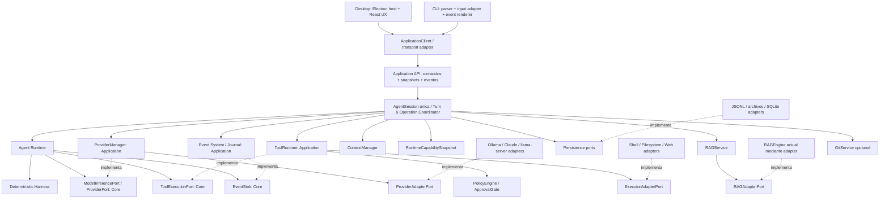
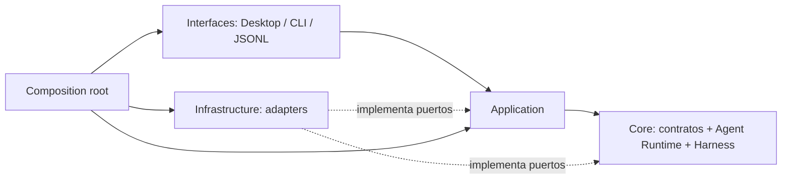
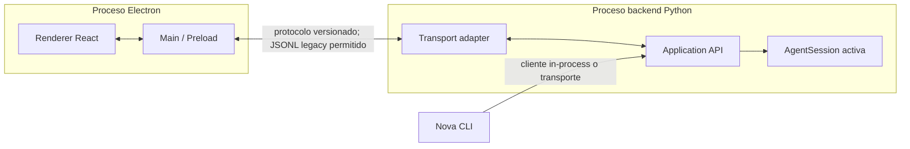
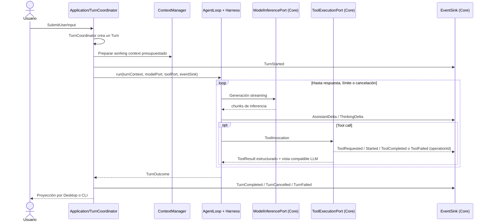
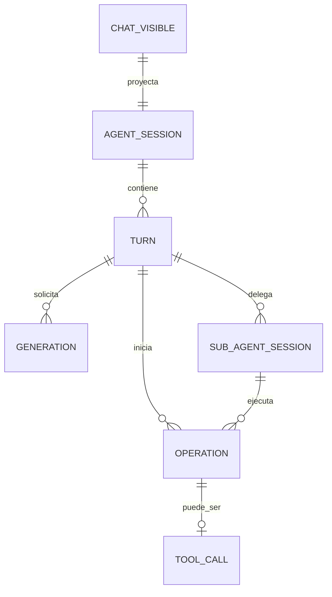
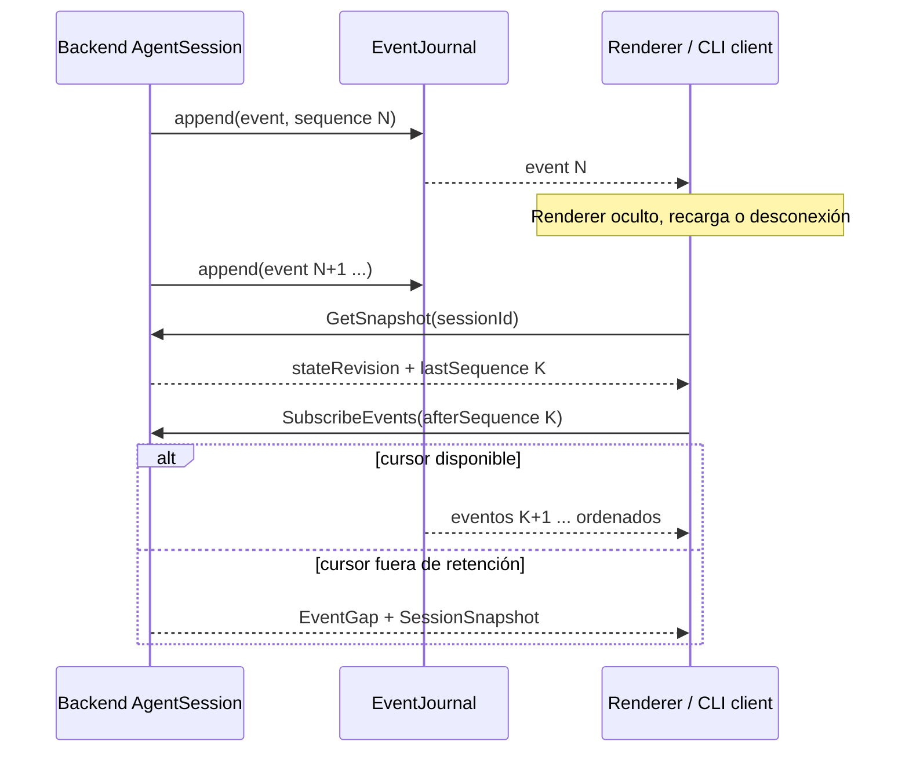
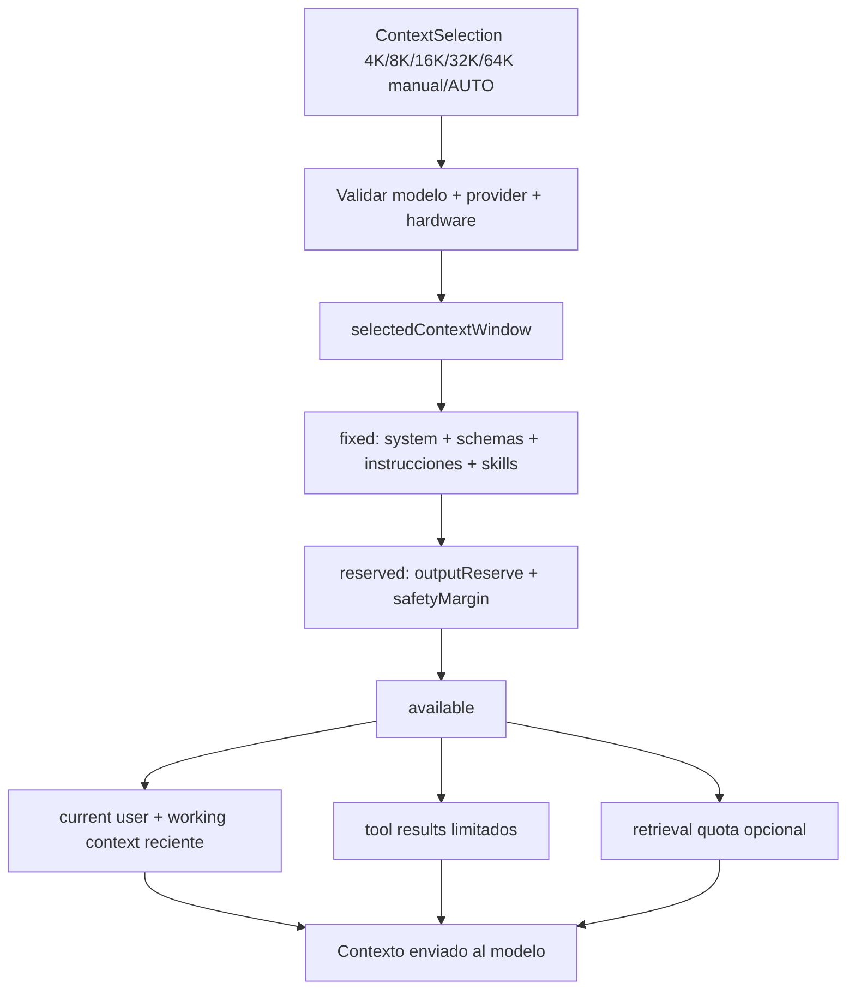
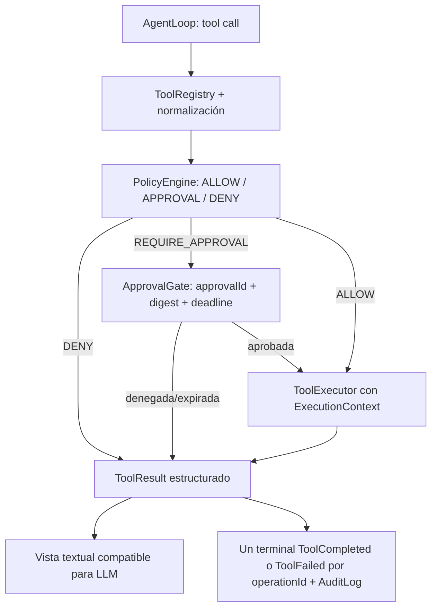
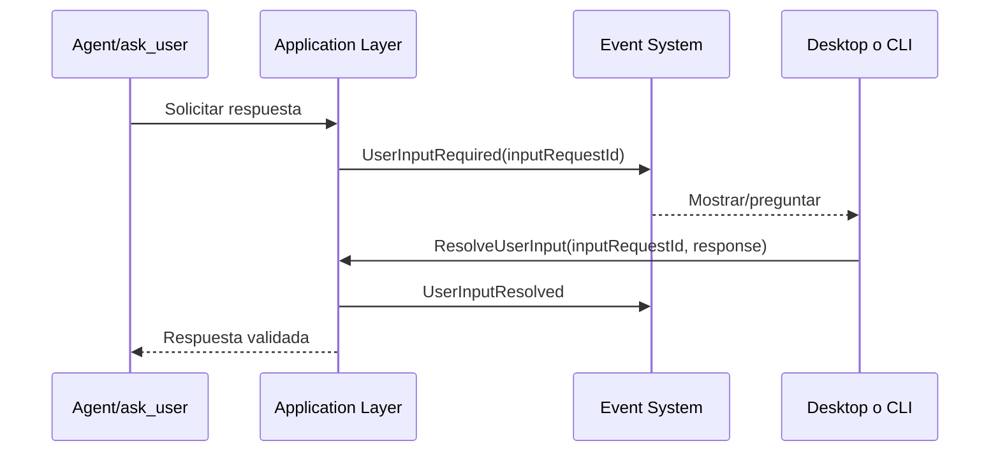
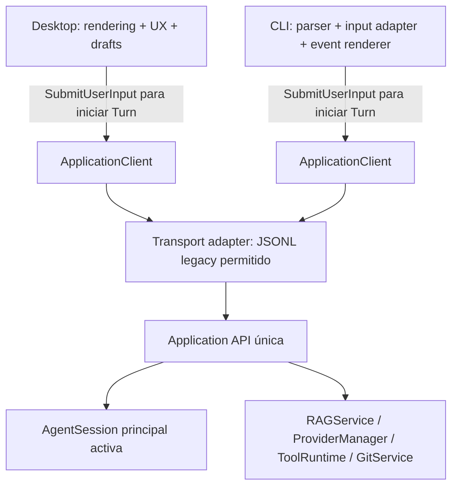

# Nova Core — Arquitectura normativa V1

**Estado:** especificación arquitectónica canónica de la refactorización del backend de Local CLI para Nova. **Fuente de decisiones:** [AUDITORIA_ARQUITECTONICA_NOVA_CORE.md](./AUDITORIA_ARQUITECTONICA_NOVA_CORE.md). Este documento define el **estado objetivo**, no afirma que el código actual ya lo cumpla. No autoriza por sí mismo la implementación de una fase.

## 1. Lenguaje normativo y alcance

| Término | Significado |
|---|---|
| **MUST / DEBE** | Requisito de Nova Core V1. Una implementación no puede omitirlo ni reinterpretarlo silenciosamente. Cambiarlo requiere una revisión explícita de esta especificación. |
| **MUST NOT / NO DEBE** | Prohibición verificable de Nova Core V1. |
| **SHOULD / DEBERÍA** | Recomendación fuerte; puede diferirse con justificación documentada sin bloquear el gate V1. |
| **MAY / PUEDE** | Opción compatible, nunca requisito implícito. |
| **OPEN DECISION** | Parámetro o mecanismo que la auditoría no cerró. Su resolución exige una decisión explícita y pruebas antes de depender de ella. |

V1 es la arquitectura del **core/backend refactorizado**, no la especificación de todo el producto Nova. La interfaz principal es Desktop; la CLI es una interfaz soportada y técnica del **mismo** backend. Nova V1 **DEBE** presentar **un chat visible y una AgentSession principal activa**. `sessionId` es identidad técnica de esa sesión, no un catálogo de conversaciones. V1 **NO DEBE** introducir `ChatManager`, `ConversationManager`, `SessionCollection`, varias sesiones principales activas, tabs, selector ni routing entre chats.

Long-Term Conversational Memory, Personal Memory, multi-chat, MCP, calendario, correo, conectores externos, STT, TTS, voice pipeline, adjuntos, PDF/visión, web search general, browser automation y sandbox fuerte del SO **quedan fuera de V1**. Los puertos de extensión definidos aquí **NO DEBEN** requerir esas capacidades para iniciar una sesión o completar un turno.

## 2. Baseline de producto y principios

Ollama es el runtime local principal. El hardware de referencia es aproximadamente **8 GB de VRAM** con un LLM local cuantizado de aproximadamente **7B/8B/9B** como mínimo recomendado de inteligencia, no como techo de hardware ni garantía de una ventana o concurrencia concretas. Nova Core **MUST NOT** requerir un modelo frontier cloud para funcionar correctamente. Equipos superiores **MAY** utilizar modelos, contexto, KV cache, retrieval y concurrencia mayores, sujetos a capacidades verificadas y presupuesto de recursos.

Los principios obligatorios son:

1. **Una lógica de aplicación.** Desktop y CLI **DEBEN** consumir los mismos servicios; ninguna interfaz implementa su propio Agent Loop, RAG, policy, gestión de provider, approvals o persistencia agentic.
2. **Una fuente de verdad.** Application Layer **ES** dueño de la AgentSession activa, su revisión, provider/modelo, turnos, operaciones y estado publicable. React sólo mantiene estado visual efímero.
3. **Dependencias hacia dentro.** Core declara contratos; Application coordina e implementa `ModelInferencePort`/`ProviderPort`, `ToolExecutionPort` y `EventSink` mediante sus servicios; Infrastructure implementa los puertos de adapters concretos definidos hacia dentro; Interfaces traducen entradas y salidas. Ningún contrato interno depende de Electron, React, JSONL, stdin ni un provider concreto.
4. **Ejecución explícita.** Toda operación agentic **DEBE** recibir `ExecutionContext`; `os.chdir()` y el cwd global mutable **NO DEBEN** participar en su ejecución.
5. **Identidad útil.** IDs **DEBEN** correlacionar lifecycle, hijos, cancelación, approvals y replay. Un ID sin validación/propagación no cumple el contrato.
6. **Efectos bajo autoridad del host.** El LLM propone llamadas; ToolRuntime, PolicyEngine y ApprovalGate deciden si pueden ejecutarse. La aprobación humana no se sustituye por texto del modelo.
7. **Contexto presupuestado.** La ventana seleccionada, reservas, schemas, instrucciones, skills, resultados de tools y retrieval **DEBEN** contarse antes de enviar contexto. La compactación no altera el transcript canónico.
8. **Capacidades observables.** Hardware, shell, Git y modelo se describen mediante snapshots confiables; un valor desconocido permanece `UNKNOWN`.
9. **Compatibilidad local.** El comportamiento determinista que rescata tool calls y sostiene modelos locales pequeños/medianos **DEBE** conservarse. El identificador público `bash` permanece estable.
10. **Lifecycle independiente de UI.** Una AgentSession **NO ES** una ventana, un componente React, una petición HTTP ni stdin. Debe poder mantenerse con renderer oculto, recargándose o temporalmente desconectado.

## 3. Arquitectura lógica completa



Application Layer **DEBE** coordinar el turno completo y conectar sus `ProviderManager`, `ToolRuntime` y Event System a los puertos de Core. Las flechas punteadas indican implementación de contratos, **no imports de Core hacia Application**. `AgentRuntime` **DEBE** permanecer invocable sin Desktop, CLI ni implementaciones concretas de Application. Las tools públicas **DEBEN** pasar por `ToolRuntime`; RAG, Git y persistencia **DEBEN** exponerse como servicios/puertos y no importarse desde interfaces. La estructura lógica es obligatoria; mover inmediatamente todos los archivos a nuevos directorios **NO** lo es.

## 4. Dirección de dependencias y fronteras de proceso



| Origen | Dependencia permitida | Dependencia prohibida |
|---|---|---|
| `core` | Biblioteca estándar y sus propios tipos/puertos: `ModelInferencePort`/`ProviderPort`, `ToolExecutionPort`, `EventSink`, `FilesystemVerifierPort` e interfaces de cancelación | `ProviderManager`, `ToolRuntime` y Event System concretos de Application; CLI, server, Electron/React, stdin/stdout, SQLite, `OllamaClient`, GitOps concretos |
| `application` | Core y puertos internos de servicios; implementa/orquesta los puertos de Core mediante `ProviderManager`, `ToolRuntime` y Event System | Componentes de React/Electron, parser CLI, formato JSONL, `input()` |
| `infrastructure` | Implementación de puertos definidos hacia dentro; bibliotecas/OS concretos | Decidir lifecycle de sesión o reglas de UX |
| `interfaces` | `ApplicationClient` y DTO/eventos públicos | Invocar directamente `run_agent`, `RAGEngine`, `GitOps`, ToolExecutor, context sizing o mutar AgentSession |
| `desktop` | Adapter de transporte y estado visual | Autoridad directa sobre policy, filesystem agentic, provider/model state o transcript canónico |

Prohibiciones concretas: `Core → Application`, `AgentRuntime → ProviderManager concreto`, `AgentRuntime → ToolRuntime concreto`, `React → AgentLoop`, `CLI → RAGEngine`, `Desktop → GitOps`, `Tool → React`, `Core → Electron`, `Core → stdin`, `AgentLoop → JSONL` **MUST NOT** existir. El composition root inyecta implementaciones de Application en puertos definidos por Core; Infrastructure puede depender de los tipos de puertos que implementa, pero ningún adapter concreto debe ser importado por un contrato de Core.



El host Desktop **PUEDE** supervisar el proceso backend, pero la sesión **NO DEBE** depender del montaje o visibilidad del renderer. Ocultar/recargar/desconectar el renderer no cancela implícitamente un turno. El cierre completo de la app requiere política explícita; su detalle figura en `OPEN DECISION`.

## 5. Estructura lógica de módulos

| Área lógica | Submódulos y responsabilidad normativa |
|---|---|
| `core/agent` | `AgentRuntime`, `AgentLoop`, estado/resultados del turno, `ModelInferencePort`/`ProviderPort`, `ToolExecutionPort` e interfaces de cancelación; sin I/O de presentación ni persistencia. |
| `core/harness` | Reglas deterministas y decisiones de intervención; solicita verificaciones mediante `FilesystemVerifierPort`. |
| `core/context` | `ContextSelection`, `ContextBudget`, ensamblado/compactación de working context. |
| `core/events` | Envelope, tipos, `EventSink` y reglas de estado terminal; no implementa transporte ni journal. |
| `core/tools` | Definiciones, invocación, scope, policy decision y resultado estructurado. |
| `core/providers`, `core/capabilities` | Contratos de inferencia/modelo y snapshots de capacidades; no contienen `ProviderManager`. |
| `application` | AgentSession, Turn/Operation Coordinator, Application API, `ProviderManager`, `ToolRuntime`, Event System/Journal, ApprovalGate, user input, scheduler, RAGService y orquestación de persistencia; implementa los puertos requeridos por Core. |
| `infrastructure` | Adapters de Ollama/Claude/llama-server, shell, filesystem, web fetch, Git, RAG/SQLite, JSONL/archivos, sondas de hardware y control de procesos. |
| `interfaces` | CLI y server/JSONL; serializadores, parsers y renderers. Web monitor, si existe, sólo como adapter de desarrollo. |
| `desktop` | Main/preload/renderer: lifecycle del host, transporte, UX, rendering, interacción y accesibilidad. |

Los límites lógicos **DEBEN** quedar establecidos mediante interfaces y tests antes de reubicar físicamente archivos. Imports de compatibilidad **PUEDEN** existir durante la migración; **NO DEBEN** crear una segunda implementación de servicios.

## 6. AgentRuntime, AgentLoop y DeterministicHarness

`AgentRuntime` **RECIBE** `TurnContext`, snapshot de modelo, working context preparado, `ModelInferencePort`/`ProviderPort`, `ToolExecutionPort`, `EventSink`, `FilesystemVerifierPort` y token/deadline mediante interfaces de cancelación definidas en Core. **NO DEBE** importar ni depender de `ProviderManager`, `ToolRuntime` o Event System concretos de Application. **DEVUELVE** un `TurnOutcome` estructurado (`completed | cancelled | failed`, respuesta final, referencias a operaciones/resultados y uso), sin imprimir ni guardar archivos. `AgentLoop` conserva el ciclo modelo → tool calls → resultados → modelo, streaming, límite de iteraciones y cierre. El `run_agent` existente es el punto de compatibilidad inicial, pero su presentación de consola, estimación/compactación de contexto, ejecución concreta de tools y side effects salen gradualmente hacia adapters/servicios.

`DeterministicHarness` **CONSERVA** text tool-call rescue, reparación de nombres y argumentos, detección de loops, read-before-edit, verificación post-write, finish guards, límite de pasos, reintentos permitidos, decisiones de compactación y recordatorios de todo. Sus decisiones son deterministas y observables como `HarnessIntervention`; `ContextManager` calcula presupuesto y materializa el working context compactado. La lectura/verificación efectiva de archivos **DEBE** realizarse mediante un puerto de filesystem/verifier; el harness **NO DEBE** ser dueño de UI, JSONL, persistencia, PolicyEngine, aprobaciones o secretos. Los reintentos de provider **NO DEBEN** reejecutar automáticamente tools con efectos si el resultado es incierto.



## 7. Modelo de entidades y lifecycle



| Entidad | Creación y dueño | Estado, relación, fin y persistencia |
|---|---|---|
| `Chat visible` | Proyección de Desktop/CLI del transcript del backend; **uno** | No posee autoridad ni lifecycle de tools. Su contenido canónico se persiste como transcript del chat único; la vista puede reconstruirse. |
| `AgentSession` | Application `StartSession`; **una principal activa** | Dueña de workspace, transcript, provider/model revision y scheduler. `active → closing → closed`; se identifica por `sessionId`. Su snapshot/restauración es técnica, no multi-chat. |
| `Turn` | TurnCoordinator tras aceptar `SubmitUserInput`; `StartTurn` es paso interno, no comando público | Contiene generaciones y operaciones. Un `commandId`/clave de idempotencia aceptado crea exactamente un Turn; `accepted → running → {completed, cancelled, failed}` exactamente una vez. Se persiste el input/resultado en transcript. `ResolveUserInput` no crea Turn. |
| `Generation` | ProviderManager por cada petición al modelo, incluidos reintentos identificados | `started → {completed, cancelled, failed}`; produce deltas. Un Turn puede tener varias. Metadatos/resultado se registran, no cada delta necesariamente en transcript. |
| `Operation` | Scheduler antes de trabajo largo o con efecto | `requested → running → {completed, failed, cancelled, outcome_unknown}`; incluye tool, índice RAG, Git, modelo o subagente. Tiene un único estado terminal de dominio y un único evento terminal por `operationId`, especializado si corresponde y genérico en otro caso. Registro/auditoría por ID; no implica mensaje visible. |
| `ToolCall` | Modelo o harness normaliza una solicitud; ToolRuntime asigna/propaga ID | Subtipo de operación enlazado a generación y turno. Resultado estructurado más respuesta compatible para LLM; queda en transcript técnico según contrato. |
| `SubAgentSession` | Application scheduler a partir de `agent` o comando explícito | Hija de `parentSessionId/parentTurnId`, con `agentId`, contexto, tools y cuotas propias. Termina con resultado/estado; **no** crea otro chat visible ni otra sesión principal. |

V1 **NO DEBE** cargar simultáneamente varios chats principales. Un chat **PUEDE** contener muchos turnos, generaciones, operaciones, tool calls, aprobaciones y subagentes. `Chat visible ≠ AgentSession ≠ Turn ≠ Generation ≠ Operation ≠ SubAgentSession`.

## 8. IDs, correlación y revisión

Todos los IDs **DEBEN** ser opacos, únicos dentro de su scope y no reutilizables durante la vida del journal correspondiente. Application genera los IDs internos antes de publicar eventos; un `toolCallId` del provider se preserva como `providerToolCallId` cuando exista y se normaliza a un ID interno único. Ningún ID por sí solo concede autoridad.

| ID | Scope y origen | Propagación y expiración |
|---|---|---|
| `sessionId` | Application; única sesión principal activa | En comandos, eventos, logs, snapshots e hijos; válido hasta cierre/reemplazo explícito y para replay histórico autorizado. |
| `turnId` | TurnCoordinator por `SubmitUserInput` aceptado | Padre de generaciones/operaciones; queda terminal al fin del Turn. Una respuesta a `ask_user` conserva el `turnId` existente. |
| `generationId` | ProviderManager por petición/attempt | Deltas, stop y terminal; expira para comandos activos al terminal. |
| `operationId` | Scheduler por trabajo con lifecycle | Progreso, cancelación y terminal; persistible en journal. |
| `toolCallId` | ToolRuntime al normalizar tool call | Solicitud, approval y resultado; relacionado con `operationId`. |
| `approvalId` | ApprovalGate por decisión pendiente | Sólo vale mientras esa solicitud/digest y deadline sigan vigentes; one-shot. |
| `agentId` | Scheduler por subagente | Padre/hijo, progreso, resultado y cancelación del subagente. |
| `eventId` | Event System por evento | Deduplicación/replay; `sequence` determina orden dentro de la sesión. |
| `commandId` | Cliente o Application al aceptar comando | Idempotencia y receipt; un duplicado devuelve el mismo receipt/resultado observable. |
| `causationId` | Application referencia al comando/evento causante | Traza causal de eventos e hijos; no reemplaza IDs de entidad. |

`stateRevision` se incrementa en cada mutación de la AgentSession. Las respuestas tardías **DEBEN** rechazarse cuando `sessionId`, entidad activa, revisión o digest ya no coinciden. Los subagentes **DEBEN** propagar `parentSessionId`, `parentTurnId`, `agentId` y `operationId` a sus eventos. `eventId` y `sequence` no son alternativas: el primero identifica; la segunda ordena por sesión.

## 9. Application Layer y propiedad del estado

Application Layer **ES** el único dueño de AgentSession, Turn/Operation lifecycle, provider/model state, approvals, solicitudes `ask_user`, activación de RAG, scheduler, cancelación, capabilities y orquestación de persistencia. Expone comandos y eventos transport-neutral. Un único escritor serializa mutaciones de sesión; trabajos paralelos devuelven resultados al coordinador, no mutan directamente el transcript. Application **DEBE** validar `expectedRevision` donde un comando pueda aplicar estado obsoleto. Desktop/CLI **NO DEBEN** asumir que una respuesta de transporte equivale al terminal del trabajo; el terminal se conoce por evento/estado.

El `CompositionRoot` **DEBE** inyectar provider, tools, policy, repositorios, RAG y adapters de evento. Application **NO DEBE** leer stdin, usar `os.chdir()`, crear ventanas Electron ni conocer el formato de transporte.

## 10. Application API transport-neutral

La API expone comandos tipados, receipts y suscripción. `CommandReceipt` **DEBE** contener `commandId`, aceptación/rechazo, `sessionId?`, `stateRevision?`, IDs creados y error tipado si se rechaza. Un receipt `accepted` **NO** declara completada una operación asíncrona. Un `commandId` repetido con el mismo payload **DEBE** devolver el mismo receipt observable; con payload distinto **DEBE** devolver `IDEMPOTENCY_CONFLICT`. `expectedRevision` **DEBE** proteger mutaciones susceptibles de carreras. Los errores se clasifican en §24.

`SubmitUserInput` **ES** el único comando público normal para iniciar un Turn desde Desktop, CLI o un futuro voice adapter. Application valida `commandId`/clave de idempotencia y el TurnCoordinator ejecuta `StartTurn` sólo como operación interna, no como comando de la Application API expuesto a interfaces. Cada comando aceptado/clave de idempotencia **DEBE** crear exactamente un Turn; un reenvío idéntico devuelve el mismo receipt y `turnId`, y un payload diferente con la misma clave falla con `IDEMPOTENCY_CONFLICT`. `ResolveUserInput` responde a una pregunta `ask_user` pendiente dentro del Turn existente y **MUST NOT** crear otro Turn.

| Comando | Entrada y precondición | Receipt, estado y eventos | Errores e idempotencia |
|---|---|---|---|
| `StartSession` | `workspace`, config/capability selection, `commandId`, snapshot opcional. No hay otra sesión principal activa salvo reemplazo explícito seguro. | `sessionId`, `stateRevision`, snapshot; crea sesión y emite `SessionStarted`/`SessionSnapshot`. | Workspace/config inválidos, capacidad requerida ausente, `CONFLICT_ACTIVE_SESSION`. Idempotente por `commandId`; no crea catálogo multi-chat. |
| `GetSnapshot` | `sessionId`, autorización de cliente; sesión principal activa o snapshot autorizado de su restore. | Vista consistente de transcript, estado, provider/modelo, operaciones/approvals pendientes, `sequence` y `stateRevision`; sin mutación. | Sesión inexistente/cerrada/no autorizada; lectura idempotente. |
| `SubmitUserInput` | `sessionId`, input no vacío, `commandId`/clave de idempotencia, `expectedRevision?`; sesión activa sin otro turno principal en conflicto. | TurnCoordinator incorpora input, crea `turnId` y `operationId`, emite `TurnStarted` e inicia generaciones; receipt incluye los IDs creados. | Input inválido, sesión no activa, conflicto de turno/revisión. Reenvío idéntico devuelve el mismo receipt/Turn; misma clave con payload distinto produce `IDEMPOTENCY_CONFLICT`. No sustituye `ResolveUserInput`. |
| `CancelTurn` | `sessionId`, `turnId`, `commandId`; turno aún no terminal. | Marca cancelación solicitada, propaga token; **después** de cierre real emite `TurnCancelled` o `TurnFailed` con causa `outcome_unknown` según efectos. | ID obsoleto/terminal/no autorizado; solicitud repetida idempotente. |
| `StopGeneration` | `sessionId`, `generationId`, `commandId`; generación activa. | Solicita parar el stream; `GenerationCancelled` al terminal real. No revierte tools ni equivale a `CancelTurn`. | Generación inexistente/terminal; repetición idempotente. |
| `CancelOperation` | `sessionId`, `operationId`, `commandId`; operación cancelable activa. | Solicita cancelación y, cuando se conoce el outcome, emite un único terminal: especializado para su tipo o genérico en otro caso; puede quedar `outcome_unknown`. | No cancelable/terminal/ID obsoleto; repetición idempotente. |
| `ChangeModel` | `sessionId`, `modelId`, `expectedRevision`, `commandId`; capacidad y disponibilidad verificadas; transición en punto seguro. | Nueva `providerRevision` y `stateRevision` al aplicar; evento de cambio de estado/modelo. | Modelo ausente/incompatible, revisión vieja, turno activo; no mutación silenciosa. Idempotente por comando. |
| `ChangeProvider` | `sessionId`, `providerId/endpointRef`, `expectedRevision`, `commandId`; provider sano/configurado y punto seguro. | Nueva `providerRevision`, capacidades/modelo coherentes y evento de cambio. | Provider no disponible, credenciales faltantes, modelo incompatible, revisión vieja; idempotente. |
| `ResolveApproval` | `sessionId`, `approvalId`, `toolCallId`, `requestDigest`, decisión, `commandId`; pendiente, no expirada y scope exacto. | `ApprovalResolved`; desbloquea o deniega sólo esa invocación. | ID/digest/cwd/policy revision distintos, vencida, cancelada o ya resuelta; one-shot, duplicado exacto devuelve estado previo sin nueva autorización. |
| `ResolveUserInput` | `sessionId`, `inputRequestId`, respuesta, `commandId`; pregunta pendiente de ese turno. | `UserInputResolved`; reanuda la tool/Turn correspondiente, **sin crear un Turn**. | Pregunta vencida/cancelada/ajena; duplicado exacto idempotente. |
| `ExecuteCommand` | `sessionId`, nombre de comando de aplicación y args tipados, `commandId`; autorización/capability propia. | `operationId?`, receipt y eventos de servicio para modelos, Git, plan, knowledge, etc. | Comando no soportado/denegado/estado incompatible; idempotencia por operación. **NO** es bypass para ejecutar shell fuera de ToolRuntime. |
| `StartSubAgent` | `sessionId`, `parentTurnId`, tarea, modo, `commandId`; scope y cuota disponibles. | `agentId`, `operationId`; emite `AgentStarted` y progreso/terminal posterior. | Cupo agotado, padre terminal, provider/tool scope no disponible; idempotente por comando. |
| `CancelSubAgent` | `sessionId`, `agentId`, `commandId`; hijo activo. | Propaga cancelación al contexto/operaciones hijas; emite `AgentCancelled` al terminal real, o `AgentFailed` si el outcome lo exige. | ID ajeno/terminal; repetición idempotente. |
| `SetRAGEnabled` | `sessionId`, booleano, `expectedRevision`, `commandId`; RAG capability conocida. | Actualiza estado de activación; evento de estado/progreso; fallo de RAG no bloquea conversación. | RAG no disponible, revisión vieja; idempotente. |
| `QueryRAG` | `sessionId`, consulta, cuota y contexto de turno cuando se inyecta, `commandId`. | Resultados sujetos al presupuesto o `operationId` si asíncrono; `OperationProgress`/terminal. | No disponible, fallo de embedding/índice, cancelación; no convierte el fallo en fallo del Turn. |
| `GetRAGStatus` | `sessionId`; lectura. | Disponibilidad, activación, progreso y último error tipado; sin mutación. | Sesión inválida; lectura idempotente. |
| `SubscribeEvents` | `sessionId`, `afterSequence?`, autorización y capacidad del consumidor. | Stream ordenado; `SessionSnapshot`/`EventGap` si el cursor no puede reproducirse. | Cursor inválido/no autorizado, desconexión de transporte; la sesión continúa. |
| `CloseSession` | `sessionId`, `commandId`, política explícita para turnos/operaciones activos. | `closing → closed`, cancela o drena según política, guarda snapshot y emite terminal de sesión. | ID obsoleto/conflicto; repetición idempotente. Política exacta al cerrar app: `OPEN DECISION`. |

Los nombres de método son conceptuales. La API **MUST NOT** fijar HTTP, WebSocket, JSONL ni Electron IPC como condición del dominio. Conforme a `OD-04` resuelta, `ChangeModel` y `ChangeProvider` **MUST NOT** modificar provider/modelo durante un Turn principal activo: Application **DEBE** rechazar la solicitud con un conflicto tipado y explícito. El rechazo **NO DEBE** cancelar, interrumpir ni modificar Turn, Generation, tools o subagentes; **MUST NOT** provocar implícitamente `StopGeneration` o `CancelTurn`. Core V1 **NO DEBE** implementar una cola de cambios pendientes. Una nueva solicitud válida puede aplicarse después del terminal del Turn e incrementar `providerRevision`. La GUI **PUEDE** deshabilitar los selectores, pero esta regla se aplica siempre en Application, independientemente del frontend.

## 11. Modelo de eventos y recuperación

`EventEnvelope` **DEBE** incluir:

```text
schemaVersion, eventId, sequence, sessionId,
turnId?, generationId?, operationId?, toolCallId?, approvalId?, agentId?,
causationId?, timestamp, kind, payload, stateRevision, visibility
```

El Event System de Application **implementa** el `EventSink` definido por Core y asigna los metadatos del envelope al publicar eventos. `sequence` es monotónica y asignada por el único escritor de sesión; `eventId` es único. `timestamp` informa observabilidad, no orden causal. `payload` es tipado/versionado por `kind`; `visibility` distingue datos publicables, internos y sensibles. Un evento público **NO DEBE** contener secretos. Todo evento de operación/hijo **DEBE** enlazar IDs padre suficientes para trazabilidad.

| Familia | Eventos normativos | Regla |
|---|---|---|
| Sesión/turno | `SessionStarted`, `TurnStarted`, `TurnCompleted`, `TurnCancelled`, `TurnFailed` | Cada Turn aceptado emite exactamente un terminal. |
| Generación | `GenerationStarted`, `AssistantDelta`, `ThinkingDelta`, `GenerationCompleted`, `GenerationCancelled`, `GenerationFailed` | Deltas pertenecen a una generación; fallo tipado cierra generación sin inventar contenido. |
| Tools | `ToolRequested`, `ToolStarted`, `ToolCompleted`, `ToolFailed` | La operación de tipo `TOOL` emite sólo `ToolCompleted` para `completed` o `ToolFailed` para `failed`, `denied`, `cancelled` u `outcome_unknown`, distinguidos en payload tipado. No emite terminal genérico adicional. |
| Interacción humana | `ApprovalRequired`, `ApprovalResolved`, `UserInputRequired`, `UserInputResolved` | IDs one-shot, deadline y causalidad; cancelación resuelve pendientes. |
| Subagentes | `AgentStarted`, `AgentProgress`, `AgentCompleted`, `AgentFailed`, `AgentCancelled` | La operación de tipo `SUB_AGENT` emite sólo `AgentCompleted`, `AgentFailed` o `AgentCancelled` según outcome; `AgentFailed` distingue `outcome_unknown` en payload. No emite terminal genérico adicional. |
| Operaciones/sistema | `OperationProgress`, `OperationCompleted`, `OperationFailed`, `OperationCancelled`, `OperationOutcomeUnknown`, `HarnessIntervention`, `SessionSnapshot`, `EventGap` | Los terminales genéricos se emiten sólo para tipos de operación sin terminal especializado. Intervención registra regla/motivo sin secretos; progreso puede ser grueso. |
| Estado de aplicación | `ModelChanged`, `ProviderChanged`, `RAGStatusChanged` | Cambios aplicados llevan `stateRevision`/`providerRevision` y nunca se infieren de un receipt aún pendiente. |

**Regla de terminal único (opción A).** Application registra una sola transición a estado terminal de dominio por `operationId` y publica **exactamente un** evento terminal para esa transición. Si el tipo de operación tiene evento especializado (`TOOL`, `SUB_AGENT`), **DEBE** publicar únicamente ese terminal especializado; en los demás casos **DEBE** publicar el terminal `Operation*` correspondiente. El evento especializado **ES** la proyección tipada del mismo outcome de `Operation`, no un segundo lifecycle. Todo terminal de operación **DEBE** llevar el mismo `operationId`, `causationId` y `stateRevision` de la transición registrada, además de `status`/outcome congruente en su payload. Para un mismo `operationId`, emitir `ToolCompleted` y `OperationFailed` —o cualquier par de terminales especializados/genéricos— **MUST NOT** ocurrir. `Turn` y `Generation` son entidades distintas: cada una conserva exactamente un terminal propio. Replay y reconexión **NO DEBEN** generar una segunda transición ni otro terminal.

| Estado terminal de Operation | Tipo `TOOL` | Tipo `SUB_AGENT` | Otros tipos |
|---|---|---|---|
| `completed` | `ToolCompleted` | `AgentCompleted` | `OperationCompleted` |
| `failed` | `ToolFailed` (`denied` puede ser razón tipada) | `AgentFailed` | `OperationFailed` |
| `cancelled` | `ToolFailed` (`status=cancelled`) | `AgentCancelled` | `OperationCancelled` |
| `outcome_unknown` | `ToolFailed` (`status=outcome_unknown`) | `AgentFailed` (`status=outcome_unknown`) | `OperationOutcomeUnknown` |

Un transporte **DEBE** respetar orden por sesión y rechazar eventos duplicados por `eventId`/`sequence`. **OD-02 queda RESUELTA: A, EventJournal V1 en memoria, configurable y acotado por AgentSession.** Los defaults son 4096 envelopes o 16 MiB serializados (primer límite alcanzado), replay de hasta 256 eventos o 1 MiB por lote, y cola de hasta 512 eventos o 4 MiB por consumidor. Se evicta desde el evento más antiguo y se conservan `oldestAvailableSequence`/`latestSequence`. Sólo `AssistantDelta` o `ThinkingDelta` adyacentes de una misma `generationId` se agrupan, sin cruzar tipo/generación/evento de estado; flush a más tardar a los 50 ms, 32 deltas o 16 KiB, lo primero que ocurra. Estos valores **DEBEN** ser configurables desde un único contrato. Terminales, approvals, user-input, resultados de tools, cambios de estado y `EventGap` **MUST NOT** descartarse silenciosamente. Si la cola no admite un evento no descartable, la suscripción se marca `out-of-sync` y se desconecta sin bloquear indefinidamente al productor. El cliente recupera con `GetSnapshot` y `SubscribeEvents(afterSequence)`; si el cursor salió de retención, recibe `EventGap` + `SessionSnapshot`, nunca continuidad inventada.



Minimizar, recargar o desconectar temporalmente el frontend **NO DEBE** destruir AgentSession ni cancelar implícitamente tools. El journal V1 se pierde al reiniciar el backend; el estado canónico se restaura desde `SessionSnapshotStore`/repositorios. Al restaurar, la secuencia **DEBE** continuar desde el último valor persistido válido cuando exista. Un tramo cuya continuidad no pueda demostrarse **DEBE** producir `EventGap` + snapshot, sin reconstruir eventos perdidos. Un journal durable **PUEDE** añadirse detrás del mismo puerto más adelante; esta decisión **NO** cierra `OD-07`.

## 12. ExecutionContext y aislamiento de cwd

```text
ExecutionContext {
  workspace: ruta raíz validada,
  cwd: ruta efectiva validada,
  environment: conjunto saneado por operación,
  sessionId, turnId?, operationId,
  cancellationToken, deadline,
  capabilities: RuntimeCapabilitySnapshot/ref,
  providerRevision?, policyRevision?
}
```

Toda operación agentic con I/O **DEBE** recibir este contexto: shell, archivos, Git, prompts, project map/instructions, RAG, persistencia y subagentes. `cwd` **DEBE** ser relativo/absoluto resuelto y validado contra la autoridad concedida; `workspace` no equivale por sí mismo a sandbox del SO. `environment` **DEBE** ser construido/saneado por el host y no mutar globalmente `os.environ` para representar estado de sesión. El shell recibe `cwd`/env en la creación del subprocess. La ejecución **MUST NOT** llamar `os.chdir()` ni consultar `os.getcwd()` como estado compartido para decidir dónde actuar.

Un subagente **HEREDA** el scope máximo de permisos/capacidades de su padre y **DERIVA** un nuevo contexto con `agentId`, `operationId`, token/deadline hijo y cwd/worktree explícito. El worktree Git cambia el `cwd` del contexto hijo, **NO** el cwd del proceso. Un hijo no obtiene más autoridad por ejecutarse en otro hilo o directorio.

## 13. Cancelación, deadlines y terminales

`CancellationToken` es jerárquico: sesión → turno → generación/operación → tool/subagente/proceso. Cancelar un padre **DEBE** propagar la solicitud a sus hijos activos. `deadline` es un instante límite; `timeout` es una duración local que se convierte en deadline efectivo más estricto. Un timeout **NO** es una aprobación ni prueba de que el efecto no ocurrió.

| Acción | Semántica obligatoria |
|---|---|
| `StopGeneration` | Detiene sólo la inferencia/stream indicado; no deshace una tool ya iniciada ni equivale a cancelar Turn. |
| `CancelTurn` | Solicita detener generaciones, operaciones y subagentes del Turn; termina sólo cuando se conoce el estado de cada efecto o se informa `outcome_unknown`. |
| `CancelOperation` | Solicita cancelar una operación concreta; si es subprocess, propaga a grupo/árbol de procesos mediante executor. |
| `CancelSubAgent` | Cancela contexto hijo y sus operaciones; no afecta otras tareas del Turn salvo política explícita. |
| `CloseSession` | Cierra la única sesión principal activa con una política explícita de drenaje/cancelación; no depende de desmontar React. |

Estado de operación: `requested → running → completed | failed | cancelled | outcome_unknown`. La **solicitud** de cancelar puede registrarse como bandera/intermedio, pero **NO** es estado terminal. Una operación con efecto externo cuyo resultado no pudo conocerse **DEBE** terminar como `outcome_unknown`; **NO DEBE** reintentarse automáticamente. Cada Turn, Generation y Operation **DEBE** alcanzar exactamente un estado terminal y emitir exactamente un evento terminal de su propio lifecycle. El terminal de Operation **DEBE** seguir la regla de proyección exclusiva de §11: especializado para `TOOL`/`SUB_AGENT`, genérico para los demás tipos. La cancelación solicitada puede finalizar como `completed`, `failed`, `cancelled` u `outcome_unknown` según el efecto observado; el evento **DEBE** reflejar ese mismo estado. Un approval o pregunta pendiente de un Turn cancelado se deniega/cierra y ninguna respuesta tardía reanuda el trabajo.

## 14. Concurrencia y scheduling

La AgentSession principal tiene **un escritor de estado**. El scheduler **DEBE** separar colas/cupos para inferencia LLM, tools, subagentes y operaciones de fondo. Los workers **PUEDEN** correr en paralelo, pero publican resultados mediante el coordinador y no mutan mensajes, provider/modelo o approvals sin serialización. `ProviderManager` entrega snapshots inmutables por generación y subagente. Una operación de fondo **DEBE** tener `operationId`, deadline, cancelación, cuota y terminal, aunque no exista un renderer conectado.

Los defaults en el baseline de ~8 GB VRAM **DEBERÍAN** ser conservadores. El límite de inferencias simultáneas **NO DEBE** derivarse sólo de la VRAM nominal ni quedar acoplado permanentemente a `OLLAMA_NUM_PARALLEL` cuando se use otro provider. Tool concurrency **DEBE** respetar scope de filesystem/policy; subagentes **DEBEN** limitarse por recursos reales y estado de provider. Los números exactos de cuotas son `OPEN DECISION` sujetos a medición y pruebas en hardware objetivo.

## 15. ProviderManager / ModelRuntime

`ProviderManager` **ES** un servicio de Application y la única fuente de verdad por AgentSession para `providerId`, endpoint, credenciales por referencia, `modelId`, `providerRevision`, capacidades, ventana nativa, tool/thinking/embedding support, health, límites de concurrencia e inference options válidas. **Implementa** el `ModelInferencePort`/`ProviderPort` definido por Core que recibe AgentRuntime; Core **MUST NOT** importar `ProviderManager`. Inicialmente **DEBE** admitir adapters de **Ollama, Claude y llama-server**. Ollama es el runtime principal; las rutas normales de conversación/tool calling **DEBEN** funcionar con un modelo local 7B–9B adecuado sin depender de Claude.

`ChangeProvider`/`ChangeModel` **DEBEN** validar disponibilidad, compatibilidad y estado de sesión antes de incrementar `providerRevision`. Una `Generation` toma un snapshot inmutable de provider/modelo/opciones/revisión al iniciar. Un `SubAgentSession` toma snapshot al crearse y **NO DEBE** retener accidentalmente el provider/modelo inicial de una tool después de un cambio. Generaciones y SubAgentSessions ya creadas **DEBEN** conservar siempre el snapshot con el que comenzaron; las creadas después de un cambio aplicado usan la nueva revisión. La política de transición durante un Turn principal activo es **rechazo sin efectos y sin cola**, fijada en §10 (`OD-04` resuelta); incluso con cancelación solicitada, el Turn sigue activo hasta alcanzar su terminal.

Los adapters **DEBEN** normalizar mensajes, streaming, tool calls y errores al contrato de core. `ProviderManager` **DEBE** exponer health/capabilities verificadas con procedencia, y separar opciones específicas (p. ej. `num_ctx`, thinking, keep-alive) del contrato común; una opción no soportada **NO DEBE** pasarse silenciosamente como si surtiera efecto. La ausencia de native tool calling **DEBE** poder usar text-tool rescue del harness. Embeddings para RAG **DEBEN** ser capacidad explícita, no inferirse porque el provider sirve chat.

## 16. RuntimeCapabilitySnapshot y hardware

```text
RuntimeCapabilitySnapshot {
  capturedAt, source, confidence/status,
  os, architecture,
  systemRamTotal?, systemRamAvailable?,
  gpuDevices?, vramTotal?, vramAvailable?,
  providerId, providerRevision, endpointRef, providerHealth,
  modelId?, modelRevision?, quantization?, modelContextWindow?,
  toolSupport, thinkingSupport, embeddingSupport,
  shellDescriptor?, gitCapability,
  concurrencyLimits?
}
```

Cada campo que no pueda medirse **DEBE** tener valor `UNKNOWN` o estado equivalente con razón; 0 sólo representa cero medido. El snapshot **DEBE** tener fecha/procedencia y renovarse al cambiar provider/modelo o cuando caduque la medición relevante. El modelo **PUEDE** recibir OS, shell seleccionado, versión y capacidades mediante contexto confiable, pero **NO DEBE** poder cambiar arbitrariamente el ejecutable ni elevar permisos. La capability Git es independiente del shell/Git Bash.

`providerRevision` identifica la revisión técnica administrada por Application. `modelRevision` **DEBE** representar una revisión/digest del artefacto reportada por el adapter, o `UNKNOWN`; **NO DEBE** inventarse a partir del nombre del modelo o confundirse con el contador técnico del provider.

La sonda Windows de RAM **DEBE** usar una API disponible del SO o devolver `UNKNOWN`; **NO DEBE** asumir `/proc/meminfo` ni depender sólo de `wmic`. En Linux/macOS se emplean fuentes propias de cada plataforma con timeouts/errores aislados. GPU/VRAM **PUEDEN** quedar desconocidas; no se inventa una cuantización o ventana nativa por nombre de modelo. `UNKNOWN` **NO DEBE** tratarse como permiso concedido ni como prueba de que un preset alto cabe en memoria.

## 17. ContextSelection, ContextBudget y ContextManager

`ContextSelection` contiene preset solicitado (`4K`, `8K`, `16K`, `32K`, `64K` o `AUTO`), provider/model revision y restricciones verificadas. **OD-05 queda RESUELTA: A, política conservadora y configurable V1**, por aprobación explícita. `ContextManager` **DEBE** validar contra límites conocidos de modelo, provider y recursos. Una selección manual que exceda cualquiera de esos límites **DEBE** rechazarse explícitamente; **NO DEBE** reducirse silenciosamente. No se exige calibración exhaustiva VRAM/KV antes de fase 9: esa calibración podrá refinar la policy posteriormente sin alterar estos contratos. RAM/VRAM nominal por sí sola **NO ES** un límite de contexto verificado.

Para `AUTO`, si los tres límites están verificados, **DEBE** seleccionarse el mayor preset del catálogo automático conservado (`4K/8K/16K/32K`) que no exceda su mínimo. Si el límite nativo es conocido y hay límites relevantes no verificados, **DEBE** aplicarse como máximo 8K, respetando todos los límites conocidos. Si el límite nativo es `UNKNOWN`, **DEBE** usarse 4K como fallback bajo capacidad no verificada, siempre que no exceda otro límite conocido. Si ningún preset cabe, la selección **DEBE** fallar explícitamente. La selección manual bajo límites desconocidos **DEBE** registrar esa incertidumbre; `UNKNOWN` **NO DEBE** convertirse en afirmación de compatibilidad. La ampliación aprobada el 2026-10-06 añade `64K = 65536` sólo como capacidad manual avanzada opcional: no cambia AUTO ni constituye recomendación o certificación de un modelo/host concreto. El budgeting opera sobre `effectiveContextWindow = N`; no se añaden presets de 128K o superiores.

`ContextBudget` **DEBE** exponer como mínimo:

```text
selectedContextWindow = ventana seleccionada y validada
fixed = systemTokens + toolSchemaTokens
      + projectInstructionTokens + skillTokens
reserved = outputReserve + safetyMargin
outputReserve(default) = clamp(ceil(0.125 * selectedContextWindow), 1024, 4096)
safetyMargin(con tokenizer fiable) = max(256, ceil(0.05 * selectedContextWindow))
safetyMargin(con fallback) = max(512, ceil(0.10 * selectedContextWindow))
available = selectedContextWindow - fixed - reserved
currentMessageTokens + recentWorkingContextTokens
  + toolResultTokens + retrievalTokens <= available
```

`outputReserve` y `safetyMargin` son configurables desde el host. La reserva **DEBE** respetar un máximo de salida del provider/modelo menor que el default cuando esté informado; la petición de generación **NO DEBE** superar la reserva. `available` **NO DEBE** ser negativo al iniciar inferencia. Si `fixed + reserved` consume la ventana, se reduce material opcional, se pide una ventana/modelo compatible o se falla con `CONTEXT_BUDGET_EXCEEDED`; **NO** se envía un prompt imposible. El mensaje actual del usuario, instrucciones de seguridad/sistema y schemas de tools habilitadas tienen prioridad; después se preserva contexto reciente necesario y continuidad de tool calls; resultados antiguos de tools y retrieval son recortables. Retrieval **NO DEBE** desplazar el mensaje actual.

Los siguientes son **caps de inyección**, no reservas: `retrievalTokens <= floor(0.15 * available)`; tool results totales `<= floor(0.30 * available)`; cada resultado `<= floor(0.15 * available)`; resultados + retrieval `<= floor(0.40 * available)`. El espacio no utilizado **DEBE** permanecer disponible para working context. Un resultado bruto **PUEDE** conservarse fuera del prompt, incluido el transcript, aunque sólo una representación truncada/relevante se inyecte. Las llamadas/resultados **DEBEN** preservar IDs y continuidad: una representación que no pueda incluir la continuidad mínima **DEBE** producir error tipado o retirar grupos antiguos completos. Estos caps resuelven **únicamente OD-05**; **NO** fijan tamaños físicos de stdout, timeouts, concurrencia ni cuotas operativas de `OD-06`.



El contador **DEBE** usar conteo/tokenizer real del adapter cuando esté disponible y sea fiable. En ausencia de tokenizer, o si falla, el fallback V1 **ES** `ceil(utf8_bytes / 3)` sobre la representación serializada, incluyendo mensajes, system prompt, schemas, tool calls/results, project instructions y skills, más 12 tokens por mensaje y 20 por cada tool call/result. El reporte **DEBE** identificar el cálculo estimado y su procedencia; si posteriormente hay uso real, **DEBE** conservar ambos valores para observabilidad/calibración. El margen fiable no se usa cuando el tokenizer falla.

`ContextManager` **PUEDE** truncar resultados de tools, compactar mensajes viejos o solicitar resumen bajo reglas del harness; **DEBE** preservar continuidad de roles/tool IDs y reportar `HarnessIntervention`/métricas. La compactación afecta sólo el **working context** enviado al modelo: **MUST NOT** borrar ni reescribir destructivamente el transcript persistido. V1 **NO** implementa memoria a largo plazo ni búsqueda semántica de conversaciones previas. Véase el ADR [nova_core_od_05_contexto_v1.md](local-cli-main/docs/nova_core_od_05_contexto_v1.md).

## 18. ToolRuntime y registro público

| Contrato | Responsabilidad normativa |
|---|---|
| `ToolDefinition` | Nombre público, descripción, schema de argumentos, versión, clasificación de efectos y scope; no contiene callback UI. |
| `ToolRegistry` | Registra definiciones/ejecutores y scopes; `AgentLoop` no enumera implementaciones concretas. |
| `ToolInvocation` | `toolCallId`, `operationId`, generación/turno padre, argumentos normalizados, `ExecutionContext`, deadline y policy revision. |
| `ToolPolicyDecision` | `ALLOW`, `REQUIRE_APPROVAL` o `DENY`, razón y policy revision. No la decide el LLM. |
| `ToolApproval` | Solicitud one-shot que ata decisión humana a `approvalId`, invocación, digest, cwd y deadline. |
| `ToolExecutor` | Ejecuta tras policy/approval dentro del contexto; reporta resultado y efecto sin depender de frontend. |
| `ToolResult` | `status`, `stdout`, `stderr`, `exitCode`, `error`, `artifacts`, `effectState`, `metadata`; existe vista textual compatible para el LLM. |

Las diez definiciones públicas V1 son **exactamente** `bash`, `read`, `write`, `edit`, `glob`, `grep`, `web_fetch`, `todo_write`, `ask_user`, `agent`. `agent` **PUEDE** estar deshabilitada por capability/scope, como en el baseline; el conjunto de nombres y schemas existentes **DEBE** preservarse inicialmente. `bash` **DEBE** seguir siendo el identificador público aunque internamente sea `ShellTool` y el shell seleccionado sea PowerShell, Bash, Zsh o sh. Git Bash en Windows **PUEDE** ofrecerse como backend opcional detectado por el host, nunca como requisito; Git ejecutable es una capability distinta. El modelo **NO DEBE** seleccionar libremente otro intérprete para evadir ShellPolicy.

ToolRuntime **ES** un servicio de Application y la única ruta para ejecutar una tool solicitada por el modelo, sea agente principal o subagente. **Implementa** el `ToolExecutionPort` definido por Core; AgentRuntime **MUST NOT** importar ToolRuntime. Normaliza nombres/argumentos con ayuda del harness, decide policy, solicita aprobación si corresponde, ejecuta y emite eventos mediante Event System. Las tools **NO DEBEN** conocer `cli`, `server`, `web_monitor` ni React. Las instancias con estado mutable, como `todo_write`, **NO DEBEN** compartirse entre subagentes sin aislamiento o contrato thread-safe. `ToolResult` estructurado es el contrato interno; un adapter **DEBE** producir el texto legacy que el LLM espera mientras dure la compatibilidad.

`ToolResult.status` **DEBE** distinguir `completed`, `failed`, `denied`, `cancelled` y `outcome_unknown`. `denied` es razón tipada de un estado terminal de dominio `failed`, no un quinto estado de Operation. `effectState` **DEBE** distinguir al menos `none`, `applied`, `partial` y `unknown` cuando la tool pueda causar efectos. `exitCode` es dato del subprocess cuando exista; un exit code no sustituye el estado tipado ni prueba ausencia de efectos. ToolRuntime **DEBE** emitir sólo `ToolCompleted` o `ToolFailed` como terminal para la misma `operationId`, conforme a §11.



## 19. Validation, Policy, Approval, Sandbox y Audit

| Frontera | Función | Invariante |
|---|---|---|
| `Validation` | Tipos, schemas, rutas/cwd/URLs, límites y argumentos | Validar no concede permiso. |
| `PolicyEngine` | Determina permitir, denegar o exigir aprobación según tool, efectos, contexto, shell/OS y capabilities | El LLM y frontend no cambian la decisión por sí mismos. |
| `ApprovalGate` | Solicita/resuelve autorización humana para una invocación específica | Sin respuesta válida a tiempo, deniega; no reutiliza approval. |
| `Sandbox` | Límite impuesto por SO/aislamiento futuro | **NO** existe sandbox fuerte como garantía de V1; el puerto no debe venderse como protección ya implementada. |
| `AuditLog` | Registro redactado, correlacionado y consultable de decisiones/efectos | No almacena secretos en claro. |

Una solicitud `ApprovalRequired` **DEBE** unir `approvalId`, `toolCallId`, argumentos canónicos, `cwd`, `policyRevision`, `requestDigest` y `deadline`. `ResolveApproval` **DEBE** validar todos esos datos y estado pendiente. Una respuesta vieja, duplicada con cambio de datos, de otra sesión/turno, para otro cwd o tras cancelación **MUST NOT** autorizar la tool. Las confirmaciones existentes **NO DEBEN** eliminarse ni hacerse más permisivas durante la migración; `--yes` conserva únicamente su carácter explícito opt-in. Subagentes sin canal humano **DEBEN** denegar operaciones que requieren aprobación. Toda invocación de shell/archivos/red/procesos/Git **DEBE** pasar por policy aplicable; `ShellPolicy` sigue siendo defensa sintáctica, no sandbox.

## 20. `ask_user` y subagentes

`ask_user` **DEBE** emitir `UserInputRequired(inputRequestId, sessionId, turnId, question, deadline)`, suspender su invocación sin ocupar stdin del dominio y reanudarse sólo con `ResolveUserInput` válido. `ResolveUserInput` **MUST NOT** invocar el `StartTurn` interno ni crear otro Turn. CLI aporta un input adapter textual, Desktop una interacción visual y un voice adapter futuro podrá usar el mismo contrato. La tool **NO DEBE** saber cuál respondió ni llamar `input()` desde core/server.



Cada `SubAgentSession` **DEBE** tener `parentSessionId`, `parentTurnId`, `agentId`, `operationId`, `ExecutionContext` propio, provider snapshot, tool scope, token hijo, deadline, cuota y resultado terminal. Su Operation **DEBE** alcanzar un único estado terminal y emitir sólo el evento especializado `AgentCompleted`, `AgentFailed` o `AgentCancelled` conforme a §11; la cancelación solicitada no asegura `AgentCancelled`, y `outcome_unknown` se expresa mediante `AgentFailed` con status tipado. **MUST NOT** usar `os.chdir()` global, compartir estado mutable de tools sin contrato thread-safe, ampliar autoridad del padre o ejecutar tools por otra ruta distinta de ToolRuntime/PolicyEngine. Los subagentes **DEBEN** respetar límites de concurrencia y cancelación; worktree Git es aislamiento de archivos opcional, no sandbox de seguridad. V1 admite delegación jerárquica acotada, **NO** requiere una plataforma multiagente recursiva ni otra conversación visible.

## 21. RAGService: frontera obligatoria, algoritmo evolutivo

`RAGService` **DEBE** existir en Application Layer y **DEBE** eliminar la dependencia de la CLI para activar/usar RAG. Desktop y CLI **DEBEN** consumir el mismo contrato de activación/desactivación, disponibilidad, consulta/inyección, progreso y errores. `ContextManager` **DEBE** reservar `retrievalTokens` antes de incorporar resultados. RAG ausente, desactivado o fallido **NO DEBE** impedir una conversación; el fallo se informa como estado/evento tipado. El progreso **PUEDE** ser inicialmente grueso (`started/completed/failed`). RAG de proyectos **NO ES** memoria conversacional ni indexa automáticamente el transcript.

`RAGService` **PUEDE** envolver el `RAGEngine` existente mediante adapter. Dividir internamente `Indexer`, `Chunker`, `EmbeddingProvider`, `VectorStore`, `Retriever` y `ContextInjector`, o mejorar ranking, chunking, reindexación, rendimiento, estrategia vectorial y almacenamiento, **DEBERÍA** hacerse cuando aporte valor, **pero NO es requisito para `NOVA CORE V1 STABLE` ni para comenzar la nueva GUI**. La API común **DEBE** permitir esa evolución sin volver a acoplar RAG a CLI o Desktop.

## 22. Persistencia y Git opcional

| Puerto | Responsabilidad y límites |
|---|---|
| `ConversationRepository` | Transcript canónico del **único chat**; separa historia completa de vista de contexto. No administra una colección de chats activos. |
| `SessionSnapshotStore` | Guardar/restaurar estado de la AgentSession principal con versión; restore reemplaza/reanuda bajo validación, no abre múltiples chats. |
| `EventJournal` | Secuencias/eventos necesarios para replay o `EventGap`; retención por política explícita. |
| `AuditLog` | Decisiones y efectos con IDs, tiempos, outcome y redacción de secretos; distinto de transcript y EventJournal. |
| `ConfigRepository` | Configuración validada con precedencia y revisiones; no mutable desde renderer sin comando de aplicación. |
| `KnowledgeRepository` | Knowledge explícito del proyecto, distinto de memoria personal o conversacional automática. |
| `PlanRepository` | Planes explícitos y su estado, distintos de lifecycle del Turn. |

`transcript persistido ≠ working context ≠ event journal ≠ knowledge ≠ futura memory`. AgentLoop **NO DEBE** conocer JSONL, rutas de archivo ni SQLite. Application **DEBE** coordinar guardado/restore y conservar lectura de autosave/snapshots existentes durante la migración necesaria. Una sesión larga **DEBE** poder compactar working context sin borrar transcript. El formato final y retención se definen como `OPEN DECISION`, sin bloquear la separación de puertos.

`GitService` es independiente del AgentLoop y expone **exactamente** `UNAVAILABLE`, `AVAILABLE_NOT_REPOSITORY`, `AVAILABLE_REPOSITORY`. Checkpoint, rollback, diff, updater y worktrees usan esa capability según corresponda; project map **DEBE** conservar fallback sin Git. Sin `git` **DEBEN** funcionar conversación, Agent Runtime, shell nativo, filesystem y project map fallback. Git Bash **NO** es el ejecutable `git` ni requisito de shell en Windows. GitService recibe workspace/cwd explícitos y errores tipados; ninguna interfaz llama `GitOps` directamente.

## 23. Interfaces, server, Desktop y web monitor



**CLI** **DEBE** conservarse como interfaz técnica, diagnóstica, alternativa y capaz de probar el core sin Electron. Su trabajo es parsear comandos, llamar ApplicationClient, presentar eventos y resolver input/approvals autorizados. Para iniciar un Turn **DEBE** enviar `SubmitUserInput`, nunca un `StartTurn` público. **MUST NOT** crear su propia lógica de provider, RAG, sesión, plan, knowledge, Git, contexto o Agent Loop.

**Server** **ES** un adapter de la Application API. JSONL **PUEDE** mantenerse durante la transición por compatibilidad, pero el dominio **NO DEBE** depender de JSONL. El lector de comandos **NO DEBE** bloquearse esperando `join()` de un turno; receipts y eventos describen trabajo asíncrono. Debe validar IDs, versiones, permisos y errores de transporte. El transporte definitivo es `OPEN DECISION`.

**Desktop** usa Electron para host/lifecycle/IPC y React para rendering, UX, interacción, accesibilidad, estado visual y drafts. Para iniciar un Turn **DEBE** enviar `SubmitUserInput` mediante ApplicationClient; responder `ask_user` **DEBE** usar `ResolveUserInput` sobre el Turn existente. Un futuro voice adapter sigue la misma regla. Desktop **MUST NOT** decidir provider policy, lifecycle de agente, context budget, RAG logic, policy de approvals o autoridad de filesystem. Toda acción que afecte al agente pasa por Application API. File explorer **PUEDE** mostrar archivos mediante servicio backend o adapter del host de sólo lectura con permisos de UI explícitos; ni su listado ni su preview conceden autoridad al agente. Todo acceso que alimente decisiones/efectos agentic **DEBE** respetar el puerto de filesystem y PolicyEngine comunes. Recarga o invisibilidad del renderer **NO** son señales de cierre de sesión.

**Web monitor** **MUST NOT** distribuirse ni arrancarse abierto en `0.0.0.0`. **PUEDE** excluirse completamente de la distribución. Si permanece como herramienta de desarrollo, **DEBE** enlazarse sólo a loopback, requerir autenticación por instancia, aplicar protección origin/CSRF y límites de tamaño/ritmo, y consumir la misma Application API sin estado agentic paralelo.

## 24. Errores tipados y seguridad transversal

`ApplicationError` **DEBE** tener `code`, `category`, mensaje seguro para cliente, IDs correlacionados, `retryable` y causa interna redactada. Categorías obligatorias: `PROVIDER`, `MODEL`, `TOOL`, `POLICY`, `APPROVAL`, `CANCELLATION`, `FILESYSTEM`, `GIT`, `RAG`, `CONTEXT`, `CAPABILITY`, `TRANSPORT`. Estados/causas diferenciables: `known_error`, `cancelled`, `timeout`, `denied`, `unsupported`, `outcome_unknown`, `conflict`, `unavailable`. El contrato interno **MUST NOT** depender de analizar strings de resultado para distinguir éxito, rechazo o error; la vista textual del LLM es sólo adapter de compatibilidad.

Invariantes de seguridad:

- Secretos **MUST NOT** salir en eventos, snapshots públicos, logs o prompts del modelo salvo credenciales estrictamente necesarias para un provider en su adapter.
- Frontend y LLM **MUST NOT** conceder autoridad por sí solos; aprobación sólo por ApprovalGate con digest/ID vigente.
- `ExecutionContext` **MUST NOT** tomar cwd global ni una variable de entorno de proceso mutada por una UI como autoridad de workspace.
- Ninguna tool del modelo ni subagente **PUEDE** saltar ToolRuntime/PolicyEngine; el scope hijo nunca supera el padre.
- Una capability `UNKNOWN` **NO** se trata como permitida o disponible.
- Operaciones con efectos externos **MUST NOT** reintentarse automáticamente ante outcome incierto.
- Validación de rutas **DEBE** aplicarse de forma consistente a read/write/edit/glob/grep y a comandos de filesystem; symlinks y rutas absolutas requieren política explícita. Quoting, pipes, redirects, child shells, elevación, network y subprocesses **DEBEN** permanecer bajo policy y límites de ejecución. Ninguna regex o approval equivale a sandbox fuerte.

## 25. Compatibilidad inicial y puntos de extensión

| Contrato | Carácter |
|---|---|
| Nombre público `bash`, comportamiento observable del deterministic harness y compatibilidad de tool-call rescue para modelos locales | **Permanente en V1.** No se renombra la tool. |
| Diez nombres/schemas de tools y sus scopes iniciales | **Permanente en V1**; cambios futuros requieren versión y pruebas de compatibilidad. |
| Ollama local como camino funcional principal; Claude y llama-server como adapters | **Permanente en V1.** Ningún cloud frontier es requisito. |
| Shell nativo multiplataforma, Git Bash opcional, Git capability opcional | **Permanente en V1.** |
| JSONL legacy y textos de tool result para el LLM | **Temporal de migración**, mantenida hasta que todos los consumidores/adapters estén migrados y probados. |
| Lectura de autosave/snapshots existentes y aliases de import/CLI | **Temporal de migración**; no se retiran sin pruebas de restore/paridad. |

V1 define sólo **puertos** de extensión para sandbox fuerte (`Sandbox`), entrada/salida de audio (`InputAdapter`/`OutputAdapter` futuros), adjuntos y PDF/visión (`ContentReference`/decoder futuros), web search/browser, MCP y conectores (`ToolRegistry`/adapter futuro), y Long-Term/Personal Memory (`RetrievalSource`/repositorio futuro). **NO DEBE** diseñar ahora su pipeline, almacenamiento, permisos o UI específica. Una extensión posterior **DEBERÍA** incorporarse sin cambios sustanciales al AgentLoop, modelo fundamental de eventos, Application API, ToolRuntime ni lifecycle de la sesión única. No se presume que el historial, RAG o knowledge constituyan memoria de largo plazo.

## 26. Invariantes arquitectónicos verificables

| ID | Invariante que debe convertirse en test/chequeo |
|---|---|
| `INV-001` | Desktop/React nunca llama `run_agent` ni importa módulos internos de core. |
| `INV-002` | CLI nunca instancia `RAGEngine` directamente; Desktop y CLI usan `RAGService` del backend. |
| `INV-003` | Ninguna operación de AgentSession o subagente llama `os.chdir()` ni depende del cwd global. |
| `INV-004` | Sólo Application Layer modifica estado de la AgentSession principal. |
| `INV-005` | Existe exactamente un chat visible y una AgentSession principal activa; ningún gestor multi-chat se introduce en V1. |
| `INV-006` | Cada Turn, Generation y Operation aceptados alcanzan exactamente un estado terminal y emiten exactamente un evento terminal de su lifecycle. Una Operation de tipo especializado emite sólo su terminal especializado; las demás emiten sólo `Operation*`. Para la misma `operationId` nunca coexisten terminales especializados y genéricos. |
| `INV-007` | Una approval sólo autoriza el `requestDigest`, `toolCallId`, cwd, policy revision y deadline correspondientes. |
| `INV-008` | ToolRuntime/PolicyEngine es la única ruta de tools del modelo, incluso para subagentes. |
| `INV-009` | Compactar working context nunca elimina o reescribe destructivamente el transcript persistido. |
| `INV-010` | Git `UNAVAILABLE` no impide iniciar AgentSession ni usar shell/filesystem/project map fallback. |
| `INV-011` | `ask_user` no lee stdin en core/server y se resuelve por ID pendiente. |
| `INV-012` | Cambiar provider/modelo produce una revisión coherente para generaciones y subagentes nuevos; ninguno usa template obsoleto. |
| `INV-013` | Eventos poseen `eventId`, `sequence`, IDs padre y `stateRevision`; snapshot/reconnect detecta gaps. |
| `INV-014` | Solicitar stop/cancel no emite terminal antes de conocer el outcome; un efecto incierto se marca `outcome_unknown`. |
| `INV-015` | RAG desactivado/no disponible/fallido no impide completar una conversación; su cuota no invade el mensaje actual. |
| `INV-016` | Un renderer oculto/recargado/desconectado no destruye ni toma propiedad de AgentSession. |
| `INV-017` | `UNKNOWN` de hardware/modelo/shell/Git no se promociona a capacidad afirmativa. |
| `INV-018` | Secretos no aparecen en eventos/logs/snapshots públicos; subagentes no amplían permisos. |
| `INV-019` | Web monitor no se distribuye escuchando en `0.0.0.0` sin las defensas de desarrollo definidas. |
| `INV-020` | Un cambio de workspace/modelo/provider no afecta silenciosamente una operación activa bajo un snapshot anterior. `ChangeModel`/`ChangeProvider` durante Turn principal activo se rechazan con conflicto tipado, sin cola ni stop/cancel implícito; los snapshots ya creados no cambian. |
| `INV-021` | Core define `ModelInferencePort`/`ProviderPort`, `ToolExecutionPort`, `EventSink`, `FilesystemVerifierPort` y cancelación; AgentRuntime sólo usa esos puertos y nunca importa implementaciones concretas de Application. |
| `INV-022` | Desktop, CLI y un futuro voice adapter inician Turn sólo con `SubmitUserInput`; cada `commandId`/clave aceptada crea un Turn, los reenvíos idénticos reutilizan receipt/`turnId`, `StartTurn` es interno y `ResolveUserInput` jamás crea Turn. |

## 27. Gate `NOVA CORE V1 STABLE`

Antes de comenzar seriamente la nueva GUI, **TODOS** los siguientes criterios **DEBEN** verificarse con tests o inspección automatizable:

1. Application API común gobierna Desktop/CLI; ambas inician Turn sólo por `SubmitUserInput`, un `commandId`/clave aceptado crea uno solo, `StartTurn` permanece interno y `ResolveUserInput` no crea Turn. Ninguna interfaz conserva un compositor agentic alterno.
2. AgentSession principal única, workspace/cwd/env explícitos y ejecución/subagentes sin cwd global.
3. Diez tools públicas con schemas compatibles; ToolRuntime/Policy/ApprovalGate comunes sin reducción de confirmaciones. AgentRuntime depende sólo de puertos de Core, nunca de `ProviderManager`/`ToolRuntime` concretos de Application.
4. `ask_user` se resuelve en CLI y Desktop sin `input()` en dominio ni un nuevo Turn; respuestas de approval/input obsoletas son rechazadas.
5. Provider/modelo/revisión/capacidades son consistentes en agente principal y subagentes; Ollama local completa un E2E multi-tool sin cloud frontier.
6. ContextManager valida ventanas y presupuestos, incluye reservas y retrieval, y no destruye transcript.
7. Eventos correlacionados y ordenados; cada Operation tiene un solo outcome/terminal por `operationId`, especializado **o** genérico; snapshot+cursor/reconnect sobreviven a renderer reload/desconexión; backpressure no pierde terminales.
8. Cancelación de generación, turno, tool/proceso hijo y subagente tiene terminal verificable y `outcome_unknown` cuando proceda, sin publicar un segundo terminal genérico para tool/subagente.
9. Persistencia lee autosave/snapshots legados; Git opcional conserva conversación/shell/FS/map fallback.
10. CLI y Desktop activan/consultan RAG por `RAGService` común, reciben disponibilidad/progreso/error y toleran fallo; **NO** se exige rediseño interno de RAG.
11. Web monitor está excluido o contenido como dev tool; secretos y approvals cumplen invariantes.
12. CI/smoke real de shell y lifecycle en Windows, Linux y macOS, además de mocks; E2E en hardware local objetivo con Ollama.

Multi-chat, memoria, voz, adjuntos, browser, MCP y sandbox fuerte **NO** son criterios de este gate.

## 28. Principios de migración

La migración **DEBE** ser incremental y ejecutable tras cada corte: congelar baseline; escribir tests de caracterización antes de cambiar comportamiento; introducir contratos y adapters legacy; migrar una ruta/consumidor cada vez; retirar duplicación sólo cuando todos los consumidores usen Application API; mover físicamente paquetes al final si sigue siendo útil. `run_agent`, harness, tools y JSONL legacy **PUEDEN** mantenerse como wrappers transitorios mientras su comportamiento sea verificable. El orden detallado de fases y pruebas previas permanece en la auditoría, no se duplica aquí.

## 29. OPEN DECISION

Las decisiones abiertas no están cerradas por la auditoría. Ninguna implementación futura puede tratarlas como un MUST implícito. `OD-02`, `OD-04` y `OD-05` se conservan en la tabla como trazabilidad de sus resoluciones explícitas aprobadas:

| ID | Falta decidir | Restricción ya fijada |
|---|---|---|
| `OD-01` | Transporte definitivo Desktop↔backend tras JSONL legacy (pipes, sockets u otro) y empaquetado del proceso. | Application API y eventos son transport-neutral; renderer no posee sesión. |
| `OD-02` — **RESUELTA: A (memoria acotada)** | Retención por AgentSession: 4096 eventos/16 MiB; replay 256/1 MiB; cola 512/4 MiB; deltas 50 ms/32/16 KiB. Todos configurables. | Replay sólo durante la vida del backend; backpressure desconecta al consumidor atrasado; cursor evictado → `EventGap` + snapshot. Persistencia canónica y `OD-07` siguen separados. Véanse §11 y ADR. |
| `OD-03` | Política de `CloseSession` al cerrar completamente Desktop: drenar/cancelar/preservar backend y duración de operación en background. | Minimizar/reload/desconexión no cancela; cierre debe ser explícito y observable. |
| `OD-04` — **RESUELTA: A (rechazo)** | Durante Turn principal activo, rechazar `ChangeModel`/`ChangeProvider` con conflicto tipado. No hay cola ni plazos de transición pendientes en V1. | No modificar/interrumpir/cancelar Turn, Generation, tools o subagentes; no stop/cancel implícito. Después del terminal, una nueva solicitud válida incrementa `providerRevision`; snapshots existentes se conservan. Véanse §10, §15 e `INV-020`. |
| `OD-05` — **RESUELTA: A (conservadora configurable)** | Presets 4K/8K/16K/32K/64K/AUTO; 64K sólo manual, AUTO conserva techo 32K; tokenizer real o bytes UTF-8/3 + overhead; reserva 12.5% (1024–4096), margen 5%/256 fiable o 10%/512 estimado; AUTO con límites conocidos o fallback 8K/4K; manual nunca se reduce silenciosamente; caps retrieval/tools 15%/30%/15%/40%. | Véase §17 y ADR. UNKNOWN no afirma compatibilidad; calibración VRAM/KV posterior; estos caps son sólo de contexto y no cierran OD-06. |
| `OD-06` | Cuotas numéricas de LLM/tools/subagentes, timeouts, gracia de cancelación y límites de resultados en hardware objetivo. | Defaults conservadores, deadlines y cancelación verificable; no hardcode sólo por VRAM nominal. |
| `OD-07` | Formato definitivo/versiones/retención del transcript, snapshots, audit y knowledge tras adapters legacy. | Compatibilidad de lectura durante migración y separación de puertos; un chat visible. |

Resolver un `OPEN DECISION` **DEBE** producir ADR o enmienda de esta especificación y tests que comprueben la elección. No se abre una decisión sobre multi-chat ni sobre la división fina de RAG como gate: ambas quedaron fijadas fuera del alcance obligatorio V1.

## 30. Trazabilidad hacia la auditoría aprobada

| Decisión arquitectónica | Sección de origen en la auditoría |
|---|---|
| Backend único con Desktop y CLI clientes; Core define puertos y Application implementa/orquesta ProviderManager, ToolRuntime y Event System | §1, §2, §5, §12 |
| Chat único, AgentSession principal e IDs técnicos; terminal único de Operation y eventos especializados exclusivos; eventos y recuperación | §1, §6, §7, §16, §17 |
| `SubmitUserInput` como entrada pública única de Turn, `StartTurn` interno y `ResolveUserInput` en el Turn existente | §6, §7, §16 |
| ExecutionContext explícito, concurrencia y cancelación | §3, §4, §6, §7, §15 |
| AgentRuntime/Harness reutilizables con adapters | §1, §2, §5, §13, §17 |
| ProviderManager, capability snapshot y baseline Ollama local | §3, §8, §9, §15, §16 |
| ContextManager y presupuesto verificable | §3, §8, §15, §16 |
| ToolRuntime, `bash` compatible, policy/approval/ask_user | §3, §10, §15, §16 |
| RAGService común obligatorio; perfeccionamiento interno no bloqueante | §1, §11, §14, §15, §16, §17 |
| Persistencia separada, Git opcional y web monitor contenido | §11, §12, §15, §16, §17 |
| Compatibilidad, gate estable y migración incremental | §13, §14, §15, §16, §17 |
