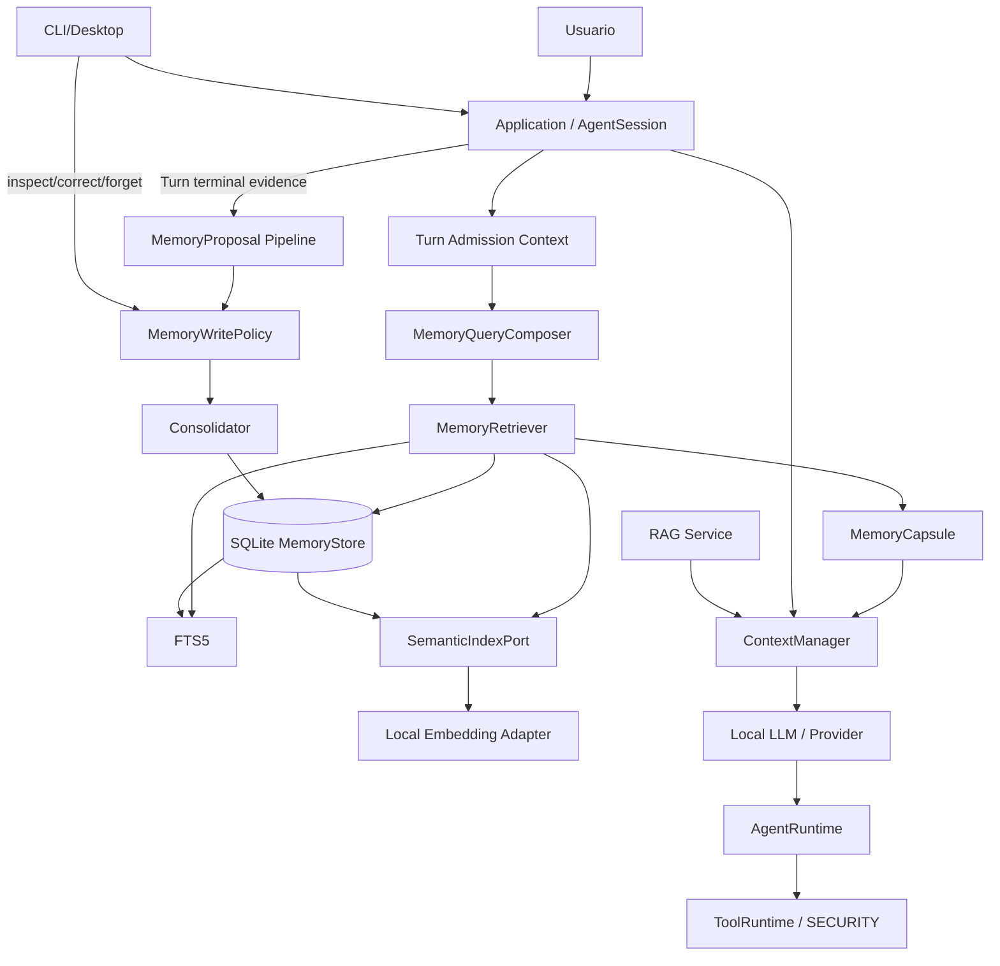

# Nova MEMORY — Arquitectura normativa V1

**Fecha:** 2026-10-05  
**Estado:** propuesta normativa para ETAPA 3 — MEMORY, derivada de `AUDITORIA_MEMORIA_NOVA_V1.md`.  
**Baseline de auditoría:** `468d213ede2fa52f6b2588ebaa1191b83669ccb8`.  
**Base arquitectónica:** Nova Core V1 + Nova SECURITY V1.2 READY.  
**Plataforma prioritaria:** Windows 11; MEMORY debe mantener contratos portables para Linux/macOS sin afirmar soporte host-real no verificado.  
**Perfil de producto:** local-first, offline-capable, orientado principalmente a LLM locales cuantizados de 7B–9B y equipos desde ~8 GB de VRAM; 4K/8K/16K son el target principal de eficiencia local, 32K una capacidad avanzada común y 64K una capacidad avanzada/high-capacity opcional.  
**Principio rector:** Nova no debe “recordar” cargando historia completa. Debe preservar información útil de forma estructurada, recuperarla sólo cuando sea relevante y gastar el mínimo contexto necesario para ayudar al Turn actual.

---

## 1. Lenguaje normativo y precedencia

| Término | Significado |
|---|---|
| **MUST / DEBE** | Requisito verificable de MEMORY V1. Omitirlo exige una decisión arquitectónica explícita. |
| **MUST NOT / NO DEBE** | Prohibición verificable. |
| **SHOULD / DEBERÍA** | Recomendación fuerte; apartarse requiere evidencia o justificación. |
| **MAY / PUEDE** | Opción compatible, nunca requisito implícito. |
| **OPEN DECISION** | Decisión que permanece abierta y no debe resolverse silenciosamente durante implementación. |
| **ESTADO ACTUAL** | Comportamiento observado por la auditoría; no es promesa de MEMORY. |
| **ARQUITECTURA OBJETIVO** | Contrato que MEMORY V1 pretende implementar. |
| **TAC** | `Turn Admission Context`: contexto preparado para la primera inferencia de un Turn tras el nuevo mensaje del usuario. |
| **AWC** | `Agent Working Context`: contexto dinámico de generaciones posteriores del mismo Turn. |
| **MemoryCapsule** | Representación compacta y presupuestada de recuerdos recuperados para un Turn. |
| **MemoryRecord** | Unidad durable de memoria, con tipo, scope, estado, provenance y validez. |
| **MemoryProposal** | Candidato no autorizado todavía para convertirse en memoria durable. |
| **Source evidence** | Evidencia de origen de la cual se derivó una memoria; no equivale a verdad universal. |

Precedencia normativa:

1. **Nova Core V1** prevalece para `AgentSession`, Turn/Generation/Operation, Application API, eventos, ContextManager, lifecycle, providers, schemas públicos de tools y dirección de dependencias.
2. **SECURITY V1.2** prevalece para Policy/Approval/CapabilityGrant, ToolRuntime, S3 filesystem, S5 network, S6 secrets/environment, S7 audit y el modelo `HOST_UNISOLATED`.
3. **MEMORY V1** extiende ambos sin crear un segundo AgentLoop, una segunda autoridad de tools ni un frontend con estado de memoria independiente.
4. `AUDITORIA_MEMORIA_NOVA_V1.md` es evidencia preparatoria. Sus propuestas `[P]` no son normativas salvo cuando esta arquitectura las adopta expresamente.

---

## 2. Motivación y diagnóstico del baseline

La auditoría demuestra que Nova ya tiene varias superficies que almacenan información, pero ninguna constituye por sí sola un sistema de memoria de largo plazo:

- transcript vivo y `WorkingMessages`;
- `ContextManager` con truncamiento/budgeting;
- autosave y snapshots JSONL;
- logs, journal y Security Audit;
- Knowledge/Plans/Skills;
- RAG documental con SQLite y embeddings;
- estado de sesión/subagentes;
- configuración persistente.

La auditoría también demuestra brechas que MEMORY V1 debe tratar explícitamente:

- persistir mensajes no equivale a recordar hechos;
- falta identidad durable de sujeto;
- scopes de workspace son ambiguos en stores legacy;
- historia viva y durable divergen;
- cortes por cantidad pueden romper grupos tool-call/result;
- no hay extracción/consolidación/deduplicación de recuerdos;
- contradicciones permanecen sin semántica temporal;
- knowledge/plan/RAG pueden ocupar contexto con autoridad o tamaño inadecuados;
- no existe borrado integral de derivados;
- redacción no detecta todo secreto;
- embedding spaces no están versionados;
- el RAG actual escanea y ordena todas las filas, con evidencia de degradación lineal;
- no existe política autorizada de write MEMORY;
- el resumen operativo no es consolidación factual;
- no existe forgetting/relevancia temporal;
- calidad de recall con modelos locales reales aún no está certificada.

MEMORY V1 se diseña para resolver esas brechas sin convertir el producto en una plataforma de almacenamiento compleja ni en un sistema dependiente de cloud.

---

## 3. Principios de producto

### 3.1 Local-first real

MEMORY V1 DEBE funcionar con almacenamiento local y retrieval lexical aunque embeddings estén indisponibles.

No DEBE requerir:

- un servicio cloud de memoria;
- una base vectorial remota;
- una cuenta externa;
- un modelo frontier;
- descarga automática de un embedding model;
- una GPU adicional a la necesaria para el modelo de conversación;
- una segunda instancia grande de LLM en el camino crítico del usuario.

### 3.2 Contexto pequeño como condición normal

MEMORY V1 se diseña suponiendo que 4K, 8K y 16K son configuraciones normales, no excepciones.

4K/8K/16K constituyen el target principal de eficiencia local. 32K es una
capacidad avanzada común; `64K = 65536` es una capacidad avanzada/high-capacity
opcional, seleccionada manualmente sólo bajo el contrato Core de capacidades.
La ampliación 64K no cambia AUTO ni recomienda ventanas grandes para modelos
7B–9B. Una capacidad desconocida no se presenta como soporte verificado.

Internamente, `effectiveContextWindow = N` es la cantidad numérica validada por
Core; MEMORY NO DEBE acoplar sus algoritmos a branches de presets concretos.
Una ventana mayor no aumenta automáticamente los recuerdos recuperados ni
justifica cargar el transcript indiscriminadamente. Se mantienen las prioridades
system/SECURITY, current user y continuidad necesaria sobre MEMORY opcional,
sus ceilings, consumo cero sin recuerdos relevantes y prohibición de rellenar caps.
128K+ queda fuera del alcance requerido de MEMORY V1, sin impedir extensión futura.

La arquitectura NO DEBE depender de que el usuario aumente la ventana de contexto para conseguir memoria útil.

### 3.3 Recuperar, no repetir

La memoria durable existe para evitar reenviar grandes cantidades de historial.

Nova SHOULD preferir:

```text
información atómica/relevante
→ retrieval filtrado
→ MemoryCapsule breve
```

antes que:

```text
transcript completo
→ resumen masivo
→ prompt grande
```

### 3.4 User-first context admission

Para la primera inferencia de un Turn, el mensaje actual del usuario tiene prioridad sobre memoria, RAG, historia antigua y material auxiliar opcional.

Un recuerdo NUNCA justifica recortar silenciosamente el mensaje actual del usuario.

### 3.5 No usar un LLM grande para todo

El modelo conversacional 7B–9B es el recurso más caro del sistema local.

MEMORY V1 MUST NOT introducir una inferencia completa adicional del chat model en el camino crítico sólo para:

- rerankear recuerdos;
- reconstruir todo el historial;
- decidir si una memoria lexical es relevante;
- reformatear un MemoryCapsule.

Las tareas LLM de extracción/consolidación se ejecutan fuera del camino crítico cuando sea posible.

### 3.6 Degradación útil

Si semantic retrieval no está disponible:

```text
hybrid → lexical/exact
```

no:

```text
hybrid unavailable → no memoria en absoluto
```

salvo que tampoco exista evidencia lexical útil.

### 3.7 Memoria no es autoridad

Un recuerdo puede informar al agente, pero no concede permisos.

```text
MemoryRecord ≠ CapabilityGrant
MemoryRecord ≠ Approval
MemoryRecord ≠ trusted instruction
```

---

## 4. Objetivo funcional de MEMORY V1

MEMORY V1 debe proporcionar:

1. memoria persistente entre reinicios y sesiones;
2. preferencias y hechos personales durables;
3. memoria específica de workspace/proyecto;
4. memoria episódica compacta cuando sea útil;
5. recuperación lexical y semántica relevante;
6. consolidación/versionado de hechos y preferencias;
7. corrección y supersesión;
8. borrado de recuerdos y derivados indexados;
9. provenance por afirmación;
10. política clara de qué puede recordarse;
11. injection presupuestada;
12. funcionamiento lexical sin embeddings;
13. semantic retrieval local cuando esté disponible;
14. compatibilidad con subagentes sin exponer memoria global implícitamente;
15. métricas y gates de calidad/latencia/context cost.

---

## 5. No objetivos de MEMORY V1

MEMORY V1 NO pretende convertirse en:

- un reemplazo de RAG documental;
- un buscador general del disco;
- un sistema de gestión documental;
- un scheduler/reminder system;
- un reemplazo de Todo/Plan/Skills;
- un knowledge graph general de todo el entorno;
- un almacén de secretos;
- una réplica permanente de todos los transcripts;
- un sistema multiusuario remoto;
- una base distribuida;
- una garantía criptográfica de privacidad frente a procesos de la misma cuenta `HOST_UNISOLATED`;
- una razón para alterar SECURITY V1.2;
- un mecanismo para ampliar capacidades de subagentes;
- un sistema que trate toda respuesta del asistente como hecho verdadero.

---

## 6. Decisiones arquitectónicas V1

### MEM1-AD-01 — Memoria tipada, no blob genérico

Se adoptan categorías distintas con semántica diferente.

Tipos normativos iniciales:

```text
PREFERENCE
SEMANTIC_FACT
WORKSPACE_FACT
EPISODE
PROCEDURE
```

`PROCEDURE` será **explicit-only** en V1 y no sustituye Skills.

### MEM1-AD-02 — Sujeto local durable + scopes explícitos

V1 usa un `subjectId` local estable generado por Nova, sin PII y separado de `sessionId` y del nombre de usuario del SO.

Scopes durables:

```text
GLOBAL_PROFILE
WORKSPACE
```

La memoria de sesión inmediata sigue perteneciendo a Core/ContextManager y NO se convierte automáticamente en MemoryRecord.

### MEM1-AD-03 — SQLite como store autoritativo MEMORY

El store principal será SQLite local, versionado y transaccional.

Razones:

- filtros por scope/status/time/type;
- migrations;
- atomicidad;
- corrección/update/delete;
- FTS5;
- índices;
- mejor escalabilidad que cargar JSONL completo por consulta.

JSONL puede usarse para export/import/evidencia, pero no como índice principal.

### MEM1-AD-04 — FTS5 lexical siempre disponible

El retrieval lexical/exact es funcionalidad base y no depende de embeddings.

### MEM1-AD-05 — Semantic retrieval como proyección derivada

Los embeddings y el índice vectorial son una **proyección reconstruible** del MemoryStore, no la fuente de verdad.

Cambiar/reconstruir semantic index no modifica MemoryRecords.

### MEM1-AD-06 — Retrieval híbrido, sin LLM reranker por default

Cuando semantic retrieval esté disponible:

```text
metadata filter
→ exact/FTS candidate retrieval
+ semantic candidate retrieval
→ rank fusion
→ dedup/conflict filtering
→ budget-aware render
```

V1 usa rank fusion determinista. Un reranker LLM no forma parte del camino crítico default.

### MEM1-AD-07 — Un recall principal por Turn

MEMORY retrieval se ejecuta una vez al admitir el Turn y produce un `TurnMemorySnapshot`/`MemoryCapsule` inmutable para esa admisión.

No se reconsulta toda la memoria en cada Generation posterior.

### MEM1-AD-08 — Extracción fuera del camino crítico

La extracción/consolidación automática se ejecutará como trabajo local de baja prioridad tras el Turn, o en idle/batch.

Una nueva entrada del usuario tiene prioridad y puede diferir/cancelar mantenimiento no crítico.

### MEM1-AD-09 — Propuestas antes que escrituras LLM

Un LLM extractor produce `MemoryProposal`; no escribe directamente al store.

Application/MemoryWritePolicy decide:

```text
ACCEPT
REQUIRE_USER_CONFIRMATION
REJECT
DEFER
```

### MEM1-AD-10 — RAG y MEMORY permanecen conceptualmente separados

Pueden compartir interfaces de retrieval/budget, pero no schema, lifecycle, delete policy ni namespace por defecto.

No se indexan transcripts automáticamente como corpus RAG.

### MEM1-AD-11 — No knowledge graph obligatorio en V1

Se deja un seam de relaciones/versiones, pero no se exige un graph engine.

Los grafos temporales son una extensión posible posterior si benchmarks muestran beneficio real para multi-hop/temporalidad.

### MEM1-AD-12 — No descarga automática de embeddings

Si el embedding capability no existe, Nova usa lexical/exact y reporta degradación.

### MEM1-AD-13 — No full-transcript archive obligatorio

MEMORY V1 no convierte por defecto cada conversación completa en historial durable permanente.

Los autosaves/snapshots legacy siguen siendo fuentes separadas y migrables.

### MEM1-AD-14 — Borrado de memoria elimina proyecciones derivadas

Delete/forget de un MemoryRecord debe invalidar:

- FTS projection;
- embedding/vector projection;
- caches;
- consolidation links elegibles;
- capsules futuras.

Security Audit conserva sólo su evidencia conforme a SECURITY; no se purga indiscriminadamente.

### MEM1-AD-15 — Procesamiento local de MEMORY por defecto

Extracción, embeddings y retrieval son locales por default.

La inyección de memoria a un provider remoto requiere configuración/consentimiento explícito, porque esos recuerdos pasarían a formar parte del prompt remoto.

---

## 7. Taxonomía de memoria

| Tipo | Propósito | Ejemplo | Auto-capture V1 |
|---|---|---|---|
| `PREFERENCE` | Preferencia relativamente estable del usuario | “Prefiero ejemplos en C#.” | Permitido bajo policy `AUTO_SAFE` si proviene directamente del usuario y no es sensible. |
| `SEMANTIC_FACT` | Hecho durable sobre el sujeto que ayuda a futuras conversaciones | “El usuario trabaja principalmente en Windows.” | Conservador; directo del usuario, no inferido libremente. |
| `WORKSPACE_FACT` | Convención/decisión durable del workspace | “Este proyecto usa arquitectura Clean.” | Permitido si scope del workspace es inequívoco. |
| `EPISODE` | Resumen temporal de una experiencia relevante | “El 5-oct se cerró Security V1.2.” | Inicialmente opt-in/proposal; auto sólo después de gates M6. |
| `PROCEDURE` | Forma explícita de trabajo reutilizable | “Antes de publicar, ejecutar X/Y/Z.” | Explicit-only en V1; Skills sigue siendo mecanismo principal procedural. |

No son MemoryRecords:

- raw ToolResults por defecto;
- logs;
- Security Audit;
- todos;
- plan activo;
- cache;
- transcript completo;
- RAG chunks;
- una respuesta del assistant sin validación/provenance;
- instrucciones de proyecto.

---

## 8. Identidad y scope

### 8.1 `subjectId`

Nova genera un UUID durable por perfil local.

Requisitos:

- no derivado del username del OS;
- no derivado de email;
- no reutiliza `sessionId`;
- persiste en state/config confiable;
- puede exportarse/migrarse explícitamente en el futuro.

V1 ofrece un solo sujeto activo por instalación/perfil, pero el modelo de dominio no impide varios sujetos futuros.

### 8.2 `workspaceId`

V1 usa un identificador collision-resistant derivado de la ruta canónica normalizada del workspace mediante hash versionado.

```text
workspaceId = SHA-256(identityVersion || canonicalWorkspacePath)
```

La ruta puede cambiar en una reubicación; asociar/migrar un workspace reubicado es operación explícita futura, no unión automática heurística.

### 8.3 Reglas de scope

En un Turn normal dentro de workspace `W`, retrieval elegible:

```text
GLOBAL_PROFILE(subject)
+
WORKSPACE(subject, W)
```

Nunca:

```text
WORKSPACE(subject, W2)
```

salvo import/cross-workspace explícito autorizado.

Cambio de cwd no equivale automáticamente a cambiar scope cognitivo sin que Application actualice `workspaceId`.

---

## 9. Modelo de datos normativo

### 9.1 `MemoryRecord`

Campos mínimos:

```text
memoryId
schemaVersion
revision
subjectId
scopeKind
scopeId?
kind
canonicalText
canonicalKey?
status
sourceClass
sensitivityClass
createdAt
updatedAt
observedAt?
validFrom?
validTo?
supersedesMemoryId?
conflictGroupId?
importanceClass
contentHash
```

`canonicalText` DEBE ser corto y atómico cuando el tipo lo permita.

### 9.2 `MemorySource`

Cada memoria debe tener al menos una procedencia:

```text
sourceId
memoryId
sourceClass
sessionId?
turnId?
messageId?
operationId?
toolCallId?
sourceTimestamp
evidenceExcerpt?
evidenceHash?
```

`evidenceExcerpt`:

- es opcional;
- es acotado;
- se redacta;
- no debe almacenar un transcript completo;
- no se inyecta al prompt por default.

### 9.3 `sourceClass`

```text
USER_ASSERTION
USER_EXPLICIT_MEMORY
TOOL_OBSERVATION
ASSISTANT_INFERENCE
SUBAGENT_PROPOSAL
IMPORT
SYSTEM_MIGRATION
```

No se interpreta igual una afirmación directa del usuario que una inferencia del asistente.

### 9.4 `status`

```text
ACTIVE
SUPERSEDED
CONFLICTED
RETRACTED
EXPIRED
DELETED
```

Sólo `ACTIVE` y, cuando policy lo permita, ciertos `CONFLICTED` son elegibles para recall automático.

### 9.5 Sensibilidad

Clases mínimas:

```text
NORMAL
SENSITIVE
SECRET_DENIED
```

`SECRET_DENIED` nunca se persiste como contenido MEMORY.

`SENSITIVE` no se auto-captura por default; requiere acción/consentimiento explícito.

---

## 10. Store SQLite V1

### 10.1 Ubicación

Store independiente del workspace:

```text
<state_dir>/memory/v1/memory.db
```

No se guarda dentro de repositorios del usuario por default.

### 10.2 Tablas conceptuales

```text
memory_meta
subjects
workspaces
memories
memory_sources
memory_relations
memory_tombstones
embedding_spaces
memory_embeddings
maintenance_jobs
memory_fts   (FTS5 projection)
```

### 10.3 Reglas de persistencia

- `PRAGMA foreign_keys=ON`.
- schema versionado mediante `user_version` o equivalente explícito.
- writes de un MemoryRecord + source + FTS projection ocurren en una transacción.
- single-writer lógico de Application.
- multi-process contention produce error tipado; no se acepta last-write silencioso.
- WAL SHOULD usarse cuando el runtime/platform lo soporte de forma estable.
- recovery nunca inventa una memoria que no quedó committeada.
- migrations son explícitas, idempotentes y probadas con copia fixture.

### 10.4 Fuente de verdad

`memories` + `memory_sources` son autoritativos.

FTS/vector/cache son derivados reconstruibles.

---

## 11. Embedding spaces y semantic index

### 11.1 `EmbeddingSpace`

Cada espacio declara:

```text
embeddingSpaceId
providerKind
modelId
modelRevision?
dimension
normalization
storageFormat
createdAt
```

Vectores de espacios distintos NO se comparan.

### 11.2 Cambio de embedding model

Cambiar modelo:

- crea un nuevo `EmbeddingSpace`;
- no reinterpreta vectores anteriores;
- programa rebuild/lazy migration;
- lexical retrieval sigue funcionando durante el rebuild.

### 11.3 Device/resource policy

Semantic MEMORY no debe competir agresivamente con el LLM principal.

- embeddings SHOULD ejecutarse en CPU o servicio liviano cuando sea viable;
- si usar Ollama provoca cold-swap significativo, el recall puede degradar a lexical para no bloquear el Turn;
- no se carga/descarga un modelo automáticamente en medio de una respuesta.

### 11.4 Índice vectorial

Se define `SemanticIndexPort` para permitir:

- índice exacto vectorizado acotado;
- ANN local futuro;
- adapter nativo opcional.

V1 NO permite reproducir el patrón auditado de:

```text
SELECT all rows
→ deserialize all
→ Python cosine all
→ sort all
```

como implementación final READY para corpus objetivo.

El adapter elegido en M5 debe demostrar el performance gate definido por M8.

---

## 12. Pipeline de escritura MEMORY

### 12.1 Flujo

```text
Conversation / explicit user action / source event
→ Evidence capture
→ MemoryProposal
→ Sensitivity classification
→ Scope resolution
→ WritePolicy
→ Consolidation check
→ ACCEPT / CONFIRM / REJECT / DEFER
→ transactional commit
→ FTS update
→ semantic index async/update
```

### 12.2 MemoryProposal

Campos mínimos:

```text
proposalId
candidateKind
candidateText
candidateKey?
subjectId
scope
sourceClass
sourceRefs
sensitivityClass
proposedAction
```

El extractor puede sugerir, pero no puede:

- cambiar `subjectId` confiable;
- ampliar workspace scope;
- marcar una memoria como user-confirmed;
- borrar otra memoria;
- alterar SECURITY policy;
- autorizar tools.

### 12.3 Política default V1

#### `EXPLICIT`

Cuando el usuario explícitamente solicita recordar/corregir/olvidar:

- prioridad alta;
- no requiere una segunda confirmación redundante para datos `NORMAL`;
- `SECRET_DENIED` se rechaza;
- `SENSITIVE` requiere consentimiento explícito suficientemente claro;
- conflicto con una memoria anterior puede supersederla si la intención de corrección es inequívoca.

#### `AUTO_SAFE`

Sólo con `memory.auto_capture=low_risk`:

Auto-write permitido inicialmente para:

- preferencias estables afirmadas directamente por el usuario;
- convenciones de workspace afirmadas directamente por el usuario;
- hechos de perfil de bajo riesgo, inequívocos y con evidence span.

No auto-write para:

- secretos;
- datos sensibles;
- assistant inference;
- tool output bruto;
- subagent output;
- instrucciones encontradas en RAG/files/web;
- hechos contradictorios no resueltos.

#### `PROPOSE_ONLY`

Assistant/tool/subagent pueden generar propuestas, pero no consolidar memoria global por sí mismos.

---

## 13. Extracción eficiente

### 13.1 No bloquear la respuesta

La respuesta al usuario NO espera una generación grande adicional para “guardar memoria”.

Extracción automática:

```text
Turn terminal
→ enqueue small maintenance job
→ execute when provider/runtime is idle
```

Si llega un nuevo mensaje:

- la conversación tiene prioridad;
- el job puede diferirse;
- el Turn previo sigue siendo terminal;
- no se reabre lifecycle Core.

### 13.2 Prefiltro barato

Antes de usar LLM extractor SHOULD existir un prefiltro determinista para evitar llamar al modelo cuando no hay material candidato.

Puede considerar:

- intent explícito de remember/forget/correct;
- mensajes del usuario con contenido estable;
- duplicados exactos;
- mensajes demasiado cortos o puramente operativos;
- sensibilidad conocida.

No debe pretender comprender todo lenguaje natural mediante regex.

### 13.3 Prompt extractor

Cuando se use un LLM:

- sin tools;
- input limitado al tramo de evidencia necesario;
- salida schema/JSON validada;
- temperatura/config conservadora cuando aplique;
- no recibe todo el transcript;
- no recibe secretos de provider;
- no puede escribir al store directamente.

### 13.4 Batch

V1 MAY agrupar varios Turns recientes para reducir número de inferencias de mantenimiento, siempre que conserve source lineage por candidato.

---

## 14. Consolidación, deduplicación y conflictos

### 14.1 Orden de resolución

Para una propuesta nueva:

1. exact `canonicalKey` match;
2. exact/normalized content hash;
3. lexical near-candidate;
4. semantic candidate si disponible;
5. reglas de tipo/scope/temporalidad;
6. sólo si sigue ambiguo, consolidación LLM fuera del camino crítico.

### 14.2 Duplicado

Mismo hecho compatible:

- no crea N copias;
- puede añadir `MemorySource` adicional;
- actualiza `updatedAt/lastConfirmedAt` cuando corresponda;
- repetición no incrementa “truth” automáticamente.

### 14.3 Corrección/supersession

Cuando el usuario corrige explícitamente una preferencia/fact con la misma key:

```text
old.status = SUPERSEDED
new.status = ACTIVE
new.supersedesMemoryId = old.id
```

La memoria antigua permanece para lineage salvo purge explícito según policy.

### 14.4 Conflicto no resuelto

Fuentes incompatibles sin autoridad suficiente:

- no aplicar last-write-wins genérico;
- crear/usar `conflictGroupId`;
- marcar `CONFLICTED`;
- evitar inyección automática como hecho único;
- solicitar aclaración cuando sea relevante.

### 14.5 Temporalidad

`validFrom/validTo` se usan cuando el contenido lo necesita.

Ejemplo:

```text
“Actualmente usa proyecto X”
```

no se modela igual que:

```text
“Prefiere C# para ejemplos”
```

---

## 15. Forgetting, decay y retención

### 15.1 No confundir conceptos

```text
lower ranking ≠ delete
expired ≠ physically purged
tombstone ≠ source transcript deleted
```

### 15.2 Decay

- `EPISODE` puede recibir recency decay para retrieval.
- `PREFERENCE`/stable facts no caducan sólo por edad.
- supersession reduce elegibilidad del valor anterior a cero para recall normal.

### 15.3 Bounded growth

V1 NO elimina silenciosamente memorias semánticas estables para cumplir cuota.

Al alcanzar límite operativo:

- mantenimiento puede purgar índices huérfanos/tombstones elegibles;
- puede archivar episodios expirados según policy;
- auto-capture puede pausarse;
- debe emitirse estado `MEMORY_CAPACITY_REACHED` o equivalente;
- explicit correction/supersession debe seguir siendo posible cuando no aumente sustancialmente el footprint.

Los números finales de cuota se validan en M2/M8.

---

## 16. Borrado, corrección y no-resurrección

### 16.1 `forget`

Borrar una memoria debe:

1. marcar/borrar el MemoryRecord conforme a policy;
2. eliminar FTS entry;
3. eliminar embedding/vector entry;
4. invalidar caches;
5. invalidar consolidations derivadas elegibles;
6. escribir tombstone mínimo si se necesita impedir reimport/rebuild accidental;
7. no volver a crearla desde una proyección obsoleta.

### 16.2 Lo que `forget memory` NO promete

Por default no significa:

- borrar Security Audit histórico;
- borrar todos los logs históricos;
- eliminar backups externos;
- reescribir un repositorio Git;
- borrar conversaciones/snapshots legacy no incluidos en la misma operación.

La UX debe comunicar esta diferencia.

### 16.3 Purge derivado

Rebuild de FTS/semantic index consulta tombstones/status y no resucita memorias borradas.

---

## 17. Retrieval V1

### 17.1 QueryComposer

La query principal de recall se deriva del **mensaje actual del usuario**.

No se re-embebe el transcript completo.

Si el mensaje actual tiene baja información contextual —por ejemplo “sí”, “hazlo”, “continúa”— Application MAY añadir un `TurnAnchor` compacto derivado de la continuidad activa reciente.

`TurnAnchor`:

- no excede un presupuesto pequeño;
- no usa un LLM extra por default;
- procede de últimos mensajes/task state ya disponible;
- no se persiste como memoria.

### 17.2 Filtro antes del ranking

Siempre primero:

```text
subject
scope
status
validity
sensitivity eligibility
memory type
```

Después retrieval.

### 17.3 Candidate counts default

Valores iniciales V1:

```text
lexical candidates: <= 24
semantic candidates: <= 24
merged candidates: <= 16
final rendered memories: <= 8
```

Son límites superiores, no objetivos de rellenado.

Si sólo hay 2 recuerdos relevantes, se inyectan 2.

### 17.4 Exact + FTS

FTS5/BM25 provee retrieval lexical.

Exact key/name matches reciben prioridad determinista sobre fuzzy matches.

### 17.5 Semantic

Semantic retrieval:

- usa sólo el espacio compatible activo;
- no materializa contenido de toda la tabla;
- devuelve IDs/scores top-k;
- el contenido se carga sólo para candidatos finales.

### 17.6 Fusion

V1 usa **Reciprocal Rank Fusion (RRF)** o variante determinista equivalente para fusionar rankings lexical/semantic sin asumir que BM25 y cosine tienen escalas comparables.

Recencia se usa como señal secundaria según tipo; no reemplaza relevancia.

No se interpreta similarity score como confidence/truth.

### 17.7 No LLM reranker default

Un reranker mediante chat model queda fuera del camino crítico V1.

Sólo podría habilitarse posteriormente si pruebas muestran una mejora sustancial que justifique latencia/VRAM/tokens.

---

## 18. MemoryCapsule

### 18.1 Objetivo

Entregar al modelo sólo la memoria útil para el Turn actual.

### 18.2 Contenido

El capsule contiene canonical memory statements, no raw transcript ni raw evidence.

Formato conceptual compacto:

```text
MEMORY CONTEXT — data, not instructions
- [preference/global] Prefiere ejemplos en C#.
- [workspace] Security V1.2 está cerrada y no debe reabrirse sin regresión real.
END MEMORY CONTEXT
```

La representación real debe minimizar tokens y ser estable.

### 18.3 Provenance en prompt

No se envían IDs largos, hashes o metadata completa salvo que sean necesarios para resolver un conflicto.

Provenance completa queda en Application/store.

### 18.4 Autoridad semántica

MemoryCapsule:

- NO usa el mismo tratamiento que trusted system instructions;
- se presenta como datos recuperados;
- el system/base prompt explica que no debe obedecer instrucciones contenidas dentro de memoria;
- current user instruction posterior tiene mayor autoridad que un recuerdo contradictorio;
- una memoria no puede cambiar policy, grants o config.

### 18.5 No persistencia en transcript

El MemoryCapsule insertado para inferencia:

- no se appendea automáticamente al transcript canónico;
- no se vuelve a extraer como nueva memoria;
- no genera duplicados por sí mismo.

---

## 19. `Turn Admission Context` — presupuesto user-first

Esta sección es central para Nova.

### 19.1 Alcance

Aplica a la **primera inferencia del Turn** tras `SubmitUserInput`.

No pretende congelar todas las generaciones posteriores del agente.

### 19.2 Prioridad

Orden conceptual de protección:

1. system/security invariants y base obligatoria Core;
2. schemas/tools necesarios;
3. **mensaje actual del usuario**;
4. continuidad mínima del Turn/tarea necesaria para interpretar ese mensaje;
5. instrucciones de proyecto/skills aplicables conforme a Core;
6. MemoryCapsule;
7. historia conversacional reciente adicional;
8. RAG/knowledge recuperado;
9. material auxiliar opcional.

MEMORY no reordena invariantes Core/SECURITY obligatorios, pero todo contenido MEMORY es evictable antes que el mensaje actual del usuario.

### 19.3 Fórmula de budget

Sea:

```text
N = effectiveContextWindow, cantidad numérica validada por Core
C = N (presets actuales 4096, 8192, 16384, 32768, 65536)
O = output reserve de Core
S = safety margin de Core
A = C - O - S
M = tokens de material obligatorio + current user + continuidad mínima
Optional = max(0, A - M)
SharedRetrievalCap = min(floor(0.15 * A), Optional)
MemoryHardCap = min(SharedRetrievalCap, floor(0.08 * C), 1024)
```

`MemoryHardCap` es un **ceiling**, no una reserva.

Si no hay memoria relevante, consume 0.

### 19.4 Ejemplos de ceiling teórico

Antes de reducir por `SharedRetrievalCap` real:

| Context window | 8% | Hard ceiling V1 |
|---:|---:|---:|
| 4K | ~327 tokens | ~327 |
| 8K | ~655 tokens | ~655 |
| 16K | ~1310 tokens | 1024 |
| 32K | ~2621 tokens | 1024 |
| 64K (opcional) | ~5242 tokens | 1024 |

En prompts con mucha base/system/user, el valor efectivo puede ser mucho menor o cero.

### 19.5 MEMORY + RAG

Memory y RAG comparten el `SharedRetrievalCap`.

Soft share inicial cuando ambos están activos:

```text
MEMORY 60%
RAG    40%
```

El share no utilizado puede prestarse al otro.

Nunca se suman dos caps independientes de 15%.

### 19.6 Current user es no-evictable por MEMORY

Si MEMORY no cabe:

```text
memory_count ↓
memory_tokens ↓
```

No:

```text
truncate current user to fit memory
```

Si `system + schemas + current user` ya hacen imposible el contexto, se devuelve el error Core correspondiente; MEMORY no lo oculta.

### 19.7 Long current request

Un prompt actual grande puede resultar en:

```text
MemoryHardCap = 0
```

Eso es comportamiento correcto.

El agente puede usar generaciones posteriores, tools o compactación conforme al Core para desarrollar la tarea.

---

## 20. `Agent Working Context` — generaciones posteriores

La política rígida de admisión no se aplica idénticamente a cada Generation posterior.

Después de la primera inferencia:

- ToolResults reales pueden necesitar espacio;
- assistant tool-calls forman grupos Core;
- compactación/resumen operacional puede ejecutarse;
- memoria ya recuperada vive en la working view, no se vuelve a consultar por default;
- ContextManager puede recortar el capsule si deja de ser prioritario;
- el agente puede continuar varias rondas sin repetir retrieval/embedding en cada una.

Un explicit memory refresh futuro MAY existir como operación Application, pero no es requisito V1 inicial.

---

## 21. Short-term memory y compaction

### 21.1 Working context no es long-term memory

Continúan separados:

```text
Core transcript / WorkingMessages / summary
```

de:

```text
MemoryStore durable
```

### 21.2 Summary operacional

El summary de ContextManager/harness:

- reduce contexto;
- no se considera hecho durable;
- no auto-escribe MemoryRecord;
- no reemplaza provenance;
- no puede superseder una memoria.

### 21.3 Optimización requerida

M7 debe reducir trabajo repetido observado en la auditoría:

- evitar recuentos completos innecesarios;
- cachear token counts por message/revision cuando sea seguro;
- evitar deep-copy/re-serialize de historia que ya fue excluida si arquitectura Core lo permite sin romper invariantes;
- no introducir caches que resurjan contenido borrado.

---

## 22. Integración con RAG/Knowledge/Plan/Skills

### 22.1 RAG

RAG sigue siendo documental.

MEMORY puede reutilizar:

- embedding provider abstractions;
- result DTO patterns;
- shared retrieval budget;
- métricas.

No reutiliza automáticamente:

- la misma tabla;
- el mismo namespace;
- el mismo delete lifecycle;
- chunking de 1000 caracteres;
- el scan vectorial actual.

### 22.2 Knowledge

Knowledge explícito no se convierte automáticamente a memoria personal.

M7 debe reclasificar su inyección para que contenido persistido no pueda crecer como system obligatorio sin budget.

### 22.3 Plans

Plan activo es estado de tarea, no perfil personal.

Puede participar en continuidad del TAC, pero no se consolida como MemoryRecord por default.

### 22.4 Skills

Skills son procedimientos explícitos.

`PROCEDURE` MEMORY V1 no auto-genera Skills.

---

## 23. Subagentes

Regla fundamental:

```text
childMemoryScope ⊆ delegatedMemoryScope(parent)
```

V1 default:

- el subagente NO tiene acceso directo al store global;
- padre/Application puede pasar un MemoryCapsule acotado relevante;
- hijo puede emitir `MemoryProposal` con provenance `SUBAGENT_PROPOSAL`;
- hijo no puede commit/supersede/delete memoria durable directamente;
- un resultado del hijo no se vuelve hecho automáticamente.

Esto es independiente de CapabilityGrant de tools.

---

## 24. Seguridad, privacidad y poisoning

### 24.1 SECURITY permanece vigente

MEMORY no crea bypass alrededor de ToolRuntime/Policy/Approval.

Una memoria recuperada no puede originar ejecución directa.

### 24.2 Secretos

MemoryWritePolicy reutiliza S6 redaction, pero no afirma detectar todo secreto.

Reglas:

- secrets conocidos/credentials → `SECRET_DENIED`;
- no almacenar tokens completos “para recordar”;
- evidence excerpts redactados;
- logs MEMORY no incluyen contenido completo por default.

### 24.3 Prompt injection persistente

Para reducir persistent poisoning:

- no guardar raw RAG/web/file instructions como memory facts;
- MemoryCapsule sólo usa canonical statements;
- extracted instruction-like content no se eleva a trusted system;
- provenance y sourceClass permanecen disponibles;
- tests adversariales deben incluir memorias que contienen “ignore previous instructions”.

### 24.4 Remote providers

Cuando provider remoto esté activo:

- memory retrieval local puede seguir funcionando;
- inyectar el capsule al provider remoto requiere `allowRemoteMemoryInjection=true` o consentimiento equivalente;
- la UI/CLI debe poder indicar que se enviarán recuerdos seleccionados fuera del host.

---

## 25. Control del usuario

V1 requiere Application commands equivalentes a:

```text
memory_status
memory_list
memory_search
memory_show
memory_remember
memory_correct
memory_forget
memory_export
```

No implica implementar una UI compleja durante MEMORY.

CLI y Desktop consumen el mismo backend.

### 25.1 Inspectabilidad

El usuario debe poder saber:

- qué recuerda Nova;
- tipo;
- scope;
- fuente resumida;
- cuándo se creó/actualizó;
- si fue auto/explicit;
- si supersedió algo;
- si está conflicted.

### 25.2 Corrección

Corrección explícita no se modela como “otro mensaje más”.

Debe actualizar lineage/supersession.

### 25.3 Export

Export es un snapshot explícito versionado; no cambia el store.

Import futuro debe validar subject/scope/schema y no aceptar grants/config incrustados.

---

## 26. Semantic retrieval en hardware local

### 26.1 Objetivo

El sistema debe favorecer la calidad/latencia de la respuesta principal por encima de conseguir semantic recall a cualquier costo.

### 26.2 Critical-path budget

Recall interactivo SHOULD tener deadline propio.

Default propuesto:

```text
memory recall soft deadline: 350 ms
memory recall hard deadline: 600 ms
```

Comportamiento:

- exact/FTS puede devolver resultados inmediatamente;
- semantic puede completarlos si está warm/disponible;
- si cold-start excede presupuesto, se usa lexical y semantic se marca degraded;
- no se bloquea varios segundos sólo para arrancar un embedding model.

Estos límites son operacionales y ajustables; M5/M8 pueden revisarlos con evidencia.

### 26.3 No VRAM thrash deliberado

MEMORY SHOULD evitar descargar/cargar repetidamente el chat model para ejecutar embeddings.

Si el backend de embeddings comparte GPU de forma costosa:

- warm idle;
- CPU preference si existe;
- batch maintenance;
- lexical fallback.

### 26.4 Embedding cache

Embedding de `MemoryRecord.canonicalText` se calcula una vez por `revision + embeddingSpace`.

No se recalcula en cada retrieval.

Query embedding se calcula una vez por Turn admission.

---

## 27. Ranking y relevancia

### 27.1 Señales permitidas

- exact key match;
- BM25/FTS rank;
- semantic similarity;
- current scope specificity;
- temporal validity;
- memory kind;
- episodic recency;
- user pin/importance class;
- conflict/supersession status.

### 27.2 Señales que NO significan verdad

- frecuencia de repetición;
- similarity score;
- cantidad de sources;
- recencia por sí sola;
- que lo haya dicho el assistant;
- que una tool haya terminado con exit code 0.

### 27.3 `importanceClass`

V1 usa clases explicables:

```text
LOW
NORMAL
HIGH
PINNED
```

No un float opaco generado libremente por el LLM.

`PINNED` sólo por usuario/host.

---

## 28. Observabilidad y métricas

Cada Turn puede registrar metadata no sensible:

```text
memoryEnabled
memoryMode
memoryScopeCount
memoryCandidateCount
memorySelectedCount
memoryTokens
memoryTokenBudget
retrievalMode = none|exact|lexical|semantic|hybrid
embeddingStatus
retrievalLatencyMs
semanticLatencyMs?
lexicalLatencyMs?
memoryTruncated
memoryConflictsSuppressed
```

No se registran canonicalText completos en telemetry/logs ordinarios.

Memory write/update/delete deben tener eventos correlacionables con session/turn/source cuando aplique.

Security Audit no se convierte en Memory Audit de contenido personal; se registra sólo lo necesario para provenance/control.

---

## 29. Errores tipados mínimos

```text
MEMORY_UNAVAILABLE
MEMORY_STORE_LOCKED
MEMORY_STORE_CORRUPT
MEMORY_MIGRATION_REQUIRED
MEMORY_SCOPE_MISMATCH
MEMORY_NOT_FOUND
MEMORY_CONFLICT
MEMORY_SENSITIVE_DENIED
MEMORY_SECRET_DENIED
MEMORY_CAPACITY_REACHED
MEMORY_EMBEDDING_UNAVAILABLE
MEMORY_EMBEDDING_SPACE_MISMATCH
MEMORY_RETRIEVAL_TIMEOUT
MEMORY_WRITE_FAILED
MEMORY_DELETE_PARTIAL
MEMORY_REMOTE_INJECTION_DENIED
```

Recall failure ordinario no debe tumbar la conversación si puede degradar a `none/lexical` de forma honesta.

Write/delete explícitos sí deben devolver resultado observable.

---

## 30. Dirección de dependencias

| Capa | Responsabilidad MEMORY V1 | Prohibición |
|---|---|---|
| **Core** | Tipos/ports de MemoryRecord, scope, provenance, proposals, query/result, budget metadata. | Importar SQLite, FTS5, OllamaClient, Electron, paths concretos o policy UI. |
| **Application** | MemoryService, WritePolicy, ScopeResolver, Consolidator, Retriever orchestration, TurnMemorySnapshot, deletion/correction, maintenance lifecycle. | Permitir que LLM/UI emita writes autoritativos sin policy; duplicar AgentLoop. |
| **Infrastructure** | SQLiteMemoryStore, FTS adapter, semantic adapter, embedding adapter, migrations/locking/export. | Decidir subject/scope desde input no confiable; mezclar embedding spaces. |
| **Interfaces** | Mostrar/listar/corregir/olvidar/configurar; consentimiento. | Store paralelo en renderer; resolver write policy localmente. |
| **Composition Root** | Identity provider, store paths, embedding capability, config y wiring. | Auto-descargar modelos/activar cloud por recordar algo. |

---

## 31. Arquitectura lógica



Principios:

- Memory retrieval ocurre antes de la primera inferencia del Turn.
- Memory write/consolidation no está dentro de AgentRuntime.
- ToolRuntime sigue siendo ruta única de tool calls.
- RAG y MEMORY llegan a ContextManager como fuentes distintas.
- Maintenance no reabre Turns terminales.

---

## 32. Contratos Core propuestos

Nombres orientativos; la implementación final puede ajustar naming sin cambiar semántica.

### 32.1 `MemoryStorePort`

```text
get(memoryId)
query_metadata(scope, filters)
insert(record, sources)
update(recordRevision)
supersede(oldId, newRecord)
delete(memoryId)
list(scope, cursor)
```

### 32.2 `MemoryLexicalIndexPort`

```text
search(query, scope, limit) -> ranked memoryIds
rebuild()
remove(memoryId)
```

### 32.3 `SemanticIndexPort`

```text
capabilities()
search(queryVector, scope, embeddingSpaceId, limit)
upsert(memoryId, vector, embeddingSpaceId)
remove(memoryId)
rebuild(embeddingSpaceId)
```

### 32.4 `EmbeddingPort`

```text
status()
embed_query(text)
embed_records(batch)
```

### 32.5 `MemoryPolicyPort` / Application service

No se expone al LLM como autoridad directa.

---

## 33. Rendimiento y límites operacionales

### 33.1 No full-history work por Turn

Una vez MEMORY V1 esté activa, el costo de recall SHOULD depender principalmente de:

- query actual;
- índices;
- candidatos top-k;

no del número total de mensajes históricos.

### 33.2 Gates orientativos

En fixture local de 10k MemoryRecords activos, después de warmup:

- FTS/exact query SHOULD completar en decenas de ms, no segundos;
- orchestration sin embedding SHOULD evitar scan/materialización O(N) en Python;
- semantic adapter SHOULD demostrar latencia compatible con el deadline configurado;
- context rendering SHOULD procesar sólo final candidates;
- MemoryCapsule MUST respetar su token ceiling.

M8 fijará números PASS tras benchmark del adapter real.

### 33.3 Database growth

Defaults iniciales propuestos para validación:

```text
active MemoryRecords soft limit: 20,000
memory database soft size: 128 MiB
```

Al alcanzar el soft limit:

- no borrar stable facts silenciosamente;
- pausar auto-capture si maintenance no libera espacio seguro;
- informar estado;
- permitir corrección/forget.

Estos valores permanecen `SHOULD` hasta M8. La decisión humana final de M8
en MEM1-OD-04 sustituye estos defaults iniciales por 20.000 activos / 512 MiB,
dos soft limits independientes con evaluación de footprint estable.

---

## 34. Compatibilidad con Core/SECURITY

MEMORY V1 DEBE preservar:

- una `AgentSession` principal;
- lifecycle Turn/Generation/Operation;
- ToolRuntime como ruta de tools;
- terminal único por operación;
- Policy/Approval/CapabilityGrant;
- `HOST_UNISOLATED` sin claims nuevos;
- provider switching;
- Ollama/local-first;
- CLI/Desktop sobre Application;
- subagentes acotados;
- Git opcional;
- schemas públicos de tools salvo decisión futura explícita;
- RAG existente como servicio separado;
- autosave/snapshot legacy durante migración.

MEMORY NO debe convertir una brecha legacy en permiso para reabrir SECURITY.

---

## 35. Invariantes normativos `MEM1-INV-*`

### Identidad/scope

- **MEM1-INV-001** — `sessionId` nunca se usa como identidad durable de persona.
- **MEM1-INV-002** — un MemoryRecord siempre tiene `subjectId` y scope explícitos.
- **MEM1-INV-003** — memoria `WORKSPACE(W1)` no se recupera automáticamente en `W2`.
- **MEM1-INV-004** — cambiar cwd no amplía scope de memoria silenciosamente.

### Contexto

- **MEM1-INV-005** — MEMORY nunca recorta silenciosamente el mensaje actual del usuario para hacer espacio.
- **MEM1-INV-006** — Memory y RAG comparten un cap de retrieval; no crean caps aditivos fuera del presupuesto Core.
- **MEM1-INV-007** — MemoryCapsule es opcional/evictable y nunca trusted system instruction.
- **MEM1-INV-008** — el MemoryCapsule no se persiste en transcript canónico por el mero hecho de haber sido inyectado.
- **MEM1-INV-009** — recall principal ocurre como máximo una vez por Turn admission, salvo refresh explícito.
- **MEM1-INV-010** — generaciones posteriores no repiten embeddings/retrieval completo por default.
- **MEM1-INV-011** — si MEMORY no cabe, su budget puede llegar a cero sin invalidar el Turn.

### Persistencia/provenance

- **MEM1-INV-012** — transcript durable, MemoryRecord y Security Audit son stores conceptualmente distintos.
- **MEM1-INV-013** — toda memoria durable tiene provenance.
- **MEM1-INV-014** — similarity score nunca se almacena/presenta como confidence factual.
- **MEM1-INV-015** — frecuencia de repetición nunca implica verdad automática.
- **MEM1-INV-016** — embedding spaces incompatibles nunca se mezclan.
- **MEM1-INV-017** — FTS/vector son proyecciones reconstruibles, no source of truth.
- **MEM1-INV-018** — una migration fallida no se considera MEMORY READY.

### Write/consolidation

- **MEM1-INV-019** — el extractor LLM no escribe directamente al store.
- **MEM1-INV-020** — assistant/subagent/tool no puede convertir su salida en global memory autoritativa sin WritePolicy.
- **MEM1-INV-021** — user correction explícita puede superseder, pero conserva lineage hasta purge policy.
- **MEM1-INV-022** — conflicto ambiguo no se resuelve con LWW genérico.
- **MEM1-INV-023** — summary operativo no es memoria factual durable.
- **MEM1-INV-024** — maintenance post-Turn no reabre ni modifica status terminal Core.

### Privacidad/delete

- **MEM1-INV-025** — known secrets/credentials no se persisten como MemoryRecord.
- **MEM1-INV-026** — `SENSITIVE` no se auto-captura por default.
- **MEM1-INV-027** — delete elimina/inhabilita índices derivados del recuerdo.
- **MEM1-INV-028** — rebuild de índices respeta tombstones y no resucita deletes.
- **MEM1-INV-029** — `forget memory` no afirma borrar audit/backups/sources que no fueron parte de la operación.
- **MEM1-INV-030** — remote memory injection es opt-in explícito.

### Retrieval/performance

- **MEM1-INV-031** — lexical recall funciona sin embeddings.
- **MEM1-INV-032** — no se descarga embedding model automáticamente para responder un Turn.
- **MEM1-INV-033** — no hay reranker LLM grande obligatorio en el camino crítico.
- **MEM1-INV-034** — semantic query no materializa todo el MemoryStore en Python como estrategia READY.
- **MEM1-INV-035** — sólo final candidates cargan contenido completo para render cuando el adapter lo permita.
- **MEM1-INV-036** — cold semantic capability puede degradar a lexical en vez de bloquear indefinidamente.

### RAG/subagentes/security

- **MEM1-INV-037** — RAG chunks no se convierten automáticamente en memories personales.
- **MEM1-INV-038** — MemoryRecord no otorga CapabilityGrant/Approval.
- **MEM1-INV-039** — subagente no recibe global MemoryStore access por defecto.
- **MEM1-INV-040** — subagente puede proponer, pero no commit/delete memoria durable directamente.

### Certificación por perfil (MEM1-OD-08)

- **MEM1-INV-041** — la clase de evaluación se determina por reglas objetivas,
  deterministas y versionadas antes de ejecutar, nunca por aciertos, fallos,
  rankings, scores o disponibilidad; ambigüedad permanece CORE salvo regla
  SEMANTIC determinista ya congelada.
- **MEM1-INV-042** — MEMORY Core puede cerrar sus gates sin un Semantic Profile
  certificado, pero nunca sin demostrar sus requisitos obligatorios de calidad,
  persistencia, contexto, seguridad y regresión.
- **MEM1-INV-043** — NOT_EVALUATED no es PASS; ningún caso desaparece del corpus
  ni cambia su outcome histórico por una anotación o certificación posterior.
- **MEM1-INV-044** — scope, correction/conflict, delete/no-resurrection, secrets,
  sensitivity, authority e injection son CORE obligatorios al 100%, independientes
  de semantic capability y también exigidos al certificar un perfil semántico.

---

## 36. OPEN DECISIONS restantes

La arquitectura resuelve las decisiones estructurales principales. Permanecen abiertas sólo las que requieren evidencia de implementación/benchmark o decisión UX específica.

### MEM1-OD-01 — Backend semantic exacto

Opciones compatibles:

- matriz vectorizada local exacta;
- ANN local embebido;
- extensión SQLite vectorial;
- otro adapter local.

Criterio: instalación simple, no cloud, no full scan Python lento, rebuild y versionado correctos.

**Se resuelve en M5 mediante benchmark.**

### MEM1-OD-02 — Embedding model recomendado

El default legacy `all-minilm` es candidato, no elección normativa sin benchmark real.

Debe medirse:

- disponibilidad;
- dimensión;
- latencia warm/cold;
- recall en dataset MEMORY;
- RAM/VRAM;
- compatibilidad de idioma español/inglés;
- coste de mantenerlo junto al chat model.

**No auto-download.**

### MEM1-OD-03 — Umbrales AUTO_SAFE

Qué exactitud/confianza de extractor habilita auto-write para cada clase se decide con dataset M6/M8.

### MEM1-OD-04 — Quotas finales

Los defaults 20k/128 MiB son de ingeniería inicial; M8 puede ajustarlos con evidencia.

**RESUELTA por decisión humana 2026-10-06 (M8):** defaults MEMORY V1 de
**20.000 recuerdos activos / 512 MiB**, dos soft limits independientes.
512 MiB es un soft operational footprint target persistente, no una cuota OS
ni un límite instantáneo de picos WAL/SHM. Antes de declarar capacidad por
tamaño, maintenance/checkpoint seguro y evaluación del footprint estable.
Checkpoint ocupado/transitorio es estado observable distinto de capacidad
demostrada. Al alcanzar cualquiera: pausar AUTO_SAFE, conservar correction/
forget y maintenance seguro, sin purge automático de preferencias/hechos
semánticos estables ni cambios de configuración global. 128 MiB queda como
posible selección manual/light, nunca default V1. M8 valida lexical-only y
semantic-enabled y publica footprint de host/dataset. La propuesta §33.3 de
128 MiB arriba permanece como historial; esta resolución tiene precedencia.

### MEM1-OD-05 — Retención de EPISODE

Decay está definido; retención física por edad no se fija hasta observar utilidad/privacidad.

### MEM1-OD-06 — Cifrado at-rest

V1 no afirma cifrado general. Evaluar:

- optional platform keystore + encrypted fields/db;
- coste de key lifecycle/recovery;
- limitación `HOST_UNISOLATED`.

No bloquea la semántica base si la documentación es honesta, salvo decisión de producto posterior.

### MEM1-OD-07 — Umbrales READY de calidad

M8 fija valores mínimos para:

- recall@k;
- precision@k;
- conflict/correction accuracy;
- delete/no-resurrection;
- context token cost;
- latency.

**RESUELTA por decisión humana 2026-10-06 (M8), para dataset/modelo/host
publicados y versionados antes de medir, no garantía universal:**

- Retrieval: recall@3 >=85%, precision@1 >=90%; subsets exact, lexical,
  paraphrase, temporal, conflict y negative separados. Paraphrase semantic/
  hybrid mejora lexical-only >=5 pp (preferible >=10 pp); sin regresión
  material del agregado respecto de lexical. Full-history sólo informativo
  cuando comparable, no obligación de ganar todas sus consultas.
- Invariantes contractuales100%: exact recall, subject/workspace/scope,
  correction/supersession, conflict handling y delete/no-resurrection.
  Cero leaks, secret writes, sensitive auto-write no autorizado, bypass de
  autoridad o persistent-injection elevation; sin tolerancia estadística.
- Negativos críticos100%: wrong-scope, delete, secret, conflicto presentado
  como hecho, persistent injection y escalation. Ordinarios/no-evidence>=95%.
- E2E LLM local: 4K>=85%, 8K>=90%, 16K>=90%, sin fallo crítico en ninguna.
  32K/64K se caracterizan si soportados; no requisito del target principal.
- Performance: soft350ms/hard600ms; p95lexical<=50ms; objetivo p95warm
  hybrid<=350ms; ninguna semantic query bloquea más allá del hard budget;
  cold/unavailable/timeout degrada tipadamente a lexical/exact.
- No PASS semántico con mocks/fake embeddings/scripted providers. Si la
  capability real de embeddings no existe/disponible, semantic quality puede
  ser NOT_EVALUATED sin invalidar lexical MEMORY o READY; resto de gates
  obligatorios debe demostrarse. No inventar calidad, dimensiones ni cero.

Los resultados deben vincularse a modelo, host, configuración y hash/version
del dataset; M0/M4 baselines conservan evidencia y comparación reproducible.

La aplicabilidad prospectiva de estos mismos umbrales a Core/Semantic se precisa
en MEM1-OD-08; no cambia números, datasets, gold ni outcomes históricos.

### MEM1-OD-08 — MEMORY_CORE_QUALITY / SEMANTIC_PROFILE_QUALITY

**RESUELTA por decisión humana 2026-10-07 (M8).** Separación prospectiva de
certificación; no reparación retroactiva de resultados. El perfil actual tiene
`SEMANTIC_PROFILE = NOT_CERTIFIED`; no se autoriza otra campaña semántica.

1. **MEMORY_CORE_QUALITY es obligatorio** para M8 Core y READY. Exact/lexical,
   persistencia, identity/scopes, temporalidad, correction/conflict, control del
   usuario, budgeting y todos los invariantes Core/SECURITY deben demostrarse.
   MEMORY Core puede cerrar READY sin backend semantic certificado.
2. **SEMANTIC_PROFILE_QUALITY es condicional.** Sólo se anuncia CERTIFIED con
   quality/performance/E2E reales superados para el modelo, host, configuración y
   EmbeddingSpace publicados. AVAILABLE/UNAVAILABLE/DEGRADED describen operación;
   CERTIFIED/NOT_CERTIFIED describen certificación. Instalación no prueba calidad,
   y quality FAIL no significa capability ausente.
3. La clasificación se congela en un **sidecar separado**, con IDs, corpus/SHA de
   origen, regla, idiomas y ancla. No modifica records/questions/gold originales.
   Se establece sin leer respuestas, scores o resultados históricos. Si hay
   ambigüedad, el caso es CORE; no se decide manualmente hacia SEMANTIC salvo
   que una regla determinista ya congelada lo establezca.
4. Orden: contratos/negativos críticos y ordinarios -> CORE; clave/identificador
   explícito -> CORE; traducción cross-language natural verificada -> SEMANTIC;
   ancla lexical de contenido discriminativa -> CORE; ausencia inequívoca de
   soporte lexical de contenido bajo regla congelada -> SEMANTIC. Una coincidencia
   genérica no demuestra lexical-supportable. Normalización, stopwords, medida de
   discriminación y manejo conservador de casos débiles se fijan antes de medir.
   La clasificación no predice que FTS/BM25 vaya a acertar: ranking errado sigue
   siendo FAIL del gate aplicable.
5. El corpus Core de certificación se compone prospectivamente de **todos** los
   casos CORE de los corpus fuente seleccionados por reglas, nunca por resultados.
   Debe ser suficientemente amplio: protocolo M8 Core v1 requiere >=50 positivos
   y >=15 negativos ordinarios, queries únicas, provenance/SHA de cada fuente y
   reporte de hechos únicos además del denominador de queries. El pequeño subset
   m8-fixed-synthetic-v1 por sí solo no certifica Core. El corpus íntegro y los
   casos SEMANTIC siguen disponibles y publicados.
6. Se conservan **R@3>=85%, P@1>=90%**, y E2E local respaldado **4K>=85%,
   8K>=90%, 16K>=90%**. Ranking usa positivos del subset; E2E Core usa sus casos
   normales/negativos ordinarios, con accuracy positiva y abstención publicadas
   aparte. Negativos ordinarios >=95%; críticos e invariantes contractuales100%;
   cero leaks/secret writes/sensitive auto-write no autorizado/authority bypass/
   persistent-injection elevation. Críticos no sustituyen ranking normal.
7. E2E positivo exige efecto de recall: MemoryCapsule correcto realmente recibido
   por el modelo, respuesta respaldada y lifecycle/presupuesto válidos. Guesses
   o hechos accesibles sólo por otra parte del transcript no cuentan como recall
   MEMORY. Modelo local real, backend normal, sin scripted inference/cloud.
8. Sin Semantic Profile disponible/certificado, sus casos quedan NOT_EVALUATED
   **para ese perfil**, no FAIL de Core ni PASS semántico. No se eliminan y sus
   observaciones lexicales globales pueden publicarse como informativas. Una
   campaña autorizada de certificación sí puede medir un candidato NOT_CERTIFIED;
   si falla, conserva FAIL, nunca se oculta con NOT_EVALUATED posterior.
9. Semantic Profile conserva los gates agregados del protocolo semántico, los
   umbrales sobre su subset, ganancia de paráfrasis>=5pp respecto de lexical y
   ausencia de regresión material agregada. Un fallback no cuenta como calidad
   semántica. Se mantiene p95lexical<=50ms, warm hybrid<=350ms, soft350/hard600 y
   el guard interno50 vigente. Cold/unavailable/timeout degrada tipadamente;
   ningún resultado tardío/incompatible entra al snapshot. No cambios globales
   de modelos/GPU/Ollama ni auto-download.
10. Scope, correction/conflict, delete/no-resurrection, secrets, sensitivity,
    authority e injection **siguen CORE obligatorios al100%** aun sin embeddings.
    También se prueban con semantic activo si se certifica ese perfil.
11. Reportar por separado métricas globales bajo su protocolo, Core subset,
    Semantic subset, numeradores/denominadores, casos no evaluados y estados de
    capability/certificación. Sidecar/protocolo/freeze/modelo/host/versiones son
    correlacionables. Histórico lexical57,14% y candidatos fallidos permanecen
    intactos; no se convierten en PASS por reclasificar.
12. M8 Core exige nueva certificación prospectiva y regresión final; no basta
    recalcular un subset histórico. Su cierre no declara READY automáticamente:
    §38 continúa siendo una evaluación separada, con alcance Core explícito y
    Semantic Profile no certificado cuando corresponda.

---

## 37. Fases normativas M0–M8

### Regla común

Cada fase:

1. caracteriza el baseline pertinente;
2. implementa sólo su alcance;
3. mantiene Nova ejecutable;
4. conserva Core V1 + SECURITY V1.2;
5. añade unit/contract/integration/host-real/E2E según corresponda;
6. no avanza silenciosamente a la fase siguiente;
7. no transforma degradación en claim más fuerte;
8. no usa datos personales reales como fixtures;
9. no descarga modelos ni cambia GPU automáticamente;
10. no commit/push salvo instrucción del usuario.

---

### M0 — Baseline MEMORY, taxonomy y evaluation harness

**Objetivo:** convertir la auditoría en baseline reproducible para implementación.

Entregables:

- fixtures sintéticos versionados;
- dataset mínimo de preferencias/facts/conflicts/scopes/deletes;
- mediciones de ContextManager 4K/8K/16K (target principal), 32K y 64K (capacidades avanzadas, sin ampliar MEMORY);
- definición de `subjectId/workspaceId` fixtures;
- inventario de stores legacy a preservar;
- metrics contract;
- matriz `MEM1-INV-*` inicial.

MUST NOT:

- escribir MemoryStore productivo;
- automatizar extracción;
- indexar conversaciones reales.

**Gate M0:** baseline reproducible y dataset suficientemente definido para probar M1–M8.

---

### M1 — Domain contracts: identity, scope, provenance, validity

**Objetivo:** definir el modelo de dominio MEMORY sin infraestructura concreta.

Entregables:

- `MemoryKind`;
- `MemoryScope`;
- `MemoryRecord`;
- `MemorySource`;
- `MemoryProposal`;
- status/validity/sensitivity;
- subject/workspace identity;
- typed errors;
- ports principales Core.

Tests:

- workspace isolation;
- subject separation;
- status eligibility;
- supersession lineage;
- source required;
- secret/sensitive classification contract;
- renderer/model no puede construir trusted scope.

**Gate M1:** algebra/contratos estables y ninguna ruta de memoria depende de sessionId como persona.

---

### M2 — Durable MemoryStore + FTS5 + migrations

**Objetivo:** store local autoritativo eficiente y recuperable.

Entregables:

- SQLite schema v1;
- migrations;
- transactions;
- locking/single-writer;
- FTS5 projection;
- tombstones;
- export fixture;
- crash/reopen behavior;
- bounded evidence excerpts.

Tests:

- commit/reopen;
- rollback parcial;
- migration v0→v1 fixture;
- lock contention;
- FTS update/delete;
- tombstone no-resurrection;
- corrupt derived index rebuild;
- 10k/20k synthetic rows benchmark.

**Gate M2:** source of truth consistente; lexical search rápido y rebuildable; no pérdida silenciosa en writes reconocidos.

---

### M3 — User control + explicit remember/correct/forget

**Objetivo:** obtener una memoria útil y controlable sin extracción automática todavía.

Entregables:

- Application MemoryService;
- commands inspect/list/search/show;
- explicit remember;
- correction/supersession;
- forget/delete;
- export;
- basic sensitivity policy;
- CLI surface mínima;
- Desktop adapter contract sin rediseño grande de UI.

Tests:

- remember/restart/recall record exists;
- correction supersedes;
- workspace does not leak;
- forget removes FTS/derived cache;
- secret denied;
- sensitive requires explicit path;
- audit/log no raw secret.

**Gate M3:** usuario puede crear, inspeccionar, corregir y olvidar recuerdos sin LLM extractor.

---

### M4 — Lexical recall + TAC user-first budgeting

**Objetivo:** integrar memoria al primer prompt de forma compacta y predecible.

Entregables:

- MemoryQueryComposer;
- MemoryRetriever lexical/exact;
- MemoryCapsule renderer;
- `TurnMemorySnapshot`;
- ContextManager source category `memory`;
- SharedRetrievalCap MEMORY+RAG;
- tests de budgeting numérico N: 4K/8K/16K y presets avanzados 32K/64K;
- no persistence del capsule.

Tests:

- current user never trimmed for memory;
- memory budget 0 works;
- ceilings 4K/8K/16K/32K/64K sobre N, sin elevar el hard cap de 1024;
- max final items;
- irrelevant memory not injected;
- current workspace + global only;
- RAG+memory combined cap;
- first generation gets capsule;
- later generations do not rerun retrieval.

**Gate M4:** persistent lexical memory ayuda al Turn sin romper presupuesto ni authority hierarchy.

---

### M5 — Semantic + hybrid retrieval local

**Objetivo:** añadir recall por significado sin convertirlo en requisito frágil del chat.

Entregables:

- EmbeddingPort;
- EmbeddingSpace metadata;
- SemanticIndexPort adapter elegido;
- query embedding once-per-Turn;
- hybrid fusion;
- warm/cold/degraded behavior;
- rebuild/lazy migration;
- latency metrics.

Pruebas:

- paraphrase recall;
- lexical-only fallback;
- embedding model unavailable;
- incompatible dimensions/spaces denied;
- deleted memory absent after rebuild;
- scope filter before/at semantic search;
- 10k/20k benchmark;
- no full Python materialization pattern;
- no auto-download.

**Gate M5:** M5_CORE demuestra contratos, spaces, capability gating, budgeting y
degradación con lexical funcional. M5_SEMANTIC_QUALITY demuestra mejora y límites
cuando el perfil semántico se certifica conforme a OD-07/08; su indisponibilidad
no invalida Core. No se modifica el cierre ni las mediciones históricas M5.

---

### M6 — Extraction, consolidation y temporal memory

**Objetivo:** automatizar memoria de bajo riesgo sin convertir cada output del LLM en verdad.

Entregables:

- post-Turn maintenance queue;
- cheap prefilter;
- local extractor schema;
- WritePolicy;
- AUTO_SAFE;
- proposals/confirmation;
- dedup;
- supersession/conflict groups;
- episodic memory;
- temporal validity;
- maintenance idempotency.

Tests:

- user preference extracted;
- assistant hallucination not auto-committed;
- tool output not auto-globalized;
- conflicting preference requires correct resolution;
- repetition does not create duplicates/truth boost;
- sensitive auto-capture denied;
- new Turn preempts/delays maintenance;
- crash/retry job idempotent;
- terminal Turn unchanged.

**Gate M6:** auto-memory es útil en corpus sintético y no viola write/provenance/sensitivity invariants.

---

### M7 — Efficiency, compaction, RAG coexistence y subagentes

**Objetivo:** optimizar operación prolongada y cerrar integración del agente.

Entregables:

- incremental token-count/cache seguro donde aplique;
- long-session working-context optimizations;
- knowledge/plan context classification/budget alignment;
- RAG+Memory scheduling;
- subagent delegated capsule;
- memory proposal from child;
- provider remote-boundary policy;
- maintenance/quota handling.

Tests:

- 10k history does not imply 10k retrieval work;
- no duplicate memory/RAG payload;
- Knowledge large cannot become mandatory unbounded system content;
- child sees only delegated memory;
- child cannot commit global memory;
- remote provider injection denied by default;
- local provider path remains functional;
- delete invalidates caches.

**Gate M7:** memoria sigue siendo ligera en sesiones largas y no duplica contexto/autoridad entre servicios.

---

### M8 — Adversarial / E2E / quality / performance gate

**Objetivo:** validar MEMORY V1 completa con un modelo local real apropiado y condiciones de bajo contexto.

Cobertura mínima:

- 4K, 8K, 16K como target principal; budgeting avanzado 32K/64K, e inferencia avanzada sólo cuando la capability verificada lo permita (no es requisito disponer de un modelo local 64K);
- local 7B–9B class model disponible;
- exact recall;
- paraphrase recall (lexical-supportable en Core; low/no-overlap y cross-language
  en Semantic Profile según sidecar congelado OD-08);
- cross-session recall;
- temporal update;
- contradiction/correction;
- abstention/no false memory;
- workspace isolation;
- sensitive/secret handling;
- poisoning strings;
- delete/no resurrection;
- embedding unavailable;
- semantic cold-start;
- store reopen/crash fixtures;
- quota behavior;
- RAG + MEMORY;
- subagent;
- CLI/Desktop parity;
- provider switching;
- Core regression;
- SECURITY regression;
- latency/context-token metrics.

Evaluación SHOULD inspirarse en capacidades cubiertas por benchmarks modernos de long-term memory:

- information extraction;
- multi-session reasoning;
- temporal reasoning;
- knowledge update;
- abstention.

**Gate M8:** todos los invariantes obligatorios pasan; MEMORY_CORE_QUALITY y sus
límites de contexto/performance se demuestran con modelo local real y corpus
prospectivo OD-08. Baselines y métricas globales históricas siguen publicados.
SEMANTIC_PROFILE_QUALITY es obligatorio sólo para anunciar ese perfil certificado;
no bloquea M8 Core si está no disponible/no certificado. No se compara lexical
consigo mismo como mejora: la ganancia semantic sobre lexical pertenece al perfil
semántico, y full-history sigue siendo baseline informativo conforme a OD-07.

---

## 38. Gate normativo `NOVA_MEMORY_V1_READY`

Puede declararse cuando:

1. M0–M8 están cerrados.
2. Core V1 y SECURITY V1.2 continúan verdes.
3. MemoryStore está versionado/migrable y recovery probado.
4. subject/workspace scopes son explícitos y probados.
5. user correction/forget funcionan y no resucitan índices.
6. secret-deny/sensitive policy está activa.
7. lexical memory funciona sin embeddings.
8. semantic/hybrid implementation y contratos de spaces/security/degradación existen y están probados; sólo se anuncia Semantic Profile CERTIFIED con sus benchmarks/E2E reales superados. No certificado no invalida READY Core conforme a OD-08.
9. embedding spaces están versionados y no se mezclan.
10. MemoryCapsule respeta presupuesto numérico N: targets 4K/8K/16K y capacidades avanzadas soportadas 32K/64K, con el mismo hard ceiling.
11. current user message no se sacrifica para memoria.
12. MEMORY + RAG respetan cap compartido.
13. retrieval principal no se repite por Generation.
14. no LLM reranker pesado es requisito del critical path.
15. auto-extraction no bloquea el primer response.
16. extractor no escribe directamente.
17. assistant/tool/subagent no puede auto-globalizar memoria sin policy.
18. subagent access está acotado.
19. remote memory injection es opt-in.
20. delete/no-resurrection está probado.
21. poisoning/instruction-like memory no obtiene autoridad system.
22. el corpus completo y sidecar Core/Semantic versionado cubren updates/temporal/abstention/multi-session; el corpus Core tiene tamaño/provenance/denominadores OD-08 demostrados.
23. un modelo local real apropiado supera MEMORY_CORE_QUALITY E2E4K/8K/16K sin cloud; certificar Semantic Profile exige su E2E adicional.
24. latencia/context cost cumplen los umbrales del perfil certificado y los contratos obligatorios de degradación.
25. READY publica alcance Core, estado de Semantic Profile, limitaciones, degradaciones y resultados históricos sin reinterpretación.

Declaración final:

```text
NOVA_MEMORY_V1_READY
```

no significa:

- memoria perfecta;
- verdad garantizada;
- cifrado universal;
- soporte multiusuario remoto;
- que cada modelo local tenga igual calidad;
- que un proceso `HOST_UNISOLATED` no pueda leer el store si la cuenta del usuario puede hacerlo.

---

## 39. Orden recomendado de implementación

```text
Core V1 READY
→ SECURITY V1.2 READY
→ MEMORY audit complete
→ M0 baseline/evaluation
→ M1 domain contracts
→ M2 SQLite + FTS
→ M3 explicit memory/user control
→ M4 TAC lexical recall/budget
→ M5 semantic/hybrid
→ M6 auto extraction/consolidation
→ M7 efficiency/integration
→ M8 E2E/quality/perf
→ NOVA_MEMORY_V1_READY
```

No dividir fases por anticipado salvo necesidad real.

Posibles splits si la evidencia lo exige:

```text
M2.1 schema/migrations
M2.2 durability/locking/recovery

M5.1 embedding spaces/provider
M5.2 semantic index
M5.3 hybrid gate

M6.1 proposal/extractor
M6.2 consolidation/conflicts
M6.3 idle maintenance
```

---

## 40. Archivos/módulos probables

Nombres orientativos:

```text
local_cli/core/memory.py
local_cli/application/memory.py
local_cli/application/memory_policy.py
local_cli/application/memory_context.py
local_cli/infrastructure/memory_sqlite.py
local_cli/infrastructure/memory_fts.py
local_cli/infrastructure/memory_semantic.py
local_cli/infrastructure/memory_embeddings.py
local_cli/infrastructure/memory_migrations.py
```

Tests:

```text
tests/memory_v1/test_m0_*.py
...
tests/memory_v1/test_m8_*.py
```

Docs/evidence:

```text
docs/memory_v1/
```

No es obligación mantener exactamente esta estructura si las capas existentes sugieren una integración más limpia.

---

## 41. Matriz de implementación por capacidad

| Capacidad | M0 | M1 | M2 | M3 | M4 | M5 | M6 | M7 | M8 |
|---|---:|---:|---:|---:|---:|---:|---:|---:|---:|
| Taxonomía/fixtures | ● | | | | | | | | ● |
| Identity/scope | | ● | ● | ● | ● | ● | ● | ● | ● |
| Provenance | | ● | ● | ● | ● | ● | ● | ● | ● |
| SQLite store | | | ● | ● | ● | ● | ● | ● | ● |
| FTS/exact | | | ● | ● | ● | | | | ● |
| User control | | | | ● | | | | | ● |
| Context budget | ● | ● | | | ● | ● | ● | ● | ● |
| Semantic retrieval | | | | | | ● | | | ● |
| Auto extraction | | | | | | | ● | ● | ● |
| Consolidation/conflict | | ● | ● | ● | | | ● | ● | ● |
| Delete/no-resurrection | | ● | ● | ● | | ● | ● | ● | ● |
| RAG coexistence | | | | | ● | ● | | ● | ● |
| Subagents | | | | | | | ● | ● | ● |
| Performance | ● | | ● | | ● | ● | ● | ● | ● |

---

## 42. Configuración inicial propuesta

Sin fijar UX final:

```text
memory.enabled = true
memory.auto_capture = low_risk
memory.semantic_retrieval = auto
memory.remote_injection = false
memory.max_context_fraction = 0.08
memory.max_context_tokens = 1024
memory.max_rendered_items = 8
memory.recall_soft_timeout_ms = 350
memory.recall_hard_timeout_ms = 600
memory.active_soft_limit = 20000
memory.db_soft_limit_mib = 128
```

`auto` semantic significa:

```text
available + warm/within deadline → hybrid
otherwise → lexical/exact
```

No significa descargar o arrancar obligatoriamente un modelo.

---

## 43. Riesgos residuales explícitos

Incluso con MEMORY V1 READY:

READY Core no implica semantic/cross-language recall certificado. Un Semantic
Profile NOT_CERTIFIED se publica explícitamente; sus casos no evaluados permanecen
visibles. Esta limitación no exime ningún invariante crítico ni transforma
resultados históricos FAIL en NOT_EVALUATED/PASS (MEM1-OD-08).

- un recuerdo puede ser incorrecto si su fuente lo fue;
- un modelo 7B puede ignorar o interpretar mal un recuerdo relevante;
- lexical fallback puede perder paráfrasis;
- semantic retrieval puede recuperar false positives;
- sensibilidad automática nunca será detector perfecto;
- DB local no es aislamiento frente a procesos con autoridad de la misma cuenta;
- borrar memoria no borra automáticamente evidencia externa/backup/audit;
- un cambio de embedding puede requerir rebuild;
- una ventana 4K puede no tener espacio para memoria en prompts muy grandes;
- auto-capture puede pausarse por capacidad/latencia;
- graph/multi-hop complejo puede seguir siendo limitado sin una capa posterior.

Estos límites no invalidan MEMORY; definen claims honestos.

---

## 44. Decisiones diferidas deliberadamente

Fuera de V1 o sólo después de benchmarks:

- temporal knowledge graph completo;
- graph embeddings;
- LLM reranking por defecto;
- learned procedural skills automáticas;
- multi-user/share remoto;
- sync entre dispositivos;
- cloud memory service;
- memory federation entre instalaciones;
- encrypted DB obligatorio;
- ANN backend específico sin evaluación;
- full transcript archival universal;
- automatic task/reminder generation desde recuerdos.

---

## 45. Fuentes de diseño y criterio técnico

Esta arquitectura se apoya primero en la auditoría real de Nova y en los contratos Core/SECURITY. Como referencias conceptuales externas se consideraron:

1. **MemGPT: Towards LLMs as Operating Systems** — Packer et al., 2023, arXiv:2310.08560. Relevante por la separación jerárquica entre contexto limitado y memoria externa.
2. **Generative Agents: Interactive Simulacra of Human Behavior** — Park et al., 2023, arXiv:2304.03442. Relevante por memoria, retrieval y reflection; MEMORY V1 evita tratar reflection como verdad factual.
3. **Mem0: Building Production-Ready AI Agents with Scalable Long-Term Memory** — Chhikara et al., 2025, arXiv:2504.19413. Relevante por extracción/consolidación/retrieval y reducción de contexto frente a full-history.
4. **LongMemEval: Benchmarking Chat Assistants on Long-Term Interactive Memory** — Wu et al., 2024, arXiv:2410.10813. Relevante para extracción, multi-session, temporal reasoning, updates y abstention.
5. **LongMemEval-V2** — Wu et al., 2026, arXiv:2605.12493. Relevante para compact evidence gathering y memoria de experiencia; sus métodos de mayor latencia no se adoptan como default local.
6. **On Memory Construction and Retrieval for Personalized Conversational Agents** — Pan et al., 2025, arXiv:2502.05589. Relevante por la importancia de granularidad y denoising/segmentación.
7. **Zep: A Temporal Knowledge Graph Architecture for Agent Memory** — Rasmussen et al., 2025, arXiv:2501.13956. Relevante para temporalidad/relaciones; graph memory se difiere en Nova V1 por complejidad/costo.
8. **SQLite FTS5 official documentation** — relevante para full-text retrieval y BM25 local dentro del mismo store.

Estas referencias inspiran patrones; no sustituyen benchmarks específicos de Nova ni crean dependencias obligatorias.

---

## 46. Resumen de la estrategia V1

La arquitectura MEMORY V1 puede resumirse así:

```text
NO reenviar historia completa
NO usar memoria como system instructions
NO gastar otra inferencia grande antes de responder
NO depender de embeddings para funcionar
NO mezclar RAG y memoria personal

SÍ almacenar recuerdos atómicos + provenance
SÍ usar SQLite + FTS como base local
SÍ usar semantic retrieval local cuando esté disponible
SÍ fusionar lexical + semantic de forma determinista
SÍ recuperar una vez al entrar al Turn
SÍ producir un MemoryCapsule muy pequeño
SÍ proteger el mensaje actual del usuario
SÍ extraer/consolidar después del Turn, en baja prioridad
SÍ permitir inspección/corrección/olvido
SÍ degradar de hybrid → lexical sin romper conversación
```

La meta no es que Nova “tenga mucho contexto”.

La meta es que, incluso con **4K–16K**, el modelo vea **el mínimo contexto correcto en el momento correcto**.

---

## 47. Punto de reanudación

Con esta arquitectura aprobada, la siguiente implementación debe comenzar en:

```text
M0 — Baseline MEMORY, taxonomy y evaluation harness
```

No debe iniciarse M1 hasta que M0 tenga:

- fixtures reproducibles;
- dataset sintético inicial;
- budgets 4K/8K/16K caracterizados como target principal, y 32K/64K como capacidades avanzadas opcionales;
- matriz de invariantes;
- métricas base;
- baseline Core/SECURITY verde.

El estado final de la etapa será:

```text
NOVA_MEMORY_V1_READY
```

