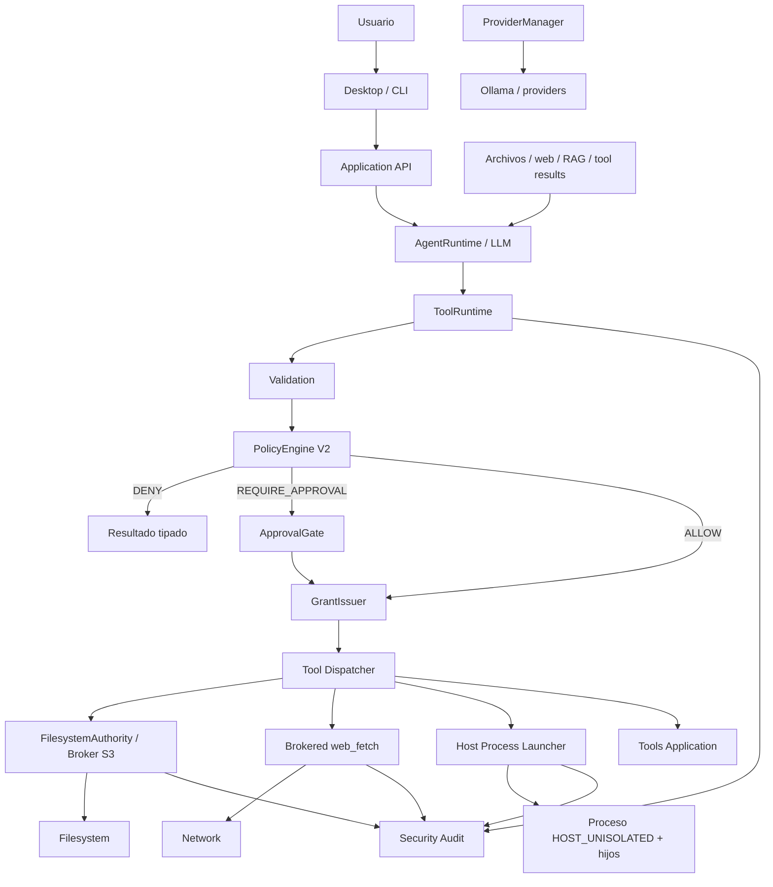

# Nova SECURITY — Arquitectura normativa V1.2

**Fecha:** 2026-10-03  
**Estado:** propuesta normativa para reiniciar ETAPA 2 — SECURITY desde el baseline limpio de Nova Core V1.  
**Base:** Nova Core V1 como código de partida. `NOVA_SECURITY_ARQUITECTURA_V1.md` y `NOVA_SECURITY_ARQUITECTURA_V1_1.md` se usan únicamente como fuentes de decisiones útiles; la implementación SECURITY anterior se considera **deprecated** y no se migra ni reutiliza automáticamente.  
**Plataforma prioritaria:** Windows, sin impedir implementaciones equivalentes posteriores en Linux/macOS.  
**Modelo de ejecución productivo:** `HOST_UNISOLATED`.  
**Principio rector:** Nova debe ser una herramienta local, ligera, cotidiana y de instalación simple. SECURITY reduce riesgos mediante mediación, permisos, policy, approvals, higiene de proceso, protección de secretos y auditoría, pero **no afirma aislamiento del sistema operativo**.

---

## 1. Lenguaje normativo y precedencia

| Término | Significado |
|---|---|
| **MUST / DEBE** | Requisito verificable de SECURITY V1.2. Omitirlo requiere una decisión arquitectónica explícita. |
| **MUST NOT / NO DEBE** | Prohibición verificable. |
| **SHOULD / DEBERÍA** | Recomendación fuerte; apartarse requiere justificación. |
| **MAY / PUEDE** | Opción compatible, nunca requisito implícito. |
| **OPEN DECISION** | Decisión pendiente que no puede resolverse silenciosamente durante implementación. |
| **ESTADO ACTUAL** | Comportamiento observado del baseline; no es promesa arquitectónica. |
| **ARQUITECTURA OBJETIVO** | Contrato que SECURITY V1.2 pretende implementar. |
| **MEDIATED / MEDIADO** | Efecto ejecutado por un componente de Nova que puede imponer el scope antes o durante la operación. |
| **HOST_UNISOLATED** | Proceso ejecutado con la autoridad normal de la cuenta del usuario, sin sandbox ni reducción general de autoridad OS. |
| **BEST_EFFORT** | Control operacional que puede reducir impacto o mejorar recuperación, pero no constituye contención preventiva. |

Prevalece **Nova Core V1** para identidad de sesión, lifecycle, AgentSession, Turn/Generation/Operation, Application API, eventos, ToolExecutionPort, ProviderManager, ContextManager, RAGService, compatibilidad CLI/Desktop, nombres/schemas públicos de tools y dirección de dependencias.

SECURITY V1.2 extiende Core V1. No crea un segundo AgentLoop, otra sesión principal, un runtime paralelo ni una arquitectura de seguridad que duplique el lifecycle del Core.

Cuando V1/V1.1 contradigan V1.2 respecto de sandbox, perfiles aislados, worker restringido, `SandboxPort`, `SandboxBroker`, Sandboxie, G-T/G-H, TCB, virtualización o certificación de aislamiento, **prevalece V1.2**.

---

## 2. Motivo de la revisión V1.2

Las revisiones anteriores intentaron que la ejecución agentic quedara físicamente confinada por debajo de la autoridad de la cuenta del usuario. Esa dirección introdujo un coste técnico y de producto desproporcionado para la meta de Nova:

- backends y dependencias externas de aislamiento;
- configuración específica de plataforma;
- drivers, servicios o virtualización;
- compatibilidad/versionado de backend;
- gates de certificación ajenos al valor principal del asistente;
- mantenimiento de una infraestructura de seguridad comparable en complejidad al propio agente;
- riesgo de convertir Nova en un integrador de sandbox en vez de una herramienta agentic local.

V1.2 adopta explícitamente otra frontera:

> **Nova controla estrictamente aquello que ella misma media; los procesos generales que Nova lanza se ejecutan con la autoridad normal del usuario y esa limitación se comunica de forma honesta.**

El objetivo deja de ser:

> “un comando arbitrario no puede superar físicamente un microgrant”.

El objetivo pasa a ser:

> “Nova reduce acciones accidentales o no autorizadas antes de ejecutarlas, media fuertemente las superficies que controla, minimiza secretos/canales heredados, supervisa la ejecución y deja trazabilidad suficiente de sus decisiones y efectos conocidos”.

Esta revisión no declara que el enfoque anterior fuera inútil. Conserva sus partes valiosas —Permission/Capability, grants, PolicyEngine, approvals, filesystem brokered, redacción, auditoría y lifecycle honesto— y elimina los requisitos que sólo existían para sostener un perfil aislado.

---

## 3. Principio de producto: instalación simple y cero dependencias externas de seguridad

### 3.1 Objetivo

Nova V1.2 SECURITY debe poder operar después de instalar Nova sin requerir que el usuario instale o administre una infraestructura externa de seguridad.

En particular, el funcionamiento normal de Nova **NO DEBE requerir**:

- Sandboxie;
- Docker o Podman;
- WSL como requisito de seguridad;
- Windows Sandbox;
- Hyper-V;
- una VM dedicada;
- un driver de terceros;
- un daemon de aislamiento;
- un servicio externo de policy;
- un runtime de contenedores;
- un producto de seguridad adicional.

Se permite usar primitivas ya disponibles en el sistema operativo o en la biblioteca/runtime que Nova distribuye para tareas como subprocess, pipes, process groups, Job Objects, señales, ACL/handles, hashing o almacenamiento local. Su uso **NO** transforma el modelo en “sandboxed”.

### 3.2 Alcance de “Zero Dependencies”

En este documento, **Zero Dependencies** significa:

> **cero dependencias externas obligatorias para proporcionar el modelo de seguridad y ejecución agentic base.**

No significa que el repositorio no pueda usar librerías normales de aplicación ni que un proyecto del usuario no pueda necesitar Python, Node, Git, compiladores o toolchains propios.

Esas herramientas son **capabilities del entorno del usuario**, no dependencias de SECURITY.

### 3.3 Consecuencia

Si una herramienta externa está instalada, Nova puede usarla mediante `bash`/shell conforme a policy y approvals. Si no está instalada, Nova informa `CAPABILITY_UNAVAILABLE`; SECURITY no instala un sandbox ni otra infraestructura para suplirla.

---

## 4. Objetivo central de seguridad

V1.2 separa cinco capas:

1. **Validation** — interpreta forma, tipos, argumentos y recursos declarados.
2. **Policy** — decide `ALLOW / REQUIRE_APPROVAL / DENY`.
3. **Approval** — obtiene consentimiento humano para el request exacto cuando corresponde.
4. **Logical Authority** — describe qué permiso/scope está autorizado para una operación de Nova.
5. **Execution / Mediation** — aplica el efecto:
   - mediante broker/adapter controlado por Nova cuando la superficie es mediable; o
   - mediante proceso host no aislado cuando la operación requiere ejecución general.

Regla fundamental:

> **Approval no equivale a autoridad física y un CapabilityGrant no reduce por sí mismo los permisos OS de un proceso `HOST_UNISOLATED`.**

Otra regla igualmente importante:

> **La ausencia de aislamiento no elimina el valor de Validation, Policy, Approval, grants, brokers y audit; sólo limita el claim que puede hacerse sobre procesos generales.**

---

## 5. Threat model V1.2

### 5.1 Dentro del modelo

SECURITY V1.2 busca reducir el riesgo de:

- errores del LLM;
- tool calls incorrectas;
- argumentos inesperados;
- prompt injection desde archivos, repositorios, RAG, web y resultados de tools;
- comandos destructivos o de alto impacto propuestos accidentalmente;
- rutas absolutas o traversal en tools de filesystem mediadas;
- symlink/junction/reparse/alias/TOCTOU en superficies FS soportadas;
- write accidental cuando sólo se concedió read;
- approvals stale, replay o asociadas al request equivocado;
- frontend defectuoso intentando resolver approvals o emitir autoridad;
- exposición accidental de secretos mediante environment heredado;
- exposición de stdin/canales de control;
- stdout/stderr sin límites razonables;
- procesos colgados;
- cancelación/timeout mal reportados;
- subagentes que soliciten mayor autoridad lógica que su padre;
- `web_fetch` con esquemas o redirecciones no previstas;
- logs/eventos con secretos;
- reintentos automáticos tras un efecto incierto;
- falta de trazabilidad sobre qué operación inició un efecto.

### 5.2 Fuera de la capacidad preventiva del modelo base

V1.2 **NO promete impedir físicamente** que un proceso general lanzado por Nova:

- lea archivos que la cuenta del usuario puede leer;
- modifique archivos que la cuenta del usuario puede modificar;
- acceda a red disponible para la cuenta;
- lance otros procesos permitidos por el sistema;
- use APIs del sistema accesibles al usuario;
- lea credenciales almacenadas en ubicaciones a las que el usuario tenga acceso;
- eluda una clasificación sintáctica de comandos;
- realice efectos no visibles para Nova.

También quedan fuera del modelo:

- administrador/root hostil;
- kernel comprometido;
- malware que ya controla la cuenta;
- un binario deliberadamente malicioso ejecutado por el usuario esperando contención OS;
- protección equivalente a contenedor/VM/sandbox;
- resistencia a exploits de kernel;
- aislamiento multiusuario hostil.

### 5.3 Consecuencia UX

Cuando el usuario habilita ejecución de comandos, debe poder comprender que:

> **un comando aprobado se ejecutará con sus permisos normales del sistema.**

La UX se especificará posteriormente, pero el backend debe exponer suficiente metadata para que la interfaz pueda comunicarlo sin ambigüedad.

---

## 6. Modelo de ejecución único: `HOST_UNISOLATED`

V1.2 elimina la arquitectura de perfiles múltiples.

No existen perfiles productivos `SANDBOXED_STANDARD`, `HARDENED_EXPERIMENTAL` ni equivalentes.

El antiguo `LEGACY_UNISOLATED` deja de ser un fallback o modo legado. Su semántica útil se convierte en el **único modelo productivo** y se renombra:

```text
HOST_UNISOLATED
```

### 6.1 Semántica

`HOST_UNISOLATED` significa:

- shell y procesos se ejecutan como la cuenta normal que ejecuta Nova;
- no se solicita elevación automática;
- no existe reducción general de token/ACL/red;
- no existe box, contenedor ni VM;
- no existe claim de process containment;
- Policy/Approval siguen vigentes;
- CapabilityGrant sigue vinculando el request que Nova está autorizada a iniciar;
- brokers de recursos pueden seguir imponiendo scopes cuando Nova controla la operación;
- lifecycle, cancelación, timeout y cleanup pueden ser `BEST_EFFORT`;
- el resultado y las limitaciones se auditan honestamente.

### 6.2 No hay fallback porque no hay segundo perfil

V1.2 no necesita reglas `Standard → Legacy`.

Existe un único camino productivo.

La seguridad depende de:

- no saltarse ToolRuntime;
- policy correcta;
- approvals exactas;
- grants exactos;
- brokers en surfaces mediadas;
- entorno/canales mínimos;
- resultados tipados;
- audit y provenance.

---

## 7. Clases de control por superficie

Para evitar repetir el error de confundir intención lógica con enforcement físico, cada capacidad declara una `ControlClass`.

| `ControlClass` | Significado |
|---|---|
| `APPLICATION_ENFORCED` | Nova controla completamente la operación dentro de Application y puede negar antes del efecto. |
| `BROKER_ENFORCED` | Nova media el recurso y puede imponer el scope dentro de la implementación soportada. |
| `HOST_UNISOLATED` | Nova puede controlar launch/request/approval, pero el proceso tiene autoridad normal de usuario después de iniciar. |
| `BEST_EFFORT` | Nova supervisa o reacciona, sin promesa preventiva. |

Ejemplos:

| Superficie | Clase principal |
|---|---|
| `todo_write` | `APPLICATION_ENFORCED` |
| `ask_user` | `APPLICATION_ENFORCED` |
| `read/write/edit/glob/grep` mediante S3 | `BROKER_ENFORCED` |
| `web_fetch` mediante cliente controlado por Nova | `BROKER_ENFORCED` para esquema/request/redirect/límites definidos |
| `bash` / PowerShell / cmd / scripts | `HOST_UNISOLATED` |
| procesos hijos del shell | `HOST_UNISOLATED` |
| cancelación de árbol | `BEST_EFFORT` salvo dimensión concretamente verificada |
| stdout/stderr truncado por capturador | `APPLICATION_ENFORCED` para el buffer que Nova conserva |
| provider/Ollama | servicio host separado, fuera de autoridad de tool salvo interfaces explícitas |

Un claim de una fila **NO se propaga** a otra.

---

## 8. Cobertura por superficie

| Superficie | Control V1.2 | Claim permitido |
|---|---|---|
| `bash` | Policy + Approval + Grant + launcher host + lifecycle | Nova controla qué request inicia; el proceso conserva autoridad del usuario. |
| Hijos de `bash` | supervisión de lifecycle cuando sea observable | No se afirma contención. |
| `read` | broker S3 | Scope FS soportado puede ser impuesto por broker. |
| `write` | broker S3 | Write sólo dentro del scope concedido por la tool mediada. |
| `edit` | broker S3 | Read/write diferenciados y binding de recurso según contrato S3. |
| `glob/grep` | broker S3 | Enumeración/lectura sólo en scopes del broker. |
| `web_fetch` | cliente HTTP controlado por Nova | Scheme/redirect/destino/límites del cliente; no firewall del shell. |
| `todo_write` | Application | Estado de sesión únicamente. |
| `ask_user` | Application | Respuesta conversacional; no approval. |
| `agent` | Application + grants atenuados | Autoridad lógica del hijo no supera a la del padre; shell hijo sigue host-unisolated. |
| Provider/Ollama | servicio host | Credenciales y red del provider no se conceden por defecto a tools. |
| Git vía shell | host-unisolated | Policy/Approval pueden controlar launch; Git conserva autoridad del usuario. |
| Git mediante servicio dedicado futuro | según adapter | Puede tener controles propios sin cambiar el modelo shell. |

---

## 9. Arquitectura lógica



Principios:

- AgentRuntime depende sólo de contratos Core.
- ToolRuntime sigue siendo la ruta agentic común.
- Application coordina validation, policy, approval, grants y lifecycle.
- Infrastructure implementa brokers/adapters/launcher concretos.
- El launcher de procesos **no se llama sandbox**.
- ProviderManager conserva credenciales/red de inferencia como servicio host.
- S3 protege únicamente las tools FS mediadas.
- La ejecución shell no se presenta como equivalente al broker FS.
- Desktop y CLI consumen la misma Application API.

---

## 10. Dirección de dependencias

| Capa | Responsabilidad SECURITY V1.2 | Prohibición |
|---|---|---|
| **Core** | Tipos/puertos de Permission, ResourceScope, Capability, CapabilityGrant, outcomes y metadata de control. | Importar PolicyEngine concreto, Electron, filesystem broker concreto, launcher OS o infraestructura. |
| **Application** | PolicyEngine V2, ApprovalGate, GrantIssuer, autoridad lógica, ToolRuntime, lifecycle, audit lógico. | Construir reglas OS concretas dentro de AgentRuntime; duplicar seguridad por interfaz. |
| **Infrastructure** | WindowsFilesystemBroker, HTTP fetch adapter, process launcher, env builder, persistence/audit adapters. | Crear grants desde argumentos no confiables; decidir autoridad de sesión. |
| **Interfaces** | Presentar approvals, warnings y resultados; enviar comandos al backend. | Emitir grants, ampliar ceiling, resolver policy localmente. |
| **Composition Root** | Inyectar implementaciones. | Introducir una segunda ruta agentic que evite ToolRuntime. |

---

## 11. Permission, ResourceScope, Capability y AuthorityCeiling

### 11.1 `Permission`

Taxonomía extensible de verbos, por ejemplo:

- `filesystem.read`
- `filesystem.write`
- `process.execute`
- `process.spawn`
- `network.fetch`
- `network.connect.intent`
- `git.read`
- `git.write`
- `environment.read`
- `environment.pass`
- `application.state.write`

### 11.2 `ResourceScope`

Representa el recurso o dominio al que se refiere el permiso.

Ejemplos:

- root de workspace;
- archivo concreto;
- URL/host para `web_fetch`;
- command/cwd para `process.execute`;
- variable de entorno concreta;
- repo Git identificado;
- estado de sesión.

### 11.3 `Capability`

```text
Permission + ResourceScope + restricciones + ControlClass
```

La `ControlClass` es parte importante del significado.

Un scope declarado para un proceso `HOST_UNISOLATED` describe la **intención autorizada por Nova**, no la totalidad de recursos que Windows permitirá al proceso.

### 11.4 `AuthorityCeiling`

`AuthorityCeiling` se conserva como **techo lógico de autoridad que Nova puede delegar**.

Reglas:

- procede del host/configuración confiable;
- LLM, prompt, PolicyEngine y frontend no lo amplían;
- es versionado;
- se intersecta con parent authority;
- sirve para herramientas mediadas y para limitar qué requests Nova puede iniciar.

Limitación normativa:

> `AuthorityCeiling` **NO es un límite físico de la cuenta de usuario para procesos HOST_UNISOLATED**.

Esto debe aparecer en documentación, tests y nombres de variables/comentarios cuando exista riesgo de confusión.

### 11.5 `CapabilityGrant`

Se conserva como delegación interna:

- inmutable;
- exacta por operación;
- ligada a session/turn/operation/toolCall;
- ligada a requestDigest;
- sujeta a ceiling;
- con issuer confiable;
- lifetime;
- parentGrantId si deriva;
- revocación;
- one-shot cuando corresponda;
- `ControlClass`.

Un grant **NO** se serializa como bearer token al LLM o renderer.

---

## 12. Vinculación exacta y `requestDigest`

El `requestDigest` debe incorporar, según aplique:

- tool;
- argumentos canónicos;
- ejecutable/acción;
- cwd/workspace;
- resource intent;
- sessionId;
- turnId;
- operationId;
- toolCallId;
- policyRevision;
- ceilingRevision;
- parent authority;
- environment intent;
- network intent;
- effect classification;
- lifetime.

Cambiar cualquiera de los campos relevantes invalida approval/grant previos.

Un approval concedido para:

```text
cwd=A, command=X
```

no autoriza:

```text
cwd=B, command=X
```

ni:

```text
cwd=A, command=Y
```

---

## 13. PolicyEngine V2

PolicyEngine V2 conserva:

```text
ALLOW
REQUIRE_APPROVAL
DENY
```

Policy decide si Nova puede **intentar** una acción. No reduce permisos OS.

### 13.1 Inputs mínimos

- ToolInvocation normalizada;
- IDs de contexto;
- tool;
- args canónicos;
- effect intent;
- resource intent;
- cwd;
- parent authority;
- capability availability;
- policyRevision;
- origen principal/subagente;
- clasificación de riesgo.

### 13.2 Reglas de shell

`ShellPolicy` puede seguir siendo una defensa sintáctica y de UX.

Debe entenderse como:

- clasificador de riesgo;
- mecanismo para approvals;
- detector de patrones evidentemente destructivos;
- ayuda para explicación al usuario.

**NO** se presenta como sandbox, parser completo de PowerShell o prueba de efecto real.

Cuando la intención o el efecto sea ambiguo y el comando tenga capacidad significativa, Policy **SHOULD** preferir `REQUIRE_APPROVAL` antes que asumir benignidad.

### 13.3 Ejemplos de mayor riesgo

Sin fijar aquí una lista exhaustiva:

- delete recursivo;
- overwrite amplio;
- cambios de permisos;
- instalación/desinstalación;
- package publish;
- push/force push;
- reset destructivo;
- ejecución descargada;
- cambios en configuración del sistema;
- comandos con elevación;
- ejecución fuera del workspace declarado;
- acceso a credenciales;
- comandos de red con posible exfiltración;
- scripts codificados/ofuscados cuando el efecto no sea claro.

La policy puede evolucionar sin cambiar schemas públicos.

---

## 14. ApprovalGate

ApprovalGate se conserva.

Una approval requerida debe ser:

- exacta;
- one-shot;
- ligada al requestDigest;
- ligada a IDs Core;
- ligada a cwd;
- ligada a policyRevision;
- con deadline;
- cancelable;
- resistente a stale/replay.

### 14.1 Desktop

Electron main/host debe correlacionar la solicitud y entregar la decisión a Application.

El renderer puede mostrar contexto, pero **NO** emite grants.

### 14.2 CLI

Una approval interactiva requiere TTY humana verificable.

En modo headless/no interactivo, una operación que requiera approval debe denegarse o devolver un error tipado, salvo que exista en el futuro un mecanismo explícito y equivalente.

### 14.3 `--yes`

`--yes`:

- no amplía AuthorityCeiling;
- no convierte `DENY` en `ALLOW`;
- no autoriza automáticamente acciones que requieran confirmación humana por contrato;
- no cambia `ControlClass`;
- no convierte host-unisolated en una operación mediada.

---

## 15. ToolRuntime como ruta única

Toda tool propuesta por el modelo pasa por:

```text
ToolInvocation
→ Validation
→ PolicyEngine
→ ApprovalGate cuando aplique
→ GrantIssuer
→ Dispatcher/adapter
→ Result/Audit
```

No debe existir una segunda ruta como:

```text
AgentRuntime
→ subprocess directo
```

o:

```text
renderer
→ filesystem/process
```

para tool calls agentic.

Servicios administrativos no originados por el modelo —updater, gestión de modelos, etc.— pueden tener rutas propias, pero deben declararse como servicios host y no reutilizarse como bypass de tools.

---

## 16. S3 — Filesystem mediado

S3 se conserva como una de las protecciones más valiosas de las arquitecturas anteriores.

Ruta conceptual:

```text
ToolInvocation
→ ToolRuntime
→ BrokeredFilesystemTool
→ FilesystemAuthority
→ GrantIssuer
→ WindowsFilesystemBroker
→ handle/root/object
```

### 16.1 Tools cubiertas

- `read`
- `write`
- `edit`
- `glob`
- `grep`

### 16.2 Reglas

- `filesystem.read` y `filesystem.write` son diferentes;
- workspace no equivale a write universal;
- raíces externas requieren autorización/grant explícito por operación;
- rutas absolutas no reciben autoridad implícita;
- `..`, case aliases, symlink, junction y reparse se tratan como vectores reales;
- UNC/ADS/superficies especiales son DENY/UNSUPPORTED hasta soporte explícito;
- temporales para write atómico permanecen dentro del scope o son mediados;
- worktree no amplía autoridad;
- el broker debe vincular la decisión al objeto real cuando la plataforma lo permita;
- no existe fallback de estas cinco tools a una implementación filesystem directa que ignore el grant.

### 16.3 Límite del claim

El siguiente comando:

```text
bash → powershell.exe → Get-Content C:\otro\archivo
```

**NO pasa por S3** por el mero hecho de que exista S3.

Por tanto:

> S3 garantiza las tools FS mediadas; no garantiza filesystem confinement del shell.

Este límite debe ser explícito en tests, audit y UX.

---

## 17. S4 — Host Process Execution Safety

S4 deja de ser “Process isolation/containment”.

Su nuevo nombre normativo es:

> **S4 — Host Process Execution Safety**

### 17.1 Objetivo

Hacer la ejecución no aislada:

- predecible;
- controlada antes del launch;
- mínima en canales heredados;
- cancelable;
- acotada en output;
- observable;
- honesta respecto de sus límites.

### 17.2 Launcher

La tool pública `bash` conserva su nombre/schemas Core.

El host selecciona shell de plataforma:

- Windows: PowerShell/pwsh según disponibilidad y configuración;
- Linux: bash/sh;
- macOS: zsh/bash/sh.

Git Bash puede ser opcional, nunca requisito.

### 17.3 Reglas obligatorias

El launcher DEBE:

- recibir command y cwd ya autorizados;
- usar cwd explícito;
- no cambiar command después del approval/grant;
- no solicitar elevación automáticamente;
- no usar `runas`, UAC elevation o equivalentes como fallback;
- controlar explícitamente stdin;
- capturar stdout/stderr;
- aplicar límites de captura;
- respetar deadline/cancellation;
- emitir PID/exit/outcome disponibles;
- limpiar handles/pipes propios;
- no reintentar automáticamente un comando con efecto incierto;
- auditar launch y terminal.

### 17.4 Stdin y control

Por defecto:

```text
stdin = DEVNULL / closed
```

salvo que la operación requiera un canal deliberadamente diseñado.

El child no debe heredar:

- stdin JSONL del backend;
- canales internos de control;
- approval credentials;
- handles reutilizables de grants;
- handles innecesarios del host.

### 17.5 Environment

S4 aplica la higiene mínima; S6 completa el modelo.

El launcher no debe pasar automáticamente credenciales internas de Nova/provider.

### 17.6 Cancelación y árbol

Nova puede usar primitivas nativas como:

- process groups;
- señales;
- Job Objects en Windows;
- APIs equivalentes de plataforma;

para mejorar lifecycle.

Pero:

> Job Object/process group usado para lifecycle **NO se presenta como sandbox ni como reducción de autoridad FS/red**.

Estados mínimos:

- launch_not_started;
- running;
- cancel_requested;
- timeout_requested;
- root_exited;
- cleanup_attempted;
- cleanup_confirmed cuando realmente se conoce;
- cleanup_unknown;
- outcome_unknown.

### 17.7 Output

Debe existir límite de bytes retenidos/publicados para stdout/stderr.

Si se trunca:

- se marca `truncated=true`;
- se conserva exit/outcome;
- no se almacena ilimitadamente antes de truncar.

### 17.8 Autoridad real

Después de iniciar:

```text
PowerShell / Python / Node / Git / otro binario
```

pueden hacer aquello que la cuenta del usuario permita.

Policy/grant controlan **qué launch autoriza Nova**, no todas las acciones internas del proceso.

---

## 18. Binarios arbitrarios y toolchains

Nova no necesita una allowlist cerrada de lenguajes.

Puede ejecutar, si están instalados y Policy lo permite:

- PowerShell;
- cmd;
- Python;
- Node;
- Git;
- package managers;
- compiladores;
- scripts;
- CLIs de terceros;
- otros ejecutables accesibles al usuario.

Esto es coherente con el objetivo de herramienta cotidiana.

### 18.1 Resolución

Cuando sea viable, Nova debe registrar:

- command solicitado;
- executable resuelto;
- cwd;
- args;
- PATH/config relevante;
- PID.

No se afirma que verificar la ruta del executable lo vuelva confiable.

### 18.2 Elevación

La ejecución automática elevada queda fuera del modelo base.

Si una funcionalidad futura necesita admin/root:

- requiere feature/flujo explícito;
- no puede nacer de un fallback;
- debe advertirse separadamente;
- no se considera equivalente a `HOST_UNISOLATED` normal.

---

## 19. S5 — Network Safety para superficies mediadas

S5 se redefine.

Ya no intenta imponer un firewall a procesos shell.

### 19.1 `web_fetch`

`web_fetch` se ejecuta mediante un cliente controlado por Nova.

Debe:

- soportar sólo schemes explícitos;
- V1.2 SHOULD limitarlo a `http`/`https`;
- `file://` se deniega y el usuario/modelo debe usar `read`;
- validar redirects;
- aplicar límites de tamaño/tiempo;
- registrar destino solicitado y efectivo;
- tratar loopback/private network conforme a policy;
- evitar que una URL aprobada se convierta silenciosamente en otro destino de mayor riesgo;
- producir error tipado.

### 19.2 Provider network

Ollama/provider sigue siendo servicio host separado.

La conectividad del provider no constituye autorización para tools.

### 19.3 Shell network

Un proceso `HOST_UNISOLATED` puede utilizar la red disponible para el usuario.

Nova puede:

- detectar intención de red en comandos comunes;
- requerir approval;
- auditar command/cwd/outcome;
- advertir sobre exfiltración o publicación.

Nova **NO afirma** que puede limitar físicamente sockets/destinos del shell.

### 19.4 Git

Git invocado por shell comparte esta limitación.

`git push`, remotes, hooks y credential helpers requieren policy proporcional al efecto, pero no se anuncian como network-brokered si se ejecutan en shell.

---

## 20. S6 — Environment y secretos

S6 sigue siendo una fase importante aun sin sandbox.

### 20.1 Principio

El hecho de que el child pueda acceder a recursos del usuario no justifica entregarle deliberadamente todos los secretos del proceso Nova.

El environment del child debe construirse explícitamente.

### 20.2 Baseline recomendado

Mantener un conjunto mínimo necesario para compatibilidad, por ejemplo:

- variables esenciales del sistema;
- PATH controlado/esperado;
- TEMP/TMP cuando sea necesario;
- variables de locale/terminal necesarias;
- variables explícitamente concedidas por la operación.

No deben heredarse por defecto:

- API keys de providers;
- tokens internos;
- approval credentials;
- secretos de plugins/conectores;
- variables sensibles propias de Nova;
- material reutilizable de grants.

### 20.3 Variables del proyecto

Algunos proyectos requieren variables propias.

V1.2 permite un mecanismo explícito de `environment.pass` por nombre/valor o por conjunto aprobado, con riesgo comunicado cuando sea sensible.

### 20.4 Redacción

Antes de publicar o persistir:

- ToolResult;
- EventEnvelope;
- stdout/stderr;
- SessionLogger;
- Security Audit;
- exception traces;
- snapshots/transcript cuando aplique;

deben pasar por redacción adecuada.

No se promete detectar todo secreto arbitrario del disco del usuario.

El claim es:

> Nova no debe **inyectar o persistir deliberadamente** secretos host que conoce como sensibles sin autorización.

---

## 21. Subagentes

Se conserva:

```text
logicalAuthority(child) ⊆ logicalAuthority(parent)
```

Cada subagente recibe:

- agentId;
- parent IDs;
- ExecutionContext;
- cancellation token;
- deadline;
- ceiling/grant lógico atenuado;
- provider snapshot según Core.

Un child:

- no amplía scopes de tools mediadas;
- no reutiliza approvals del padre;
- no reactiva grants vencidos;
- pasa por el mismo ToolRuntime/Policy/Approval;
- se cancela/revoca con el padre según lifecycle.

Limitación:

> si el child lanza shell, ese proceso sigue siendo `HOST_UNISOLATED`; la relación `child ⊆ parent` no se presenta como confinement físico del proceso.

La atenuación sigue siendo valiosa para las operaciones que Nova media y para decidir qué launches Nova autoriza.

---

## 22. Desktop, CLI, JSONL e IPC

Regla:

> **Frontend presenta; Application decide.**

React/Electron renderer y CLI no son authority roots.

### 22.1 Desktop

Main/preload debe:

- exponer IPC estrecho;
- validar sender/origin cuando corresponda;
- validar argumentos;
- imponer tamaños razonables;
- correlacionar approvals;
- evitar transportar grants reutilizables.

### 22.2 CLI

CLI consume la misma Application API.

No existe una “versión menos segura” del backend sólo por ser CLI.

### 22.3 JSONL

El transporte JSONL puede conservar compatibilidad externa, pero:

- no transporta secretos internos innecesarios;
- no transporta bearer grants;
- no permite que un frame resuelva una approval sin actor válido;
- no permite ejecutar tool por fuera de ToolRuntime.

---

## 23. Lifecycle, cancelación y outcomes

Core V1 mantiene el lifecycle.

Solicitar stop no equivale a demostrar que todos los efectos terminaron.

### 23.1 Outcomes

| Outcome | Semántica |
|---|---|
| `denied` | Policy/approval/grant rechazó antes del launch/efecto mediado. |
| `unavailable` | Capability/tool/executable requerido no disponible. |
| `cancelled` | Operación terminó bajo cancelación y su estado conocido permite esa clasificación. |
| `timeout` | Deadline vencido; incluye estado disponible de terminación. |
| `failed` | Fallo conocido. |
| `outcome_unknown` | No puede determinarse con suficiente confianza qué efecto quedó aplicado o si un proceso persiste. |

### 23.2 No retry automático

Una operación con side effects y `outcome_unknown` **NO DEBE** reintentarse automáticamente.

### 23.3 Terminal único

Security Audit puede emitir múltiples registros internos, pero no crea un segundo terminal Core.

---

## 24. Security Audit y provenance

Security Audit es distinto de EventJournal, transcript y SessionLogger.

### 24.1 Datos mínimos por operación

Según superficie:

- sessionId;
- turnId;
- operationId;
- toolCallId;
- agentId/parentAgentId;
- actor/origin;
- tool;
- requestDigest;
- policyRevision;
- decision;
- approvalId/status;
- grantId resumido;
- permission/scope resumido;
- ControlClass;
- cwd;
- command/executable cuando corresponda;
- PID;
- recurso mediado;
- inicio/fin;
- exit code;
- cancel/timeout;
- truncated flags;
- outcome;
- effectState;
- errores tipados.

### 24.2 Provenance de filesystem

Para `write/edit` mediado, cuando sea razonable:

- path lógico;
- identidad del recurso si existe;
- operation = create/modify/delete/move;
- before hash cuando aplique;
- after hash;
- outcome.

No se exige guardar contenido bruto.

### 24.3 Shell

Para shell puede atribuirse con certeza:

- que Nova lanzó un command;
- quién lo aprobó;
- bajo qué operation;
- cwd;
- executable;
- PID/exit/output conocido.

No se afirma que Nova pueda identificar perfectamente **cada** cambio de archivo realizado internamente por ese proceso.

Puede existir provenance best-effort adicional, pero debe etiquetarse como tal.

### 24.4 Privacidad

Audit no guarda secretos sólo “por si acaso”.

Retención, rotación y durabilidad exactas se deciden en S7.

---

## 25. Errores conceptuales

V1.2 debe extender la taxonomía Core existente, no crear un sistema paralelo.

Códigos conceptuales:

- `PERMISSION_DENIED`
- `POLICY_DENIED`
- `APPROVAL_REQUIRED`
- `APPROVAL_EXPIRED`
- `APPROVAL_STALE`
- `RESOURCE_SCOPE_VIOLATION`
- `CAPABILITY_UNAVAILABLE`
- `EXECUTABLE_NOT_FOUND`
- `PROCESS_LAUNCH_FAILED`
- `PROCESS_TIMEOUT`
- `PROCESS_CANCELLED`
- `PROCESS_CLEANUP_UNKNOWN`
- `OUTCOME_UNKNOWN`
- `ENVIRONMENT_VARIABLE_NOT_GRANTED`
- `NETWORK_REQUEST_DENIED`
- `NETWORK_DESTINATION_BLOCKED`
- `SECURITY_POLICY_CONFLICT`

Se eliminan del objetivo V1.2 errores específicos de backend sandbox.

---

## 26. Compatibilidad con Core V1

| Superficie | Core | SECURITY V1.2 |
|---|---|---|
| `bash` | nombre/schema público estable | Policy/Approval/Grant + launcher HOST_UNISOLATED. |
| `read/write/edit` | paths/schemas existentes | Broker S3 con scopes read/write. |
| `glob/grep` | paths/patrones | Enumeración brokered. |
| `web_fetch` | URL | HTTP(S) mediado; `file://` se deriva a FS y puede denegarse. |
| `todo_write` | estado auxiliar | Application-enforced. |
| `ask_user` | input humano | Respuesta conversacional, no approval. |
| `agent` | subagente | Grants lógicos atenuados; shell hijo sigue host-unisolated. |
| Git | opcional | Shell host o servicio dedicado; policy proporcional. |
| RAG | no fatal | Texto recuperado no confiable; SECURITY no rediseña RAG. |
| Ollama/providers | ProviderManager | Host service; secrets no heredados a tools por defecto. |
| CLI/Desktop | misma API | mismo backend de seguridad. |
| Cancellation | lifecycle Core | cancel/timeout honesto, cleanup best-effort. |
| Persistencia | transcript/eventos | Security Audit separado. |

---

## 27. Invariantes SECURITY V1.2

| ID | Invariante |
|---|---|
| **SEC12-INV-001** | Toda tool agentic pasa por ToolRuntime. |
| **SEC12-INV-002** | LLM, prompt y frontend no emiten grants ni amplían AuthorityCeiling. |
| **SEC12-INV-003** | `CapabilityGrant ⊆ AuthorityCeiling` lógicamente. |
| **SEC12-INV-004** | Grants son internos, inmutables y ligados a request/operation/revisiones. |
| **SEC12-INV-005** | Approval no equivale a autoridad OS. |
| **SEC12-INV-006** | `HOST_UNISOLATED` se comunica como ejecución con permisos normales del usuario. |
| **SEC12-INV-007** | Ningún componente llama sandbox a ShellPolicy, worktree, Job Object, process group o path validation. |
| **SEC12-INV-008** | `read/write/edit/glob/grep` brokered no degradan silenciosamente a filesystem directo. |
| **SEC12-INV-009** | El claim S3 no se extiende al shell. |
| **SEC12-INV-010** | `filesystem.read` no implica `filesystem.write`. |
| **SEC12-INV-011** | Child logical authority no excede parent logical authority. |
| **SEC12-INV-012** | Child shell no se presenta como físicamente confinado por parent grant. |
| **SEC12-INV-013** | El launcher no eleva privilegios automáticamente. |
| **SEC12-INV-014** | Stdin/control/handles internos no se heredan deliberadamente. |
| **SEC12-INV-015** | Provider secrets no se heredan al shell por defecto. |
| **SEC12-INV-016** | `web_fetch` mediado no se usa para leer `file://` fuera del modelo FS. |
| **SEC12-INV-017** | Shell network se declara host authority, no network-brokered. |
| **SEC12-INV-018** | Cancel requested no equivale a termination confirmed. |
| **SEC12-INV-019** | Efecto incierto produce `outcome_unknown` y no retry automático. |
| **SEC12-INV-020** | Security Audit no contiene bearer grants ni secretos deliberadamente. |
| **SEC12-INV-021** | Renderer no resuelve autoridad por estado local. |
| **SEC12-INV-022** | Cada Operation conserva un único terminal Core. |
| **SEC12-INV-023** | Nova SECURITY base no requiere software externo de sandbox/contenedor/VM. |
| **SEC12-INV-024** | AgentRuntime no importa Application/Infrastructure concretos. |
| **SEC12-INV-025** | Una tool denegada devuelve error tipado; no simula éxito vacío. |
| **SEC12-INV-026** | Un scope lógico de proceso no se documenta como límite OS. |
| **SEC12-INV-027** | La ausencia de aislamiento no autoriza a saltarse Policy/Approval. |
| **SEC12-INV-028** | Los controles nativos de lifecycle se etiquetan por su función real, no como isolation. |

---

## 28. Reimplementación desde Core limpio

La implementación SECURITY V1.2 comienza desde el repositorio/carpeta basada únicamente en Nova Core V1.

### 28.1 No migrar código deprecated

El branch/carpeta SECURITY anterior puede conservarse históricamente, pero la nueva implementación:

- no copia módulos por inercia;
- no mantiene adapters Sandboxie;
- no mantiene contracts de worker/sandbox;
- no mantiene flags/profile baggage de V1.1;
- no conserva tests cuyo único propósito sea probar aislamiento;
- no introduce compatibilidad con manifests/receipts de Sandboxie.

### 28.2 Sí reusar ideas

Deben reimplementarse, limpiamente:

- Permission;
- ResourceScope;
- Capability;
- AuthorityCeiling lógico;
- CapabilityGrant;
- GrantIssuer;
- parent/child attenuation;
- requestDigest;
- PolicyEngine V2;
- Approval binding;
- filesystem broker S3;
- environment hygiene;
- audit/provenance;
- outcome_unknown;
- tests adversariales que sigan siendo relevantes.

### 28.3 Regla

> Reusar **decisiones**, no copiar **deuda**.

---

## 29. Fases normativas S0–S8

### Regla común

Cada fase:

1. caracteriza baseline;
2. implementa sólo su alcance;
3. mantiene Nova ejecutable;
4. conserva Core V1;
5. añade tests unit/contract/integration/host-real cuando sean pertinentes;
6. no implementa la fase siguiente;
7. no transforma una limitación conocida en un claim más fuerte.

---

### S0 — Baseline y threat model ejecutable

**Objetivo:** caracterizar el Core limpio y fijar exactamente qué superficies existen antes de introducir SECURITY.

Entregables:

- matrix de tools/efectos;
- baseline de ShellPolicy/ApprovalGate existente;
- tests temporales/no destructivos;
- inventario de env heredado;
- comportamiento stdin;
- comportamiento de paths externos;
- `web_fetch` schemes;
- child process/cancel básico;
- Desktop/CLI/IPC relevantes;
- threat model V1.2;
- documento de límites `HOST_UNISOLATED`.

MUST:

- diferenciar observación de inferencia;
- registrar qué tools tienen efecto host;
- demostrar baseline sin modificar datos personales;
- conservar hashes/fixtures sólo cuando aporten reproducibilidad.

MUST NOT:

- implementar grants/policy nueva;
- introducir sandbox;
- llamar “vulnerabilidad” a toda capacidad normal del usuario sin contexto;
- convertir tests de caracterización en claims de protección.

**Gate S0:** baseline reproducible, threat model aprobado y lista de surfaces completa para iniciar S1.

---

### S1 — Permission / Capability / Grant

**Objetivo:** construir el modelo lógico de autoridad.

Entregables:

- `Permission`;
- `ResourceScope`;
- `ControlClass`;
- `Capability`;
- `AuthorityCeiling`;
- `CapabilityGrant`;
- `GrantSubject`;
- `GrantLifetime`;
- `GrantIssuer`;
- parent/child attenuation;
- claim/revoke/expiry;
- `requestDigest` versionado;
- errores tipados.

Tests:

- grant ⊆ ceiling;
- child ⊆ parent;
- stale/revision mismatch;
- one-shot;
- revoke/cancel;
- digest mismatch;
- renderer/model no puede emitir grant;
- `HOST_UNISOLATED` no se confunde con broker enforcement.

MUST NOT:

- añadir `SandboxPort`;
- introducir requiredGuarantees de aislamiento;
- afirmar enforcement físico del shell.

**Gate S1:** contratos estables, algebra de grants y bindings pasan unit/contract tests sin cambiar schemas públicos.

---

### S2 — PolicyEngine V2 + approvals

**Objetivo:** decidir de forma estructurada qué acciones puede iniciar Nova y cuándo debe preguntar.

Entregables:

- PolicyEngine V2;
- effect/resource intent;
- reglas por tool;
- integración ToolRuntime;
- ApprovalGate exacto;
- host-confirmation Desktop;
- TTY CLI;
- vínculo approval → grant;
- policyRevision;
- ShellPolicy conservado como heurística adicional.

Tests:

- `ALLOW / REQUIRE_APPROVAL / DENY`;
- destructive shell;
- unknown/high-risk shell;
- FS read/write;
- web_fetch;
- stale approval;
- cancel/deadline;
- digest/cwd mismatch;
- spoof renderer;
- headless CLI;
- `--yes`;
- subagente.

**Gate S2:** ninguna tool agentic evita ToolRuntime/Policy; approval requerida es exacta/one-shot y no crea autoridad adicional.

---

### S3 — Brokered Filesystem

**Objetivo:** proteger fuertemente las tools FS que Nova puede mediar.

Entregables:

- `FilesystemAuthority`;
- `WindowsFilesystemBroker`;
- root/handle/object binding;
- adapters `read/write/edit/glob/grep`;
- scopes read/write;
- temporales/write atómico;
- errores de scope.

Tests host-real no destructivos:

- absoluto externo;
- `..`;
- case/alias;
- symlink;
- junction/reparse;
- UNC;
- ADS;
- rename/replace;
- TOCTOU cuando pueda probarse de forma determinista;
- read ≠ write;
- raíz externa one-shot;
- no fallback.

**Gate S3:** las cinco tools soportadas respetan el scope brokered y el reporte declara explícitamente que shell puede bypassar esta superficie mediante autoridad normal del usuario.

---

### S4 — Host Process Execution Safety

**Objetivo:** productizar shell/procesos host sin claim de aislamiento.

Entregables:

- launcher productivo;
- command/cwd binding;
- no auto-elevation;
- stdin cerrado por defecto;
- handles/canales explícitos;
- env mínimo inicial;
- stdout/stderr bounded;
- PID/exit;
- timeout;
- cancel;
- tree cleanup best-effort;
- outcome_unknown;
- audit mínimo;
- smoke PowerShell/Python/Node/Git cuando existan.

Tests host-real:

- comando benigno;
- cwd exacto;
- command mutation after approval bloqueada;
- stdin dummy no heredado;
- output grande truncado;
- timeout;
- cancel;
- child process;
- missing executable;
- exit code;
- no retry;
- no auto elevation;
- env secret dummy no heredado si ya está integrado el mínimo S4;
- single terminal.

MUST NOT:

- probar G-T/G-H;
- investigar TCB;
- certificar process containment;
- exigir Sandboxie/Docker/VM;
- llamar sandbox a Job Objects/process groups.

**Gate S4:** launcher host estable, lifecycle honesto y límites documentados. `HOST_UNISOLATED` queda listo como único modelo de process execution.

---

### S5 — Network Safety

**Objetivo:** mediar correctamente las superficies de red controladas por Nova y clasificar el shell como host authority.

Entregables:

- `web_fetch` HTTP(S) controlado;
- scheme policy;
- redirect policy;
- size/time limits;
- destino efectivo/audit;
- loopback/private-network policy;
- `file://` DENY;
- network intent para shell/policy;
- provider network separado.

Tests:

- http/https;
- redirect;
- redirect a destino bloqueado;
- loopback/private fixture;
- IPv4/IPv6 cuando corresponda;
- timeout;
- payload grande;
- file/data schemes;
- provider/Ollama sigue operativo;
- shell network documentado como no mediado.

**Gate S5:** `web_fetch` cumple su contrato brokered y ningún documento afirma firewall para shell.

---

### S6 — Environment / Secrets

**Objetivo:** evitar exposición deliberada de secretos desde Nova hacia tools.

Entregables:

- EnvironmentBuilder;
- baseline env permitido;
- variables explícitas;
- provider secrets aislados;
- redaction pipeline;
- policy `environment.pass/read`;
- integración shell/subagent.

Tests:

- dummy API key;
- nombre de variable sensible conocida;
- variable sensible no usada por tool;
- PATH;
- HOME/USERPROFILE según política;
- TEMP/TMP;
- proxy;
- SSH/Git vars;
- NODE_OPTIONS/PYTHONPATH;
- logs;
- exception traces;
- transcript/eventos;
- provider smoke.

**Gate S6:** secretos gestionados por Nova no se heredan ni persisten por defecto; cualquier pass explícito queda vinculado a operación.

---

### S7 — Security Audit / Provenance

**Objetivo:** responder qué decidió Nova, qué inició y qué efecto mediado conoce.

Entregables:

- SecurityAuditPort;
- persistence adapter;
- schema versionado;
- actor/origin;
- policy/approval/grant correlation;
- process launch records;
- FS provenance;
- network fetch provenance;
- outcome/effectState;
- redaction;
- retention policy;
- crash behavior.

Tests:

- deny;
- approval;
- FS write;
- shell launch;
- timeout/cancel;
- outcome_unknown;
- subagent;
- redaction;
- crash/reopen según retención;
- no bearer grants.

**Gate S7:** una operación fixture puede reconstruirse razonablemente sin secretos y sin inventar efectos internos del shell que Nova no observó.

---

### S8 — Adversarial / E2E Security Gate

**Objetivo:** validar el producto completo bajo el modelo V1.2.

Cobertura:

- prompt injection;
- args inesperados;
- approval spoof/stale;
- grants;
- subagentes;
- FS alias/reparse;
- shell destructivo con approval;
- stdin;
- large output;
- timeout/cancel;
- web_fetch redirects/private/file scheme;
- env/secrets;
- audit;
- CLI/Desktop;
- Ollama local;
- Git/RAG opcionales;
- regresión Core.

**Gate S8:** todos los invariantes V1.2 anunciados pasan en la plataforma soportada y las limitaciones de `HOST_UNISOLATED` están publicadas.

---

## 30. Gate normativo `NOVA_SECURITY_V1_2_READY`

Se define:

```text
NOVA_SECURITY_V1_2_READY
```

Puede declararse cuando:

1. S0–S8 requeridos están cerrados.
2. Toda tool agentic pasa por ToolRuntime.
3. Permission/Capability/Grant bindings están implementados.
4. approvals son exactas/one-shot.
5. renderer no emite autoridad.
6. S3 brokered FS pasa pruebas host-real para las superficies anunciadas.
7. S4 `HOST_UNISOLATED` cumple lifecycle/canales/output/audit sin claims de aislamiento.
8. S5 `web_fetch` cumple su contrato mediado.
9. Shell network está documentado como host authority.
10. S6 evita herencia deliberada de secretos Nova.
11. S7 conserva provenance y outcomes honestos.
12. subagentes no amplían autoridad lógica.
13. `outcome_unknown` no se transforma en éxito/denied inocuo.
14. no hay retry automático de efectos inciertos.
15. CLI/Desktop comparten Application backend.
16. Ollama/local-first sigue operativo.
17. el producto no necesita infraestructura externa de sandbox/contenedor/VM.
18. la documentación/UX puede explicar que los procesos usan permisos normales del usuario.
19. regresión Core relevante pasa.
20. las claims se publican por superficie, no como “Nova es segura/sandboxed” de forma global.

Este gate es un gate de calidad de producto, no una certificación externa de seguridad.

---

## 31. Comunicación futura de seguridad al usuario

Texto conceptual recomendado:

> **Ejecución local:** Nova ejecuta comandos con los permisos normales de tu cuenta. Antes de acciones sensibles puede solicitar confirmación y aplica controles adicionales a sus propias herramientas, pero los procesos que ejecuta no están aislados del sistema.

Para filesystem mediado puede mostrarse:

> Las herramientas de archivos de Nova operan dentro de las ubicaciones autorizadas. Un comando de terminal aprobado puede acceder a otros recursos que tu cuenta de usuario pueda utilizar.

La UX puede ofrecer configuración de confianza/approvals, pero no debe usar términos como:

- sandboxed;
- isolated;
- safe mode;
- contained;

si sugieren propiedades que V1.2 no proporciona.

---

## 32. Requisitos eliminados de SECURITY V1.2

Los siguientes conceptos **NO forman parte del objetivo de implementación V1.2**:

- `SANDBOXED_STANDARD`;
- `HARDENED_EXPERIMENTAL`;
- `SandboxPort`;
- `SandboxBroker`;
- `SandboxieAdapter`;
- Sandboxie;
- container backend;
- VM backend;
- Windows Sandbox;
- AppContainer como requisito;
- restricted-token sandbox como requisito;
- box/config identity;
- worker sandboxed;
- virtualización de filesystem de procesos;
- G-T;
- G-H;
- host TCB certification;
- raw monitor;
- token attestation;
- F01/F02;
- causalidad minifilter;
- proof universal de pipes;
- `requiredGuarantees` de aislamiento;
- `GuaranteeEvidence` orientado a sandbox;
- STD-01..STD-10 de V1.1;
- packaging/licensing de sandbox;
- perfiles de seguridad múltiples;
- downgrade/fallback entre perfiles;
- release receipts de backend sandbox.

Esto no impide que una futura versión mayor investigue aislamiento como feature opcional. No pertenece al roadmap V1.2 y no bloquea Nova.

---

## 33. OPEN DECISIONS V1.2

### `SEC12-OD-01 — Defaults de aprobación para shell`

Definir qué categorías de comandos:

- ALLOW;
- REQUIRE_APPROVAL;
- DENY.

Debe equilibrar seguridad y uso cotidiano.

No se intentará construir un parser perfecto de PowerShell.

### `SEC12-OD-02 — Output limits`

Definir límites productivos para:

- stdout;
- stderr;
- tiempo;
- concurrencia;
- opcionalmente número de procesos observados.

No se confunden con quotas preventivas OS.

### `SEC12-OD-03 — Environment baseline`

Definir allowlist/base mínima multiplataforma y UX para variables adicionales del proyecto.

### `SEC12-OD-04 — web_fetch private network`

Decidir política para:

- loopback;
- RFC1918/private;
- link-local;
- redirects hacia redes privadas.

Provider/Ollama debe mantenerse separado.

### `SEC12-OD-05 — Security Audit persistence`

Definir:

- JSONL/SQLite/u otro adapter;
- retención;
- rotación;
- crash recovery;
- privacidad.

### `SEC12-OD-06 — Git dedicated service vs shell`

Decidir qué operaciones Git merecen en el futuro un adapter dedicado y cuáles permanecen shell host-unisolated.

No bloquea S0–S4.

### `SEC12-OD-07 — Elevation`

V1.2 normal prohíbe auto-elevation.

Si se desea una feature administrativa futura, requiere diseño separado y confirmación explícita; no se incorpora silenciosamente.

---

## 34. Estrategia de implementación

La secuencia recomendada es:

```text
Core V1 limpio
  ↓
S0 baseline/threat model
  ↓
S1 Permission/Capability/Grant
  ↓
S2 PolicyEngine V2 + Approval
  ↓
S3 Brokered Filesystem
  ↓
S4 Host Process Execution Safety
  ↓
S5 Network Safety
  ↓
S6 Environment/Secrets
  ↓
S7 Audit/Provenance
  ↓
S8 E2E Security Gate
  ↓
NOVA_SECURITY_V1_2_READY
```

Cada fase debe ser pequeña y cerrable.

La regla de producto es:

> SECURITY no puede volver a convertirse en el proyecto principal de Nova.

Si una mejora de seguridad futura exige una infraestructura mayor que el beneficio que aporta al threat model V1.2, debe tratarse como feature opcional o revisión mayor, no como blocker del Core.

---

## 35. Criterios de ligereza

SECURITY V1.2 debe respetar:

- startup sin daemon de seguridad;
- sin drivers externos;
- sin VM;
- sin imágenes de contenedor;
- sin servicio adicional obligatorio;
- sin configuración global del sistema para operar;
- sin dependencia de edición Pro/Enterprise de Windows;
- sin requerir admin para uso normal;
- sin aumentar sustancialmente memoria en reposo;
- sin duplicar AgentRuntime;
- sin worker permanente de aislamiento;
- sin harnesses de laboratorio en runtime productivo.

Las estructuras de grants/policy/audit deben ser simples, tipadas y testeables.

---

## 36. Claims permitidos y prohibidos

### 36.1 Permitidos

- “Nova solicita aprobación para determinadas acciones sensibles.”
- “Las tools FS mediadas respetan scopes autorizados.”
- “Nova no entrega por defecto sus credenciales de provider a comandos.”
- “Nova limita/captura stdout/stderr conforme a configuración.”
- “Nova registra qué comando inició y bajo qué autorización.”
- “web_fetch aplica su propia policy de URL/destino.”
- “Nova ejecuta comandos con los permisos normales del usuario.”

### 36.2 Prohibidos

- “El shell está confinado al workspace.”
- “Un grant impide físicamente que PowerShell lea otra carpeta.”
- “Los procesos de Nova están sandboxed.”
- “El shell no puede acceder a la red.”
- “Un subagente físicamente no puede superar el scope del padre.”
- “Job Object aísla filesystem/red.”
- “PolicyEngine impide todo comportamiento malicioso.”
- “Approval vuelve seguro un binario arbitrario.”
- “S3 protege las syscalls de filesystem hechas por shell.”

---

## 37. Ejemplos de comportamiento

### 37.1 Lectura con tool `read`

```text
read("C:\workspace\src\a.cs")
→ Policy
→ filesystem.read grant
→ S3 broker
→ PASS si objeto está dentro del scope
```

Claim: `BROKER_ENFORCED` para esa operación.

### 37.2 Lectura externa con `read`

```text
read("C:\Users\...\Documents\secret.txt")
→ fuera del scope
→ RESOURCE_SCOPE_VIOLATION
→ no read
```

### 37.3 Lectura externa desde PowerShell

```text
bash("Get-Content C:\Users\...\Documents\secret.txt")
→ Policy/Approval según clasificación
→ usuario aprueba
→ proceso HOST_UNISOLATED
```

Si la cuenta puede leer el archivo, Windows puede permitirlo.

Eso **no contradice S3** porque son superficies diferentes.

### 37.4 Comando destructivo

```text
bash("Remove-Item -Recurse ...")
→ Policy = REQUIRE_APPROVAL o DENY según reglas
→ Approval exacta
→ si autorizado, launch HOST_UNISOLATED
```

Approval controla consentimiento, no rollback.

### 37.5 `web_fetch(file://...)`

```text
web_fetch("file:///C:/x.txt")
→ NETWORK_REQUEST_DENIED / unsupported scheme
```

El acceso local debe usar `read`.

### 37.6 Secret de provider

```text
NOVA_PROVIDER_API_KEY=...
bash("env")
```

Por defecto el child no debe recibir esa variable desde el proceso Nova.

Esto reduce exposición accidental aunque el child siga host-unisolated.

---

## 38. Relación con futuras features

V1.2 está diseñada para admitir:

- memoria;
- knowledge inputs;
- web activo;
- desktop automation;
- voz;
- MCP/plugins;
- más tools;

sin exigir un sandbox.

Cada nueva tool debe clasificarse:

```text
APPLICATION_ENFORCED
BROKER_ENFORCED
HOST_UNISOLATED
BEST_EFFORT
```

y declarar:

- permiso;
- resource scope;
- policy;
- approval;
- environment/secrets;
- audit;
- lifecycle;
- límites del claim.

Una tool futura puede implementar aislamiento propio si aporta valor, pero no cambia globalmente el modelo de process execution sin una nueva versión arquitectónica.

---

## 39. Punto exacto de reanudación

Después de aprobar V1.2:

```text
S0 — Baseline y threat model V1.2
```

se ejecuta sobre el repositorio limpio de Nova Core.

Después:

```text
S1 — Permission / Capability / Grant
S2 — PolicyEngine V2 + Approval
S3 — Brokered Filesystem
S4 — Host Process Execution Safety
S5 — Network Safety
S6 — Environment / Secrets
S7 — Audit / Provenance
S8 — E2E Security Gate
```

No se porta código desde el árbol `deprecated` salvo decisión explícita y revisión manual de una pieza concreta. La preferencia es reimplementación limpia contra los contratos de V1.2.

---

## 40. Resumen normativo

Nova SECURITY V1.2 toma una decisión de producto simple:

1. **Nova no proporciona un sandbox de procesos.**
2. **Los comandos se ejecutan con los permisos normales del usuario.**
3. **El usuario conserva la decisión final sobre acciones que Policy marque como sensibles.**
4. **Permission/Capability/Grant siguen siendo útiles para controlar qué operaciones inicia y media Nova.**
5. **S3 proporciona enforcement real sólo a las tools FS brokered.**
6. **Shell es `HOST_UNISOLATED` y sus scopes son intención lógica, no límite OS.**
7. **S4 se ocupa de ejecución segura operacional: canales, cwd, env, output, timeout, cancel y audit.**
8. **S5 protege network surfaces mediadas, no pretende ser firewall del shell.**
9. **S6 reduce exposición de secretos por herencia.**
10. **S7 aporta trazabilidad y provenance honesto.**
11. **S8 valida el producto contra este threat model, no contra un modelo de sandbox.**
12. **Nova SECURITY no requiere Sandboxie, Docker, VM, WSL ni otra infraestructura de aislamiento.**
13. **La instalación y operación cotidiana deben seguir siendo ligeras.**
14. **Las limitaciones se comunican claramente y nunca se presentan como garantías inexistentes.**

El éxito de V1.2 no consiste en demostrar que un proceso arbitrario carece de autoridad.

Consiste en que:

> **Nova sólo inicia acciones que han pasado por sus controles, media fuertemente las superficies que sí controla, reduce exposición accidental, supervisa honestamente lo que ejecuta y deja al usuario informado de que el shell conserva la autoridad normal de su cuenta.**
