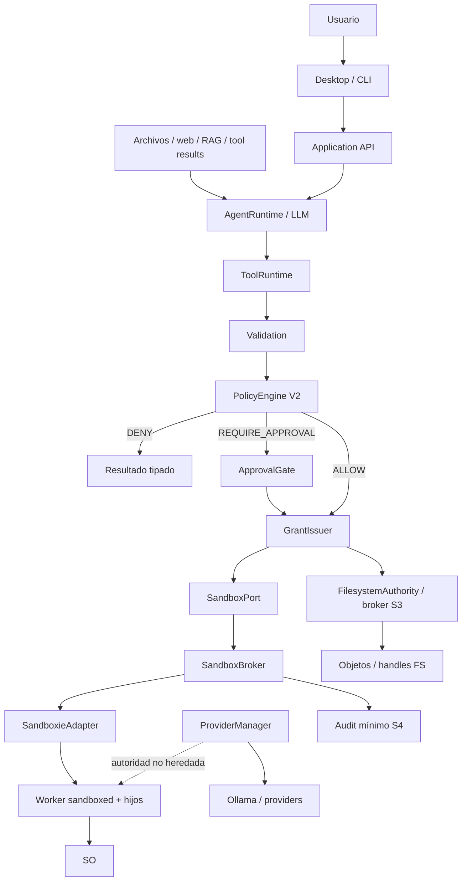

# Nova SECURITY — Arquitectura normativa V1.1

**Fecha:** 2026-10-02  
**Estado:** propuesta normativa para aprobación. Sustituye el objetivo de certificación fuerte obligatoria de `NOVA_SECURITY_ARQUITECTURA_V1.md` para el desarrollo futuro, pero **no modifica retroactivamente** resultados, manifests, attempts, hashes ni estados históricos.  
**Base:** Nova Core V1 + implementación SECURITY S0–S3 existente + informe de transición `informe_transicion_nova_security_v1_a_v1_1_20261002.md`.  
**Plataforma de implementación prioritaria:** Windows.  
**Backend Standard propuesto:** Sandboxie Plus mediante adapter de Infrastructure.  
**Principio rector:** SECURITY debe reducir materialmente el riesgo de ejecución agentic sin convertir el desarrollo de Nova en un proyecto de certificación formal del sandbox.

---

## 1. Lenguaje normativo y precedencia

| Término | Significado |
|---|---|
| **MUST / DEBE** | Requisito verificable de SECURITY V1.1. Omitirlo exige una nueva decisión arquitectónica explícita. |
| **MUST NOT / NO DEBE** | Prohibición verificable. |
| **SHOULD / DEBERÍA** | Recomendación fuerte; apartarse exige justificación y no puede invalidar un gate requerido. |
| **MAY / PUEDE** | Opción compatible, nunca requisito implícito. |
| **OPEN DECISION** | Aspecto aún no resuelto; no autoriza una elección silenciosa durante implementación. |
| **ESTADO ACTUAL** | Comportamiento observado o implementado actualmente. No es una promesa arquitectónica. |
| **ARQUITECTURA OBJETIVO** | Contrato a implementar. |
| **HISTÓRICO** | Evidencia o clasificación de un ensayo pasado que debe conservarse sin reinterpretación retroactiva. |
| **FUERA DE ALCANCE** | No bloquea SECURITY V1.1 ni el perfil Standard. |

Prevalece **Nova Core V1** para lifecycle, identidad de sesión/turno/operación, Application API, eventos, ToolExecutionPort, ProviderManager, ContextManager, RAGService, compatibilidad CLI/Desktop y dirección de dependencias.

SECURITY V1.1 añade autoridad, policy, approvals, filesystem brokered, perfiles de ejecución y aislamiento práctico. **NO DEBE** crear un segundo AgentLoop, una segunda sesión principal ni una arquitectura paralela al Core.

La arquitectura SECURITY V1 original permanece como fuente histórica del objetivo fuerte anterior. Cuando exista conflicto entre V1 y esta V1.1 respecto de fuerza del sandbox, garantías, S4, G-T/G-H o gates de certificación, **prevalece V1.1 para desarrollo futuro**.

---

## 2. Motivo de la revisión V1.1

SECURITY V1 adoptó un objetivo muy fuerte: que un worker no pudiera exceder físicamente un `CapabilityGrant` y que cada garantía requerida quedara atestada como enforcement del sistema operativo.

La investigación S4 demostró que ese objetivo genera un coste desproporcionado para Nova en Windows:

- AppContainer/LPAC, Restricted Token, Job Objects, Windows Sandbox, Hyper-V y Sandboxie fueron investigados;
- se construyeron fixtures y harnesses de alta rigurosidad;
- se estudiaron lifecycle, tokens, host TCB, pipes, causalidad y cuotas;
- G-T y G-H no quedaron certificados;
- F01/F02 y los intentos históricos produjeron evidencia útil, pero no una certificación general del sandbox.

La conclusión de producto es deliberada:

> Nova necesita **aislamiento práctico, reproducible, honesto y suficientemente robusto para reducir el riesgo cotidiano**, no una demostración formal de ausencia absoluta de escape.

V1.1 preserva la arquitectura de autoridad construida y separa dos objetivos que V1 mezclaba:

1. **seguridad productiva práctica**, que debe ser pequeña, mantenible y verificable;
2. **investigación de sandbox fuerte**, que puede continuar en el futuro sin bloquear Nova.

---

## 3. Alcance de producto

Nova continúa siendo un agente local-first orientado principalmente a LLM locales mediante Ollama y hardware de consumo. SECURITY no debe requerir un modelo frontier cloud ni transformar el producto en una plataforma de ejecución hostil multiusuario.

Dentro del alcance:

- errores del LLM;
- tool calls incorrectas;
- prompt injection desde archivos, repositorios, retrieval y web;
- argumentos inesperados;
- comandos de shell con PowerShell, Python, Node, Git u otros hijos;
- rutas absolutas, traversal, symlink/junction/reparse en superficies soportadas;
- ejecución de procesos agentic;
- subagentes;
- approvals;
- secretos/entorno;
- cancelación y timeout;
- resultado incierto;
- renderer defectuoso o comprometido dentro de su IPC permitido;
- backend de sandbox no disponible o inconsistente.

Fuera del claim de `SANDBOXED_STANDARD`:

- administrador/root hostil;
- kernel comprometido;
- malware que ya controla plenamente la cuenta/host;
- ataque deliberado especializado contra Sandboxie con capacidad equivalente al usuario;
- demostración formal de todas las superficies del kernel;
- resistencia absoluta a cualquier escape desconocido;
- garantía física total de CPU/RAM/storage por tarea;
- certificación exhaustiva del TCB de Sandboxie.

---

## 4. Objetivo central de seguridad V1.1

Nova separa cuatro capas que **NO DEBEN** confundirse:

1. **Validation**: interpreta forma, argumentos y recursos.
2. **Policy**: decide si la acción se permite intentar, se deniega o requiere aprobación.
3. **Authority**: limita qué permisos/scopes puede solicitar una operación mediante ceiling + grants.
4. **Isolation / enforcement**: aplica restricciones prácticas mediante broker, handles y/o sandbox backend.

La regla sigue siendo:

> **Approval no equivale a autoridad y authority lógica no equivale automáticamente a enforcement físico universal.**

Un `CapabilityGrant` continúa siendo exacto, inmutable, acotado y vinculado a una operación. Sin embargo, bajo `SANDBOXED_STANDARD`, Nova **NO afirma** que todo microgrant se reproduzca de forma físicamente perfecta en cada acceso posible de un proceso general dentro de Sandboxie.

La arquitectura debe declarar honestamente:

- qué limita Nova lógicamente;
- qué media el broker mediante objetos/handles;
- qué configura el backend de sandbox;
- qué sólo supervisa Nova;
- qué no está soportado.

---

## 5. Perfiles de seguridad

V1.1 define tres perfiles conceptuales.

### 5.1 `LEGACY_UNISOLATED`

Perfil seleccionable explícitamente por el usuario.

Características:

- ejecuta shell/procesos con autoridad normal de la cuenta del usuario;
- mantiene Validation, Policy, Approval y grants lógicos donde sean aplicables;
- **NO** realiza claim de sandbox OS;
- los cinco adapters S3 de filesystem pueden seguir utilizando su broker si la composición así lo define;
- debe mostrarse y auditarse como ejecución no aislada;
- **NO DEBE** ser fallback automático desde otro perfil.

Un fallo en Standard **NO** autoriza pasar a Legacy.

### 5.2 `SANDBOXED_STANDARD`

Perfil normal de seguridad de Nova y opción seleccionable por el usuario.

Objetivo:

> Reducir materialmente el impacto de errores del LLM, prompt injection y comandos accidentales mediante Sandboxie + Policy + Approval + grants + brokered filesystem + lifecycle control, sin claim de certificación absoluta.

Requisitos mínimos:

- toda ejecución agentic de shell/proceso pasa por `SandboxPort`;
- backend Sandboxie activo y compatible;
- box/configuración Nova identificable;
- worker observado como perteneciente a la box esperada;
- hijos soportados permanecen en la misma frontera en los casos declarados;
- no existe fallback silencioso a host;
- stdin/control y handles innecesarios no se entregan deliberadamente;
- cancelación/timeout llegan al backend y se registra cleanup;
- S3 permanece activo para `read/write/edit/glob/grep`;
- grants/approvals siguen siendo exactos y one-shot;
- subagentes no pueden seleccionar un perfil menos restrictivo que el padre;
- audit mínimo registra backend/versión/box/config/operation/grant/outcome/cleanup;
- propiedades no demostradas se declaran como tales.

### 5.3 `HARDENED_EXPERIMENTAL`

Perfil interno de investigación.

Características:

- **NO será seleccionable por la UX/UI normal**;
- conserva el objetivo fuerte anterior;
- puede exigir garantías `ENFORCED`, causalidad fuerte, TCB, cuotas y evidencias especiales;
- una garantía requerida `UNKNOWN`/`UNSUPPORTED` bloquea la operación experimental;
- puede permanecer indefinidamente incompleto;
- **NO bloquea** S4 Standard ni el roadmap de Nova;
- no puede degradarse automáticamente a Standard o Legacy.

Toda la investigación F01/F02, G-T/G-H, token attestation, raw monitor, TCB y pipe observer pertenece aquí salvo que una parte pequeña se reutilice explícitamente como patrón productivo.

---

## 6. Selección y dominancia de perfiles

La selección de perfil es una decisión del host/usuario, no del LLM.

Orden conceptual de fuerza para **selección**, no como prueba física:

```text
HARDENED_EXPERIMENTAL
        >
SANDBOXED_STANDARD
        >
LEGACY_UNISOLATED
```

Reglas:

- una operación hereda el perfil vigente al crearse;
- un child/subagente **MUST NOT** elegir un perfil menos restrictivo que el padre;
- un grant emitido bajo un perfil no es reutilizable bajo otro;
- cambiar perfil invalida bindings/revisions que dependan de él;
- el renderer no es autoridad para promover/downgradear perfil;
- `LEGACY_UNISOLATED` sólo puede activarse mediante acción explícita del host/usuario;
- ausencia de Sandboxie bajo Standard produce `UNSUPPORTED`/error tipado para ejecución de proceso, no host fallback;
- el chat/Core y capacidades que no necesitan process sandbox pueden seguir disponibles si el perfil lo permite.

---

## 7. Cobertura por superficie

V1.1 **NO usa una afirmación global ambigua como “Nova está sandboxed”**.

Cada claim debe especificar superficie.

| Superficie | `LEGACY_UNISOLATED` | `SANDBOXED_STANDARD` | `HARDENED_EXPERIMENTAL` |
|---|---|---|---|
| `bash` / proceso agentic | Host | Sandboxie mediante SandboxPort | Backend/instrumentación experimental |
| Hijos de `bash` | Host | Misma box/config en casos soportados | Requisitos experimentales |
| `read/write/edit/glob/grep` | Broker S3 si composición lo conserva | Broker S3 | Broker S3 + pruebas adicionales si se exigen |
| `todo_write`, `ask_user` | Application | Application | Application |
| `web_fetch` | Host/policy heredada hasta S5 | **No queda protegido automáticamente por Sandboxie shell** | Según experimento |
| Provider/Ollama | Host | Host | Host |
| Git/updater/model management host | Host service | Host service con policy propia | Fuera del worker salvo experimento |
| Network de tools | Pendiente S5 | Pendiente S5 | Puede investigarse antes sólo internamente |
| Environment/secrets | Parcial heredado hasta S6 | mínimos necesarios de S4 + S6 posterior | según requisitos |

No se permite usar la protección de `bash` para afirmar que `web_fetch` o un servicio host están contenidos.

---

## 8. Arquitectura lógica



Principios:

- AgentRuntime depende sólo de contratos Core.
- ToolRuntime permanece la ruta agentic común.
- Application coordina policy, approval, grants y lifecycle.
- Infrastructure implementa brokers/adapters concretos.
- `SandboxieAdapter` **NO** pertenece a Core.
- el worker no es autoridad raíz.
- servicios host permanecen explícitamente fuera de la frontera del worker.
- S3 no se elimina por introducir Sandboxie.

---

## 9. Dirección de dependencias

| Capa | Responsabilidad SECURITY V1.1 | Prohibición |
|---|---|---|
| **Core** | `Permission`, `ResourceScope`, `Capability`, `AuthorityCeiling`, `CapabilityGrant`, perfiles/garantías, `SandboxPort`, requests/outcomes. | Importar Sandboxie, PolicyEngine concreto, Application, Electron o SO concreto. |
| **Application** | `PolicyEngineV2`, `ApprovalGate`, `GrantIssuer`, composición de autoridad, lifecycle, coordinación de SandboxPort, audit lógico. | Construir adapters concretos de Infrastructure dentro de lógica de dominio cuando pueda inyectarse factory/port. |
| **Infrastructure** | `WindowsFilesystemBroker`, `SandboxBroker`, `SandboxieAdapter`, launcher, consultas backend/box, process control, persistence adapters. | Crear autoridad desde argumentos del worker o decidir lifecycle de sesión. |
| **Interfaces** | Presentar perfil/approval, enviar comandos y renderizar resultados. | Emitir grants, resolver policy, elegir downgrade silencioso. |
| **Composition Root** | Seleccionar implementaciones y perfil solicitado. | Duplicar reglas de seguridad que pertenecen a Application. |

La deuda actual donde `filesystem_authority.py` construye Infrastructure directamente debe corregirse de forma localizada si la inyección de `SandboxBroker/SandboxieAdapter` lo hace necesario. No justifica reescribir S3.

---

## 10. Permission / Capability / Ceiling

Se conservan los conceptos V1.

### 10.1 `Permission`

Verbo autorizado, por ejemplo:

- `filesystem.read`
- `filesystem.write`
- `process.execute`
- `process.spawn`
- `network.connect`
- `git.read`
- `git.write`
- `environment.read`

### 10.2 `ResourceScope`

Referencia estable de un recurso/destino administrado por el host/broker.

No debe reducirse a un path libre controlado por el modelo.

### 10.3 `Capability`

`Permission + ResourceScope + restricciones`.

### 10.4 `AuthorityCeiling`

Máxima autoridad **lógica** que el host permite delegar dentro de un contexto.

Cambio V1.1:

> `AuthorityCeiling` no se describe como prueba de que un proceso general carece físicamente de cualquier acceso fuera del conjunto.

La imposición física depende de la superficie:

- S3: broker/handles concretos;
- S4 Standard: configuración Sandboxie + lifecycle y checks definidos;
- Hardened: garantías adicionales si son demostradas.

### 10.5 `CapabilityGrant`

Se conserva:

- interno;
- inmutable;
- exacto por operación;
- sujeto a ceiling;
- con issuer confiable;
- lifetime;
- parent;
- requestDigest;
- revisiones;
- revocación;
- one-shot/claim según contrato.

Un grant **MUST NOT** ser un bearer token entregado al renderer/modelo.

---

## 11. Binding, digest y revisiones

V1.1 conserva request binding fuerte.

El `requestDigest` debe incluir, según aplique:

- argumentos canónicos;
- operación/toolCall/session/turn;
- cwd/workspace;
- resource intent;
- ceiling revision;
- policy revision;
- profile id/revision;
- backend/config revision cuando forme parte de la decisión;
- parent authority;
- lifetime;
- garantías requeridas por el perfil.

La introducción de perfiles V1.1 requiere una **revisión/versionado explícito del digest**.

Un digest V1 no debe convertirse implícitamente en autorización V1.1.

Cambiar de perfil/backend/config relevante invalida el binding que corresponda.

---

## 12. PolicyEngine V2

Se conserva `ALLOW / REQUIRE_APPROVAL / DENY`.

Policy:

- decide si una petición puede intentar ejecutarse;
- no certifica Sandboxie;
- no crea autoridad;
- no puede ampliar ceiling;
- no puede convertir Legacy en Standard;
- no puede ignorar backend unavailable;
- no reemplaza broker/enforcement.

V1.1 requiere únicamente cambios de composición/reglas para:

- conocer el perfil vigente;
- impedir rutas shell legacy bajo Standard;
- emitir/solicitar el grant de proceso apropiado;
- bloquear tool/superficie no soportada cuando el claim del perfil lo exige;
- distinguir servicios host de workers agentic.

`ShellPolicy` puede seguir como defensa sintáctica y UX, nunca como sandbox.

---

## 13. ApprovalGate

S2 se conserva.

Approval debe permanecer:

- exacta;
- one-shot;
- ligada a IDs y digest;
- con deadline/cancel;
- resistente a replay/stale;
- controlada por Electron main o TTY local verificable;
- separada de `ask_user`.

`--yes`:

- **NO DEBE** sustituir al actor cuando una approval es obligatoria;
- **NO DEBE** ampliar ceiling;
- **NO DEBE** desactivar sandbox;
- **NO DEBE** cambiar Standard a Legacy.

Aprobar una operación no concede una box persistente con autoridad general.

---

## 14. Taxonomía de fuerza de garantía V1.1

V1.1 separa **fuerza/evidencia** de **resultado operativo**.

### 14.1 Estados de fuerza/evidencia

| Estado | Significado |
|---|---|
| **ENFORCED** | Una primitiva concreta impone el límite y existe evidencia suficiente para el claim declarado. No implica prueba matemática universal. |
| **CONFIGURED** | El backend está configurado para proporcionar/reducir una capacidad y pasó los tests Standard definidos, pero Nova no afirma equivalencia física absoluta con un microgrant. |
| **BEST_EFFORT** | Nova supervisa, limita o reacciona, pero el control no es preventivo/estricto. |
| **UNSUPPORTED** | El backend/perfil no proporciona la garantía. |
| **UNKNOWN** | No puede establecerse el estado con la evidencia disponible. |

### 14.2 `FAILED`

`FAILED` deja de representar “fuerza de garantía”.

Debe modelarse como resultado/estado operativo de una preparación, ejecución, cierre o verificación:

```text
evidenceStrength = ENFORCED | CONFIGURED | BEST_EFFORT | UNSUPPORTED | UNKNOWN
operationStatus   = success | failed | cancelled | outcome_unknown | ...
```

La implementación existente puede mantener compatibilidad transitoria, pero la arquitectura debe converger a esta separación.

### 14.3 Regla Standard

Una propiedad requerida por Standard puede aceptar únicamente los niveles definidos para esa propiedad.

Ejemplo conceptual:

| Propiedad Standard | Nivel mínimo |
|---|---|
| backend/box identity | `CONFIGURED` o mejor |
| no silent fallback | `ENFORCED` en la lógica de composición |
| filesystem S3 | `ENFORCED` para adapters soportados |
| child in same box, casos anunciados | `CONFIGURED` |
| timeout/cleanup | `BEST_EFFORT` con outcome honesto |
| physical storage quota | `UNSUPPORTED` permitido porque no es required |
| formal TCB proof | `UNKNOWN` permitido porque no es required |

No existe una regla “todo debe ser ENFORCED” para Standard.

### 14.4 Regla Hardened

Hardened puede declarar garantías `REQUIRED_ENFORCED`.

Si una de ellas está `CONFIGURED`, `BEST_EFFORT`, `UNSUPPORTED` o `UNKNOWN`, la operación experimental no satisface ese gate.

---

## 15. `SecurityProfile` y `requiredGuarantees`

V1.1 mantiene perfiles versionados, pero redefine `requiredGuarantees`.

Cada perfil debe declarar:

- `profileId`;
- `profileRevision`;
- backend esperado;
- superficies cubiertas;
- requisitos por garantía;
- nivel mínimo aceptado;
- política de UNKNOWN;
- policy de fallback;
- subagent inheritance;
- audit mínimo.

No se debe representar Standard como un conjunto vacío de `requiredGuarantees`.

Tampoco debe inferirse dominancia sólo por inclusión de nombres de garantías.

La comparación padre/hijo debe considerar:

1. perfil;
2. superficie;
3. permisos/scopes;
4. nivel mínimo requerido;
5. backend/config relevante;
6. lifetime.

---

## 16. SandboxPort V1.1

`SandboxPort` sigue siendo el contrato Core para ejecución aislada de proceso.

Debe permitir, como mínimo:

### `prepare(request)`

Valida/prepara:

- perfil;
- backend disponible;
- versión compatible;
- box/config identificable;
- grant/binding;
- executable/cwd;
- canales/handles;
- audit correlation;
- capacidad de launch.

Debe devolver información tipada, no `sandboxed=true`.

### `execute(prepared, ...)`

Ejecuta y devuelve:

- operation/backend/box identity;
- root PID;
- exit status;
- stdout/stderr acotados;
- cancel/timeout state;
- cleanup state;
- child observations disponibles;
- outcome/effectState;
- evidencia Standard requerida.

`UNKNOWN` en una **precondición obligatoria** bloquea el launch.

`UNKNOWN` después de iniciar un efecto se informa como incertidumbre; no se transforma en “sin efecto”.

---

## 17. SandboxBroker V1.1

`SandboxBroker` es Application/Infrastructure boundary para proceso.

Responsabilidades:

- verificar grant y request binding;
- comprobar perfil vigente;
- seleccionar adapter ya permitido por composition root;
- preparar backend;
- iniciar exactamente una ejecución por operación;
- correlacionar worker;
- transmitir sólo canales necesarios;
- coordinar cancel/timeout;
- registrar cleanup;
- devolver outcome tipado;
- impedir fallback a host.

No necesita demostrar el TCB completo de Sandboxie para Standard.

Sí debe impedir:

```text
Standard requested
→ Sandboxie unavailable
→ host Popen silently
```

Ese flujo está prohibido.

---

## 18. SandboxieAdapter — objetivo Standard

Windows Standard usa un adapter de Sandboxie.

El adapter debe ser pequeño y productivo. **NO debe incorporar el harness F01/F02 completo.**

Debe encargarse de:

- detectar instalación/backend;
- comprobar versión/config soportada;
- resolver box configurada por Nova;
- lanzar proceso en esa box;
- observar que el PID pertenece a la box esperada mediante API/mecanismo soportado;
- capturar stdout/stderr por transporte confiable;
- evitar stdin/control heredado;
- aplicar cancel/timeout/close disponibles;
- consultar procesos conocidos de la box cuando sea necesario;
- registrar cleanup;
- exponer evidence Standard.

La configuración Standard debe ser conocida y versionada por Nova.

No es requisito Standard:

- raw monitor;
- snapshots A/B/C;
- atestación completa de token;
- causalidad minifilter;
- host TCB formal;
- demostrar ausencia universal de cliente IPC.

---

## 19. Filesystem S3 en V1.1

S3 se conserva.

Ruta conceptual:

```text
ToolInvocation
→ ToolRuntime
→ BrokeredFilesystemTool
→ FilesystemAuthority
→ GrantIssuer
→ WindowsFilesystemBroker
→ WindowsHandleRoot / handles relativos
```

Claims válidos:

- `read/write/edit/glob/grep` soportados usan broker;
- read/write son permisos separados;
- absolutos externos/traversal/superficies no soportadas se deniegan según contrato;
- root/object binding se hace mediante handles en Windows;
- reparse/hardlink/UNC/ADS/etc. conservan la política documentada;
- no existe fallback a filesystem legacy si falla el broker.

V1.1 **NO extiende automáticamente este claim a**:

- comandos shell;
- `web_fetch`;
- services host;
- cualquier syscall que un proceso Sandboxie intente ejecutar.

Standard compone S3 + Sandboxie; no sustituye S3 por Sandboxie.

---

## 20. Resultados de worker y proyecto

V1.1 requiere una política explícita de resultados.

No se debe asumir que una copia virtualizada en Sandboxie equivale a un cambio autorizado del proyecto.

Se permiten dos estrategias futuras compatibles:

### A. Commit brokered de resultados

El worker escribe en superficie/staging controlada y Nova aplica cambios al proyecto mediante broker/grant S3.

Ventaja: frontera clara entre ejecución no confiable y mutación final.

### B. Escritura directa declarada

La configuración Standard puede permitir determinadas escrituras directas dentro del workspace si:

- la decisión es explícita;
- el claim lo documenta;
- S3/Policy/Grant sigue mediando la operación relevante cuando aplique;
- no se crea una ruta accidental fuera del modelo de autoridad.

**OPEN DECISION:** seleccionar la estrategia productiva concreta antes de cerrar S4 Standard.

---

## 21. Subagentes

Se mantiene:

```text
childAuthority ⊆ parentAuthority
```

V1.1 añade:

```text
childProfile >= parentProfile
```

donde `>=` significa “no menos restrictivo para esa operación”.

Bajo Standard:

- child no puede elegir Legacy;
- shell del child también pasa por SandboxPort;
- grants hijos no amplían scopes;
- cancelar/revocar padre invalida descendants según contratos existentes;
- falta de backend compatible en child produce error, no host fallback.

Hardened conserva requisitos propios si se usa internamente.

---

## 22. Lifecycle, timeout, cancelación y cleanup

Standard exige honestidad, no perfección.

Estados conceptuales deben distinguir:

- launch no ocurrido;
- running;
- cancel requested;
- timeout requested;
- root exited;
- hijos conocidos observados;
- cleanup attempted;
- cleanup confirmed;
- cleanup unknown;
- effect outcome unknown.

Reglas:

- `exitCode == 0` no prueba cleanup completo;
- solicitar cancelación no prueba terminal efectivo;
- fallo de consulta puede producir `UNKNOWN`;
- no se repite automáticamente una operación con efectos inciertos;
- un backend que no puede cerrar/observar según lo requerido debe reportarlo;
- siguiente operación no debe reutilizar autoridad/handles de la anterior.

No se requiere probar “todos los procesos posibles del host” para Standard.

---

## 23. Stdin, control e handles

El worker Standard:

- **MUST NOT** heredar stdin interactivo/control de Nova;
- **MUST NOT** recibir credenciales de control;
- debe recibir sólo handles/canales deliberadamente necesarios;
- stdout/stderr deben estar correlacionados a la operación;
- canales privados no deben contener grants reutilizables.

No se exige una investigación universal de todos los IPC de Windows.

Sí se exige un test de producto que demuestre que un dummy del canal host no es legible por el worker.

---

## 24. Resources en V1.1

Los límites de recursos se clasifican por fuerza real.

Ejemplos:

| Control | Clasificación posible Standard |
|---|---|
| deadline | `BEST_EFFORT` / control de Application |
| timeout de proceso | `BEST_EFFORT` con cleanup observado |
| límite de stdout capturado | `ENFORCED` por el componente que trunca/rechaza si realmente limita memoria de captura; si sólo recorta después, `BEST_EFFORT` |
| Job Object limit si se usa y verifica | `ENFORCED` para la dimensión concreta |
| storage físico total por tarea | `UNSUPPORTED` salvo mecanismo futuro |
| G-T completo | fuera de gate Standard |
| G-H completo | fuera de gate Standard |

`reactive stop != physical quota` sigue siendo verdadero. Simplemente deja de bloquear Standard.

---

## 25. G-T y G-H

### 25.1 Estado

Los estados históricos se conservan:

```text
G-T = NOT_CERTIFIED
G-H = NOT_CERTIFIED
```

### 25.2 V1.1

G-T y G-H:

- **NO son requisitos obligatorios de S4 Standard**;
- **NO se marcan como PASS**;
- **NO se borran**;
- pasan a `HARDENED_EXPERIMENTAL`;
- sus experimentos y decisiones se preservan.

Standard puede usar controles operativos de recursos siempre que estén etiquetados con la fuerza correcta.

---

## 26. Host TCB, raw monitor, token attestation y F02

Se conservan históricamente:

```text
SANDBOXIE_HOST_TCB_EVALUATION = UNKNOWN
RAW_MONITOR_ACQUISITION = UNKNOWN
```

También permanecen históricos:

- op6 `READ_DENIED` con causalidad/comportamiento revisado `UNKNOWN`;
- F02 causal no ejecutado;
- R0/R1 no cerrados live;
- observer v2 con acceptance tail no resuelta;
- attempt `957d...` `UNKNOWN`;
- snapshots/token investigations.

V1.1 declara:

> Ninguno de esos puntos bloquea S4 Standard mientras no sea una precondición requerida por Standard.

No deben reinterpretarse como PASS.

No deben reejecutarse automáticamente.

---

## 27. Network y relación con S5

S4 Standard **NO certifica red de tools**.

Hasta S5:

- Provider/Ollama continúa en host;
- `web_fetch` continúa siendo una superficie host separada;
- la sandbox de shell no debe usarse como claim de protección para `web_fetch`;
- una función host con acceso a red no hereda automáticamente el perfil del worker.

V1.1 debe permitir declarar una superficie como:

```text
OUT_OF_CLAIM_UNTIL_S5
```

cuando no corresponda bloquear todo Nova.

S5 definirá network authority de forma independiente.

---

## 28. Environment/secrets y relación con S6

S4 Standard exige sólo la higiene mínima necesaria para no entregar deliberadamente:

- token de control;
- credenciales internas de approval;
- stdin de backend;
- handles innecesarios.

La allowlist completa, redacción durable de secretos y matriz de environment corresponden a S6.

Un denylist heredado no debe describirse como aislamiento fuerte.

---

## 29. Audit mínimo S4 vs SecurityAudit S7

S4 Standard necesita audit mínimo operacional:

- profile;
- backend;
- backend version;
- box/config id;
- session/turn/operation/toolCall;
- grantId resumido;
- root PID;
- launch outcome;
- exit/cancel/timeout;
- cleanup state;
- effect/outcome;
- errores tipados.

No debe contener:

- bearer grants;
- secretos;
- credenciales de control;
- handles reutilizables.

Esto **NO sustituye S7**.

S7 sigue siendo responsable de:

- retención;
- redacción sistemática;
- reconstrucción durable;
- correlation completa;
- políticas de privacidad;
- crash/effect audit avanzado.

---

## 30. S4 Standard — gate de producto

S4 Standard se considera listo sólo después de que exista integración productiva y pase una suite pequeña y reproducible.

### Precondiciones

- `SANDBOXED_STANDARD` existe como perfil versionado;
- SandboxPort productivo conectado;
- SandboxBroker productivo conectado;
- SandboxieAdapter productivo conectado;
- shell/subagent no tienen ruta host alternativa bajo Standard;
- box/config Nova identificable;
- audit mínimo;
- política de resultados al proyecto;
- canales/handles declarados;
- backend unavailable no causa fallback.

### Casos host-real

#### `STD-01 — Worker básico`

ToolRuntime → SandboxPort real → SandboxieAdapter.

PASS Standard si:

- worker creado una vez;
- PID/imagen esperados;
- box/config esperada observada;
- output benigno correcto;
- audit correlacionado.

#### `STD-02 — Backend unavailable / config inválida`

PASS Standard si:

- no se crea proceso host;
- error tipado;
- no retry privilegiado;
- no silent fallback.

#### `STD-03 — Lectura externa artificial`

PASS Standard si:

- recurso concedido funciona;
- recurso externo artificial seleccionado se bloquea según configuración;
- se registra comportamiento observado;
- no se afirma causalidad exhaustiva.

#### `STD-04 — Escritura / resultado autorizado`

PASS Standard si:

- escritura permitida sigue el contrato elegido;
- host/copy/result effect es coherente con ese contrato;
- aplicación a proyecto ocurre sólo por mecanismo autorizado;
- no requiere G-T.

#### `STD-05 — Hijo de intérprete`

PASS Standard si:

- PowerShell/hijo benigno soportado permanece en la misma box/config;
- Python/Node sólo se incluyen si están anunciados/instalados;
- no se introducen excepciones silenciosas.

#### `STD-06 — Timeout`

PASS Standard si:

- deadline llega al backend;
- cleanup se intenta;
- root/hijos conocidos se consultan;
- estado incierto se reporta `UNKNOWN/FAILED`;
- no se inventa PASS por exit code.

#### `STD-07 — Cancel`

PASS Standard si:

- cancelación Application alcanza backend;
- existe un único terminal de operación;
- no se dispara un segundo launch por recuperación/retry.

#### `STD-08 — stdin/control/handles`

PASS Standard si:

- dummy del canal host no es accesible por el worker;
- sólo canales/handles deliberados se entregan.

#### `STD-09 — Approval/grant/subagent`

PASS Standard si:

- approval requerida bloquea launch hasta resolverse;
- stale/cancel se deniega;
- grant/profile binding coincide;
- child no puede elegir Legacy ni ampliar scopes.

#### `STD-10 — Audit/cierre/limitaciones`

PASS Standard si:

- audit registra backend/version/box/config/operation/grant/outcome/cleanup;
- no filtra secretos/credential;
- fixtures/config del caso quedan en estado esperado;
- las limitaciones del perfil quedan declaradas.

### Significado de `PASS_STANDARD`

`PASS_STANDARD` significa:

> El contrato productivo `SANDBOXED_STANDARD` funciona en los escenarios y plataforma/versión anunciados.

**NO significa:**

- ausencia universal de escapes;
- SECURITY V1 antiguo certificado;
- G-T/G-H certificados;
- TCB formalmente demostrado;
- causalidad completa de Sandboxie;
- prueba de todos los interleavings posibles.

---

## 31. S4 Hardened — gate de investigación

Hardened no tiene fecha de cierre obligatoria.

Su backlog puede incluir:

- G-T;
- G-H;
- quotas preventivas físicas;
- host TCB;
- raw monitor;
- token equivalence;
- A/B/C temporal evidence;
- F02;
- causalidad minifilter;
- pruebas exhaustivas de IPC;
- versión/build matrix fuerte;
- proof más estricto de AuthorityCeiling físico.

Estado inicial V1.1:

```text
HARDENED_EXPERIMENTAL = PAUSED
executionReady = false
G-T = NOT_CERTIFIED
G-H = NOT_CERTIFIED
SANDBOXIE_HOST_TCB_EVALUATION = UNKNOWN
RAW_MONITOR_ACQUISITION = UNKNOWN
SEC-OD-01 (strong form) = OPEN
```

No hay autorización implícita para nuevos attempts.

---

## 32. Fases S0–S8 bajo V1.1

| Fase | Estado/objetivo V1.1 | Acción |
|---|---|---|
| **S0 — Baseline/threat model** | Conservado y validado para su contrato. | No rehacer; pin de release nuevo cuando corresponda. |
| **S1 — Permission/Capability/Grant** | Conservado. | Ajustes menores de profile/digest/dominance. |
| **S2 — Policy/Approval** | Conservado. | Integrar profile/backend/process grant; no rehacer ApprovalGate. |
| **S3 — Filesystem authority** | Conservado Windows para cinco tools. | Mantener broker; ajustar factory/composition si es necesario. |
| **S4 — Process isolation** | Redefinido en `Standard` + `Hardened`. | Implementar Standard; Hardened pausado. |
| **S5 — Network authority** | Pendiente. | Continuar después de cerrar Standard. |
| **S6 — Environment/secrets** | Pendiente. | Continuar después de S5 según roadmap. |
| **S7 — Security audit/effect guarantees** | Pendiente. | Audit durable/redaction posterior. |
| **S8 — Security release gate** | Redefinido por perfiles/claims. | Gate Standard práctico; Hardened separado. |

No se vuelve a S1/S2/S3 como si hubieran fallado.

---

## 33. Nuevo gate `NOVA SECURITY V1.1 STANDARD READY`

La arquitectura deja de usar un único claim absoluto `NOVA SECURITY V1 STABLE` para toda propiedad imaginable.

Se define:

```text
NOVA_SECURITY_V1_1_STANDARD_READY
```

Sólo puede declararse cuando:

1. S0–S3 requeridos siguen pasando su regresión;
2. `SANDBOXED_STANDARD` está implementado;
3. `LEGACY_UNISOLATED` está explícitamente separado;
4. Hardened no aparece como opción normal UX;
5. no hay silent fallback Standard→Legacy;
6. shell/subagent Standard usan SandboxPort;
7. SandboxieAdapter/backend/config están identificados;
8. STD-01..STD-10 pasan en la plataforma/versiones anunciadas;
9. coverage por tool/superficie está publicado;
10. propiedades no soportadas están declaradas;
11. `UNKNOWN` en precondición obligatoria bloquea launch;
12. outcome incierto después de efecto se reporta honestamente;
13. Core lifecycle/eventos siguen cumpliéndose;
14. approvals/grants/subagent attenuation siguen vigentes;
15. S3 no ha sido degradado;
16. audit mínimo Standard existe;
17. G-T/G-H/TCB/raw monitor no se presentan como certificados;
18. los expedientes históricos permanecen inmutables.

Este gate es de producto, no una certificación de seguridad externa.

---

## 34. Comunicación de seguridad al usuario

La UX futura debe ser honesta.

### `LEGACY_UNISOLATED`

Descripción conceptual:

> Ejecuta herramientas con los permisos normales de tu usuario. Nova aplica sus políticas y aprobaciones, pero los procesos no están aislados por Sandboxie.

### `SANDBOXED_STANDARD`

Descripción conceptual:

> Ejecuta procesos de Nova dentro de un entorno aislado mediante Sandboxie y controles adicionales. Reduce de forma importante el riesgo de cambios o accesos no deseados, pero no garantiza aislamiento absoluto frente a todas las técnicas de escape.

### `HARDENED_EXPERIMENTAL`

No se muestra como opción normal.

No se debe usar en marketing/UX para sugerir un modo “100% seguro”.

---

## 35. Errores y degradación

Errores conceptuales compatibles:

- `SANDBOX_UNAVAILABLE`
- `SANDBOX_BACKEND_INCOMPATIBLE`
- `SANDBOX_CONFIG_MISMATCH`
- `SANDBOX_IDENTITY_UNKNOWN`
- `SANDBOX_LAUNCH_FAILED`
- `SANDBOX_CLEANUP_UNKNOWN`
- `SECURITY_PROFILE_UNSUPPORTED`
- `RESOURCE_SCOPE_VIOLATION`
- `PERMISSION_DENIED`
- `SECURITY_POLICY_CONFLICT`

Regla:

> El fallo de Standard no se resuelve ejecutando Legacy en la misma operación.

El usuario puede cambiar explícitamente de perfil y generar una nueva operación/request/grant.

---

## 36. Versiones y mantenimiento del backend

Standard no requiere certificar todas las builds de Sandboxie.

Sí requiere:

- versión mínima/compatibilidad declarada;
- config-id/revision de Nova;
- detección de backend ausente;
- detección de incompatibilidad conocida;
- smoke/regression al cambiar backend/config que afecte el claim;
- no etiquetar como Standard una configuración desconocida.

Un upgrade puede provocar:

```text
STANDARD_BACKEND_REVALIDATION_REQUIRED
```

sin implicar que el producto completo sea inutilizable.

---

## 37. Distribución y licencia

La integración futura debe revisar:

- forma legal de depender/distribuir Sandboxie;
- componentes gratuitos requeridos;
- instalación/driver/admin;
- actualización;
- si Nova configura una box existente o crea una propia;
- compatibilidad de versiones.

La investigación previa no constituye por sí sola una decisión de distribución o licencia.

**OPEN DECISION:** packaging/distribution de Sandboxie para Nova.

---

## 38. Invariantes SECURITY V1.1

| ID | Invariante |
|---|---|
| **SEC11-INV-001** | Toda tool agentic pasa por ToolRuntime. |
| **SEC11-INV-002** | Policy/Approval no crean autoridad OS por sí solos. |
| **SEC11-INV-003** | `CapabilityGrant ⊆ AuthorityCeiling` lógicamente. |
| **SEC11-INV-004** | Grants son internos, inmutables y ligados a operación/request/revisión. |
| **SEC11-INV-005** | Child authority no excede parent authority. |
| **SEC11-INV-006** | Child no puede seleccionar un perfil menos restrictivo. |
| **SEC11-INV-007** | Standard process execution pasa por SandboxPort. |
| **SEC11-INV-008** | Standard nunca hace fallback automático a Legacy. |
| **SEC11-INV-009** | S3 brokered FS no se degrada por introducir Sandboxie. |
| **SEC11-INV-010** | `web_fetch`/host services no quedan cubiertos por claim de shell sandbox salvo implementación explícita. |
| **SEC11-INV-011** | `UNKNOWN` requerido antes de launch bloquea la operación. |
| **SEC11-INV-012** | Incertidumbre posterior a un efecto se conserva como outcome/cleanup unknown. |
| **SEC11-INV-013** | Cancel requested no equivale a terminal confirmado. |
| **SEC11-INV-014** | Exit 0 no equivale a cleanup PASS. |
| **SEC11-INV-015** | G-T/G-H no se anuncian certificados en Standard. |
| **SEC11-INV-016** | Hardened puede permanecer incompleto sin bloquear Nova. |
| **SEC11-INV-017** | Evidencia histórica no se reinterpreta por el cambio de arquitectura. |
| **SEC11-INV-018** | Renderer no emite grants ni downgrades de perfil. |
| **SEC11-INV-019** | Audit no contiene material reutilizable de autoridad. |
| **SEC11-INV-020** | SECURITY no introduce imports concretos desde AgentRuntime hacia Application/Infrastructure. |

---

## 39. Migración desde SECURITY V1

### 39.1 Conservar sin rehacer

- S0 baseline/threat model;
- `Permission`;
- `ResourceScope`;
- `Capability`;
- `GrantSubject`;
- `GrantLifetime`;
- `CapabilityGrant`;
- GrantIssuer registry/claim/revoke/attenuation;
- ApprovalGate;
- host approval/IPC/CLI TTY;
- ToolRuntime;
- WindowsFilesystemBroker;
- WindowsHandleRoot;
- S3 adapters;
- tests S0–S3;
- Core lifecycle/API/events.

### 39.2 Cambios menores

- AuthorityCeiling: separar autoridad lógica de fuerza backend;
- requestDigest: versionar perfil/backend bindings;
- profile dominance;
- `requiredGuarantees`;
- `GuaranteeEvidence`;
- Policy composition;
- ToolRuntime process path;
- factory/injection S3 si procede;
- audit mínimo S4.

### 39.3 Implementación nueva

- perfiles globales V1.1;
- SandboxBroker productivo;
- SandboxieAdapter productivo;
- Standard worker launch;
- Standard child/lifecycle observation;
- stdin/handle policy;
- backend/config validation;
- result/project policy;
- STD-01..STD-10.

### 39.4 Diferir

- G-T/G-H;
- raw monitor;
- host TCB formal;
- A/B/C;
- F02;
- exhaustive pipe proof;
- full physical quota model;
- certificación fuerte multiplataforma.

---

## 40. Preservación histórica

Los siguientes resultados mantienen su significado original.

No deben editarse para ajustarlos a V1.1.

En particular:

- op1 PASS conserva su alcance focal;
- op3 PASS conserva su virtualización/copia y lifecycle;
- host control ALLOW conserva su alcance;
- op6 conserva `READ_DENIED` y los estados revisados `UNKNOWN`;
- attempts UNKNOWN siguen UNKNOWN;
- F02 real no se declara ejecutado;
- observer v2 no obtiene PASS universal de no-client;
- `executionReady=false` del paquete Hardened permanece;
- `G-T=NOT_CERTIFIED`;
- `G-H=NOT_CERTIFIED`;
- `SANDBOXIE_HOST_TCB_EVALUATION=UNKNOWN`;
- `RAW_MONITOR_ACQUISITION=UNKNOWN`;
- manifests/hashes/raw evidence permanecen inmutables.

V1.1 cambia **qué necesita el producto futuro**, no lo que ocurrió en el laboratorio.

---

## 41. OPEN DECISIONS V1.1

### `SEC11-OD-01 — Result commit model`

Seleccionar:

- commit brokered de resultados; o
- escrituras directas Standard explícitamente acotadas.

Bloquea cierre S4 Standard.

### `SEC11-OD-02 — Sandboxie packaging`

Definir instalación/dependencia/distribución/update/config ownership.

No bloquea la redacción de adapters, pero sí release Standard.

### `SEC11-OD-03 — Backend compatibility policy`

Definir versiones/config changes que requieren revalidación Standard.

### `SEC11-OD-04 — Global profile representation`

Definir DTO/config exactos y su relación con `filesystem_profile` S3.

Debe evitar confundir `BROKERED_FILESYSTEM_S3` con el perfil global Standard.

### `SEC11-OD-05 — Standard evidence persistence`

Definir qué audit mínimo persiste durante S4 antes de S7.

### `SEC11-OD-06 — Coverage temporal de web_fetch`

Hasta S5, decidir si determinadas capacidades de `web_fetch` se mantienen fuera del claim, se restringen o se deshabilitan bajo Standard.

No se debe afirmar protección general contra exfiltración mientras quede host network no mediada.

---

## 42. Punto exacto de reanudación

Después de aprobar esta arquitectura, el desarrollo se reanuda en:

```text
S4 — SANDBOXED_STANDARD
  → profile compatibility + digest revision
  → composition
  → ToolRuntime process route
  → SandboxPort
  → SandboxBroker
  → SandboxieAdapter
  → lifecycle / stdin / handles / audit mínimo
  → result/project policy
  → STD-01 .. STD-10
```

No se reanuda en:

```text
S1
S2
S3 desde cero
F02
R0/R1
pipe observer
G-T
G-H
raw monitor
host TCB
```

Tras cerrar S4 Standard:

```text
S5 — Network authority
→ S6 — Environment / secrets
→ S7 — Security audit / effect guarantees
→ S8 — Release security gate por perfil/coverage
```

Hardened queda pausado hasta una futura decisión explícita.

---

## 43. Relación con el roadmap general de Nova

SECURITY es una etapa habilitadora, no el producto completo.

Tras concluir el nivel de seguridad necesario:

1. **Nova Core V1** — conservar.
2. **SECURITY V1.1** — completar Standard.
3. **Memory** — posterior.
4. **Knowledge Inputs** — posterior.
5. **Active Web** — posterior y sujeto a S5.
6. **Nova Desktop** — experiencia de producto.
7. **Nova Voice** — objetivo voice-first futuro.

V1.1 existe precisamente para evitar que la investigación Hardened absorba indefinidamente el desarrollo de estas etapas.

---

## 44. Resumen normativo

La arquitectura final de SECURITY V1.1 puede resumirse así:

```text
LLM
→ AgentRuntime
→ ToolRuntime
→ Validation
→ PolicyEngine V2
→ ApprovalGate (si aplica)
→ GrantIssuer
→ {
    S3 FilesystemBroker para FS brokered
    S4 SandboxPort → SandboxBroker → SandboxieAdapter para procesos Standard
  }
→ outcome honesto
→ audit
```

Y sus tres perfiles:

```text
LEGACY_UNISOLATED
  = explícito, sin claim OS sandbox

SANDBOXED_STANDARD
  = aislamiento práctico de producto
  = Sandboxie + policy + grants + S3 + lifecycle + no-fallback
  ≠ certificación absoluta

HARDENED_EXPERIMENTAL
  = investigación fuerte
  = G-T/G-H/TCB/causalidad/etc.
  = no UX normal
  = no bloquea Nova
```

La principal decisión de V1.1 es:

> **Nova mantiene su arquitectura seria de autoridad, pero deja de exigir una certificación formal del sandbox para avanzar como producto.**

Eso permite seguir reduciendo significativamente el riesgo de ejecución local sin convertir SECURITY S4 en el propósito central de Nova.
