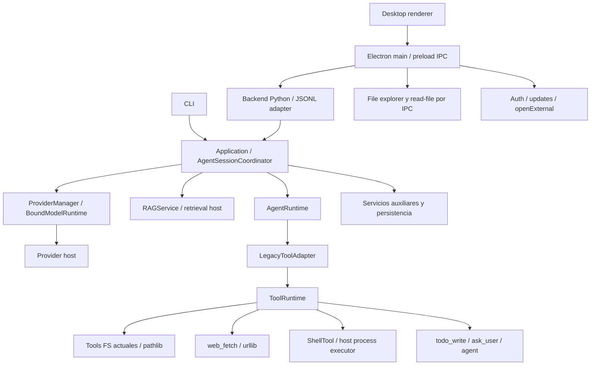

# Nova SECURITY V1.2 — S0: baseline y threat model

**Fecha de elaboración:** 2026-10-03.  
**Estado:** caracterización implementada; ver registro de resultados y gate al final.  
**Alcance:** S0 exclusivamente, sobre el Core V1 limpio de `nova-local-cli/nova-assistant`.  
**Fuente normativa:** [NOVA_SECURITY_ARQUITECTURA_V1_2.md](../architecture/NOVA_SECURITY_ARQUITECTURA_V1_2.md), en particular §§5, 6 y 29/S0.  
**Modelo objetivo de procesos:** `HOST_UNISOLATED`.

Este documento caracteriza las superficies existentes antes de introducir SECURITY V1.2. No implementa S1–S8, no modifica los schemas públicos de tools y no declara `NOVA_SECURITY_V1_2_READY`. La implementación SECURITY deprecated y el proyecto anterior no fueron consultados, copiados, migrados ni reutilizados para esta revisión. Los nombres `Legacy*` presentes aquí pertenecen al Core limpio actual; no significan que se haya portado SECURITY deprecated.

## 1. Método y niveles de evidencia

Cada conclusión se etiqueta de la siguiente manera:

| Etiqueta | Significado en este informe |
|---|---|
| **OBSERVADO — código** | Comportamiento o estructura leído directamente en el Core limpio. Prueba que esa secuencia existe en el código revisado; no prueba por sí solo su comportamiento bajo todas las condiciones del sistema operativo. |
| **OBSERVADO — prueba** | Resultado reproducible de una fixture controlada, con comando, plataforma y resultado registrados. Ningún resultado de este tipo se presume mientras su registro esté pendiente. |
| **INFERIDO** | Consecuencia razonable del código o del modelo de ejecución. Se especifica su base y la limitación que impide tratarla como prueba ejecutada. |
| **PENDIENTE** | Dato, prueba o decisión que falta completar. No significa ALLOW, DENY ni requisito implementado. |

Las referencias de código son relativas al repositorio de destino. Los números de línea corresponden a la revisión estática de elaboración y deben verificarse contra la identidad final del baseline. Una capacidad normal de la cuenta del usuario no se etiqueta automáticamente como vulnerabilidad. La caracterización tampoco se transforma en un claim de protección.

### 1.1 Identidad reproducible del baseline

| Dato | Registro |
|---|---|
| Repositorio objetivo | `nova-local-cli/nova-assistant` |
| Commit Core limpio | **`158b60effa484cd34a58b991f3ee4ca3f808d924` — feat(core): complete Nova Core V1 refactor** |
| Estado del árbol al comenzar S0 | **41 entradas preexistentes conservadas; listado exacto y hashes en `s0_manifest.json`. No se afirma working tree Git limpio.** |
| Plataforma y build de Windows | **Windows-11-10.0.26200-SP0** |
| Python y entorno de dependencias | **Python 3.14.6; pytest 9.1.1; Nova 0.12.6; rutas y hashes en manifest** |
| Node/Electron/Desktop | **Node disponible; Desktop 0.12.6 en package.json. Sin node_modules; sin instalación ni Electron/GUI live.** |
| Shell seleccionado y ejecutable | **PowerShell 7.6.5; ejecutable del host registrado en manifest; Windows PowerShell 5.1 también probado por el Core** |
| Configuración relevante | **Config actual conservada; auto_approve True/False sólo en mocks; timeout/cancel en fixtures; entorno privado por ejecución, sin valores reales registrados** |
| Comandos de caracterización | **`python -B tests/security_v12/run_s0.py --output <directorio-nuevo>`; ver §8** |
| Resultados de regresión Core | **Pre-cambio: 199 passed, 1 skipped, 33 subtests passed; resultado final en `s0_resultados.md` y evidencia** |
| Fixtures y limpieza | **TemporaryDirectory + tmp_path; archivos dummy y estado HOME/APPDATA/XDG/TEMP aislados; ningún fixture antiguo/personal usado** |

La revisión estática se complementó con pruebas sobre temporales y datos dummy; no necesita archivos personales, credenciales reales, destinos externos ni acciones administrativas reales. Hashes o fixtures sólo se conservan cuando aportan reproducibilidad.

## 2. Fronteras del Core actual

**OBSERVADO — código.** `AgentSessionCoordinator` construye una `ToolRegistry` por sesión y un `ToolRuntime` Application ([session.py:361](../../local_cli/application/session.py#L361), [session.py:395](../../local_cli/application/session.py#L395)). El camino principal entrega `LegacyToolAdapter` al runtime del agente ([session.py:865](../../local_cli/application/session.py#L865)). Los subagentes construyen su propio registro/runtime y adapters ([sub_agent.py:267](../../local_cli/sub_agent.py#L267), [sub_agent.py:286](../../local_cli/sub_agent.py#L286)).



El diagrama describe el código presente. No añade Permission, CapabilityGrant, PolicyEngine V2, broker FS S3 ni un segundo runtime de seguridad. Las operaciones auxiliares, provider, RAG y lecturas del visor Desktop requieren inventario propio; no se presentan como las diez tools del modelo.

**OBSERVADO — prueba.** Las regresiones Core y los casos nuevos comprueban rutas Application/CLI/JSONL con providers/executors falsos; Desktop se revisa por fuente y contratos. Esta revisión no certifica la inexistencia universal de cualquier llamada directa: las clases de tools conservan métodos `execute` para compatibilidad y pruebas.

## 3. Matriz de tools y efectos

**OBSERVADO — código.** La lista base tiene nueve herramientas ([tools/__init__.py:65](../../local_cli/tools/__init__.py#L65)). La composición añade `agent` cuando su inicialización funciona: Desktop/server en [bootstrap_server.py:70](../../local_cli/bootstrap_server.py#L70) y CLI en [__main__.py:366](../../local_cli/__main__.py#L366). Por tanto, la superficie completa soportada es de diez nombres públicos; una instancia puede anunciar nueve si subagentes no están disponibles. El estado exacto de la fixture debe quedar registrado.

| Tool pública | Efecto y recurso del baseline | Ruta concreta | Mediación actual y límite | Evidencia ejecutable |
|---|---|---|---|---|
| `bash` | Lanzamiento de shell, procesos hijos y efectos que el comando realice con la autoridad del usuario. Recursos declarados: command, cwd, env, timeout. | `ShellTool._execute_result` → executor `.run` ([shell_tool.py:92](../../local_cli/tools/shell_tool.py#L92), [shell_tool.py:134](../../local_cli/tools/shell_tool.py#L134)) → `Popen` ([shell_executor.py:126](../../local_cli/shell_executor.py#L126)). | ShellPolicy/approval de launch, cwd/env vinculados al contexto y lifecycle. No confinamiento OS de FS/red/procesos. | Ver §8 y `s0_resultados.md`; cobertura no ejecutada se indica como UNKNOWN/no probada. |
| `read` | Metadata y contenido de archivo; también sugerencia de path cuando no existe. | `ReadTool.execute` → comprobación de path → `open`/`read_text` ([read_tool.py:64](../../local_cli/tools/read_tool.py#L64), [:91](../../local_cli/tools/read_tool.py#L91), [:106](../../local_cli/tools/read_tool.py#L106), [:125](../../local_cli/tools/read_tool.py#L125)). | Valida tipos y escapes relativos. Absolutos externos no se niegan por scope. No broker S3. | Ver §8 y `s0_resultados.md`; cobertura no ejecutada se indica como UNKNOWN/no probada. |
| `write` | Crea padres, crea/reescribe archivo, usa temp hermano y replace. | `WriteTool.execute` → `_is_path_safe` → `mkdir` → `atomic_write_text` ([write_tool.py:90](../../local_cli/tools/write_tool.py#L90), [:113](../../local_cli/tools/write_tool.py#L113), [:130](../../local_cli/tools/write_tool.py#L130), [:139](../../local_cli/tools/write_tool.py#L139)). | Cwd para relativos y blocklist POSIX de prefijos; absolutos se admiten tras esa comprobación. Atomicidad no es grant ni enforcement S3. | Ver §8 y `s0_resultados.md`; cobertura no ejecutada se indica como UNKNOWN/no probada. |
| `edit` | Lee archivo existente y reemplaza contenido mediante escritura atómica. | `EditTool.execute` → path → `read_text` → `atomic_write_text` ([edit_tool.py:176](../../local_cli/tools/edit_tool.py#L176), [:216](../../local_cli/tools/edit_tool.py#L216), [:228](../../local_cli/tools/edit_tool.py#L228), [:266](../../local_cli/tools/edit_tool.py#L266)). | Escape relativo y comprobación de archivo; no grants diferenciados read/write ni binding de objeto. | Ver §8 y `s0_resultados.md`; cobertura no ejecutada se indica como UNKNOWN/no probada. |
| `glob` | Enumera paths y consulta mtimes. | `GlobTool.execute` → `base.glob` → `stat` → filtro resolved ([glob_tool.py:60](../../local_cli/tools/glob_tool.py#L60), [:90](../../local_cli/tools/glob_tool.py#L90), [:101](../../local_cli/tools/glob_tool.py#L101), [:107](../../local_cli/tools/glob_tool.py#L107)). | Comprobación del base relativo y filtro final de resultados relativos. Enumera/consulta metadata antes de filtrar. Absolutos externos admitidos. | Ver §8 y `s0_resultados.md`; cobertura no ejecutada se indica como UNKNOWN/no probada. |
| `grep` | Enumera, abre y lee archivos; devuelve hasta 500 matches. | `GrepTool.execute` → `rglob` → filtro resolved → `open`/`read_text` ([grep_tool.py:74](../../local_cli/tools/grep_tool.py#L74), [:122](../../local_cli/tools/grep_tool.py#L122), [:134](../../local_cli/tools/grep_tool.py#L134), [:145](../../local_cli/tools/grep_tool.py#L145), [:155](../../local_cli/tools/grep_tool.py#L155)). | Filtro de archivos para base relativa antes de leer; absolutos externos admitidos. No broker de handles ni límite total de corpus leído. | Ver §8 y `s0_resultados.md`; cobertura no ejecutada se indica como UNKNOWN/no probada. |
| `web_fetch` | Request por urllib, redirects según cliente y lectura completa de respuesta; puede incluir schemes que urllib soporte. | `WebFetchTool.execute` → `Request` → `urlopen` → `response.read` ([web_fetch_tool.py:57](../../local_cli/tools/web_fetch_tool.py#L57), [:78](../../local_cli/tools/web_fetch_tool.py#L78), [:84](../../local_cli/tools/web_fetch_tool.py#L84), [:112](../../local_cli/tools/web_fetch_tool.py#L112)). | String no vacío, timeout 30 s, filtro de Content-Type y truncación posterior. No allowlist HTTP(S), política explícita de redirects/destinos privados ni límite de bytes descargados. | Ver §8 y `s0_resultados.md`; cobertura no ejecutada se indica como UNKNOWN/no probada. |
| `todo_write` | Reemplaza estado de lista de tareas en memoria de la instancia. | `TodoWriteTool.execute` → `self._todos = validated` ([todo_tool.py:104](../../local_cli/tools/todo_tool.py#L104), [:134](../../local_cli/tools/todo_tool.py#L134)). | Validación Application de items/status; no efecto FS/red/proceso por el executor de esta tool. | Ver §8 y `s0_resultados.md`; cobertura no ejecutada se indica como UNKNOWN/no probada. |
| `ask_user` | Solicita input conversacional y entrega respuesta al modelo. | Rama Application de ToolRuntime → `UserInputGate.ask` ([tool_runtime.py:278](../../local_cli/application/tool_runtime.py#L278), [:290](../../local_cli/application/tool_runtime.py#L290)); executor compatible con responder en [ask_user_tool.py:39](../../local_cli/tools/ask_user_tool.py#L39). | Gate de input separado de ApprovalGate. Una respuesta de esta tool no autoriza por sí misma el launch de una operación sensible. | Ver §8 y `s0_resultados.md`; cobertura no ejecutada se indica como UNKNOWN/no probada. |
| `agent` | Crea provider fresh, delega trabajo foreground/background y ejecuta tools de hijo. | `AgentTool._execute` → fresh provider → `SubAgent` → runner submit ([agent_tool.py:133](../../local_cli/tools/agent_tool.py#L133), [:170](../../local_cli/tools/agent_tool.py#L170), [:174](../../local_cli/tools/agent_tool.py#L174), [:199](../../local_cli/tools/agent_tool.py#L199), [:207](../../local_cli/tools/agent_tool.py#L207)). | Contexto/lifecycle del hijo; ocho tools, sin recursión ni input interactivo en lista estándar. No atenuación CapabilityGrant V1.2 implementada. Shell hijo conserva autoridad host. | Ver §8 y `s0_resultados.md`; cobertura no ejecutada se indica como UNKNOWN/no probada. |

**OBSERVADO — código.** El `effect_class` del registro es una clasificación genérica derivada de `cacheable` y nombres, con fallback `potential_mutation` ([tool_runtime.py:55](../../local_cli/application/tool_runtime.py#L55)). No equivale a la taxonomía normativa `ControlClass` ni constituye una declaración precisa de todos los efectos host. La matrix anterior describe los efectos concretos de la implementación.

## 4. Matriz de otras superficies

Todas las filas siguientes son **OBSERVADO — código**. Las regresiones de servicios usan adapters falsos/temporales; no se ejecutaron efectos administrativos reales, auth, updates ni providers externos. Ver §8 para el alcance exacto.

| Superficie | Entrada y efectos actuales | Separación respecto de ToolRuntime | Referencias y verificación pendiente |
|---|---|---|---|
| Inferencia provider | `ProviderManager` fija provider/model/revision; `BoundModelRuntime` llama adapter `chat_stream`/`chat`. Red y credenciales del provider son del servicio host. | No es `web_fetch`, `bash` ni permiso lógico otorgado a tools. | [providers.py:121](../../local_cli/application/providers.py#L121), [:137](../../local_cli/application/providers.py#L137). Ver §8 y `s0_resultados.md`; cobertura no ejecutada se indica como UNKNOWN/no probada. |
| Clonado de provider | Clone factory conserva configuración/credenciales privadas para crear instancia fresca. Snapshots del endpoint eliminan userinfo/query/fragment. | Sólo Application/composición maneja factory privada; no bearer grant al modelo. Esto no prueba ausencia de toda exposición accidental. | [providers.py:23](../../local_cli/application/providers.py#L23), [:37](../../local_cli/application/providers.py#L37), [:89](../../local_cli/application/providers.py#L89). Ver §8 y `s0_resultados.md`; cobertura no ejecutada se indica como UNKNOWN/no probada. |
| Ollama | Cliente host tiene requests de chat, embedding y gestión de modelos. Su validación de endpoint admite HTTP(S) y nombres/addresses de localhost enumerados. | La policy de endpoint del provider no se propaga a `web_fetch` ni al shell. | [security.py:188](../../local_cli/security.py#L188), [ollama_client.py:495](../../local_cli/ollama_client.py#L495). Ver §8 y `s0_resultados.md`; cobertura no ejecutada se indica como UNKNOWN/no probada. |
| RAG activación/query | `RAGService` ejecuta backend `index`/`query`, con operación y progreso propios. Motor lee corpus, pide embeddings y persiste SQLite. | Servicio host independiente. No pasa por las cinco tools FS ni por `web_fetch`. | [application/rag.py:105](../../local_cli/application/rag.py#L105), [:107](../../local_cli/application/rag.py#L107), [infrastructure/rag.py:33](../../local_cli/infrastructure/rag.py#L33), [rag.py:239](../../local_cli/rag.py#L239), [:342](../../local_cli/rag.py#L342), [:355](../../local_cli/rag.py#L355), [:384](../../local_cli/rag.py#L384). Ver §8 y `s0_resultados.md`; cobertura no ejecutada se indica como UNKNOWN/no probada. |
| Contexto RAG del turno | Si está enabled, Application crea `ServiceOperation`, hace query e inserta contexto temporal. El mensaje de retrieval usa rol `system` y `_context_kind= retrieval`. | El contenido recuperado es input al LLM; no crea autoridad ni aprobación. No debe confundirse con una fuente confiable para grants. | [session.py:943](../../local_cli/application/session.py#L943), [:956](../../local_cli/application/session.py#L956), [application/rag.py:37](../../local_cli/application/rag.py#L37). Ver §8 y `s0_resultados.md`; cobertura no ejecutada se indica como UNKNOWN/no probada. |
| Subagentes | Lista estándar de ocho tools; cwd/env ligados a hijo, estado todo independiente y runtime propio. | El hijo usa ToolRuntime; todavía no hay parent/child grant attenuation S1. | [tools/__init__.py:101](../../local_cli/tools/__init__.py#L101), [sub_agent.py:249](../../local_cli/sub_agent.py#L249), [:267](../../local_cli/sub_agent.py#L267). Ver §8 y `s0_resultados.md`; cobertura no ejecutada se indica como UNKNOWN/no probada. |
| Worktree opcional | `StartSubAgent` admite modo `default`/`worktree`. Lifecycle prepara/remueve worktree y branch mediante Git. | Administración del runner; llamadas Git directas, no tool call del LLM. Worktree separa checkout/contexto, sin aislamiento OS. | [session.py:797](../../local_cli/application/session.py#L797), [:816](../../local_cli/application/session.py#L816), [sub_agent.py:463](../../local_cli/sub_agent.py#L463), [:514](../../local_cli/sub_agent.py#L514), [:527](../../local_cli/sub_agent.py#L527). Ver §8 y `s0_resultados.md`; cobertura no ejecutada se indica como UNKNOWN/no probada. |
| Model management | UI/JSONL solicita pull/delete; Application `execute_auxiliary` llama ModelManager. | Capability administrativa, ausente del registro de diez tools. No protegida por la policy de tool calls. | [server.py:172](../../local_cli/server.py#L172), [:180](../../local_cli/server.py#L180), [:380](../../local_cli/server.py#L380), [:401](../../local_cli/server.py#L401), [auxiliary.py:84](../../local_cli/application/auxiliary.py#L84). Ver §8 y `s0_resultados.md`; cobertura no ejecutada se indica como UNKNOWN/no probada. |
| Git auxiliar | Checkpoint, rollback, undo, diff y capability se despachan como auxiliares. `GitOps` lanza Git con args/cwd/env. | Servicio explícito del backend, distinto de Git escrito en un comando `bash`. No implica confinamiento de Git. | [auxiliary.py:69](../../local_cli/application/auxiliary.py#L69), [git_ops.py:83](../../local_cli/git_ops.py#L83), [:100](../../local_cli/git_ops.py#L100). Ver §8 y `s0_resultados.md`; cobertura no ejecutada se indica como UNKNOWN/no probada. |
| Plans/knowledge/skills | Auxiliares consultan o modifican artefactos locales; knowledge usa mkdir, escritura/replace y delete. | Repositorios host propios; no tools FS S3. Contenido de skills/knowledge también puede influir en contexto del modelo. | [auxiliary.py:71](../../local_cli/application/auxiliary.py#L71), [:73](../../local_cli/application/auxiliary.py#L73), [:75](../../local_cli/application/auxiliary.py#L75), [knowledge.py:97](../../local_cli/knowledge.py#L97), [:190](../../local_cli/knowledge.py#L190), [:295](../../local_cli/knowledge.py#L295). Ver §8 y `s0_resultados.md`; cobertura no ejecutada se indica como UNKNOWN/no probada. |
| Persistencia y logs | Conversation/session stores guardan transcripciones; event journal conserva eventos; legacy audit redacta patrones/valores conocidos. | Lifecycle/persistencia Core actual, distinto del SecurityAuditPort/provenance S7. | [infrastructure/persistence.py:45](../../local_cli/infrastructure/persistence.py#L45), [:81](../../local_cli/infrastructure/persistence.py#L81), [:175](../../local_cli/infrastructure/persistence.py#L175), [session.py:937](../../local_cli/application/session.py#L937). Ver §8 y `s0_resultados.md`; cobertura no ejecutada se indica como UNKNOWN/no probada. |
| CLI | Cliente in-process manda ApplicationCommand y presenta approval/input. `--yes` alimenta auto_approve. | Misma Application; UI no crea grants. Baseline usa función de lectura y EOF/cancel; no afirmar requisito TTY S2 implementado. | [cli_application.py:175](../../local_cli/interfaces/cli_application.py#L175), [bootstrap_cli.py:263](../../local_cli/bootstrap_cli.py#L263). Ver §8 y `s0_resultados.md`; cobertura no ejecutada se indica como UNKNOWN/no probada. |
| JSONL backend | Adapter convierte chat/stop/approval/input/RAG/auxiliary/commands a Application. Mantiene IDs y pending responses compatibles. | Transporte y proyección, sin segundo agent loop. No es un mecanismo OS de separación de autoridad. | [jsonl_application.py:60](../../local_cli/interfaces/jsonl_application.py#L60), [:130](../../local_cli/interfaces/jsonl_application.py#L130), [:155](../../local_cli/interfaces/jsonl_application.py#L155), [:203](../../local_cli/interfaces/jsonl_application.py#L203). Ver §8 y `s0_resultados.md`; cobertura no ejecutada se indica como UNKNOWN/no probada. |
| Desktop Application IPC | Preload expone `applicationCommand` y `sendToPython`; main reenvía. Product commands incluyen `ResolveApproval`. Renderer usa nodeIntegration=false/contextIsolation=true. | Backend decide matching y lifecycle; no se observa aún host-confirmation independiente del renderer requerida por S2. | [preload.ts:19](../../desktop/electron/preload.ts#L19), [:28](../../desktop/electron/preload.ts#L28), [main.ts:419](../../desktop/electron/main.ts#L419), [:441](../../desktop/electron/main.ts#L441), [:449](../../desktop/electron/main.ts#L449), [application_client.ts:5](../../desktop/electron/application_client.ts#L5), [:77](../../desktop/electron/application_client.ts#L77). Ver §8 y `s0_resultados.md`; cobertura no ejecutada se indica como UNKNOWN/no probada. |
| Desktop backend process | Electron lanza Python server con stdin/stdout/stderr pipes, cwd y copia de process.env; puede añadir credencial de provider para el backend. | Proceso de servicio, distinto del subprocess de `bash`. El sanitizado posterior de tools debe caracterizarse por separado. | [main.ts:314](../../desktop/electron/main.ts#L314), [:321](../../desktop/electron/main.ts#L321). Ver §8 y `s0_resultados.md`; cobertura no ejecutada se indica como UNKNOWN/no probada. |
| Desktop visor FS | IPC `list-directory` enumera/lstat; `read-file` hace stat y readFile, rechazando tamaño >1 MB. | Lectura del frontend/main fuera del ToolRuntime Python; no autoridad FS S3. | [preload.ts:50](../../desktop/electron/preload.ts#L50), [main.ts:473](../../desktop/electron/main.ts#L473), [:493](../../desktop/electron/main.ts#L493). Ver §8 y `s0_resultados.md`; cobertura no ejecutada se indica como UNKNOWN/no probada. |
| Auth Desktop/backend | Main valida/persiste key, usa safeStorage si está disponible y actualiza env/backend; OAuth abre flujo externo. | Administración confiable de provider, distinta del environment entregado a tools. | [main.ts:46](../../desktop/electron/main.ts#L46), [:75](../../desktop/electron/main.ts#L75), [:517](../../desktop/electron/main.ts#L517), [:537](../../desktop/electron/main.ts#L537). Ver §8 y `s0_resultados.md`; cobertura no ejecutada se indica como UNKNOWN/no probada. |
| Updates/openExternal | Main verifica/instala updates y abre URLs; Python updater puede lanzar Git/pip. | Administración de producto, no tool del LLM ni sandbox. Tiene efectos FS/red/proceso propios. | [main.ts:543](../../desktop/electron/main.ts#L543), [:621](../../desktop/electron/main.ts#L621), [:696](../../desktop/electron/main.ts#L696), [:743](../../desktop/electron/main.ts#L743), [updater.py:65](../../local_cli/updater.py#L65), [:127](../../local_cli/updater.py#L127). Ver §8 y `s0_resultados.md`; cobertura no ejecutada se indica como UNKNOWN/no probada. |

## 5. Comportamiento actual por frontera

### 5.1 Validation, policy, approval y outcomes

**OBSERVADO — código.** ToolRuntime resuelve nombres, normaliza argumentos y calcula fingerprint de operación con nombre/args/cwd/session/turn/toolCall. Una repetición con igual fingerprint devuelve el outcome anterior; una diferente para la misma operation produce `IDEMPOTENCY_CONFLICT` ([tool_runtime.py:140](../../local_cli/application/tool_runtime.py#L140)). Comprueba cancel/deadline antes de efecto, cwd del tool frente a contexto y env del shell ([tool_runtime.py:162](../../local_cli/application/tool_runtime.py#L162), [:174](../../local_cli/application/tool_runtime.py#L174), [:179](../../local_cli/application/tool_runtime.py#L179)). Esta lógica existente no se renombra como CapabilityGrant V1.2.

**OBSERVADO — código.** `policy_for` aplica ShellPolicy a `ShellTool`; nombres desconocidos son DENY, pero las otras tools registradas obtienen ALLOW con motivo `legacy tool policy` ([tool_runtime.py:122](../../local_cli/application/tool_runtime.py#L122)). ShellPolicy tiene decisiones allow/confirm/block y reglas por dialecto, comandos peligrosos, intérpretes anidados y ciertas formas dinámicas de PowerShell ([shell_policy.py:86](../../local_cli/shell_policy.py#L86)). Es una clasificación heurística de texto, no parser completo ni restricción OS.

**OBSERVADO — código.** Para shell CONFIRM, ToolRuntime usa auto_approve o ApprovalGate, antes de llamar `execute_with_approval` ([tool_runtime.py:193](../../local_cli/application/tool_runtime.py#L193), [:269](../../local_cli/application/tool_runtime.py#L269)). Gate liga session/turn/operation/toolCall/name/args/cwd/policy/deadline mediante SHA-256 y valida respuesta, cancel y expiry ([interactions.py:74](../../local_cli/application/interactions.py#L74), [:133](../../local_cli/application/interactions.py#L133)). Repetir una resolución compatible puede devolver la decisión existente; no debe describirse sin matiz como rechazo de toda respuesta repetida. Approval concede consentimiento de launch, no autoridad OS reducida.

**OBSERVADO — código.** `ask_user` usa UserInputGate y no ApprovalGate. Outcomes de executors heredados todavía se infieren por texto/status y `cacheable`; para mutaciones el effect state puede ser UNKNOWN ([tool_runtime.py:324](../../local_cli/application/tool_runtime.py#L324)). No se conoce el efecto interno completo de comandos a partir de stdout o exit code.

**OBSERVADO — prueba.** Los 18 casos nuevos de frontends/gates, junto con la regresión Core, reproducen policy con executor falso, bindings, mismatch, expiry/cancel, replay exacto idempotente y separación ask_user/approval. Los comandos y resultados están en §8 y `s0_resultados.md`.

### 5.2 Filesystem: relativos, absolutos y atomicidad

**OBSERVADO — código.** `resolve_tool_path` resuelve el path absoluto o cwd+relativo. `relative_path_escapes` sólo rechaza escapes de entradas relativas ([tools/_paths.py:8](../../local_cli/tools/_paths.py#L8), [:13](../../local_cli/tools/_paths.py#L13)). Por ello `read/edit/glob/grep` no rechazan por scope un absoluto externo. `write._is_path_safe` permite absolutos tras una lista de prefijos POSIX y confina relativos al cwd ([write_tool.py:15](../../local_cli/tools/write_tool.py#L15), [:21](../../local_cli/tools/write_tool.py#L21)). Esa lista no constituye una policy completa de ubicaciones sensibles Windows.

**INFERIDO.** Si la cuenta del proceso tiene acceso a un archivo externo absoluto, la operación correspondiente puede alcanzar ese recurso. Esto debe probarse sólo con archivos temporales externos al workspace de fixture. Es comportamiento normal del baseline, no evidencia automática de una vulnerabilidad del sistema operativo.

**OBSERVADO — código.** `Path.resolve()` permite comprobar paths resueltos, pero comprobación y uso son operaciones separadas. Las herramientas no usan FilesystemAuthority, WindowsFilesystemBroker ni binding de handles/objetos. `glob` enumera y consulta metadata antes del filtro final; `grep` aplica su filtro por archivo antes de abrirlo. Los helpers de sugerencia también consultan paths/metadata ([tools/_fileio.py:17](../../local_cli/tools/_fileio.py#L17)).

**INFERIDO.** Un escape por enlace ya presente puede detectarse en ciertos paths relativos, pero este mecanismo no demuestra prevención de TOCTOU, junction/reparse/alias/UNC/ADS ni enforcement universal Windows. La comprobación satisfactoria de una fixture no se extenderá a casos no probados.

**OBSERVADO — código.** `atomic_write_text` escribe temp hermano y reemplaza destino ([tools/_fileio.py:77](../../local_cli/tools/_fileio.py#L77), [:101](../../local_cli/tools/_fileio.py#L101), [:119](../../local_cli/tools/_fileio.py#L119)). Esto reduce riesgo de contenido parcialmente escrito; no crea permiso ni scope FS. No se anuncia que S3 esté implementado.

**OBSERVADO — prueba.** Las cinco tools aceptaron sus absolutos externos artificiales y rechazaron traversal relativo sin cambiar el canario. Las regresiones de tools cubren relativos. No se creó un junction/reparse nuevo: TOCTOU, UNC/ADS y variantes Windows siguen no probadas; no se afirma enforcement S3.

### 5.3 Procesos: autoridad, stdin, env, output y lifecycle

**OBSERVADO — código.** El host selecciona shell/executable; la tool conserva el nombre público `bash`. Executor lanza `Popen` con command/cwd/env, stdout/stderr PIPE y grupo/sesión de proceso, sin backend de sandbox ([shell_tool.py:42](../../local_cli/tools/shell_tool.py#L42), [:47](../../local_cli/tools/shell_tool.py#L47), [shell_executor.py:126](../../local_cli/shell_executor.py#L126)). Timeout público se normaliza a 1–600 s ([shell_tool.py:107](../../local_cli/tools/shell_tool.py#L107)).

**INFERIDO.** El proceso se ejecuta con la autoridad normal de la cuenta de Nova. Los checks de texto, cwd, env y aprobación no reducen por sí mismos sus permisos FS/red ni impiden todos sus procesos hijos. No se observa un mecanismo de elevación automática en ese launcher; una prueba de S0 no debe ejecutar elevación real.

**OBSERVADO — código.** El `Popen` de shell no especifica stdin. El launch del backend Desktop sí usa pipes de control explícitos ([shell_executor.py:126](../../local_cli/shell_executor.py#L126), [main.ts:321](../../desktop/electron/main.ts#L321)).

**OBSERVADO — prueba.** Un driver y su hijo finitos recibieron únicamente `NOVA_S0_STDIN_CANARY` por un pipe artificial. El hijo iniciado mediante el executor actual leyó la línea completa con CRLF en este Windows/PowerShell y terminó; el JUnit conserva bytes hex y cierre observado. Esto confirma que stdin no quedó cerrado en esa fixture. No se ensayó consumo del canal JSONL real, consola interactiva ni entrada sensible: su comportamiento concreto permanece UNKNOWN. No está implementado aquí el cierre por defecto futuro S4.

**OBSERVADO — código.** `get_sanitized_env` copia `os.environ` y retira por nombre una blocklist case-insensitive ([security.py:133](../../local_cli/security.py#L133), [:159](../../local_cli/security.py#L159)). ShellTool vuelve a aplicar esa lista al environment explícito ([shell_tool.py:37](../../local_cli/tools/shell_tool.py#L37)); subagente también filtra y propaga su environment ([sub_agent.py:176](../../local_cli/sub_agent.py#L176)). Incluye nombres conocidos de tokens/keys y `BASH_ENV`, `ENV`, `ZDOTDIR`. Es denylist existente, no la allowlist mínima/EnvironmentBuilder S6.

**INFERIDO.** Una variable cuyo nombre no esté en esa lista puede seguir heredándose; el valor podría ser sensible aunque el nombre sea nuevo. También permanecen capacidades ambientales como PATH, ubicaciones de usuario, temporales y otras variables no bloqueadas. No se publican valores reales de environment en la evidencia S0.

**OBSERVADO — código.** `communicate` captura salida antes de truncar la representación de ShellTool ([shell_executor.py:135](../../local_cli/shell_executor.py#L135), [:147](../../local_cli/shell_executor.py#L147)). Resultado conserva stdout y stderr hasta 100 KiB cada uno; texto combinado también se recorta después de captura ([shell_tool.py:154](../../local_cli/tools/shell_tool.py#L154)). Esto no prueba un buffer bounded durante la ejecución ni una cuota OS.

**OBSERVADO — código.** Timeout/cancel interrumpen comunicación y solicitan cleanup de árbol: `taskkill /T /F` en Windows o killpg en otras plataformas, con kill/pipe cleanup posterior ([shell_executor.py:151](../../local_cli/shell_executor.py#L151), [:157](../../local_cli/shell_executor.py#L157)). Cancel tras inicio y timeout resultan `OUTCOME_UNKNOWN` / `EffectState.UNKNOWN` ([shell_tool.py:138](../../local_cli/tools/shell_tool.py#L138), [:145](../../local_cli/tools/shell_tool.py#L145)).

**INFERIDO.** Cleanup es BEST_EFFORT y no constituye contención preventiva ni prueba de terminación universal de descendants. Los efectos previos al cancel/timeout pueden persistir. Una fixture debe registrar los PIDs/artefactos que realmente observe y cleanup; no extrapolar de ella a todos los árboles de proceso.

**OBSERVADO — prueba.** Los 12 casos nuevos de procesos comprueban env dummy conocido/desconocido, snapshot de env, defaults Popen, stdin artificial, autoridad sobre un archivo dummy hermano, límites de salida mediante mocks y timeout parcial. La regresión Core agrega launch benigno, cwd/Unicode/exit y timeout/cancel con descendientes ordinarios propios. No se probaron árboles detached universales ni capacidades preventivas OS.

### 5.4 Network: web_fetch y servicios host

**OBSERVADO — código.** `web_fetch` no valida scheme; construye Request y delega a `urlopen` ([web_fetch_tool.py:68](../../local_cli/tools/web_fetch_tool.py#L68), [:78](../../local_cli/tools/web_fetch_tool.py#L78), [:84](../../local_cli/tools/web_fetch_tool.py#L84)). Nova no instala un handler explícito de deny/redirect/destino. El filtro de Content-Type sucede después de abrir respuesta y el body completo se lee antes de truncar caracteres ([web_fetch_tool.py:99](../../local_cli/tools/web_fetch_tool.py#L99), [:112](../../local_cli/tools/web_fetch_tool.py#L112), [:134](../../local_cli/tools/web_fetch_tool.py#L134)).

**INFERIDO.** Los schemes aceptados y redirects efectivos dependen de los handlers del urllib instalado; no hay fundamento para declarar `file://` DENY en este baseline. La aceptación específica de HTTP, HTTPS, file, data y FTP debe registrarse por prueba o inspección del runtime, sin confundir excepción de Content-Type/red con rechazo por policy de scheme.

**OBSERVADO — código.** Red de inferencia/embeddings/model management se usa desde provider/RAG/admin host; no está otorgada por `web_fetch`. Validación localhost de Ollama es de ese cliente. El shell puede ejecutar requests bajo la autoridad normal del usuario, sujeto al launch policy heurístico.

**INFERIDO.** No hay firewall de shell, microgrant de red ni restricción OS demostrada. Una prueba correcta del cliente web sólo sustenta ese cliente y su caso concreto. No decide silenciosamente SEC12-OD-04 sobre loopback/private/link-local.

**OBSERVADO — prueba.** file y data funcionaron con fixtures; HTTP loopback siguió un redirect controlado; scheme inexistente devolvió error. HTTPS/FTP sólo fueron delegados a urllib en mocks: conectividad real, TLS, FTP, IPv6 y redirects a otros destinos no probados. La lectura completa previa a truncación se verificó con mock.

### 5.5 Subagentes y administración

**OBSERVADO — código.** La lista estándar hija no incluye ask_user/agent, y shell usa `_deny_risky` ([tools/__init__.py:80](../../local_cli/tools/__init__.py#L80), [:106](../../local_cli/tools/__init__.py#L106)). El subagente usa RuntimeCapabilitySnapshot descriptivo y cancellation context; no CapabilityGrant/security ceiling V1.2 ([sub_agent.py:270](../../local_cli/sub_agent.py#L270)). El modo worktree del comando Application cambia checkout, no el token del usuario.

**OBSERVADO — código.** Auxiliares verifican sesión activa y conflicto con turn en ejecución, luego despachan a servicios host ([session.py:1306](../../local_cli/application/session.py#L1306)). Su lista incluye Git, plans, knowledge, skills, modelos, configuración de brain/registry, agentes, usage y updates ([auxiliary.py:62](../../local_cli/application/auxiliary.py#L62)). Esto constituye una frontera de API/lifecycle actual, no Permission/PolicyEngine V2 común.

**INFERIDO.** Excluir tools o rehusar comandos clasificados reduce la superficie de requests del hijo, pero no demuestra child ⊆ parent de autoridad lógica por grants ni contención física de un shell hijo. La administración host tiene su propia superficie de confianza; no debe mezclarse con grants del modelo.

### 5.6 Desktop/CLI/IPC, persistencia y exposición

**OBSERVADO — código.** CLI envía approval con campos correlacionados por Application y toma input de su read adapter ([cli_application.py:175](../../local_cli/interfaces/cli_application.py#L175)). EOF/KeyboardInterrupt se convierten en no aprobación. No se ve un requisito isatty en esa rama. Las fixtures nuevas reproducen approval desde input no-TTY y autoapproval actual para CONFIRM; DENY sigue impidiendo el executor.

**OBSERVADO — código.** Desktop expone Application commands, incluyendo ResolveApproval, al renderer vía preload/main; también conserva transporte sendToPython. Gate backend valida bindings, pero la resolución de host independiente del renderer descrita por S2 no debe anunciarse como implementada. nodeIntegration=false/contextIsolation=true describen configuración de Electron, sin transformar el Python shell en sandbox.

**OBSERVADO — código.** Main tiene lectura FS para file explorer/visor y administración auth/update/openExternal separadas de ToolRuntime. Sus controles se describen por handler, no como scope global de tools. `read-file` limita el tamaño usando stat previo; no hay binding de objeto S3 entre stat/readFile.

**OBSERVADO — código.** El Core tiene eventos, visibilidad, transcripción, persistence y redacción en LegacyAuditLog ([application/events.py:277](../../local_cli/application/events.py#L277), [infrastructure/persistence.py:182](../../local_cli/infrastructure/persistence.py#L182)). Ese adapter redacta keys sensibles, valores explícitos conocidos y Bearer. Se crea desde persistence con logger cuando existe ([application/persistence.py:110](../../local_cli/application/persistence.py#L110)). No demuestra redacción universal de todos los logs/eventos/transcripts ni el SecurityAuditPort S7 con grants y provenance de efectos.

**OBSERVADO — prueba.** Mocks/integración de gates y frontends verifican bindings, replay idempotente, mismatch, cancel/expiry, CLI no-TTY/EOF, ask_user separado y JSONL sin actor. IPC Desktop y lectura JSONL se inspeccionan por fuente/AST. No se ejecutó GUI ni se probaron todos los posibles senders Electron.

## 6. Threat model V1.2 aplicado a este baseline

El threat model procede de §§5 y 6 del documento normativo. Su aprobación normativa y la constatación de controles son cosas distintas: aceptar el modelo no significa que S1–S8 ya estén implementados.

### 6.1 Activos y entradas de confianza

| Activo/frontera | Contenido relevante |
|---|---|
| Recursos del usuario | Archivos del workspace y externos, repositorios, red host, procesos, estado de sistema accesible a la cuenta. |
| Secretos y canales | Credenciales provider/config/auth, variables de entorno, stdin/control JSONL, logs/eventos/transcripts. |
| Autoridad lógica futura | Policy/approval/request bindings, grants/ceiling/revisions y delegación padre-hijo. En S0 se caracteriza su baseline existente, sin crear grants. |
| Lifecycle y trazabilidad | Session/Turn/Generation/Operation/toolCall, cancel/deadline, outcome conocido/desconocido y artefactos de prueba. |
| Entradas no confiables | Requests del modelo, argumentos, archivos/repositorios, RAG, web, tool results y mensajes que puedan contener prompt injection. |
| Interfaces | CLI/Desktop/IPC presentan estado y envían comandos; fallas o spoofing de frontend deben ser considerados en S2/S8. |
| Servicios host | Provider/Ollama, embeddings/RAG, persistence/admin/updates: autoridad propia de composición host, que no se delega automáticamente a tools. |

### 6.2 Amenazas que V1.2 pretende reducir

| Escenario normativo | Exposición o control observado en S0 | Trabajo posterior del roadmap, sin implementarlo aquí |
|---|---|---|
| LLM equivocado, args inesperados o prompt injection | Executor valida parte de argumentos; policy no-shell permite registrado; contenido externo entra al contexto. | S1/S2 intents/authority/policy; S8 casos adversariales. |
| Acción destructiva accidental o request de alto impacto | ShellPolicy clasifica algunos patrones y ToolRuntime pide aprobación según resultado/config. | S2 defaults y approvals exactas; no parser perfecto de PowerShell. |
| Paths externos/traversal/alias/reparse/TOCTOU; read confundido con write | Checks relativos por Path; absolutos externos admitidos; sin FS authority/grants diferenciados. | S3 brokered FS soportado, sin cambiar autoridad física del shell. |
| Approval stale, replay o request equivocado | Gate Core tiene digest/binding/cancel/expiry; no grant issuer V1.2. | S1 bindings; S2 approval→grant y host-confirmation/TTY. |
| Frontend defectuoso o suplantado | Backend valida correlación; Desktop renderer puede enviar ResolveApproval. | S2/S8 fronteras de approval y autoridad, sin asumir confiabilidad plena del renderer. |
| Herencia accidental de secretos/env o stdin/control | Denylist env existente; Popen de tool omite stdin; backend Desktop usa pipes. | S4 channels/env mínimo inicial, S6 EnvironmentBuilder/redacción. |
| stdout/stderr excesivo, proceso colgado y cancel/timeout ambiguo | Captura completa y truncación posterior; cleanup de árbol y outcome_unknown en shell. | S4 límites productivos, canales y lifecycle honesto. |
| Hijo con más autoridad lógica que padre | Ocho tools y rechazo heurístico de riesgosos; no grants/ceiling parent-child. | S1 attenuación; S2/S6 integración subagente. |
| web_fetch schemes/redirects/destinos inesperados | urlopen sin policy explícita scheme/destino; body read completo. | S5 cliente HTTP(S), file DENY, redirects/límites, decisión private network. |
| Logs/eventos con secretos y falta de provenance | Core aporta IDs/eventos/persistencia/redacción parcial; sin S7 security audit completo. | S6 pipeline y S7 audit/provenance/retention. |
| Retry después de efecto incierto | ToolRuntime tiene cache de outcome por operation/fingerprint; Desktop desconectado informa resultado desconocido sin retry automático en su cliente. | S4/S7/S8 comprobar no replay de efectos inciertos y reportar límites. |

La columna de roadmap enumera objetivos normativos, no controles ya presentes ni nuevas decisiones de implementación tomadas en S0.

### 6.3 Fuera de la capacidad preventiva del modelo base

V1.2 no promete impedir físicamente que un proceso general iniciado por Nova lea o modifique archivos accesibles a la cuenta, use su red, lance procesos, invoque APIs host, lea credenciales en ubicaciones accesibles, eluda una clasificación sintáctica o produzca efectos no visibles para Nova. También quedan fuera del modelo administrador/root hostil, kernel comprometido, malware que ya controla la cuenta, un binario malicioso ejecutado esperando contención, equivalencia VM/contenedor/sandbox, exploits de kernel y aislamiento multiusuario hostil.

Una prueba benigna de `bash` no verifica esas propiedades. Tampoco lo hacen un approval, cwd, grant lógico futuro, reparse check de tool FS, worktree, process group ni cleanup de árbol.

## 7. Límites y lenguaje de HOST_UNISOLATED

`HOST_UNISOLATED` es el único modelo productivo definido por V1.2. Describe procesos con los permisos normales de la cuenta de Nova: sin sandbox, VM/contenedor, reducción general de token/ACL/red ni auto-elevation por el launcher normal. Approval y grants futuros describen qué request Nova puede iniciar; no reducen por sí mismos la autoridad del proceso después de launch.

| Afirmación admisible para S0 | Límite obligatorio |
|---|---|
| El código del camino principal usa ToolRuntime y policy/approval existente para determinados comandos. | Debe indicar los entry points/fixtures verificados; no declara PolicyEngine V2 universal implementado. |
| Hay checks de paths relativos y escritura atómica en tools FS. | No afirmar que todas las rutas están confinadas, ni que S3 protege syscalls del shell. |
| Hay denylist case-insensitive de nombres env conocidos. | No afirmar allowlist mínima ni eliminación de todos los secretos. |
| El resultado shell conserva salida truncada y reporta outcome_unknown para timeout/cancel tras inicio. | No afirmar captura bounded durante ejecución, rollback ni conocimiento de todos los efectos del shell. |
| Nova intenta terminar árbol/grupo de proceso. | Cleanup es BEST_EFFORT; no process containment. |
| web_fetch es un cliente implementado por Nova. | No afirmar scheme/redirect/private-network policy S5 existente ni firewall del shell. |
| Subagentes tienen contexto/runtime/lista propia de tools. | “Contexto aislado” y worktree no significan aislamiento OS ni grant attenuation S1 ya probado. |
| Core registra eventos/transcripciones y dispone de redacción parcial. | No declarar SecurityAuditPort/provenance S7 completo o logs universalmente libres de secretos. |

Texto descriptivo compatible con el baseline: “Nova ejecuta comandos con los permisos normales de tu cuenta. El Core aplica validaciones y puede solicitar confirmación para comandos que clasifica como riesgosos. Los controles presentes tienen límites por superficie; el proceso ejecutado no está aislado del sistema.”

No se usarán claims como “shell confinado al workspace”, “PowerShell limitado físicamente por grant”, “procesos sandboxed”, “shell sin red”, “subagente físicamente limitado por su padre”, “Job Object aísla FS/red”, “PolicyEngine impide todo comportamiento malicioso” o “approval vuelve seguro un binario arbitrario”.

## 8. Registro de caracterización ejecutable

El registro definitivo está en [s0_resultados.md](s0_resultados.md) y su evidencia enlazada. PASS de un test significa reproducir el comportamiento actual, incluso una limitación; no certifica la protección futura.

| Superficie | Evidencia y límite |
|---|---|
| Baseline/public schemas | HEAD, 41 entradas preexistentes, hashes de archivos y versiones; snapshot de parámetros de las nueve tools base; Core comprueba agent opcional y ocho tools hijo. |
| Policy/Approval | ShellPolicy existente y mocks Application/CLI/JSONL: autoapproval actual, DENY, bindings, replay exacto idempotente, decision opuesta, cancel/expiry; ningún comando sensible real. |
| FS | Cinco tools sobre carpeta workspace/externa artificial; traversal negado sin mutación; corpus/escrituras relativas en regresiones de tools. Sin datos personales. |
| Web | file/data reales, HTTP loopback + redirect; https/ftp por mock de transporte; error scheme desconocido; read completo/truncación por mock. Sin red externa. |
| Env | Inventario host de nombres, sin valores; denylist completa case-insensitive; snapshot al construir tool; variable secreta dummy desconocida retenida. |
| stdin | Defaults Popen por mock y driver/child finitos con input artificial. Resultado real y limitaciones en `s0_resultados.md`; una observación UNKNOWN no se presenta como stdin aislado. |
| Output | Streams 100 KiB, combinados 60+60 KiB, UTF-8 cortado y timeout parcial con mocks. No se somete el host a salida ilimitada. |
| Child/cancel | Core host-real: launch benigno/cwd/env/Unicode/exit y árbol ordinario propio por timeout/cancel. BEST_EFFORT; no prueba procesos detached universales. |
| Subagents/services | Core integration con providers/adapters falsos: runtime hijo, context/lifecycle, provider, RAG, auxiliares y persistence temporales. No descargas de modelos, auth ni updates reales. |
| Desktop/CLI/IPC | CLI y JSONL por integración/mocks; main/preload por fuente/AST y regresiones Core. GUI/Node Desktop live omitidos explícitamente. |

Reproducción desde el checkout Core con Python y pytest instalados:

```text
python -B tests/security_v12/run_s0.py --output <directorio-nuevo>
```

El runner guarda logs/JUnit y sourceHashes, usa estado de usuario temporal, desactiva opt-ins Electron/Ollama y no instala dependencias. El directorio de salida debe ser nuevo. Los tests sólo tocan sus fixtures y el registro de tests; no son un runtime/harness de seguridad productivo. No se reutilizó código del proyecto deprecated.

Esta suite fija una fotografía S0. Si una fase futura cambia deliberadamente una conducta, debe versionar/actualizar su caracterización con procedencia; los tests de baseline que esperan una limitación no deben convertirse en requisitos de conservarla.

## 9. Insumos para S1, sin implementarlo

**OBSERVADO — código.** La revisión del árbol limpio `local_cli/**/*.py` no encontró los símbolos `Permission`/`CapabilityGrant` de SECURITY V1.2, `AuthorityCeiling`, `GrantIssuer`, `ControlClass`, `FilesystemAuthority`, `WindowsFilesystemBroker` ni `PolicyEngine` como implementación de esta etapa. El Core sí posee ExecutionContext, ToolInvocation/Result, RuntimeCapabilitySnapshot, policy revision y approval bindings existentes; sus funciones actuales deben preservarse.

La siguiente tabla es un mapa conceptual para diseñar S1 contra V1.2. No crea grants, defaults de policy, APIs nuevas ni garantías de enforcement.

| Superficie | Intención de permiso/scope a considerar en S1 | Clase normativa del objetivo y límite |
|---|---|---|
| read/glob/grep | filesystem.read y ámbito de archivo/root/enumeración | BROKER_ENFORCED sólo cuando S3 implemente su broker soportado; los checks actuales no se reetiquetan como S3. |
| write | filesystem.write y destino/padres/temporales necesarios | BROKER_ENFORCED futuro S3; read y write no se confunden. |
| edit | filesystem.read + filesystem.write sobre recurso vinculado | BROKER_ENFORCED futuro S3; binding de recurso/objeto pendiente. |
| web_fetch | network.fetch, URL/host, redirects, destino efectivo y límites | Cliente mediado S5; no firewall OS ni autoridad network de provider/shell. |
| bash | process.execute/spawn, command/cwd y env/network intent declarados | HOST_UNISOLATED: scope describe request autorizado, no todo recurso accesible al proceso. |
| todo_write | application.state.write, estado de sesión/instancia | APPLICATION_ENFORCED para esa operación controlada por Nova. |
| ask_user | Solicitud de input conversacional ligada a operación | APPLICATION_ENFORCED; no se convierte en approval ni grant. |
| agent | Delegación lógica ligada a padre/hijo, límites heredados | Atenuación S1 futura; shell hijo sigue HOST_UNISOLATED. |
| provider/RAG/admin | Identidad del servicio host y sus propios recursos | No delegar por defecto credenciales/red/autoridad administrativa a tools. Su scope se especifica separadamente. |

Insumos que el diseño S1 deberá preservar y ampliar conforme al documento normativo:

- Session/Turn/Operation/toolCall y ExecutionContext existentes; no segundo AgentLoop ni sesión paralela.
- Request exacto y canonicalización versionada: no confundir fingerprint de idempotency o digest actual de ApprovalGate con un grant ya existente.
- Revisión de policy/ceiling, parent authority, lifetime/claim/revoke/expiry y one-shot donde corresponda, conforme al contrato normativo.
- Issuer confiable; modelo/renderer no emiten grants ni amplían ceiling. Grants no se serializan como bearer tokens al LLM o renderer.
- ControlClass explícita y diferenciación entre autoridad lógica y autoridad OS de HOST_UNISOLATED.
- Scopes FS del broker futuro separados de intención cwd/paths del shell; no fallback de tool FS mediada a shell para eludir un deny.
- Servicios host de provider/RAG/admin y canales de control separados de la autoridad delegada a tools.
- Errores/outcomes honestos, incluida incertidumbre de efectos; no retry automático de operación con resultado incierto.

S0 no resuelve silenciosamente SEC12-OD-01 (approval defaults shell), OD-02 (límites productivos), OD-03 (env baseline), OD-04 (private network), OD-05 (audit persistence), OD-06 (Git dedicado) ni OD-07 (elevation futura). Las fixtures sólo describen el baseline; no fijan por accidente una policy de producto.

## 10. Gate S0 y punto de continuación

El cierre y las cuentas ejecutadas se registran en `s0_resultados.md`. El threat model se adopta exactamente de §§5–6 de V1.2, seleccionada por el usuario para esta implementación S0; no se añade un modelo nuevo ni se presume que sus controles futuros estén presentes.

| Requisito S0 | Evidencia de cierre |
|---|---|
| Baseline reproducible | Commit + estado previo + sourceHashes + schemas + runner aislado + logs/JUnit. |
| Matrix tools/efectos y otras surfaces | §§3–4, incluidas provider/RAG/subagent/admin/IPC/FS Desktop. |
| ShellPolicy/ApprovalGate actuales | Código y tests previos/nuevos; diferencias respecto del objetivo se mantienen visibles. |
| Env/stdin/paths/web/child/frontend | Registro §8, observaciones ejecutadas y UNKNOWN/no probado cuando corresponda. |
| Threat model y HOST_UNISOLATED | §§6–7, sin ampliar los claims del baseline. |
| Alcance exclusivo S0 | Sólo docs/tests/evidencia nueva; archivos preexistentes verificados byte-identical; no production changes. |

No hay OPEN DECISION que impida caracterizar S0. Las SEC12-OD del roadmap permanecen abiertas; no se resolvieron mediante fixtures o defaults accidentales.

**Siguiente fase lógica:** S1 — Permission / Capability / Grant, por reimplementación limpia contra Core V1 y V1.2. No se inició S1.
